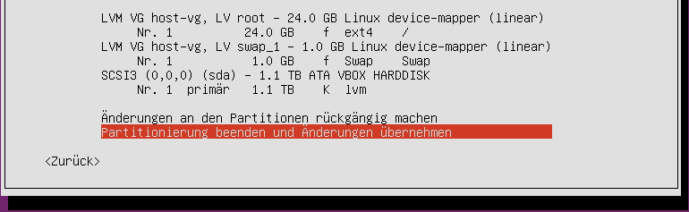

.. include:: /guided-inst.subst

.. _install-kvm-label:

=======================
Virtualisierung mit KVM
=======================

.. sectionauthor:: `@morbweb <https://ask.linuxmuster.net/u/morpweb>`_,
		   `@Tobias <https://ask.linuxmuster.net/u/Tobias>`_,
		   `@MachtDochNix (pics) <https://ask.linuxmuster.net/u/MachtDochNix>`_

In diesem Dokument findest du "Schritt für Schritt" Anleitungen zum Installieren der linuxmuster.net-Musterlösung in der Version 7.0 auf Basis von KVM unter Ubuntu Server 18.04 LTS. Lies zuerst die Abschnitte :ref:`what-is-new-label` und :ref:`prerequisites-label`, bevor du dieses Kapitel durcharbeitest.

Im folgenden Bild ist die einfachste Form der Implementierung der Musterlösung schematisch mit dem gewählten (Standard-)Netzwerk ``10.0.0.0/16`` dargestellt:

.. figure:: media/install-on-kvm-image01.png

Nach der Installation gemäß dieser Anleitung erhältst du eine einsatzbereite Umgebung bestehend aus

* einem Host (KVM) für alle virtuellen Maschinen, 
* einer Firewall (OPNsense für linuxmuster.net) und 
* einem Server (linuxmuster.net)

Ähnliche, nicht dokumentierte, Installationen gelten für einen OPSI-Server und einen Docker-Host, die dann ebenso auf dem KVM-Host laufen können.

Voraussetzungen
===============

* Der Internetzugang des KVM-Hosts sollte (zunächst) gewährleistet sein. Entweder bekommt er von einem Router per DHCP eine externe IP-Adresse, Gateway und einen DNS-Server oder man trägt eine statische IP, Gateway und einen DNS-Server von Hand ein.
* Sofern ein Admin-PC eingerichtet wird, sollte dieser die Möglichkeit haben, sich bei Bedarf in das entsprechende Netzwerk einzuklinken. Im Servernetzwerk bekommt der Admin-PC die IP-Adresse ``10.0.0.10/16`` mit Gateway und DNS-Server jeweils ``10.0.0.254``. Es bietet sich ein Ubuntu-Desktop mit der Software `virt-manager`
  an.

Vorgehen
========

1. Der KVM-Host wird an einen Router angeschlossen, so dass er ins Internet kommt (per DHCP oder statischer IP), es wird ein heruntergeladenes Ubuntu Server 64bit von einem USB-Stick auf dem KVM-Host installiert.
2. Die Software für KVM und die Zeitsynchronisation werden installiert und konfiguriert.
3. Das virtuelle Netzwerk wird auf dem KVM-Host konfiguriert.
4. Das heruntergeladene Abbild der Firewall wird importiert, an die neue Netzwerkumgebung angepasst und die Netzwerkverbindung zur Firewall getestet. In der Firewall wird optional die externe Netzwerkanbindung konfiguriert.
5. Der Server wird importiert, die Festplattengrößen an eigene Bedürfnisse angepasst und die Netzwerkverbindung angepasst und getestet.
6. Abschließende Konfigurationen auf dem KVM-Host

Bereitstellen des KVM-Hosts
===========================

.. hint::

   Der KVM-Host bildet das Grundgerüst für die Firewall *OPNsense* und den Schulserver *server*. Da KVM im Gegensatz zu Xen oder VMWare auf die Virtualisierungsfunktionen der CPU angewiesen ist, müssen diese natürlich vorhanden sein und eventuell im BIOS aktiviert werden.

Die folgende Anleitung beschreibt die *einfachste* Implementierung ohne Dinge wie VLANs, Teaming/Bonding oder RAIDs. Diese Themen werden in zusätzlichen Anleitungen betrachtet.

* :ref:`Anleitung Netzwerksegmentierung <subnetting-basics-label>` 

.. _preface-usb-stick-label:

Erstellen eines USB-Sticks für den KVM-Host
-------------------------------------------

Download für den KVM-Host

Es wird für die Installation auf dem KVM-Host ein Ubuntu Server 64bit in der Version 18.04 LTS verwendet. Es wird das alternative Installationsimage für DVD/USB-Stick verwendet, welches `hier unter "Server install image" <https://releases.ubuntu.com/18.04.5/`_ heruntergeladen werden kann. 

.. hint:: Benötigte Programme für die Herstellung des USB-Sticks:
   
   * dd
   * pv  
  
Hilfreiche Befehle sind (Vorsicht - mit ``dd`` werden vorhandene Daten unwiderruflich zerstört) hier aufgeführt. Der Name des USB-Stick-Gerätes muss vorher herausgefunden werden, z.B. mit ``fdisk -l``, er wird aus Sicherheitsgründen hier mit ``/dev/sdX`` bezeichnet.

Löschen des MBRs des USB-Sticks
  .. code-block:: console

     # sudo dd if=/dev/zero of=/dev/sdX bs=1M count=10

Größe des ISOs herausfinden
  .. code-block:: console

     # du -b ubuntu-18.04.5-live-server-amd64.iso
     749731840	ubuntu-18.04.5-live-server-amd64.iso

Kopieren des ISOs auf den Stick
  .. code-block:: console

     # sudo dd if=uubuntu-18.04.5-live-server-amd64.iso | sudo pv -s 749731840 | sudo dd of=/dev/sdX bs=1M && sync
     [sudo] Passwort für linuxadmin: 
     715MiB 0:00:09 [73,1MiB/s] [====================================================================>] 100%
     0+168504 Datensätze ein
     0+168504 Datensätze aus
     749731840 bytes (750 MB, 715 MiB) copied, 9,78505 s, 76,6 MB/s

Natürlich können auch alle anderen gängigen Tools zur Erstellung genutzt werden. Im folgenden Video ist die Prozedur anhand einer älteren ISO-Datei dargestellt, verläuft aber äquivalent mit jeder aktuellen Ubuntu-Version:

.. raw:: html

   

   <iframe width="696" height="392" src="https://www.youtube.com/embed/7NIoQpSSVQw?rel=0" frameborder="0" allow="autoplay; encrypted-media" allowfullscreen></iframe>
   

Installation des KVM-Hosts
--------------------------

.. tip::

   **Tl;dr** 

   * Achte auf die Auswahl der korrekten Netzwerkschnittstelle für
     einen Internetzugang
   * Erstelle einen Nutzer ``linuxadmin`` mit einem sicheren
     Passwort
   * Richte ein LVM auf deiner Festplatte/RAID mit ``25GB`` für das
     Betriebssystem des KVM-Hosts ein
   * Wähle das Pakets *OpenSSH server* 
   * Nach Reboot, Update des Systems und Installation von ``qemu-kvm``
     und ``libvirt-bin``

Netzwerkeinrichtung

Nach Sprach- und Keyboardauswahl wird das Netzwerk eingerichtet. Es muss die primäre Schnittstelle ausgewählt werden, die einen Zugang zum Internet ermöglicht. 
  
  .. figure:: media/kvmhost-install-network.png
  
Sollte die automatische Netzwerkkonfiguration per DHCP nicht erfolgreich sein, kannst du auch manuell IP-Adresse, Gateway und DNS-Server eingestellen (z.B. für die Kunden von Belwue). Wichtig ist die richtige Schnittstelle auszuwählen.

Rechnername, Benutzername, Passwort, Zeitzone

Es wird empfohlen wie im Beispiel ``host`` als Rechnernamen zu verwenden. Der Benutzername wird im Beispiel ``linuxadmin`` genannt und dazu ein sicheres Passwort vergeben. Die Zeitzone sollte bereits richtig erkannt werden.

Festplatten partitionieren

Im Beispiel wird `Geführt - gesamte Platte verwenden und LVM einrichten` gewählt. Wer eine Festplatte bzw. ein RAID verwendet, die eine Partitionierung enthält, dem wird dementsprechend die Option zur Wiederverwendung angeboten. Hat man bereits eine exisitierenden Partition und ein existierendes LVM und will sie `nicht` wiederverwenden, so muss dementsprechend zustimmen, dass die existierenden Daten entfernt werden.

Im Anschluss muss man auf alle Fälle dem Schreiben der Änderungen auf die Speichergeräte zustimmen.

.. figure:: media/kvmhost-install-write-partitiontable.png

Die folgende Abfrage bezieht sich tatsächlich auf die Größe der Partition die für den KVM-Host verwendet werden soll. Dies wird dementsprechend niedrig, z.B. bei ``25GB`` angesetzt.

.. figure:: media/kvmhost-install-root-vg-size.png

Wenn man im nächsten Dialog das Schreiben auf die Festplatte zunächst `ablehnt`,

.. figure:: media/kvmhost-install-decline-diskchanges.png

bekommt man eine Übersicht über die aktuell vorgesehene Konfiguration und hat erweitertete Änderungsmöglichkeiten (RAID, Verschlüsselung, etc.). 

Über `Partitionierung beenden und Änderungen übernehmen` kann man nun den zunächst abgelehnten Dialog bestätigen.
  
Paketmanager und Softwareauswahl

Der HTTP-Proxy wird leer gelassen, sofern du freien Internetzugang hast. Im nächsten Dialog sollte ``OpenSSH server`` gewählt werden.

.. figure:: media/kvmhost-install-tasksel.png

Am Ende der Installation musst du noch die Installation von GRUB in den Bootbereich bestätigen. Der KVM-Host wird rebootet.
  
Update und Softwareinstallation des KVM-Hosts
---------------------------------------------

Nach einem Reboot loggst du dich als ``linuxadmin`` ein und führst zunächst ein Update aus. Das ist (Stand: Dez. 2018) notwendig, damit die spätere Konfiguration funktioniert. Der erste Befehl zeigt Dir, ob und welche IP-Adresse du auf einem Netzwerk hast. Im folgenden Beispiel wird als externe IP-Adresse immer die IP ``192.168.1.2/16`` verwendet, die per DHCP von einem Router zugeordnet wurde.

.. code-block:: console

   $ ip -br addr list
   lo               UNKNOWN        127.0.0.1/8 ::1/128 
   enp0s8           DOWN        
   enp0s17          UP             192.168.1.2/16 fe80::ae1c:ba12:6490:f75d/64
   $ sudo apt update
   $ sudo apt full-upgrade -y

Unter Umständen werden Dialoge erneut abgefragt, die schon bei der Installation beantwortet wurden (z.B. Tastaturkonfiguration).

Installiere danach die qemu/KVM-Software durch Bestätigen der Fragen

.. code-block:: console

   $ sudo apt install libvirt-bin qemu-kvm kpartx qemu-utils
   $ sudo apt --no-install-recommends install virtinst

Einrichten der Zeitsynchronisation
----------------------------------

Immer eine gute Sache ist es, z.B. in Logfiles die korrekte Zeit zu finden. Aus diesem Grund erfolgt die Konfiguration eines NTP-Clients.

.. code-block:: console

   Installieren von ntpdate
   $ sudo apt install ntpdate

   Einmaliges Stellen der Uhrzeit
   $ sudo ntpdate 0.de.pool.ntp.org

   Installieren des NTP-Daemons
   $ sudo apt install ntp

   Anzeigen der Zeitsynchronisation
   $ sudo ntpq -p

.. raw:: html

	
 <iframe width="696" height="392"
	src="https://www.youtube.com/embed/tHqFTfS99xo?rel=0"
	frameborder="0" allow="autoplay; encrypted-media"
	allowfullscreen></iframe> 

Netzwerkkonfiguration des KVM-Hosts
===================================
   
Nach Installation der KVM-Software (``virbr0*`` wurden automatisch hinzugefügt) ist die Netzwerksituation folgende:

.. code::

   $ ip -br addr list
   lo               UNKNOWN        127.0.0.1/8 ::1/128 
   enp0s8           DOWN        
   enp0s17          UP             192.168.1.2/16 fe80::ae1c:ba12:6490:f75d/64
   virbr0           DOWN           192.168.122.1/24 
   virbr0-nic       DOWN           

In diesem Schritt wird die direkte Verbindung des KVM-Hosts mit dem Internet gekappt und eine virtuelle Verkabelung über so genannte `bridges` erstellt.  Zunächst werden die Brücken ``br-red`` (Internetseite) und ``br-server`` (Schulnetzseite) definiert.  Zuletzt kann der KVM-Host auch über die Brücke ``br-red`` eine IP-Adresse ins Internet bekommen, genau wie er über die Brücke ``br-server`` auch im pädagogischen Netzwerk auftauchen kann. Letzteres ist nicht zu empfehlen.

.. hint::

   Die Netzwerkkonfiguration wird seit Ubuntu 18.04 standardmäßig über netplan realisiert. Wer seinen KVM-Host von früheren Ubuntu-Versionen updatet, bei dem wird nicht automatisch `netplan` installiert, sondern `ifupdown` wird mit der Konfigurationsdatei ``/etc/network/interfaces`` beibehalten.

Namen der Netzwerkkarten:

Mit folgendem Befehl werden alle physischen Netzwerkkarten (teilweise umbenannt) angezeigt:

.. code::
     
   # dmesg | grep eth
   [    9.230673] e1000e 0000:08:00.0 eth0: (PCI Express:2.5GT/s:Width x4) 00:30:48:dd:ee:ff
   [    9.273215] e1000e 0000:11:00.1 eth1: (PCI Express:2.5GT/s:Width x4) 00:30:48:aa:bb:cc
   [    9.432342] e1000e 0000:08:00.0 enp0s8: renamed from eth0
   [    9.654232] e1000e 0000:11:00.1 enp0s17: renamed from eth1

Anpassen der Netzwerkkonfiguration im Editor deiner Wahl. Hier am Beispiel nano

.. code::

  $ sudo nano /etc/netplan/01-netcfg.yaml

Die Netzwerkkonfiguration enthält standardmäßig die Schnittstelle, die bei der Installation mit dem Internet verbunden war. Diese Schnittstelle wird dann auch mit der Brücke ``br-red`` verbunden. 
     
.. code::

   network:
     version: 2
     renderer: networkd
     ethernets:
       enp0s8:
         dhcp4: no
         enp0s17:
         dhcp4: no
       bridges:
         br-red:
           interfaces: [enp0s17]
           dhcp4: no
           addresses: [ ]
         br-server:
           interfaces: [enp0s8]
           addresses: [ ]

Diese Netzwerkkonfiguration kann nun ausprobiert und angewandt werden.

.. code::

   $ sudo netplan try

.. hint:: Potenzielle Fehlerquellen sind nicht konsequent eingerückte Zeilen oder TABs.

.. code::

   Invalid YAML at /etc/netplan/01-netcfg.yaml line 6 column 0: found character that cannot start any token

Bei fehlerhaften Anläufen lohnt es sich, den KVM-host zu rebooten und die Netzwerkkonfiguration erneut zu betrachten. 
  
KVM-Host auch im Internet

Soll später nicht nur die Firewall sondern auch der KVM-Host im Internet erreichbar sein, dann muss der entsprechende Block so aussehen:

.. code::

   network:
     ...
     bridges:
       br-red:
           interfaces: [enp0s17]
           dhcp4: yes
       br-server:
     ...

Wer bisher einen statischen Zugang eingerichtet hatte, der kann das genauso hier tun. Der entsprechende Abschnitt wäre beispielhaft

.. code::

     bridges:
       br-red:
         interfaces: [enp0s17]
           addresses: [141.1.2.5/29]
           gateway4: 141.1.2.3
            nameservers:
             addresses: [129.143.2.1]

Weiter geht es mit dem Import der Virtuellen Maschinen.

.. toctree::
  :maxdepth: 2
  :caption: Externe Dienste
  :hidden:

  import-kvm-vms
