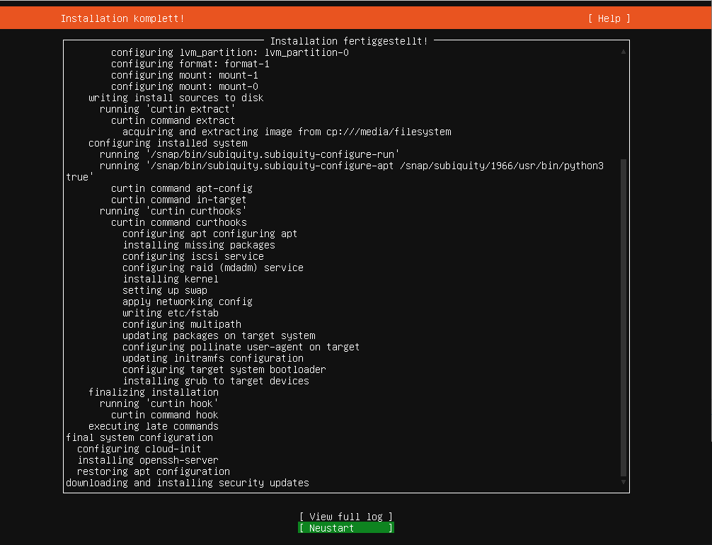

.. include:: /guided-inst.subst

.. _install-kvm-label:

=======================
Virtualisierung mit KVM
=======================

.. sectionauthor:: `@morbweb <https://ask.linuxmuster.net/u/morpweb>`_,
		   `@Tobias <https://ask.linuxmuster.net/u/Tobias>`_,
		   `@MachtDochNix <https://ask.linuxmuster.net/u/MachtDochNix>`_

In diesem Dokument findest du unsere "Schritt für Schritt" Anleitungen um linuxmuster.net unter KVM zu installieren. Als Basis dient ein Ubuntu Server 18.04.5 LTS.

Wir setzen voraus, dass du die Abschnitte :ref:`what-is-new-label` und :ref:`prerequisites-label` gelesen hast, bevor du dieses Kapitel durcharbeitest.

Im folgenden Bild ist die einfachste Form der Implementierung der Musterlösung schematisch mit dem gewählten (Standard-)Netzwerk ``10.0.0.0/16`` dargestellt:

.. figure:: media/install-on-kvm-image01.png

Nach der Installation gemäß dieser Anleitung erhältst du eine einsatzbereite Umgebung bestehend aus

 * einem Host (KVM) für alle virtuellen Maschinen,
 * einer Firewall (OPNsense für linuxmuster.net) und
 * einem Server (linuxmuster.net)

Ähnliche, hier nicht dokumentierte, Installationen gelten für einen OPSI-Server und einen Docker-Host, die dann ebenso auf dem KVM-Host laufen können.

Voraussetzungen
===============

* Der Internetzugang des KVM-Hosts muss gewährleistet sein.
 
  Entweder bekommt er von einem Router per DHCP eine IP-Adresse, Gateway- und DNS-Server oder man trägt diese Daten von Hand ein.

* Sofern ein Admin-PC eingerichtet wird, sollte dieser für die Installation die Möglichkeit haben, sich bei Bedarf mit dem entsprechende Netzwerk zu verbinden. Im letztendlichen linuxmuster.net-Intranet erhält dieser dann die folgenden Einstellungen:

  * IP-Adresse:  ``10.0.0.10/16``
  * Gateway und DNS-Server jeweils: ``10.0.0.254``

  Für solch einen Administrations-Rechner bietet sich ein Ubuntu-Desktop mit der Software `virt-manager` an.

Vorgehen
========

1. Der KVM-Host wird an einen Router angeschlossen, sodass er ins Internet kommt. Es wird ein heruntergeladenes "Server install image 64bit" von einem Boot-Medium auf dem KVM-Host installiert.

2. Die Software für KVM und die Zeitsynchronisation werden installiert, aktualisiert und konfiguriert.

3. Das virtuelle Netzwerk wird auf dem KVM-Host konfiguriert.

4. Das heruntergeladene Abbild der Firewall wird importiert, an die neue Netzwerkumgebung angepasst und die Netzwerkverbindung zur Firewall getestet. 

 .. todo:: zu klären: "In der Firewall wird optional die externe Netzwerkanbindung konfiguriert."   

5. Der linuxmuster.net-Server wird importiert, dessen Festplattengrößen und die Netzwerkverbindung angepasst und getestet.

6. Abschließende Konfigurationen auf dem KVM-Host.

Bereitstellen des KVM-Hosts
===========================

.. hint::

   Der KVM-Host bildet die Grundlage für die Firewall *OPNsense®* und den Schulserver *server*. Da KVM im Gegensatz zu Xen oder VMWare auf die Virtualisierungsfunktionen der CPU angewiesen ist, müssen diese natürlich hardwareseitig vorhanden und im BIOS aktiviert sein.

Die folgende Anleitung beschreibt die einfachste Implementierung ohne Dinge wie VLANs, Teaming/Bonding oder RAIDs. Diese Themen werden in zusätzlichen Abschnitten im Kapitel "SYSTEMADMINISTRATION" betrachtet.

Wir beschreiben hier die Installation von dem Erstellen eines Bootmediums bis zum fertigen Ubuntu-Server. Sollte das für dich ein alter Hut sein, kannst du das überspringen und mit der Installtion von der Pakete für `Installation der KVM-Pakete`_ fortfahren 

.. _preface-usb-stick-label:

Erstellen eines Installationsmediums
------------------------------------

.. _Download: https://releases.ubuntu.com/18.04.5/

Es wird für die Installation des KVM-Hosts ein Ubuntu Server 64bit in der Version 18.04 LTS verwendet. Welches du unter "Server install image" auf der Ubuntu-Seite zum Download_ findest. Diese iso-Datei muss auf ein Bootmedium so kopiert werden, dass sich der zukünftige KVM-Host von diesem Medium starten lässt.

.. _heruntergeladen: https://unetbootin.github.io/

Neben dem "Brennen" auf einer DVD, stehen dir zum Erzeugen eines USB-Boot-Sticks diverse Anleitung im Internet bereit. Da diese immer von deinem verwendeten Betriebssystem abhängen, zeigen wir dir dieses an dem Programm UNetbootin. Dieses hat für uns den Vorteil, dass es die Erstellung unter verschiedenen Betriebssystemen (Linux, Windows und macOS) ermöglicht und die Erkläung davon unabhängig bleibt.

Installiere das Programm nachdem du es dir hier heruntergeladen_ hast. Vor dem Start des Programms verbinde deinen USB-Stick mit dem Rechner.

Nachdem du es gestartet hast, begrüßt dich dieser Bildschirm. Eventuell musstest du vorher die erweiterten Rechte für den Programmstart erlauben. Diese sind für den Zugriff auf den USB-Stick nötig. 

.. figure:: ../media/unetbootin_001_open-program.png
   :align: center
   :alt: Das geöffnete Programm

Zwar bietet UNetbootin für viele Livesystem die Möglichkeit diese direkt herunterzuladen. Leider aber nicht für den benötigten Ubuntu Server. Aber da du die iso-Datei ja zuvor schon auf deinem Rechner geladen hast, wählst du sie mit dem nächsten Schritt aus. Dazu klickst du auf den gezeigten Button ``...``.

.. figure:: ../media/unetbootin_002_select-iso.png
   :align: center
   :alt: Auswahl der iso-Datei 

Wähle die iso-Datei und bestätige sie mit ``Open``.

.. figure:: ../media/unetbootin_003_start-copy.png
   :align: center
   :alt: Starten der USB-Stick-Erstellung

Überprüfe ob ``Typ`` und ``Laufwerk`` den von dir gewünschten USB-Stick beschreiben.

.. Attention:: Sollte da nicht das richtige Medium ausgewählt sein, würde der nächste Schritt das falsch ausgewählte Medium unwiederbringbar löschen!

Mit ``OK`` startest du die Erstellung

.. figure:: ../media/unetbootin_004_copy-progress.png
   :align: center
   :alt: Fortschritt der USB-Stick-Erstellung

Warte den Fortschritt des Installationsprozesses ab, bis ...

.. figure:: ../media/unetbootin_005_finish.png
   :align: center
   :alt: Erfolgreiche Beendigung des Vorganges
   
... er erfolgreich abgeschlossen wurde.

Installation des KVM-Hosts
--------------------------

Nachdem du deinen zukünftigen KVM-Host von deinem zuvor erstellten Boot-Medium gestaret hast, beginn die eigentlichen Installation.

.. todo:: Installation KVM

.. figure:: ../media/ubuntu-installation_001_select-language.png
   :align: center
   :alt: Auswahl der Sprache für die Installation

Nach einiger Zeit wird dich der Installer von Ubuntu nach der Sprache für die Installattion fragen. Markiere deine gewünschte Sprache und wähle sie mir `Enter` aus. 

.. figure:: ../media/ubuntu-installation_002_without-actualisation.png
   :align: center
   :alt: Überspringe die Auswahl der Aktualisierung

Die nächste Frage bezieht sich auf den aktualisierten Installer. Dieses Frage kannst du mit `Ohne Aktualisierung fortfahren` und `Enter` überspringen.

.. figure:: ../media/ubuntu-installation_003_keyboard-configuration.png
   :align: center
   :alt: Auswahl des Tastaturlayouts 

Wir beschreiben die Funktion `Tastatur erkennen` solltest du Belegung und Variante kennen, kannst du das hier direkt auswählen und mit `Enter` `weiter voranschreiten`_ : 

.. figure:: ../media/ubuntu-installation_004_keyboard-autodetection.png
   :align: center
   :alt: Einleitung der Tastatur-Autoerkennung

Der Text in der Grafik erklärt das weitere Vorgehen. Folge einfach den dargestellten Bildern und beachte den dargestellten Mauszeiger bzw. den grünen oder grauen Auswahlmöglichkeiten.

.. figure:: ../media/ubuntu-installation_005_select-key.png
   :align: center
   :alt: 

.. figure:: ../media/ubuntu-installation_006_question4key.png
   :align: center
   :alt: 

.. figure:: ../media/ubuntu-installation_007_press-key.png
   :align: center
   :alt: 

.. figure:: ../media/ubuntu-installation_008_question4key.png
   :align: center
   :alt: 

.. figure:: ../media/ubuntu-installation_009_keyboard-pre-confirmation.png
   :align: center
   :alt: 

.. figure:: ../media/ubuntu-installation_010_keyboard-confirmation.png
   :align: center
   :alt: 

.. _`weiter voranschreiten`:

Als nächstes geht es an die Einrichtung der Netzwerkschnittstelle. Das nachfolgende Bild veranschaulicht die momentane Netzwerkanbindung für die Installation.

.. todo:: Grafik überarbeiten - Proxmox ersetzen durch (Virtualisierungs)-Host.

.. figure:: ../media/install_01_network-4-installation.svg
   :align: center
   :alt: Netzwerkstruktur zur Einrichtung
   
Also dein Host ist an dem selben Switch angeschlossen wie dein Router.

Wir gehen davon aus das dein Router IP-Adressen via DHCP vergibt.

Wenn dein Host momentan nur mit einer Schnittstelle angeschlossen ist, solltest du ein fast identisches Bild erhalten.

.. figure:: ../media/ubuntu-installation_011_network-interface-selection.png
   :align: center
   :alt: Auswahl der Netzwerk-Schnittstelle

Einzige Abweichung können die Bezeichnung `ens18` und die erhaltene Adresse sein. Solltest du solch eine Abweichung feststellen, dann wirst du die Konfiguration manuel ausführen müssen. Dafür benötigst du die IP-Adresse, das Gateway und den DNS-Server (z.B. für die Kunden von Belwue). 

Wichtig ist dabei, dass du die richige Schnittstelle ausgewählt hast, die mit deinem Switch/Router verbunden ist.

.. figure:: ../media/ubuntu-installation_012_proxy-konfiguration.png
   :align: center
   :alt: Eingabe einer eventuellen Proxy-Adresse für den Internet-Zugriff

Eventuell brauchst du für den Internetzugang in deiner Infrastruktur einen Proxy-Server. Dessen Daten müsstest du wie in der letzten Zeile "http://..." beschrieben eingeben. Mit `Erledigt` geht es weiter.

.. figure:: ../media/ubuntu-installation_013_update-server.png
   :align: center
   :alt: Auswahl eines alternativen Spiegelservers

Solltest du wissen, das deine Internet-Verbindung über einen bestimmten Spiegelserver schneller ist, dann könntest du ihn hier angeben. Ist in aller Regel aber nicht notwendig.

.. figure:: ../media/ubuntu-installation_014_hdd-konfiguration.png
   :align: center
   :alt: Konfiguration der Festplatten

Nun geht es daran die Festplatte(n) einzurichten.

.. todo:: Hier weier. Es muss überprüft werden inwieweit Zwischenschritte nötig sind. Festplattengröße???

Im Beispiel wird `Geführt - gesamte Platte verwenden und LVM einrichten` gewählt. Wer eine Festplatte bzw. ein RAID verwendet, die eine Partitionierung enthält, dem wird dementsprechend die Option zur Wiederverwendung angeboten. Hat man bereits eine exisitierenden Partition und ein existierendes LVM und will sie `nicht` wiederverwenden, so muss dementsprechend zustimmen, dass die existierenden Daten entfernt werden.

Im Anschluss muss man auf alle Fälle dem Schreiben der Änderungen auf die Speichergeräte zustimmen.

.. figure:: ../media/ubuntu-installation_015_summary-hdd-configuration.png
   :align: center
   :alt: 

.. figure:: ../media/ubuntu-installation_016_hdd-configuration-confirm.png
   :align: center
   :alt: 

.. figure:: ../media/ubuntu-installation_017_user-registration.png
   :align: center
   :alt: 

.. figure:: ../media/ubuntu-installation_018_install-openssh.png
   :align: center
   :alt: 

.. figure:: ../media/ubuntu-installation_019_optional-software.png
   :align: center
   :alt: 

.. figure:: ../media/
   :align: center
   :alt: 

.. todo:: Hier weiter 

Installation des KVM-Hosts
--------------------------

.. tip::

   * Achte auf die Auswahl der korrekten Netzwerkschnittstelle für
     einen Internetzugang
   * Erstelle einen Nutzer ``admin`` mit einem sicheren
     Passwort
   * Richte ein LVM auf deiner Festplatte/RAID mit ``25GB`` für das
     Betriebssystem des KVM-Hosts ein
   * Wähle das Pakets *OpenSSH server* 
   * Nach Reboot, Update des Systems und Installation von ``qemu-kvm``
     und ``libvirt-bin``

.. todo:: Screenshots der Installation sind nicht mehr up-to-date 

.. hint:: ALter Text

Rechnername, Benutzername, Passwort, Zeitzone

Es wird empfohlen wie im Beispiel ``host`` als Rechnernamen zu verwenden. Der Benutzername wird im Beispiel ``admin`` genannt und dazu ein sicheres Passwort vergeben. Die Zeitzone sollte bereits richtig erkannt werden.

Festplatten partitionieren

Im Beispiel wird `Geführt - gesamte Platte verwenden und LVM einrichten` gewählt. Wer eine Festplatte bzw. ein RAID verwendet, die eine Partitionierung enthält, dem wird dementsprechend die Option zur Wiederverwendung angeboten. Hat man bereits eine exisitierenden Partition und ein existierendes LVM und will sie `nicht` wiederverwenden, so muss dementsprechend zustimmen, dass die existierenden Daten entfernt werden.

Im Anschluss muss man auf alle Fälle dem Schreiben der Änderungen auf die Speichergeräte zustimmen.

.. figure:: media/kvmhost-install-write-partitiontable.png

Die folgende Abfrage bezieht sich tatsächlich auf die Größe der Partition die für den KVM-Host verwendet werden soll. Dies wird dementsprechend niedrig, z.B. bei ``25GB`` angesetzt.

.. figure:: media/kvmhost-install-root-vg-size.png

Wenn man im nächsten Dialog das Schreiben auf die Festplatte zunächst `ablehnt`,

.. figure:: media/kvmhost-install-decline-diskchanges.png

bekommt man eine Übersicht über die aktuell vorgesehene Konfiguration und hat erweitertete Änderungsmöglichkeiten (RAID, Verschlüsselung, etc.). 

.. figure:: media/kvmhost-install-overviewchanges.png

Über `Partitionierung beenden und Änderungen übernehmen` kann man nun den zunächst abgelehnten Dialog bestätigen.
  
Paketmanager und Softwareauswahl

Der HTTP-Proxy wird leer gelassen, sofern du freien Internetzugang hast. Im nächsten Dialog sollte ``OpenSSH server`` gewählt werden.

.. figure:: media/kvmhost-install-tasksel.png

Am Ende der Installation musst du noch die Installation von GRUB in den Bootbereich bestätigen. Der KVM-Host wird rebootet.
  
Update und Softwareinstallation des KVM-Hosts
---------------------------------------------

Nach einem Reboot loggst du dich als ``admin`` ein und führst zunächst ein Update aus. Das ist (Stand: Dez. 2018) notwendig, damit die spätere Konfiguration funktioniert. Der erste Befehl zeigt Dir, ob und welche IP-Adresse du auf einem Netzwerk hast. Im folgenden Beispiel wird als externe IP-Adresse immer die IP ``192.168.1.2/16`` verwendet, die per DHCP von einem Router zugeordnet wurde.

.. code-block:: console

   $ ip -br addr list
   lo               UNKNOWN        127.0.0.1/8 ::1/128 
   enp0s8           DOWN        
   enp0s17          UP             192.168.1.2/16 fe80::ae1c:ba12:6490:f75d/64
   $ sudo apt update
   $ sudo apt full-upgrade -y

Unter Umständen werden Dialoge erneut abgefragt, die schon bei der Installation beantwortet wurden (z.B. Tastaturkonfiguration).

Installiere danach die qemu/KVM-Software durch Bestätigen der Fragen

Installation der KVM-Pakete
---------------------------

.. code-block:: console

   $ sudo apt install libvirt-bin qemu-kvm kpartx qemu-utils
   $ sudo apt --no-install-recommends install virtinst

Einrichten der Zeitsynchronisation
----------------------------------

Immer eine gute Sache ist es, z.B. in Logfiles die korrekte Zeit zu finden. Aus diesem Grund erfolgt die Konfiguration eines NTP-Clients.

.. code-block:: console

   Installieren von ntpdate
   $ sudo apt install ntpdate

   Einmaliges Stellen der Uhrzeit
   $ sudo ntpdate 0.de.pool.ntp.org

   Installieren des NTP-Daemons
   $ sudo apt install ntp

   Anzeigen der Zeitsynchronisation
   $ sudo ntpq -p

.. raw:: html

	
 <iframe width="696" height="392"
	src="https://www.youtube.com/embed/tHqFTfS99xo?rel=0"
	frameborder="0" allow="autoplay; encrypted-media"
	allowfullscreen></iframe> 

Netzwerkkonfiguration des KVM-Hosts
===================================
   
Nach Installation der KVM-Software (``virbr0*`` wurden automatisch hinzugefügt) ist die Netzwerksituation folgende:

.. code::

   $ ip -br addr list
   lo               UNKNOWN        127.0.0.1/8 ::1/128 
   enp0s8           DOWN        
   enp0s17          UP             192.168.1.2/16 fe80::ae1c:ba12:6490:f75d/64
   virbr0           DOWN           192.168.122.1/24 
   virbr0-nic       DOWN           

In diesem Schritt wird die direkte Verbindung des KVM-Hosts mit dem Internet gekappt und eine virtuelle Verkabelung über so genannte `bridges` erstellt.  Zunächst werden die Brücken ``br-red`` (Internetseite) und ``br-server`` (Schulnetzseite) definiert.  Zuletzt kann der KVM-Host auch über die Brücke ``br-red`` eine IP-Adresse ins Internet bekommen, genau wie er über die Brücke ``br-server`` auch im pädagogischen Netzwerk auftauchen kann. Letzteres ist nicht zu empfehlen.

.. todo:: Das ist so keine Schritt für Schritt-Anleitung, sondern Mist. Anleitung muss schnell zum Ergebnis wie gewünscht führen. Also IP-Adressen anpassen an die zuvor genannten Vorgaben.

.. hint::

   Die Netzwerkkonfiguration wird seit Ubuntu 18.04 standardmäßig über netplan realisiert. Wer seinen KVM-Host von früheren Ubuntu-Versionen updatet, bei dem wird nicht automatisch `netplan` installiert, sondern `ifupdown` wird mit der Konfigurationsdatei ``/etc/network/interfaces`` beibehalten.

Namen der Netzwerkkarten:

Mit folgendem Befehl werden alle physischen Netzwerkkarten (teilweise umbenannt) angezeigt:

.. code::
     
   # dmesg | grep eth
   [    9.230673] e1000e 0000:08:00.0 eth0: (PCI Express:2.5GT/s:Width x4) 00:30:48:dd:ee:ff
   [    9.273215] e1000e 0000:11:00.1 eth1: (PCI Express:2.5GT/s:Width x4) 00:30:48:aa:bb:cc
   [    9.432342] e1000e 0000:08:00.0 enp0s8: renamed from eth0
   [    9.654232] e1000e 0000:11:00.1 enp0s17: renamed from eth1

Anpassen der Netzwerkkonfiguration im Editor deiner Wahl. Hier am Beispiel nano

.. code::

  $ sudo nano /etc/netplan/01-netcfg.yaml

Die Netzwerkkonfiguration enthält standardmäßig die Schnittstelle, die bei der Installation mit dem Internet verbunden war. Diese Schnittstelle wird dann auch mit der Brücke ``br-red`` verbunden. 
     
.. code::

   network:
     version: 2
     renderer: networkd
     ethernets:
       enp0s8:
         dhcp4: no
       enp0s17:
         dhcp4: no
     bridges:
       br-red:
         interfaces: [enp0s17]
         dhcp4: no
         addresses: [ ]
       br-server:
         interfaces: [enp0s8]
         addresses: [ ]

Diese Netzwerkkonfiguration kann nun ausprobiert und angewandt werden.

.. code::

   $ sudo netplan try

.. hint:: Potenzielle Fehlerquellen sind nicht konsequent eingerückte Zeilen oder TABs.

.. error:: Wie beschrieben ist die Einrichtung nun richtig. Führt allerdings zum Verlust der Verbindung.

.. code::

   Invalid YAML at /etc/netplan/01-netcfg.yaml line 6 column 0: found character that cannot start any token

Bei fehlerhaften Anläufen lohnt es sich, den KVM-host zu rebooten und die Netzwerkkonfiguration erneut zu betrachten. 
  
KVM-Host auch im Internet

Soll später nicht nur die Firewall sondern auch der KVM-Host im Internet erreichbar sein, dann muss der entsprechende Block so aussehen:

.. code::

   network:
     ...
     bridges:
       br-red:
           interfaces: [enp0s17]
           dhcp4: yes
       br-server:
     ...

Wer bisher einen statischen Zugang eingerichtet hatte, der kann das genauso hier tun. Der entsprechende Abschnitt wäre beispielhaft

.. code::

     bridges:
       br-red:
         interfaces: [enp0s17]
           addresses: [141.1.2.5/29]
           gateway4: 141.1.2.3
            nameservers:
             addresses: [129.143.2.1]

Weiter geht es mit dem Import der Virtuellen Maschinen.

.. toctree::
  :maxdepth: 2
  :caption: Externe Dienste
  :hidden:

  import-kvm-vms
