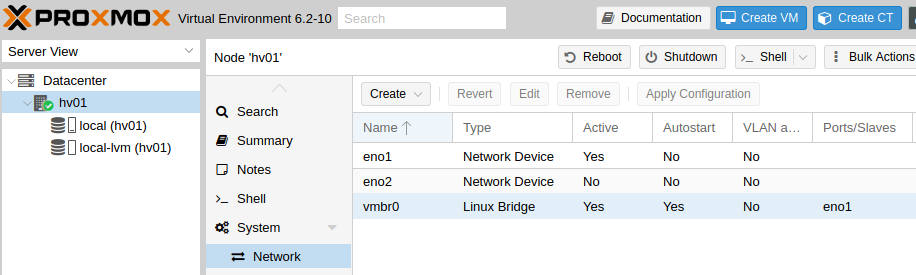
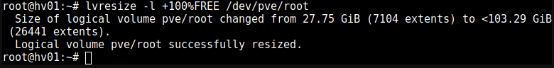
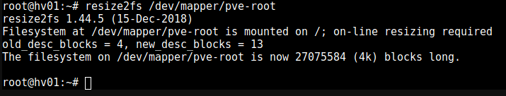

.. include:: /guided-inst.subst

.. _install-on-proxmox-label:

============================
 Virtualisierung mit Proxmox
============================

.. sectionauthor:: `@cweikl <https://ask.linuxmuster.net/u/cweikl>`_,
                   `@MachtDochNix <https://ask.linuxmuster.net/u/MachtDochNix>`_,
                   `@maurice <https://ask.linuxmuster.net/u/Maurice>`_

Proxmox ist eine OpenSource-Virtualisierungsplattform. Diese kombiniert KVM- und Container-basierte Virtualisierung und verwaltet virtuelle Maschinen, Container, Storage, virtuelle Netzwerke und Hochverfügbarkeit-Cluster übersichtlich über die zentrale Managementkonsole.

Das web-basierte Verwaltungs-Interface läuft direkt auf dem Server. Zudem kann die Virtualisierungsumgebung via SSH administriert werden.

Proxmox VE eignet sich für den virtuellen Betrieb von linuxmuster.net besonders, da dieser Hypervisor dem OpenSource-Konzept entspricht. Der Einsatz wird auf jeglicher Markenhardware unterstützt und es gibt zahlreiche professionelle 3rd-Party Software für Backup-Lösungen und andere Features. „No-Name-Hardware“ kann hiermit ebenfalls meist verwendet werden.

Diese Anleitung beinhaltet Angaben zu den notwendigen Systemanforderungen und Festplattenkonfigurationen, der Proxmoxinstallation sowie der anschließenden Installation von Proxmox.

Zusätzlich sind Beschreibungen enthalten, wie du von uns bereitgestellte Vorlagen für virtuelle Maschinen der linuxmuster-Komponenten importieren kannst.

Systemvoraussetzungen
=====================

In der unten aufgeführten Tabelle findest du die Systemvoraussetzungen zum Betrieb der von uns bereitgestellten virtuellen Maschinen. Die Systemanforderungen für die Installation von Proxmox selbst finden sich im Web unter https://www.proxmox.com/de/proxmox-ve/systemanforderungen. 

Die Werte sind die voreingestellten Werte der VMs beim Import und bilden gleichzeitig die Mindestvoraussetzungen. Für die Installation mit Proxmox und linuxmuster v7 wird der 
`IP-Bereich 10.0.0.0/16` genutzt.

============ ============= ================ =====
VM           IP            HDD              RAM 
============ ============= ================ =====
OPNsense®    10.0.0.254/16 10 GiB           4 GiB
Server       10.0.0.1/16   25 GiB u 100 GiB 4 GiB
OPSI         10.0.0.2/16   100 GiB          2 GiB
Docker-VM    10.0.0.3/16   100 GiB          2 GiB
Proxmox-Host 10.0.0.10/16  100 GiB          4 GiB
============ ============= ================ =====

Die Festplattengröße sowie der genutzte RAM der jeweiligen VMs kann nach deren Import
später einfach an die Bedürfnisse der Schule angepasst werden. 

Bevor du dieses Kapitel durcharbeitest, lese bitte zuerst die Abschnitte
  + :ref:`what-is-linuxmuster.net-label`,
  + (:ref:`what-is-new-label`),
  +  :ref:`install-overview-label` und
  +  :ref:`prerequisites-label`.

Für den Betrieb des Hypervisors selbst (Proxmox VE) sollten ca. 2 bis 6 GB Arbeitsspeicher eingeplant werden. Um nach Anleitung installieren zu können, sollte der Server mit mindestens 2 Netzwerkkarten bestückt sein. Durch VLANs kann der Betrieb aber auch bereits mit nur einer NIC erfolgen, bsp. 10 Gbit-Karte an einem Core-VLAN-Switch (L3).

Für die Basis dieser Installationsanleitung werden auf dem verfügbaren Speicherplatz des Proxmox-Servers zwei Festplatten eingerichtet. Eine mit 120 GB (SSD) Speichergröße für die Hypervisorinstallation selbst und eine zweite mit dem restlich verfügbaren Speicherplatz (hier 1 TiB - HDD als zweite Festplatte) als Speicher für die virtuellen Maschinen. Eine Aufteilung auf zwei Disks wird empfohlen, wenn vor allem viel Speicher für Bakup-, Schuldaten usw. benötigt wird. Eine einzelne Disk kann aber je nach Anforderung für die linuxmuster-Umgebung ebenfalls ausreichend sein.

Der Proxmox-Host sollte gemäß o.g. Minimalanforderungen folgende Merkmale aufweisen - sofern alle VMs eingesetzt werden:

  * RAM gesamt: mind. 16 GiB (besser: 32 GiB)
  * Erste HDD: mind 100 GiB für Proxmox selbst
  * Zweite HDD: für die VMs mit mind. 500 GB Kapazität (besser: 1 TiB oder 2 TiB)
  * Zwei Netzwerkkarten
  * Der Internetzugang des Proxmox-Hosts sollte zunächst gewährleistet sein, d.h. dieser wird z.B. an einen (DSL-)Router angeschlossen, der den Internet-Zugang sicherstellt. Sobald spalles eingerichtet ist, bekommt der Proxmox-Host eine IP-Adresse im Schulnetz und die Firewall OPNsense® stellt den Internet-Zugang für alle VMs und den Proxmox-Host bereit.

.. hint:: 

   Virtualisierungs-Hosts sollten grundsätzlich niemals im gleichen Netz wie andere Geräte sein, damit dieser nicht von diesen angegriffen werden kann. In dieser Dokumentation wird zur Vereinfachung der Fall dokumentiert, dass der Proxmox-Host zu Beginn im externen Netz mit Internet-Zugriff und nach Abschluss der Installation im internen Schulnetz mit Internet-Zugriff via OPNsense®-Firewall befindet. 

Bereitstellen des Proxmox-Hosts
===============================

.. hint:: 

   Der Proxmox-Host bildet das Grundgerüst für die Firewall *OPNsense®* und
   den Schulserver *server*. Die Virtualisierungsfunktionen der CPU sollten 
   zuvor im BIOS aktiviert worden sein.

Die folgende Anleitung beschreibt die *einfachste* Implementierung ohne Dinge wie VLANs, Teaming oder RAID. Diese Themen 
werden in zusätzlichen Anleitungen betrachtet.

* :ref:`Anleitung Netzwerksegmentierung <subnetting-basics-label>` 

Die Download-Quellen für den Proxmox-Host selbst finden sich hier:

https://www.proxmox.com/de/downloads/category/iso-images-pve/

Dort findet sich das ISO-Image zur Installation von Proxmox (derzeit basiert unsere Beschreibung auf der Proxmox-Version 6.2).

Lade dir dort dieses Image herunter und erstelle dir einen bootfähigen USB-Stick zur weiteren Installation.

Erstellen eines USB-Sticks zur Installation des Proxmox-Host
------------------------------------------------------------

Nachdem du die ISO-Datei für Proxmox heruntergeladen hast, wechselst Du in das Download-Verzeichnis. Danach ermittel Du den korrekten Buchstaben für den USB-Stick unter Linux. X ist durch den korrekten Buchstaben zu ersetzen und dann ist nachstehender Befehl als Benutzer *root* oder mit einem *sudo* vorangestellt einzugeben:

.. code-block:: console
 
   dd if=proxmox-ve_6.2-1.iso of=/dev/sdX bs=1M status=progress conv=fdatasync
   
Verkabelungshinweise
--------------------

Es ist für linuxmuster.net ein internes Netz (grün) und ein externes Netz (rot) am Proxmox-Host zu unterscheiden. 
Sind zwei Netzwerkkarten im Proxmox-Host vorhanden, so ist die erste Netzwerkkarte (z.B. eth0, eno1 oder enp7s0), die zu 
Beginn eine IP aus dem bestehenden lokalen Netz (z.B. via DSL-Router) erhalten soll, mit dem Switch zu verbinden, der an den (DSL-)Router angeschlossen ist.

Die zweite Netzwerkkarte (z.B. eth1 oder enp7s1) ist dann an einen eigenen Switch anzuschließen, ebenso wie alle Clients, die im internen Netz eingesetzt werden. 

Um zu Beginn den Proxmox-Host zu administrieren, ist ein Laptop mit dem Switch zu verbinden, der an den lokalen (DSL-)Router angeschlossen ist. Der Laptop erhält ebenfalls eine IP aus dem lokalen (DSL-)Netz und kann sich dann auf die zu Beginn eingerichtete IP-Adresse des Proxmox-Host auf die grafische Verwaltungsoberfläche verbinden. 

.. figure:: media/install-on-proxmox_01_network-4-proxmoc-installation.svg
   :align: center
   :alt: Netzwerk für die Proxmox Installation

Installieren von Proxmox
========================

Basis-Installation
------------------

Vom USB-Stick booten, danach erscheint folgender Bildschirm:

.. figure:: media/install-on-proxmox_02_boot-menu.png
   :align: center
   :alt: Proxmox Boot-Menu 

Wähle `Install Proxmox VE` und starte die Installation mit `ENTER`.

.. figure:: media/install-on-proxmox_03_eula.png
   :align: center
   :alt: Proxmox Nutzervereinbarung

Bestätige das `End-User Agreement` mit `Enter`.

.. figure:: media/install-on-proxmox_04_target-harddisk.png
   :align: center
   :alt: Proxmox Installation Wahl der Festplatten

Wähle die gewünschte Festplatte auf dem Server zur Installation aus. Hast du mehrere einzelne Festplatten im Server verbaut und kein RAID-Verbund definiert, so kannst du an dieser Stelle mithilfe der Schaltfläche `Optionen` weitere Einstellungen aufrufen. Hier kannst du z.B. mehrere Festplatten angeben, die in einem sog. ZFS-Pool definiert werden sollen. Dies ist für das Erstellen von sog. Snapshots von Vorteil. Soll aber an dieser Stelle nicht vertieft werden. 
(siehe hierzu u.a.: https://pve.proxmox.com/pve-docs/pve-admin-guide.html)

Nun bei den Location- and Time-Settings `Next` wählen:

.. figure:: media/install-on-proxmox_05_location-and-time-zone.png
   :align: center
   :alt: Proxmox Installation Zeitzone 

Lege ein Kennwort für den Administrator des Proxmox-Host und eine E-Mail
Adresse fest. Klicke auf `Weiter`.

.. figure:: media/install-on-proxmox_06_admin-password.png
   :align: center
   :alt: Proxmox Installation Admin-Passwort

Lege die IP-Adresse des Proxmox-Host im internen Netz fest. Solltest Du intern z.B. auf dem (DSL-)Router einen
DHCP-Server laufen haben, dann erhältst du hier bereits eine vorausgefüllte Konfigurationsseite. Passe diese Werte nun den 
gewünschten Werten an. Der Hostname des Proxmox-Host ist hier in gewünschter Form - hier `hv01.linuxmuster.lan` -
anzugeben.

.. hint::

   Diese muss zu diesem Zeitpunkt der Installation diejenige Adresse sein, die ebenfalls Zugriff auf das Internet hat.
   In einem lokalen Netz mit DSL-Router wäre dies eine IP-Adresse aus dem internen Netz, die der Router für die internen Clients 
   verteilt - also z.B. 192.168.199.20/24. DNS- und Gateway-Adressen entsprechen der Router-IP.

Hier wurde die interne IP-Adresse `192.168.199.20/24` festgelegt.

.. figure:: media/install-on-proxmox_07_network-configuration.png
   :align: center
   :alt: Proxmox Installation Netzwerk Konfiguration

Überprüfe auf der Übersichtsseite, dass alle Angaben korrekt sind und fahre anschließend fort.

.. figure:: media/install-on-proxmox_08_install-summary.png
   :align: center
   :alt: Proxmox Installation Installation Übersicht

Warte den Abschluss der Installation ab.

.. figure:: media/install-on-proxmox_09_install-success.png
   :align: center
   :alt: Proxmox Installation erfolgreich beendet

Nach erfolgreicher Installation lasse Proxmox über `Reboot` neu starten.

Proxmox Einrichtung
-------------------

Nach dem Neustart von Proxmox kannst du dich über einen PC, welcher sich im selben Netz befindet, über das
graphische Webinterface auf https://192.168.199.20:8006 mit `root` als `User name` und dem vorher gesetzten Passwort 
über Login anmelden:

.. figure:: media/install-on-proxmox_10_proxmox-login.png
   :align: center
   :alt: Proxmox Web-UI Login

Im Fenster `No valid subscription` `OK` wählen oder Fenster schließen:

.. figure:: media/install-on-proxmox_11_no-valid-subscription.png
   :align: center
   :alt: Proxmox No valid subscription

Updates ermöglichen
-------------------

Um Proxmox Updates installieren zu können, müssen in der Shell des Nodes hv01 folgende Änderungen an den Repositorien vorgenommen werden. Dafür den Node im Datacenter auswählen und eine Shell öffnen.

.. figure:: media/install-on-proxmox_12_open-shell.png
   :align: center
   :alt: Proxmox Open Shell

Folgende Befehle müssen der Reihe nach ausgeführt werden:

.. code::

   sed -i -e 's/^/#/' /etc/apt/sources.list.d/pve-enterprise.list
   echo "deb http://download.proxmox.com/debian buster pve-no-subscription" >> /etc/apt/sources.list.d/pve-no-subscription.list

.. hint:

   Falls du die beiden Befehl via copy & paste übernimmst, prüfe, ob in der Eingabekonsole die Hochkommata erhalten bleiben.

.. code::

   apt update
   apt upgrade -y

Die Konsole kann nach dem erfolgreichen Update geschlossen werden.
   
Netzwerkbrücken einrichten
--------------------------

Für eine funktionierende Umgebung müssen zwei Netzwerkschnittstellen auf dem Hypervisor eingerichtet sein. 

Eine für das interne Netz (green, 10.0.0.0/16) und eine für das externe Netz (red, externes Netz, Internetzugriff). 

Nach der Erstinstallation von Proxmox wurde bislang nur eine sogenannte Bridge (vmbr0) eingerichtet. Diese ist mit der ersten Netzwerkschnittstelle des Proxmox-Hosts verbunden. Über deren Ethernet-Kabel der (DSL)-Router angeschlossen ist. Verlief der vorherige Befehl zur Aktualisierung von Proxmox erfolgreich, so weist du, dass diese bereits funktioniert und für die weitere Nutzung für das externe Netz (red) genutzt werden kann.  

Daher muss nun die zweite Schnittstelle eingerichtet werden, um später mit den noch zu importierenden VMs arbeiten zu können.

Für die internen virtuellen Netze ist also eine zweite Bridge zu erstellen, die an die zweite Netzwerkkarte direkt gebunden wird. Dieser wird allerdings keine IP-Adresse zugeordnet. 

Ausgangspunkt: `Host hv01` -> `Network`

Die bisherige Netzwerkkonfiguration stellt sich wie folgt dar:

Für die folgende Überprüfung öffnet du nochmals die Konsole auf dem Hypervisor hv01 (wie oben beschrieben) und lässt dir den Inhalt der Konfigurationsdatei mittels `cat /etc/network/interfaces` anzeigen. Dort finden sich bisher folgende Eintragungen:

.. code::

  auto lo
  iface lo inet loopback

  iface eno1 inet manual

  auto vmbr0
  iface vmbr0 inet static
        address 192.168.199.20
        netmask 255.255.255.0
        gateway 192.168.199.1
        bridge_ports eno1
        bridge_stp off
        bridge_fd 0

  iface eno2 inet manual

Nun erstellst Du die zweite Bridge:

Dazu wähle das Menü `Datacenter` -> `hv01`-> `Network`-> `Create` -> `Linux Bridge`

.. figure:: media/install-on-proxmox_14_network-add-bridge.png
   :align: center
   :alt: Proxmox-Übersicht hv01 - Network - Create - Linux Bridge

Darauf öffent sich ein neues Fenster. Dort sind folgende Einträge nötig: 

.. figure:: media/install-on-proxmox_15_create-linux-bridge.png
   :align: center
   :alt: Proxmox Create:Linux-Bridge

Mit `Create` wird die Brücke erstellen.

Anschließend Proxmox über den Button `Reboot` oben rechts neu starten, um die neuen Networking-Konfigurationen zu laden - Node hv01 muss dafür im Menü `Datacenter` links ausgewählt sein:

.. figure:: media/install-on-proxmox_16_reboot.png
   :align: center
   :alt: Proxmox reboot

Die Netzwerkkonfiguration des Proxmox-Host kannst du mit ``cat /etc/network/interfaces`` wie oben gezeigt in der Konsole überprüfen.
Die Datei sollte nachstehende Eintragungen aufweisen. Die angezeigte IP für die Bridge `vmbr0` muss der entsprechen, die bei Installation eingetragenen wurde.

.. code::

  auto lo
  iface lo inet loopback

  iface eno1 inet manual

  iface eno2 inet manual

  auto vmbr0
  iface vmbr0 inet static
        address 192.168.199.20/24
        gateway 192.168.199.1
        bridge-ports eno1
        bridge-stp off
        bridge-fd 0
  #red  

  auto vmbr1
  iface vmbr1 inet manual
        bridge-ports eno2
        bridge-stp off
        bridge-fd 0
  #green

Zur Veranschaulichung eine Grafik, die den Status der Konfiguration zeigt.

.. figure:: media/install-on-proxmox_17_network-eno2.svg
   :align: center
   :alt: eno2 Schnittstelle hinzugefügt

(Optional) Festplatten anpassen
-------------------------------

Zweiten Datenträger als Speicher einbinden
++++++++++++++++++++++++++++++++++++++++++

In diesem Schritt wird die zweite Festplatte in Proxmox eingebunden, um diese als Storage für die virtuellen Maschinen zu nutzen.

.. note::

   Die folgenden Schritte nur dann ausführen, wenn nicht auf einem einzigen Volume eingerichtet werden soll!

local-lvm(hv01)-Partition entfernen und Speicher freigeben
++++++++++++++++++++++++++++++++++++++++++++++++++++++++++

Während der Proxmox-Installation wurden die Storages „local“ und „local-lvm“ automatisch auf der ersten Festplatte erstellt. Da anfangs für die Linuxmuster-Maschinen eine zweite Festplatte als „Storage“ eingerichtet wurde, wird „local-lvm“ nicht benötigt. Deshalb wird nun „local-lvm“ entfernt und „local“ durch den freigewordenen Speicher vergrößert, so dass auf der ersten 
Festplatte der gesamte Speicher dem Hypervisor zur Verfügung steht:

1. auf hv01 oben rechts Shell anklicken:

.. figure:: media/install-on-proxmox_12_open-shell.png
   :align: center
   :alt: Shell aufrufen

2. ``lsblk`` eingeben und mit der Enter-Taste bestätigen; folgende Ausgabe sollte erscheinen:

.. figure:: media/install-on-proxmox_18_console-lsblk-default.png
   :align: center
   :alt: Proxmox Konsole Output lsblk default

Es ist zu sehen, dass die Festplatten sda (931.5G) und sdb (111.8G) vorhanden sind. Die erste Festplatte sda ist eine HDD mit 1 TByte Kapazität und soll nun für die VMs genutzt werden. Die zweite Fstplatte ist eine SSD auf der Proxmox selbst installiert wurde. Von dieser zweiten Platte startet dieses System automatisch Proxmox. Zudem findet sich auf `sdb3` ein sog. `LVM`. Bei der Erstinstallation wurde hier automatisch ein Bereich für die VMs eingerichtet.

Dieser Bereich wird im Folgenden nun gelöscht und der frei werdende PLatz auf `sdb` wird vollständig dem Proxmox-Host zugeordnet. Danach wird die Festplatte `sda` als LVM für die VM eingerichtet.

3. Vorhandene local-lvm entfernen:

.. code::

   lvremove /dev/pve/data

.. figure:: media/install-on-proxmox_19_console-lvremote-question.png
   :align: center
   :alt: Proxmox Konsole Output lvremote question

Bestätige die Nachfrage mit ``y``

.. figure:: media/install-on-proxmox_20_console-lvremote-success.png
   :align: center
   :alt: Proxmox Konsole Output lvremote

4. Speicherbereich von local erweitern:

.. code::

   lvresize -l +100%FREE /dev/pve/root

5. Filesystem anpassen:

.. code::

   resize2fs /dev/mapper/pve-root

6. über ``lsblk`` sollte nun zu sehen sein, dass pve-data-Partitionen entfernt wurden:

.. figure:: media/install-on-proxmox_23_console-lsblk-ready.png
   :align: center
   :alt: Proxmox Konsole Output lsblk 

Es ist zu erkennen, dass auf `/dev/sdb3` nur noch `pve-swap` und `pve-root` vorhanden sind. 

7. Auf der Weboberfläche von Proxmox ist der local-lvm Eintrag noch über `Datacenter → Storage local-lvm (hv01)` mit dem `Remove`-Button graphisch zu entfernen:

.. figure:: media/install-on-proxmox_24_storage-default.png
   :align: center
   :alt:  Proxmox-Übersicht Festplatten default

Danach findest Du noch folgenden Speicher:

.. figure:: media/install-on-proxmox_25_storage-after-remove.png
   :align: center
   :alt: Proxmox-Übersicht nach Löschung local-lvm

Die SSD `/dev/sdb` steht für den Proxmox-Host  zur Verfügung.

Zweiten Datenträger vorbereiten
+++++++++++++++++++++++++++++++

Die erste Festplatte heißt hier sda und ersetzt die pve-data-Partition, die im vorigen Schritt entfernt wurde. Um diese für Proxmox vorzubereiten, stellt man über Konsolenbefehle einige Konfigurationen ein. Falls die Shell noch nicht geöffnet ist, wie oben beschrieben, öffnen und folgende Befehle eingeben:

.. hint::

  Für folgende Schritte: Die Bezeichnungen vg-xxx & lv-xxx Namen solltest du an deine Festplattengrößen 
  entsprechend anpassen, die folgenden Grafiken dienen zur Orientierung: `vg-hdd-1000` eignet sich 
  beispielsweise für ein Volume aus einer HDD mit 1 TByte Kapazität.

1. Datenträger vorher partitionieren z.B mit ``fdisk /dev/sda → , g → n → w`` (über lsblk den richtigen Datenträgernamen herausfinden; in diesem Fall sda)

.. figure:: media/install-on-proxmox_26_console-fdisk.png
   :align: center
   :alt: Proxmox Konsole Output fdisk 

2. Jetzt eine neue Partition auf der Festplatte anlegen - ``pvcreate /dev/sd<xy>1``

Beispiel: 

.. code::

   pvcreate /dev/sda1

und anschließend mit ``y`` bestätigen:

.. figure:: media/install-on-proxmox_27_console-pvcreate.png
   :align: center
   :alt: Proxmox Konsole Output vgcreate 

3. Nun wird eine virtuelle Gruppe auf der ersten Partition der zweiten Festplatte eingerichtet: ``vgcreate vg-<disk>-<size> /dev/sd<xy>1``

Beispiel:

.. code::

   vgcreate vg-hdd-1000 /dev/sda1

.. figure:: media/install-on-proxmox_28_console-vgcreate.png
   :align: center
   :alt: Proxmox Konsole Output vgcreate vg-hdd

4. mit ``lvcreate -l 99%VG -n lv-<disk>-<size> vg-<disk>-<size>`` nun das logical volume erstellen. Hier ist die virtuelle Festplatte eine HDD mit 1 TByte Speicher, weshalb die Namen im Befehl so angepasst werden: 

Beispiel: 

.. code:: 

   lvcreate -l 99%VG -n lv-hdd-1000 vg-hdd-1000

.. figure:: media/install-on-proxmox_29_console-lvcreate.png
   :align: center
   :alt: Proxmox Konsole Output lvcreate

5. ``lvconvert --type thin-pool vg-<disk>-<size>/lv-<disk>-<size>`` konvertiert den Speicherbereich der erstellten virtual group als „thin-pool“:

Beispiel: 

.. code:: 

   lvconvert --type thin-pool vg-hdd-1000/lv-hdd-1000

.. figure:: media/install-on-proxmox_30_console-lvconvert.png
   :align: center
   :alt: Proxmox Konsole Output lvconvert

Datenträger graphisch als Storage in Proxmox anbinden
+++++++++++++++++++++++++++++++++++++++++++++++++++++

1. Im Menü `Datacenter > Storage > Add` wählt man „LVM-Thin“ aus. Im ID-Feld wird der Name des virtuellen Datenträgers angegeben. In diesem Fall ist es eine HDD mit 1 TByte Speicherkapazität, weshalb die Bezeichnung vd-hdd-1000 gewählt wird. Unter Volume Group die erstellte virtuelle Gruppe auswählen, welche hier vg-hdd-1000 ist:

.. figure:: media/install-on-proxmox_31_add-lvm-thin.png
   :align: center
   :alt: Hinzufügen von LVM-Thin 

2. Nun sollte im linken Menü der zweite Storage zu sehen sein, auf welchem die Maschinen für Linuxmuster installiert werden können:

.. figure:: media/install-on-proxmox_32_storage-ready.png
   :align: center
   :alt: Proxmox-Übersicht hv01 zweite Festplatte

Importieren der Virtuellen Maschinen
====================================

Nachdem du den Host für die virtuellen Maschinen fertiggestellt hast, müssen diese nun importiert werden.

Unter Proxmox ist ein Import einer VM, die zuvor unter Proxmox als Backup gesichert wurde, der bevorzugte Weg.

VM Templates herunterladen
--------------------------

Fertige VM-Snapshots für Proxmox stellt linuxmuster.net auf dem eigenen Download-Server bereit. https://download.linuxmuster.net/proxmox/v7/latest/

Um die Maschinen importieren zu können, müssen diese zuerst auf den Hypervisor geladen werden. Die VMs können über die Shell von Proxmox mit dem wget-Befehl direkt heruntergeladen werden. 

Für eine linuxmuster.net v7 Umgebung werden die Server-VM und als Firewall die OPNsense®-VM benötigt. Optional sind zusätzlich eine OPSI-VM und eine Docker-VM für deine linuxmuster.net-Umgebung verfügbar. 

Für die VMs wären folgende Befehle in der Shell von hv01 einzugeben: 

=========== ===================================================================================================
VM          Download-Befehl                                                                                   
=========== ===================================================================================================
opnsense-VM wget https://download.linuxmuster.net/proxmox/v7/latest/vzdump-qemu-200-2020_12_19-19_23_00.vma.lzo
server-VM   wget https://download.linuxmuster.net/proxmox/v7/latest/vzdump-qemu-201-2020_12_19-19_31_29.vma.lzo
opsi-VM     wget https://download.linuxmuster.net/proxmox/v7/latest/vzdump-qemu-202-2020_12_19-19_37_48.vma.lzo
docker-VM   wget https://download.linuxmuster.net/proxmox/v7/latest/vzdump-qemu-203-2020_12_19-19_43_09.vma.lzo
=========== ===================================================================================================

Beispiel für die opensense-VM:

.. code::

   root@hv01:~# wget https://download.linuxmuster.net/proxmox/v7/latest/vzdump-qemu-200-2020_12_19-19_23_00.vma.lzo
   --2020-12-20 12:01:46--  https://download.linuxmuster.net/proxmox/v7/latest/vzdump-qemu-200-2020_12_19-19_23_00.vma.lzo
   Resolving download.linuxmuster.net (download.linuxmuster.net)... 95.217.39.154
   Connecting to download.linuxmuster.net (download.linuxmuster.net)|95.217.39.154|:443... connected.
   HTTP request sent, awaiting response... 200 OK
   Length: 3838493301 (3.6G)
   Saving to: ‘vzdump-qemu-200-2020_12_19-19_23_00.vma.lzo’

   20_12_19-19_23_00.vma   5%[>                       ] 186.40M  10.4MB/s
   
Nach dem Herunterladen der Backup-Dateien sollten sich diese mittels ``ls -lh`` in der Proxmox-Shell anzeigen lassen.

.. code::

   root@hv01:~# ls -lh
   total 15G
   -rw-r--r-- 1 root root 3.6G Dez 19 23:30 vzdump-qemu-200-2020_12_19-19_23_00.vma.lzo
   -rw-r--r-- 1 root root 4.1G Dez 19 23:51 vzdump-qemu-201-2020_12_19-19_31_29.vma.lzo
   -rw-r--r-- 1 root root 4.0G Dez 19 23:54 vzdump-qemu-202-2020_12_19-19_37_48.vma.lzo
   -rw-r--r-- 1 root root 4.1G Dez 19 23:59 vzdump-qemu-203-2020_12_19-19_43_09.vma.lzo

Die Besonderheiten zu den Archiv-Namen der VMs sind in nachstehendem Hinweis erläutert.

.. hint::

   Sollte ein Proxmox-Host mit der Version 6.2 zum Einsatz kommen, sind die einzelnen Sicherungen der VMs
   nach folgendem Muster aufgebaut:

   vzdump-qemu-xxx-yyyy_mm_dd-hh_mi_ss.vma.lzo

   xxx –> ID

   yyyy –> Jahr

   mm –> Tag

   hh –> Stunde

   mi –> Minute

   ss –> Sekunde

   Der Befehl qmrestore erwartet ab Proxmox 6.2 einen solchen Archivnamen.

VM Templates importieren
------------------------

Liegen die VMs auf Proxmox, können die Abbilder als neue virtuelle Maschinen in der Shell über das `qmrestore-Tool` eingefügt werden. Für jede zu importierende Maschine ist der nachstehende Befehl anzupassen und auszuführen. Dabei sollte man sich im selben Verzeichnis befinden, in welchem die Abbilder liegen oder im Befehl den Pfad zur Datei angeben.

Der Befehl sollte mit dem Prinzip ``qmrestore <vmname.vma.lzo> <VM-ID> --storage <storage-name> -unique 1`` angewendet werden.

Dabei gilt:

*  Festvorgegeben:

   `<vmname.vma.lzo>` entspricht einem der Dateinamen in der obigen Tabelle im Abschnitt "VM Templates herunterladen".

*  Anzupassen an deine Umgebung:

   Mit `<VM-ID>` gibst du der VM eine ID, in unserer Beschreibung beispielsweise "200", "201", "202" und "203". (Dieser Vorgabe musst du nicht folgen, kannst sie also nach eigenen Vorgaben wählen.)

   `<storage-name>` ist der Name des Volumes, welchen du zuvor bei "Datenträger graphisch als Storage in Proxmox anbinden" vergeben hast. Hier in der Anleitung "vd-hdd-1000".

*  Weiterer Parameter:

   `-unique 1` generiert eine andere MAC-Addresse, als im Template exportiert.

Übersicht der Import-Befehle
----------------------------

=========== ===== =============================================================================================
VM          VM-ID Import-Befehl                                                                             
=========== ===== =============================================================================================
opnsense-VM 200   ``qmrestore vzdump-qemu-200-2020_12_19-19_23_00.vma.lzo 200 --storage vd-hdd-1000 -unique 1`` 
server-VM   201   ``qmrestore vzdump-qemu-201-2020_12_19-19_31_29.vma.lzo 201 --storage vd-hdd-1000 -unique 1`` 
opsi-VM     202   ``qmrestore vzdump-qemu-202-2020_12_19-19_37_48.vma.lzo 202 --storage vd-hdd-1000 -unique 1``
docker-VM   203   ``qmrestore vzdump-qemu-203-2020_12_19-19_43_09.vma.lzo 203 --storage vd-hdd-1000 -unique 1``
=========== ===== =============================================================================================

1. Hier wird als Beispiel der opensense-Snapshot mit der ID 200 (lmn7-opnsense) auf dem vd-hdd-1000 Storage über folgenden Befehl importiert:

.. code::

   qmrestore vzdump-qemu-200-2020_12_19-19_23_00.vma.lzo 200 --storage vd-hdd-1000 -unique 1

.. code::

   root@hv01:~# qmrestore vzdump-qemu-200-2020_12_19-19_23_00.vma.lzo 200 --storage vd-hdd-1000 -unique 1
   restore vma archive: lzop -d -c /root/vzdump-qemu-200-2020_12_19-19_23_00.vma.lzo | vma extract -v -r /var/tmp/vzdumptmp19171.fifo - /var/tmp/vzdumptmp19171
   CFG: size: 442 name: qemu-server.conf
   DEV: dev_id=1 size: 10737418240 devname: drive-scsi1
   CTIME: Sat Dec 19 19:23:01 2020
   new volume ID is 'vd-hdd-1000:vm-200-disk-0'
   map 'drive-scsi1' to '/dev/vd-hdd-1000/vm-200-disk-0' (write zeros = 0)
   progress 1% (read 107413504 bytes, duration 1 sec)
   progress 2% (read 214761472 bytes, duration 1 sec)
   progress 3% (read 322174976 bytes, duration 2 sec)
   progress 4% (read 429522944 bytes, duration 3 sec)

2. Wurden die gewünschten Maschinen erfolgreich importiert, sollten diese mit ihren IDs und Namen auf der Weboberfläche von Proxmox links aufgelistet zu sehen sein.

.. figure:: media/install-on-proxmox_33_vm-imported.png
   :align: center
   :alt: Proxmox-Übersicht VMs des hv01

Zur Veranschaulichung eine Grafik, die den Status nach dem Import der VM zeigt.

.. figure:: media/install-on-proxmox_34_network-after-import.svg
   :align: center
   :alt: Status Netzwerk nach dem Importieren

Anpassung der VM-Einstellungen vor dem ersten Starten
=====================================================

Die VMs können nun vor dem Start recht einfach auf die eigenen Bedürfnisse und Anforderungen angepasst werden. So dürften z. B. die Größen für die Festplatten für größere Schulen zu klein sein. Zudem sind die Netzwerkeinstellungen zu prüfen und gegebenenfalls zu berichtigen.

Diese Anpassungen können in der WebUI des Proxmox-Host recht einfach vorgenommen werden. Für nachstehende Änderungen müssen die VMs heruntergefahren sein, so wie dies direkt nach dem Import der Fall ist.

VM HDD anpassen
---------------

Um die Größe der Festplatten der importierten VMs anzupassen sind mehrere Schritte erforderlich.
Nachstehender Link führt dich zur Anpassung der HDD Größe der VMs.

=================================== =====================
Vorbereiten der Proxmox-Festplatten |follow_me2hd-resize|
=================================== =====================

.. _install-on-proxmox-network-config-label:

VM Netzwerkeinstellungen prüfen
-------------------------------

.. figure:: media/install-on-proxmox_34_network-after-import.svg
   :align: center
   :alt: Status Netzwerk nach dem Importieren

Die OPNsense®-VM weist zwei Netzwerkkarten auf, wie in der Grafik dargestellt.
In der Verwaltungs-Oberfläche von Proxmox zeigt sich das wie nachstehend dargestellt.

.. figure:: media/install-on-proxmox_35_vm-network-overview.png
   :align: center
   :alt: Proxmox-Übersicht Hardware der OPNSense®

Die Netzwerkkarte `net0` ist mit der Bridge `vmbr0` verbunden. Diese ist derzeit noch für die Verbindung ins Intranet zuständig.

Die Netzwerkkarte `net1` ist mit der Bridge `vmbr1` verbunden.

.. figure:: media/install-on-proxmox_36_vm-network-status.png
   :align: center
   :alt: Status Netzwerk-Schnittstellen der OPNSense® 

Im nächsten Schritt wird dies geändert, so dass die VMs mit ihrer Verbindung ins Intranet (grünes Netz) an die Bridge `vmbr0` und die externe Schnittstelle der OPNsense®-VM auf die dann externe Bridge `vmbr1` angeschlossen sein wird.

Für die VMs `server (opsi, docker)` müssen die Einstellungen für die Netzwerkkarte ebenfalls überprüft werden.
Alle sollten mit ihrem `Network Device net0` mit der `bridge=vmbr0` verbunden sein.

Für die endgültige Verwendung kommentierst du jetzt am besten die Netzwerk-Schnittstellen deines Promox-Host entsprechend.

Wechsele auf deinen Host `hv01`, wähle unter `Network` die Bridge `vmbr0` aus und betätige den Edit-Button.

.. figure:: media/install-on-proxmox_37_edit-network-devices.png
   :align: center
   :alt: Proxmox Ansicht hv01 - Network - vmbr0 - Edit

Dann fügst du den Kommentar `intern / green` in das entsprechende Feld ein.
Die Felder `IPv4/CIDR` und `Gateway (IPv4)` sind unerheblich.

.. figure:: media/install-on-proxmox_38_vm-network-bridge-vmbr0-comment.png
   :align: center
   :alt: Hinzufügen eines Kommtentars bei vmbr0

Ebenso verfährst du der Brigde `vmbr1` und dem Kommentar `extern / red`.

.. figure:: media/install-on-proxmox_39_vm-network-bridge-vmbr1-comment.png
   :align: center
   :alt: Hinzufügen eines Kommtentars bei vmbr1

Proxmox - Host: Zugriff von außen unterbinden
=============================================

Das Management-Interface (WebUI) des Proxmox-Host ist immer auf `vmbr0` festgelegt. 

Um nach der Erstinstallation und -konfiguration den Zugriff auf den Proxmox-Host von außen zu unterbinden, ist die Netzwerkschnittstelle, die IP für den Proxmox-Host und die Verkabelung zu ändern.

Dies erledigst du mit folgenden Konfigurationsschritten:

1. Ändern der Interfaces.

   Du öffnest wie zuvor beschrieben die Shell des Proxmox-Host hv01.
   Darin editierst Du die Datei ``/etc/network/interfaces`` änderst du die Eintragungen wie folgt:

   .. code::

      auto lo
      iface lo inet loopback
  
      iface eno1 inet manual
  
      iface eno2 inet manual

      #Bridge green / intern
      auto vmbr0
      iface vmbr0 inet static
            address 10.0.0.20   # IP aus dem internen Netzwerkes (gruen) - IP des Proxmox-Host
            netmask 255.255.0.0 # Subnetzmaske 16 = 255.255.0.0
            gateway 10.0.0.254  # IP der OPNsense® Firewall
            bridge-ports eno1   # erste NIC an vmbr0 gebunden
            bridge-stp off
            bridge-fd 0

      #Bridge red / extern
      auto vmbr1
      iface vmbr1 inet manual
            bridge-ports eno2   # zweite NIC an vmbr1 gebunden 
            bridge-stp off
            bridge-fd 0

2. Ändern des Hostnames.

   Öffne die Datei ``/etc/hosts`` und ändere diese wie folgt:

     .. code::

        127.0.0.1 localhost.localdomain localhost
        10.0.0.20 hv01.linuxmuster.lan hv01

   IPv6 - Einträge mit `::1` oder mit `fe` und `ff` beginnend können so bleiben.

3. Ändern der DNS-Auflösung.

   Öffne die Datei ``/etc/resolv.conf`` und ändere diese wie folgt:

   .. code::

      search linuxmuster.lan
      nameserver 10.0.0.254

   Dies ist die interne IP-Adresse der OPNsense® Firewall.

4. Proxmox-Host anhalten.

   Zur Übernahme der Einstellungen ist der Proxmox-Host anzuhalten. (`Shutdown`)

5. Die physischen Netzwerkkabel an den Netzwerk-Schnittstellen tauschen.

.. figure:: media/install-on-proxmox_40_network-ready.svg
   :align: center
   :alt: Status Netzwerk nach dem Importieren

6. Client Netzwerkeinstellungen ändern.

  Der Client mit dem du die Konfiguration vornimmst muss an dem Switch angeschlossen sein, den für das interne Netz (`grün`) vorgesehen hast. Die Netzwerkkonfiguration deines Clients muss du ändern:

  * IP 10.0.0.10/16
  * MASK 255.255.0.0
  * GATEWAY & DNS 10.0.0.254

Die WebUI des Proxmox-Host erreichst du ab sofort nun über die Adresse `https://10.0.0.20:8006`.

Virtuelle Maschinen starten
===========================

Nachdem du dich mit dem Proxmox-Host neu verbunden hast, starte zunächst die Firewall-VM (OPNsense®). 
Anschließend startest du die Server-VM und falls eingerichtet die optionalen VMs.

Nach dem ersten Start der Server-VM laufen diverse automatische Anpassungen ab, wie die Auslastung der CPU zeigt: 

.. figure:: media/install-on-proxmox_41_cpu-utilization.png
   :align: center
   :alt: CPU-Auslastung

Bevor du fortfährst warte ab, bis die Auslastung zurückgegangen ist. 

Nachdem dein Hypervisor läuft und die VM erfolgreich gestartet sind, muss das Setup deiner
linuxmuster.net-Installation durchgeführt werden. 

.. Konfiguriere zuerst die Firewall, indem du dort die Netzwerschnittstellen korrekt zuweist und die IP-Adressen zuordnest. 
   Diese sorgt nun dafür, dass das gesamte System Zugriff auf exterene Netze / das Internet hat.

.. Zum jetzigen Zeitpunkt hat dein Proxmox-Host keine Internet-Verbindung. Diese erhält dieser erst wieder, wenn die OPNsense®-VM eingerichtet wurde.

============================ =================
Weiter geht es mit dem Setup |follow_me2setup|
============================ =================
