.. _install-on-proxmox-label:

============================
 Virtualisierung mit Proxmox
============================

.. sectionauthor:: `@cweikl <https://ask.linuxmuster.net/u/cweikl>`_,
                   `@maurice <https://ask.linuxmuster.net/u/Maurice>`_

Proxmox ist eine OpenSource-Virtualisierungsplattform. diese kombiniert KVM- und 
Container-basierte Virtualisierung und vewaltet virtuelle Maschinen, Container,
Storage, virtuelle Netzwerke und Hochverfügbarkeits-Cluster übersichtlich über die zentrale 
Managmentkonsle.

Das web-basierte Verwaltungs-Interface läuft direkt auf dem Server.

Diese Dokumentation stellt eine "Schritt-für-Schritt" Anleitungen für die
Installation der linuxmuster.net-Musterlösung in der Version 7 auf
Basis von Proxmox dar.

Es werden diverse Installationsautomatismen verwendet, so dass keine
erweiterten Kenntnisse für die Installation notwendig sind. Eine vollständige 
Installation des Hypervisors, der Import aller VMs sowie die Konfiguration laut 
Anleitung benötigen ca. 80 Minuten.

Proxmox VE eignet sich für den virtuellen Betrieb von linuxmuster.net besonders, da 
er nahtlos dem OpenSource-Konzept entspricht. Der Betrieb wird auf jeglicher Markenhardware 
unterstützt und es gibt zahlreiche professionelle 3rd-Party Software für Backup und andere 
Features. Die meiste „NoName-Hardware“ kann ebenfalls nativ verwendet werden.

Diese Anleitung beinhaltet Angaben zu den notwendigen Systemanforderungen und 
Festplattenkonfigurationen, der Proxmoxinstallation und -integration sowie der
anschließenden Hypervisorinstallation und -integration von Proxmox. 

Zusätzlich sind Beschreibungen enthalten, wie Sie von uns bereitgestellte 
Vorlagen für virtuelle Maschinen der linuxmuster-Komponenten importieren können. 

Systemvoraussetzungen
=====================

In der unten aufgeführten Tabelle finden Sie die Systemvoraussetzungen zum Betrieb der von uns bereitgestellten virtuellen Maschinen. Die Systemanforderungen für die Installation von Proxmox selbst finden Sie im Web unter https://www.proxmox.com/de/proxmox-ve/systemanforderungen. 

Die Werte sind die voreingestellten Werte der VMs beim Import und bilden gleichzeitig die Mindestvoraussetzungen. Für die Installation mit Proxmox und linuxmuster v7 wird der 
``IP-Bereich 10.0.0.0/16`` genutzt.

+--------------+--------------------+-------------------+--------+
| VM           | IP                 | HDD               | RAM    |
+==============+====================+===================+========+
| OPNsense     | 10.0.0.254/16      | 40 GiB            | 4 GiB  |
+--------------+--------------------+-------------------+--------+
| Server       | 10.0.0.1/16        | 50 GiB u 100 GiB  | 8 GiB  |
+--------------+--------------------+-------------------+--------+
| OPSI         | 10.0.0.2/16        | 100 GiB           | 4 GiB  |
+--------------+--------------------+-------------------+--------+
| Docker-Host  | 10.0.0.3/16        | 100 GiB           | 6 GiB  |
+--------------+--------------------+-------------------+--------+
| Proxmox-Host | 10.0.0.10/16       | 100 GiB           | 6 GiB  |
+--------------+--------------------+-------------------+--------+

Lesen Sie bitte zuerst die Abschnitte :ref:`release-information-label` 
und :ref:`prerequisites-label`, bevor Sie dieses Kapitel durcharbeiten.

Für den Betrieb des Hypervisors (Proxmox VE) sollten ca. 2 bis 6 GB Arbeitsspeicher eingeplant 
werden. Um nach Anleitung installieren zu können, sollte der Server mit mindestens 
2 Netzwerkkarten bestückt sein. Durch VLANs kann der Betrieb aber auch bereits mit nur 
einer NIC erfolgen, bsp. 10 Gbit-Karte an einem Core-VLAN-Switch (L3).

Für die Basis dieser Installationsanleitung werden auf dem verfügbaren Speicherplatz des 
Proxmox-Servers zwei Festplatten eingerichtet. Eine mit 100 GB Speichergröße für die Hypervisorinstallation selbst und eine zweite mit dem restlich verfügbaren Speicherplatz 
(hier 1700 GB) als Speicher für die virtuellen Maschinen. Eine Aufteilung auf zwei Disks 
wird empfohlen, wenn vor allem viel Speicher für Bakup-, Schuldaten usw. benötigt wird. 
Eine einzelne Disk kann aber je nach Anforderung für die linuxmuster-Umgebung ausreichend sein.

* Der Internetzugang des Proxmox-Hosts sollte zunächst gewährleistet sein, 
  d.h. dass dieser zunächst z.B. an einem Router angeschlossen wird. Sobald später 
  die Firewall OPNSense korrekt eingerichtet ist, bekommt der Proxmox-Host eine
  IP-Adresse im Schulnetz.

.. hint:: 

   Virtualisierungs-Hosts sollten grundsätzlich niemals im gleichen Netz wie 
   andere Geräte sein, damit dieser nicht von diesen angegriffen werden kann.
   In dieser Dokumentation wird zur Vereinfachung der Fall dokumentiert, dass
   der Proxmox-Host sich im internen Schulnetz befindet.

Bereitstellen des Proxmox-Hosts
===============================

.. hint:: 

   Der Proxmox-Host bildet das Grundgerüst für die Firewall *OPNsense* und
   den Schulserver *server*. Die Virtualisierungsfunktionen der CPU sollten 
   zuvor im BIOS aktiviert worden sein.

Die folgende Anleitung beschreibt die *einfachste* Implementierung
ohne Dinge wie VLANs, Teaming oder RAID. Diese Themen werden in
zusätzlichen Anleitungen betrachtet.

* :ref:`Anleitung Netzwerksegmentierung <subnetting-basics-label>` 

Download-Quellen
----------------

Die Download-Quellen für den Proxmox-Host selbst finden sich hier:

https://www.proxmox.com/de/downloads

Dort findet sich das ISO-Image zur Installation von Proxmox (derzeit Version 6.1-1).

Laden Sie dieses Image herunter und erstellen Sie einen bootfähigen USB-Stick zur weiteren installation.

Die Proxmox-VMs finden Sie als ``vma.lzo`` Dateien zum direkten Import in Proxmox unter nachstehendem Link:

https://www.netzint.de/education/downloads/education-proxmox70

Laden Sie sich dort die gewünschten VMs herunter.

Erstellen eines USB-Sticks zur Installation des Proxmox-Host
------------------------------------------------------------

USB-Stick erstellen: Nachdem Sie die ISO-Datei für Proxmox heruntergeladen haben,
wechseln Sie in das Download-Verzeichnis. Ermitteln Sie den korrekten Buchstaben für 
den USB-Stick unter Linux. X ist durch den korrekten Buchstaben zu ersetzen und 
dann ist nachstehender Befehl einzugeben:

.. code-block:: console
 
   dd if=proxmox-ve_6.1-1.iso of=/dev/sdX bs=8M status=progress oflag=direct

Installieren von Proxmox
========================

Basis-Installation
------------------

Vom USB-Stick booten, danach erscheint folgender Bildschirm:

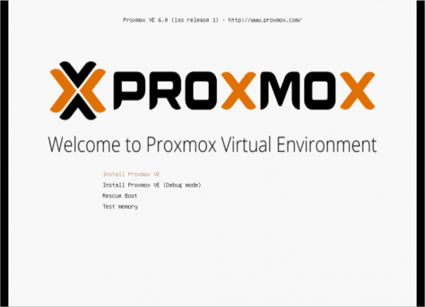

Wäheln Sie ``Install Proxmox VE`` und starten Sie die
Installtion mit ``ENTER``.

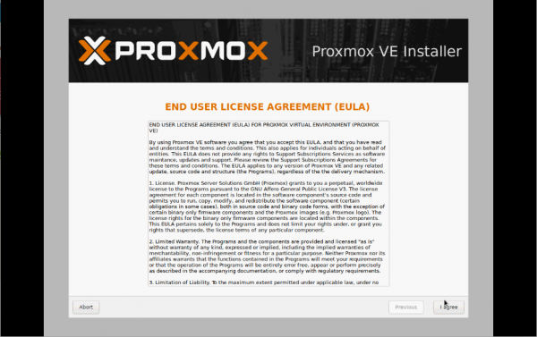

Bestätigen Sie das ``End-User Agreement`` mit ``Enter``.

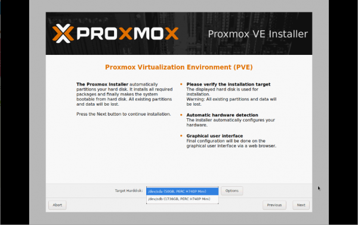

Wählen Sie die gewünschte Festplatte auf dem Server zur 
Installation aus. Haben Sie mehrere einzelne Festplatten im Server
verbaut und kein RAID-Verbund definiert, so können Sie an dieser
Stelle in der Installation mithilfe der Schaltfläche ``Optionen``
weitere Einstellungen aufrufen. Hier können Sie z.B. mehrere Festplatten 
angeben, die in einem ZFS-Pool definiert werden sollen. Dies ist für das
Erstellen von sog. Snapshots von Vorteil. Soll aber an dieser Stelle 
nicht vertieft werden.

Nun bei den Location- and Time-Settings Next wählen:

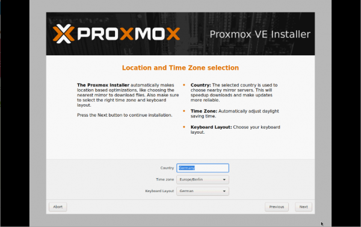

Legen Sie ein Kennwort für den Administrator des Proxmox-Host und eine E-Mail
Adresse fest. Klicken Sie auf ``Weiter``.

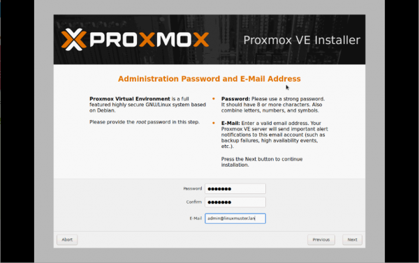

Legen Sie die IP-Adresse des Proxmox-Host im internen Netz fest. Hier wurde die 
interne IP-Adresse ``10.0.0.10/16`` festgelegt.

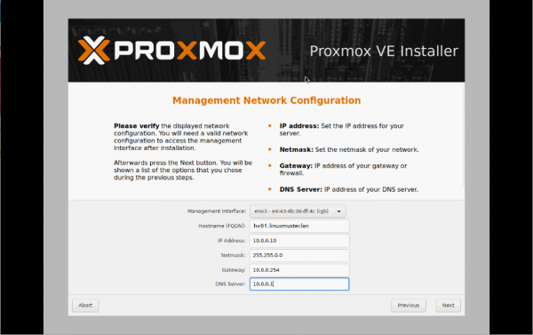

Überprüfen Sie auf der Übersichtsseite, dass alle Angaben korrekt sind und fahren anschließend fort.

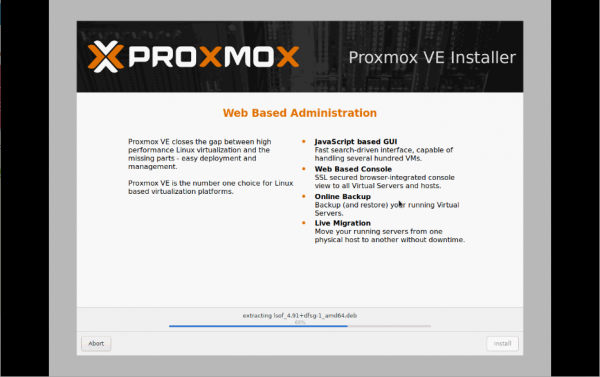

Warten Sie den Abschluss der Installation ab.

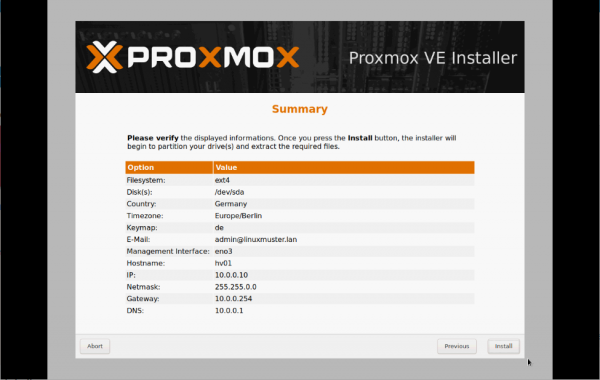

Nach erfolgreicher Installation lassen Sie Proxmox über ``Reboot`` neustarten.

Proxmox Einrichtung
-------------------

Nach dem Neustart von Proxmox können Sie sich über einen PC, welcher sich im selben Netz befindet, über das
graphische Webinterface auf https://10.0.0.10:8006 mit ``root`` als User name und dem vorher gesetzten Passwort über Login anmelden:

.. figure:: media/image_9.png
   :align: center
   :alt: Schritt 9

Im Fenster ``No valid subscription`` ``OK`` wählen oder Fenster schließen:

.. figure:: media/image_10.png
   :align: center
   :alt: Schritt 10

Updates ermöglichen
-------------------

Um Proxmox Updates installieren zu können, müssen in der Shell

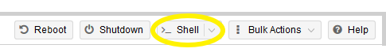

folgende Befehle der Reihe nach ausgeführt werden:

.. code::

   sed -i -e 's/^/#/' /etc/apt/sources.list.d/pve-enterprise.list
   echo „deb http://download.proxmox.com/debian stretch pve-no-subscription“ »
   /etc/apt/sources.list.d/pve-no-subscription.list

.. figure:: media/image_12.png
   :align: center
   :alt: Schritt 12

.. code::

   apt update
   apt upgrade → Y
   
Internetzugriff einrichten
--------------------------

Für eine funktionierende Umgebung sollten zwei Netzwerkschnittstellen auf dem Hypervisor eingerichtet sein. Eine für das interne Netz (green, 10.0.0.0/16) und eine für das externe Netz und den 
Internetzugriff (red, externes Netz). An diesem Punkt ist auf dem Hypervisor lediglich die interne
Netzwerkschnittstelle (green), welche bei der Installation eingerichtet wurde. Daher muss nun 
die zweite Schnittstelle eingerichtet werden, um eine Internetverbindung aufbauen zu können.

Zweite Netzwerkbrücke hinzufügen
^^^^^^^^^^^^^^^^^^^^^^^^^^^^^^^^

Bislang ist nur eine Bridge für das interne Netz vorhanden. Um von Proxmox externen
Internetzugriff zu erhalten, muss eine zweite Bridge erstellt werden. 
Dazu das Menü hv01 > Network > Create > Linux Bridge wählen:

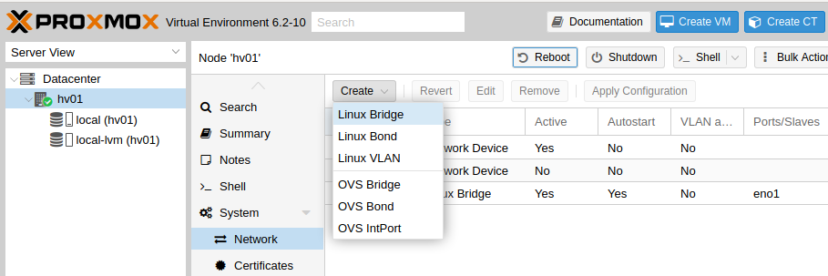

Unter Bridge/Slave den physiaklischen Ausgangsport eintragen, an dem das externe Netz erreicht 
wird. In unserem Fall ist das eno4. Im Feld ``Comment`` ``red`` eingeben. 
Mit ``Create`` die Brücke erstellen:

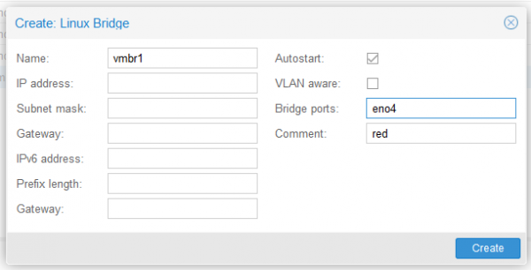

Anschließend Proxmox über den Button ``Reboot`` oben rechts neu starten, um die neuen 
Networking-Konfigurationen zu laden. (Node hv01 muss dafür im Menü links ausgewählt sein):

.. figure:: media/image_14-1.png
   :align: center
   :alt: Schritt 14-1

Der Firewall müssen dann später beide Interfaces zugeordnet werden

Zweiten Datenträger als Speicher einbinden
^^^^^^^^^^^^^^^^^^^^^^^^^^^^^^^^^^^^^^^^^^

In diesem Schritt wird die zweite Festplatte in Proxmox eingebunden, um diese als 
Storage für die virtuellen Maschinen zu nutzen.

.. note::

   Die folgenden Schritte nur dann ausführen, wenn vorher eine zweite virtuelle Disk 
   für die virtuellen Maschinen vorbereitet wurde und nicht auf einem einzigen 
   Volume eingerichtet werden soll!

local-lvm(hv01)-Partition entfernen und Speicher freigeben
^^^^^^^^^^^^^^^^^^^^^^^^^^^^^^^^^^^^^^^^^^^^^^^^^^^^^^^^^^

Während der Proxmox-Installation wurden die Storages „local“ und „local-lvm“ automatisch 
auf der ersten virtuellen Festplatte erstellt. Da anfangs für die Linuxmuster-Maschinen 
eine zweite virtuelle Festplatte als „Storage“ eingerichtet
wurde, wird „local-lvm“ nicht benötigt. Deshalb wird nun „local-lvm“ entfernt und „local“ durch den freigewordenen Speicher vergrößert:

1. auf hv01 oben rechts Shell anklicken:

2. lsblk eingeben und mit der Enter-Taste bestätigen; folgende Ausgabe sollte erscheinen:

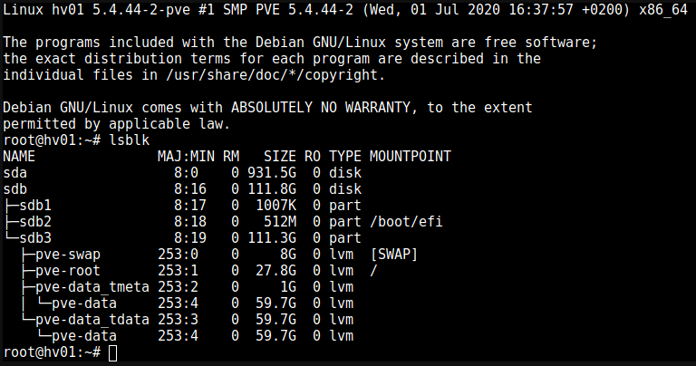

3. lvremove /dev/pve/data entfernt local-lvm:

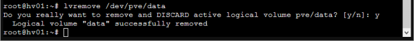

4. lvresize -l +100%FREE /dev/pve/root erweitert den Speicherbereich von local-lvm:

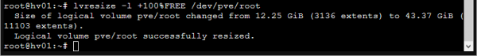

5. mit resize2fs /dev/mapper/pve-root dsa Filesystem anpassen:

.. figure:: media/image_14-5.png
   :align: center
   :alt: Schritt 14-5

6. über lsblk sollte nun zu sehen sein, dass pve-data-Partitionen entfernt wurden:

.. figure:: media/image_14-6.png
   :align: center
   :alt: Schritt 14-6

7. Auf der Weboberfläche von Proxmox über Datacenter → Storage local-lvm (hv01) mit dem Remove Button graphisch entfernen:

.. figure:: media/image_14-7.png
   :align: center
   :alt: Schritt 14-7

Zweiten Datenträger vorbereiten
^^^^^^^^^^^^^^^^^^^^^^^^^^^^^^^

Die zweite virtuelle Festplatte heißt hier sdb und ersetzt die pve-data-Partition, die im 
vorigen Schritt entfernt wurde. Um diese für Proxmox vorzubereiten, stellt man über 
Konsolenbefehle einige Konfigurationen ein. Falls die Shell noch nicht geöffnet ist, 
wie oben beschrieben, öffnen und folgende Befehle eingeben: 
(für folgende Schritte vg- & lv- Namen sollten Sie an Ihre Festplattengrößen entsprechend 
anpassen, die folgenden Grafiken dienen zur Orientierung; „vg-ssd-1700“ eignet sich 
beispielsweise für ein Volume aus SSDs mit 1700GB )

1. Datenträger vorher partitionieren z.B mit fdisk /dev/sdb → , g → n → w (über lsblk den richtigen
Datenträgernamen herausfinden; in diesem Fall sdb)

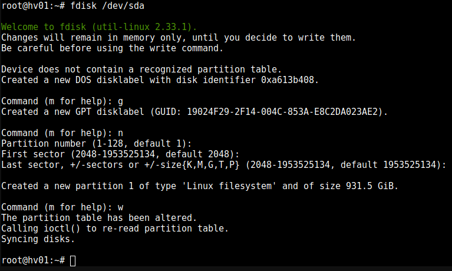

2. pvcreate /dev/sd<xy>1
Beispiel: pvcreate /dev/sdb1 und anschließend mit y bestätigen:

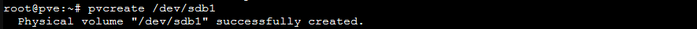

3. vgcreate vg-<disk>-<size> /dev/sd<xy>1
mit Beispiel:vgcreate vg-ssd-1700 /dev/sdb1 eine virtuelle Gruppe auf sdb erstellen:

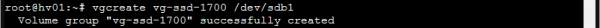

4. lvcreate -l 99%VG -n lv-<disk>-<size> vg-<disk>-<size>
nun das logical volume erstellen; hier ist die virtuelle Festplatte eine SSD mit 1.7TB Speicher, weshalb die Namen im Befehl so angepasst werden: 
Beispiel: lvcreate -l 99%VG -n lv-ssd-1700 vg-ssd-1700:

.. figure:: media/image_14-11.png
   :align: center
   :alt: Schritt 14-11

5. lvconvert –tpype thin-pool vg-<disk>-<size>/lv-<disk>-<size>
Beispiel: lvconvert –tpype thin-pool vg-ssd-1700/lv-ssd-1700 konvertiert den Speicherbereich der
erstellten virtual group als „thin-pool“ (Beachten Sie die zwei Bindestriche vor dem Wort „type“):

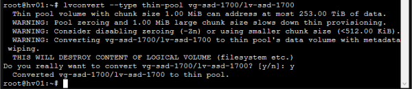

Datenträger graphisch als Storage in Proxmox anbinden
^^^^^^^^^^^^^^^^^^^^^^^^^^^^^^^^^^^^^^^^^^^^^^^^^^^^^

1. Im Menü ``Datacenter > Storage > Add`` wählt man „LVM-Thin“ aus. Im ID-Feld wird der 
Name des virtuellen Datenträgers angegeben. In diesem Fall ist es eine SSD mit 1.70TB 
Speicherkapazität, weshalb die Bezeichnung vd-ssd-1700 gewählt wird. Unter 
Volume Group die erstellte virtuelle Gruppe auswählen, welche hier vg-ssd-1700 ist:

.. figure:: media/image_15-1.png
   :align: center
   :alt: Schritt 15-1

2. Unter Thin Pool das logical volume auswählen:

.. figure:: media/image_15-2.png
   :align: center
   :alt: Schritt 15-2

3. Bei Node den Hypervisor, welcher hier „hv01“ heißt, auswählen:

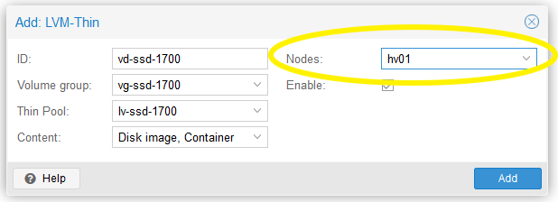

4. Nun sollte im linken Menü der zweite Storage zu sehen, auf welchem die Maschinen für die Linuxmuster-Lösung installiert werden können:

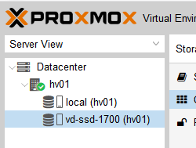

VM Import
=========

VM Templates herunterladen
--------------------------

Fertige VM-Snapshots für Proxmox haben wir für Sie erstellt und sind auf der Übersichtsseite 
der Proxmox 7.0 Aplliance unter https://www.netzint.de/education/downloads/education-proxmox70 bereitgestellt. Die virtuelle Maschine für eine linuxmuster.net v7 Umgebung ist die Server-VM 
lmn70-server_xcp-ng_2019-08.xva. Zudem wird als Firewall-VM lmn70-opnsense_xcp-ng.xva für Sie bereitgestellt. 

Optional ist zusätzlich eine OPSI-VM und eine Docker-VM für Ihre linuxmuster.net-Umgebung 
verfügbar. Um die Maschinen also importieren zu können, müsssen diese zuerst auf den 
Hypervisor geladen werden und anschließend importiert werden.
Heruntergeladen werden können diese z.B. über die Shell von Proxmox mit dem wget-Befehl. 
Für die OPSI-VM wäre es der Befehl 

.. code::

   wget https://www.netzint.de/lmnvmrepo/lmn70-opsi_proxmox_2019-08.vma.lzo

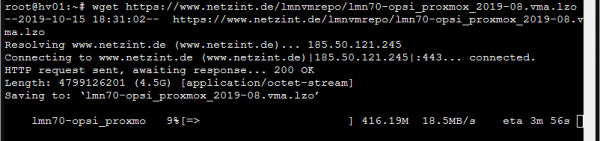

Liegen die Dateien auf einem PC im selben Netz, können z.B. auch von diesem aus mit scp die 
Dateien auf Proxmox kopiert werden:

.. code::

    scp lmn70-docker_proxmox_2019-08.vma.lzo root@10.0.0.10:~

+------------+------------------------------------------------------------------------------+
| VM         | Download-Befehl                                                              |
+============+==============================================================================+
|server-VM   | wget https://www.netzint.de/lmnvmrepo/lmn70-server_proxmox_2019-08.vma.lzo   |
+------------+------------------------------------------------------------------------------+
|opsi-VM     | wget https://www.netzint.de/lmnvmrepo/lmn70-opsi_proxmox_2019-08.vma.lzo     |
+------------+------------------------------------------------------------------------------+
|docker-VM   | wget https://www.netzint.de/lmnvmrepo/lmn70-download_proxmox_2019-08.vma.lzo |
+------------+------------------------------------------------------------------------------+
|opnsense-VM | wget https://www.netzint.de/lmnvmrepo/lmn70-opnsense_proxmox_2019-08.vma.lzo |
+------------+------------------------------------------------------------------------------+

Alternativ können Sie die Imagedateien lokal über die jeweilgen Download-Button auf der 
Übersichtsseite https://www.netzint.de/education/downloads/education-proxmox70 auf Ihren PC herunterladen und anschließend über das „scp“-Tool (Grundkenntnisse notwendig) 
z.B: mit scp lmn70-server_proxmox_2019-08.vma.lzo root@10.0.0.10:~ auf den Hypervisor übertragen.

VM Templates importieren
========================

Liegen die VMs auf Proxmox, können die Abbilder als neue virtuelle Maschinen in der Shell über das qmrestore-Tool eingefügt werden. Dafür für jede zu importierende Maschine den Befehl anpassen und ausführen. Dabei sollte man sich im selben Verzeichnis befinden, in welchem die Abbilder liegen 
oder im Befehl den Pfad zur Datei mitangeben.

Der Befehl sollte mit dem Prinzip ``qmrestore <vmname.vma.lzo> <VM-ID> - -storage <storage-name> -
unique 1`` (Beachten Sie die zwei Bindestriche vor dem Wort „storage“) angewendet werden.

<vmname.vma.lzo> entspricht dem Dateinamen der TemplateVM. Mit <VM-ID> übergeben Sie der VM 
eine ID, wie beispielsweise „101“ oder „701“. <storage-name> ist etwa local oder der Name 
einer zweiten virtuellen Disk, wie im obigen Beipiel „vd-ssd-1700“-unique 1 generiert eine 
andere MAC-Addresse, als im Template exportiert.

+-------------+-----------------------------------------------------------------------------+
| VM          | Import-Befehl                                                               |
+=============+=============================================================================+
| server-VM   |  qmrestore lmn70-server_2019-08.vma.lzo 701 –storage local-lvm -unique 1    |
+-------------+-----------------------------------------------------------------------------+
| opsi-VM     |  qmrestore lmn70-opsi_2019-08.vma.lzo 702 –storage local-lvm -unique 1      |
+-------------+-----------------------------------------------------------------------------+
| docker-VM   |  qmrestore lmn70-docker_2019-08.vma.lzo 703 –storage local-lvm -unique 1    |
+-------------+-----------------------------------------------------------------------------+
| opnsense-VM |  qmrestore lmn70-opnsense_2019-08.vma.lzo 745 –storage local-lvm -unique 1  |
+-------------+-----------------------------------------------------------------------------+

1. Hier wird als Beispiel der Server-Snapshot mit der ID 701 auf dem local-lvm-Storage über 
den Befehl qmrestore lmn70-server_proxmox_2019-08.vma.lzo 701 –storage local-lvm -unique 1 
hochgeladen. Beachten Sie die zwei Bindestriche vor dem Wort „storage“:

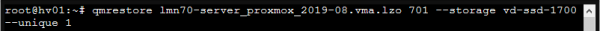

2. Als VM-IDs kann ebenso 101, 102, 103 etc. gewählt werden. Wurden die gewünschten Maschinen
erfolgreich importiert, sollten diese auf der Weboberfläche von Proxmox (https://10.0.0.10:8006) 
links aufgelistet zu sehen sein.

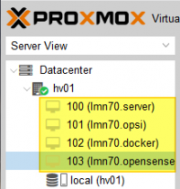

Netzwerkkarten überprüfen/anpassen
==================================

Standardmäßig ist nach der Installation von Proxmox nur eine Netzwerkbrücke eingerichtet, 
um an ein externes Netz angebunden zu sein. Da die importierten Maschinen untereinander 
in dem eigenen internen Netz laufen werden, sollte kontrolliert werden,
dass den VMs Server, OPSI und Docker die Netzwerkbrücke für das interne Netz (green) 
zugewiesen ist. Die Netzwerkbrücken der Firewall-VM OPNSense sollten richtig zugeordnet sein 
``net0 ⇒ green; net1 ⇒ red``.

NachdemIhr Hypervisor läuft und die VM erfolgreich importiert wurden, starten Sie nun mit dem Setup
der linuxmuster.net. Gehen Sie hierzu zu dem Kapitel :ref:`Erstkonfiguration <setup-using-selma-label>`.

