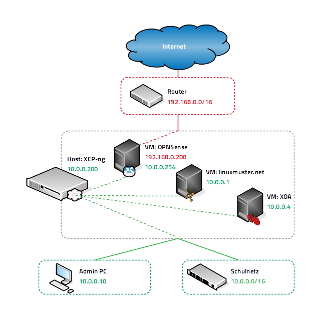
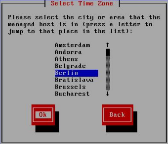
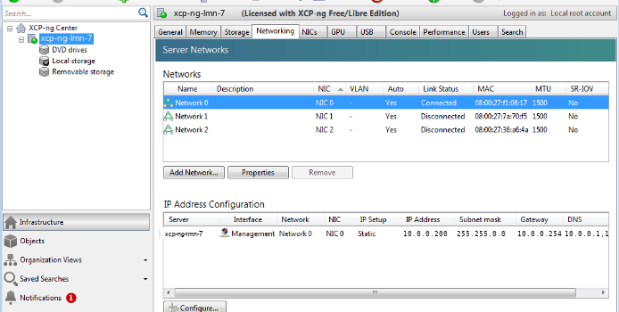
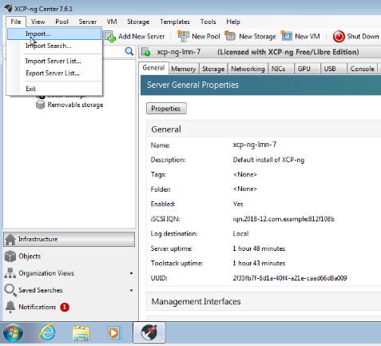
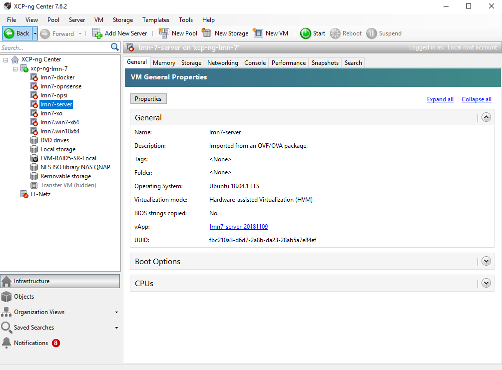
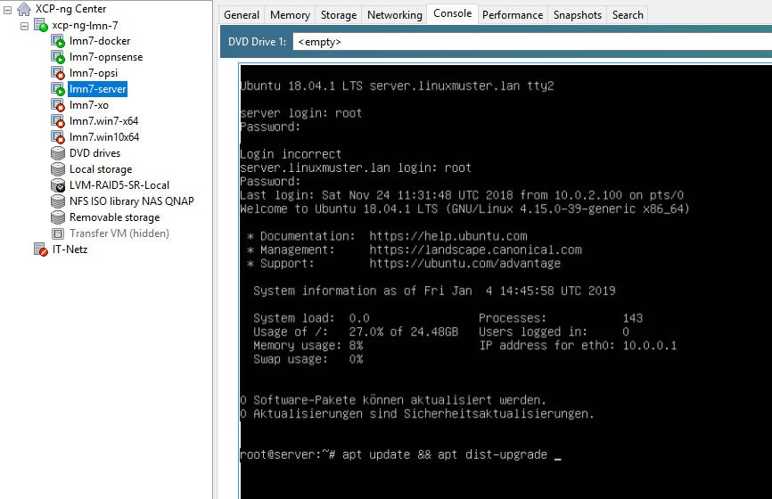
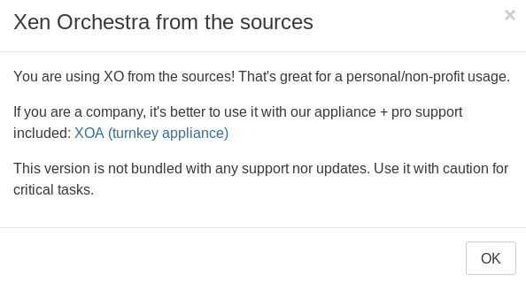
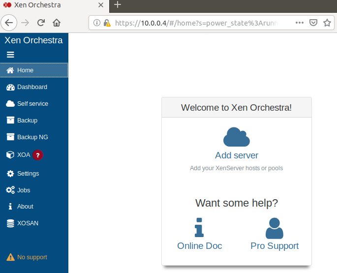

.. include:: /guided-inst.subst

.. _install-on-xen-label:

============================
 Virtualisierung mit XCP-ng
============================

.. sectionauthor:: `@cweikl <https://ask.linuxmuster.net/u/cweikl>`_,
		   `@MachtDochNix (pics) <https://ask.linuxmuster.net/u/MachtDochNix>`_

XCP-ng ist eine reine OpenSource-Virtualisierungslösung, die auf Basis 
von XEN arbeitet. XCP-ng bietet sog. Enterprise-Features wie Replikation, 
automatisierte Backups, Verschieben von VMs im laufenden Betrieb und 
weitere Funktionen. Daher eignet sie sich besonders für den virtuellen 
Betrieb von linuxmuster.net, da diese recht einfach skalierbar ist,
mehrere Virtualisierungs-Hosts und Speichereinheiten in einem 
sog. ``Resource-Pool`` zusammengeführt und verwaltet werden können.

Der Betrieb wird auf jeglicher Markenhardware und auf einer Vielzahl an 
NoName-Hardware unterstützt.

Diese Dokumentation ist eine "Schritt für Schritt" Anleitung für die
Installation der linuxmuster.net-Musterlösung in der Version 7 auf
Basis von XCP-ng. 

Übersicht
=========

In nachstehender Abbildung wird der schematische Netzaufbau der
anstehenden v7-Installation unter XCP-ng dargestellt.

Für die Installation mit XCP-ng und linuxmuster v7 wird der 
``IP-Bereich 10.0.0.0/16`` genutzt. Es gilt nachstehende Zuordnung
der IPs zu den VMs bzw. genutzten Hosts.

+--------------+--------------------+
| VM           | IP                 | 
+==============+====================+
| OPNsense®    | 10.0.0.254/16      |
+--------------+--------------------+
| Server       | 10.0.0.1/16        | 
+--------------+--------------------+
| OPSI         | 10.0.0.2/16        | 
+--------------+--------------------+
| Dockerhost   | 10.0.0.3/16        |
+--------------+--------------------+
| XOA          | 10.0.0.4/16        |
+--------------+--------------------+
| Admin-PC     | 10.0.0.10/16       |
+--------------+--------------------+
| XCP-ng Host  | 10.0.0.200/16      |
+--------------+--------------------+

Lies zuerst die Abschnitte :ref:`what-is-new-label` 
und :ref:`prerequisites-label`, bevor du dieses Kapitel durcharbeitest.

Nach der Installation gemäß dieser Anleitung erhältst du eine
einsatzbereite Umgebung bestehend aus

* einem Host (XCP-ng Hypervisor) für alle virtuellen Maschinen, 
* einer Firewall (OPNsense®)  
* einem Server (linuxmuster.net)
* einer VM (XOA) zur web-basierten Verwaltung des Virtualisierungs-Hosts

Die Einbindung der VMs für den OPSI-Server und den Docker-Host werden hier nicht weiter beschrieben.
Diese sind analog zum Import und Anpassung der Server-VM durchzuführen.

Voraussetzungen
===============

* Es wird vorausgesetzt, dass du einen Administrationsrechner
  (Admin-PC genannt) besitzt, den du je nach Bedarf in die
  entsprechenden Netzwerke einstecken kannst und dessen
  Netzwerkkonfiguration entsprechend vornehmen kannst.

* Der Internetzugang des Admin-PCs und auch des XCP-ng-Hosts sollte
  zunächst gewährleistet sein, d.h. dass beide zunächst z.B. an einem
  Router angeschlossen werden, über den die beiden per DHCP oder fester IP 
  ins Internet können. Sobald später die Firewall korrekt eingerichtet
  ist, bekommt der Admin-PC und der XCP-ng-Host eine IP-Adresse im Schulnetz.

.. hint:: 

   Virtualisierungs-Hosts sollten grundsätzlich niemals im gleichen Netz wie 
   andere Geräte sein, damit dieser nicht von diesen angegriffen werden kann.
   In dieser Dokumentation wird zur Vereinfachung der Fall dokumentiert, dass
   der XCP-ng-Host sich im internen Schulnetz befindet.

Bereitstellen des XCP-ng-Hosts
==============================

.. hint:: 

   Der XCP-ng-Host bildet das Grundgerüst für die Firewall *OPNsense®* und
   den Schulserver *server*. Die Virtualisierungsfunktionen der CPU sollten 
   zuvor im BIOS aktiviert worden sein.

Die folgende Anleitung beschreibt die *einfachste* Installation. 
Komplexere Einsatzszenarien, die VLANs, Teaming oder RAID berücksichtigen, werden in
zusätzlichen Anleitungen betrachtet.

.. hint::

   :ref:`Anleitung Netzwerksegmentierung <subnetting-basics-label>` 

Download der Appliances und der Virtualisierungssoftware XCP-ng
---------------------------------------------------------------

Die Download-Links zur Installation der XCP-ng Virtualisierungssoftware finden Sie nachstehend:

+--------------------+----------------------------------------------------------------------+
| Programm           | Beschreibung                                                         | 
+====================+======================================================================+
| XCP-ng             | `Installationsdatenträger <https://xcp-ng.org/#easy-to-install>`_    | 
+--------------------+----------------------------------------------------------------------+
| XCP-ng Center      | Windows-Programm zur Verwaltung der Virtualisierungsumgebung         |                             
+--------------------+----------------------------------------------------------------------+
| Download-Link:     | XCP-ngCenter_ für XCP-ng ab v8.2 LTS                                 |
+--------------------+----------------------------------------------------------------------+
| XVA VMs            | VM der lmn v7 für XCP-ng im XVA-Format zum direkten Import           |                             
+--------------------+----------------------------------------------------------------------+
|  Download-Link:    | Download der XVAs-v7_                                                |
+--------------------+----------------------------------------------------------------------+
| Beschreibung VMs   | :ref:`Beschreibung der VMs für v7 <prerequisites-label>`             |                             
+--------------------+----------------------------------------------------------------------+

.. _XCP-ngCenter: https://github.com/cocoon/xenadmin/releases/download/20.11.00.3/XCP-ng-Center_20.11.00.3.msi

.. _XVAs-v7: https://download.linuxmuster.net/xcp-ng/v7/latest/

.. hint::

   Die XVAs für die v7 wurden mit XCP-ng v8.2 LTS erstellt. Zudem wurden die xcp-ng
   Tools für die v8.2 pro VM installiert. Ein Import für eine XCP-ng 7.6 Version 
   scheitert und bricht mit einem Fehler ab. Daher bitte sicherstellen, dass 
   eine aktuelle XCP-ng v8.2 genutzt wird. 

Erstellen eines USB-Sticks zur Installation des XCP-ng-Host
-----------------------------------------------------------

Herunterladen von XCP-ng
^^^^^^^^^^^^^^^^^^^^^^^^

Diese Anleitung bezieht sich auf die Version 8.2 von XCP-ng. Für nachfolgende Versionen ist 
dieses Vorgehen entsprechend anzuwenden.

Die ISO-Datei muss heruntergeladen und ein bootfähiger USB-Stick erstellt werden.

Herunterladen: XCP-Webseite_

.. _XCP-Webseite: https://xcp-ng.org/#easy-to-install

Erstellen des Boot-Sticks
^^^^^^^^^^^^^^^^^^^^^^^^^

USB-Stick erstellen: In das Download-Verzeichnis wechseln, Buchstaben für 
USB-Stick unter Linux ermitteln, X durch den korrekten Buchstaben ersetzen und 
dann nachstehenden Befehl eingeben:

.. code-block:: console
 
   dd if=XCP-ng_8.2.0.iso of=/dev/sdX bs=8M status=progress oflag=direct

Installation XCP-ng
===================

Vom USB-Stick booten, danach erscheint folgender Bildschirm:

.. figure:: media/02_install-on-xcp-ng_boot-screen.png
   :align: center
   :alt: Schritt 1 der Installation des XCP-ng Servers

Starten der Installtion mit ``ENTER``.

Wählen Sie Ihr Tastaturlayout.

.. figure:: media/03_install-on-xcp-ng_select-keymap.png
   :align: center
   :alt: Schritt 2 der Installation des XCP-ng Servers

Wir verwenden ``[qwerz] de``.

Sollten Sie zusätzliche Treiber benötigen können Sie diese nun laden in dem Sie ``F9`` 
drücken. Starten Sie das XCP-ng Setup mit ``Ok``.

.. figure:: media/04_install-on-xcp-ng_welcome-setup.png
   :align: center
   :alt: Schritt 3 der Installation des XCP-ng Servers

Akzeptieren Sie danach die Lizenzbedingungen mit ``Accept EULA``.

.. figure:: media/05_install-on-xcp-ng_license-agreement.png
   :align: center
   :alt: Schritt 4 der Installation des XCP-ng Servers

XCP-ng prüft, ob bereits eine vorherige Version entwedern von XenServer oder ggf. auch 
von XCP-ng installiert war. Falls ja, bietet die Installationsroutine an, die 
bestehende Installation zu aktualisieren oder eine Neuinstallation vorzunehmen. Wählen 
Sie das gewünschte Vorgehen aus. Bei einer Aktualisierung legt XCP-ng zuvor eine 
Sicherheitskopie der bereits bestehenden Installation an, um ggf. wieder auf diese Version 
zurückkehren zu können.

.. figure:: media/06_install-on-xcp-ng_upgrade-or-clean-installation.png
   :align: center
   :alt: Schritt 5 der Installation des XCP-ng Servers

Wählen Sie danach den Datenträger aus, der verwendet werden soll und setzen Sie den Haken 
bei ``Enable thin provisioning``. Bestätigen Sie mit ``Ok``.

.. figure:: media/07_install-on-xcp-ng_virtual-machine-storage.png
   :align: center
   :alt: Schritt 6 der Installation des XCP-ng Servers

Bei einer Neuinstallation werden für das gewählte Medium dann die Partitionen erstellt, das 
Dateisystem erzeugt und alle Daten auf dem Medium gelöscht. Bei einem Upgrade bleiben die 
Daten erhalten.

Danach werden Sie nach der Installationsquelle gefragt. 

.. figure:: media/08_install-on-xcp-ng_installation-source.png
   :align: center
   :alt: Schritt 7 der Installation des XCP-ng Servers

Geben Sie hier ``Local Media`` an.

Danach werden Sie gefragt, ob das Installationsmedium überprüft werden soll.

.. figure:: media/09_installation-on-xcp-ng_verify-installation-source.png
   :align: center
   :alt: Schritt 8 der Installation des XCP-ng Servers

Bestätigen Sie dies mit ``Verfy installation source``.

Nach Abschluss der erfolgreichen Überprüfung des Installationsmediums wird dies bestätigt.

.. figure:: media/10_installation-on-xcp-ng_verification.png
   :align: center
   :alt: Schritt 9 der Installation des XCP-ng Servers

Legen Sie danach das Kennwort für den Administrator (user: root) fest und bestätigen Sie dieses.

.. figure:: media/11_installation-on-xcp-ng_set-password.png
   :align: center
   :alt: Schritt 10 der Installation des XCP-ng Servers

Solltest du kein Upgrade einer bestehenden Installation durchführen, 
so must du noch die Netzwerkeinstellungen festlegen.

.. figure:: media/12_xcp-ng-install_networking.png
   :align: center
   :alt: Schritt 11 der Installation des XCP-ng Servers

Vergebe hier eine statische IP-Adresse aus dem internen Netz (z.B. 10.0.0.200/16).
Lege die DNS-Server und Gateway-IP (beides 10.0.0.254) fest.

.. figure:: media/13_xcp-ng-install_host_and_dns_konfiguration.png
   :align: center
   :alt: Schritt 12 der Installation des XCP-ng Servers

Lege danach die Systemzeit fest (manuelle Auswahl oder via NTP-Server (10.0.0.254).

.. figure:: media/14_install-on-xcp-ng_system-time.png
   :align: center
   :alt: Schritt 13 der Installation des XCP-ng Servers

Bei manueller Angabe der Systemzeit, wähle die Zeitzone aus.

Erst die Region wählen.

.. figure:: media/15_install-on-xcp-ng_select-time-zone-area.png
   :align: center
   :alt: Schritt 14 der Installation des XCP-ng Servers

Danach die Stadt auswählen.

Bestätige danach die Frage nach der Installation von XCP-ng.

.. figure:: media/17_install-on-xcp-ng_confirm-installation.png
   :align: center
   :alt: Schritt 16 der Installation des XCP-ng Servers

Danach startet die Installation

.. figure:: media/18_install-on-xcp-ng_preparing-for-installation.png
   :align: center
   :alt: Schritt 17 der Installation des XCP-ng Servers

Die Frage nach Installation eines ``Supplemental Pack`` ist mit ``No`` zu beantworten.

.. figure:: media/19_install-on-xcp-ng_supplemental-packs.png
   :align: center
   :alt: Schritt 18 der Installation des XCP-ng Servers

Nach erfolgreicher Installation kannSt du mit ``Ok`` den Server neu starten.
Achte darauf, dass der USB-Stick nicht mehr für den Bootvorgang aktiv ist.

.. figure:: media/20_install-on-xcp-ng_installation-completion.png
   :align: center
   :alt: Schritt 19 der Installation des XCP-ng Servers

Beim Startvorgang erscheint folgende Auswahl:

.. figure:: media/21_install-on-xcp-ng_grub-bootloader.png
   :align: center
   :alt: Schritt 20 der Installation des XCP-ng Servers

XCP-ng wird nach einigen Sekunden automatisch gestartet.

.. figure:: media/22_install-on-xcp-ng_boot-screen.png
   :align: center
   :alt: Schritt 21 der Installation des XCP-ng Servers

Nach erfolgreichem Start bootet XCP-ng in folgende Konsole des Hypervisors, 
in der dann der Hinweis auf die installierte Version 8.1 erscheinen sollte 
(im Bild noch 7.6):

.. figure:: media/23_xcp-ng-konsole_hypervisor.png
   :align: center
   :alt: Schritt 22 der Installation des XCP-ng Servers

XCP-ng: Administration
=======================

Für die Administration Deines XCP-ng-Hosts stehen Dir zwei Möglichkeiten zur Verfügung.
Zunächst solltest du Dir auf einem Windows-Rechner im Netzwerk das Programm ``XCP-ng Center`` 
installieren. Hiermit kannst du die gesamte Virtualisierungsumgebung administrieren 
und insbesondere die vorkonfigurierten VMs einfach importieren. 

Zudem kann der XCP-ng-Host ebenfalls ``web-basiert administriert`` werden. Dies erfolgt mithilfe 
der Anwendung ``XenOrchestra (XOA - Xen Orchestra Application)``. linuxmuster.net stellt hierfür 
ebenfalls eine vorkonfigurierte VM mit einer installierten XOA App zur Verfügung. XOA wurde
hier "from scratch" installiert und an die lmn7 angepasst. Die Nutzung von XOA ist der von 
XCP-ng empfohle Weg der Administration und bietet im Produktivbetrieb viele Vorteile wie z.B.
die Eirichtung und Automatisierung von Backups / Snapshots.

XCP-ng Center unter Windows installieren
----------------------------------------

Installiere das Programm (siehe ``Downloads-Links``) durch einen Rechtsklick auf die MSI-Datei auf dem Windows-Rechner und 
wähle dann ``Als Administrator ausführen`` aus.

.. figure:: media/25_xcp-ng-admin_execute-as-administrator.png
   :align: center
   :alt: Installation XCP-ng Center

Bestätige die Rückfrage mit ``Ja``

.. figure:: media/26_xcp-ng-admin_confirm.execution-of-xcp-ng-center.png
   :align: center
   :alt: 2. Teil: Installation XCP-ng Center

Rufe nach erfolgreicher Installation das Programm ``XCP-ng Center`` auf.

Wähle hier den Menüpunkt ``Add New Server`` und gebe Sie bei der Installation
vergebene IP-Adresse des XCP-Hosts sowie die Benutzerdaten an.

.. figure:: media/27_xcp-ng-admin_add_new_server.png
   :align: center
   :alt: 3. Teil: Hinzufügen des XCP-ng-Hosts

Netzwerk einrichten
^^^^^^^^^^^^^^^^^^^

Jetzt muss das Netzwerk eingerichtet werden. Notiere dir hierzu die Bezeichnungen
und MAC-Adressen der eingebauten Netzwerkkarten. Diese findest du unter der Reiterkarte ``NICs``.
Die Netzwerkkarte, die die Verbindung zum Internet übernehmen soll, wird später dem Netzwerk ``Red``, 
diejenige für das interne Schulungsnetz dem Netzwerk ``Green`` und die dritte Netzwerkkarte 
für die Steuerung des WLAN dem Netzwerk ``Blue`` zugeordnet - sofern diese überhaupt vorhanden ist.

Damit dies korrekt erfolgt, ist es wichtig zu wissen, wie NIC 0,1,2 physikalisch angeschlossen sind
und welche MAC-Adressen diese aufweisen. Anhand der Informationen erfolgt dann im folgenden Schritt
die Zuordnung der Netze (vSwitche).

Wähle nun für den XCP-ng-Host die Reiterkarte ``Networking`` aus.

Wähle das erste Netwerk ``Network 0`` aus, prüfe die Zuordnung der Netzwerkkarte (MAC-Adresse und physikalische Verkabelung beachten). 
Es sollte diejenige NIC diesem vSwitch zugewiesen sein, die die Verbindung in das interne Netz steuert. In der Abb. ist dies NIC0, die dem Network0 zugeordnet ist. Der Name des vSwitches Network0 wird nun geändert. 
Klicke dazu auf ``Properties`` und ändere den Namen für das Netzwerk in ``Green``.

Führe diese Schritte ebenfalls für die weiteren Netze (BLUE - WLAN Netz und RED - externes Netz) 
aus und ändere die Namen auf ``BLUE`` und ``RED``. In der Abb. ist NIC1 dem vSwitch Network1 zugeordnet und so verkabelt, dass hiermit das WLAN angesteuert wird, so dass dieses nun mit dem Namen ``Blue`` anzugeben ist. Network2 wird in diesem Beispiel dann zu ``Red``.

VMs importieren
^^^^^^^^^^^^^^^

Nachdem das Netzwerk korrekt eingerichtet wurde, können nun die VMs der linuxmuster.net 
importiert werden.

Lade dir vorher zunächst alle VMs, die du importieren möchtest unter linuxmuster.net auf 
deinen Client herunter (siehe obigen Download-Link: XVAs-v7_ ). Die heruntergeladenen VMs
sind als ZIP-Archiv komprimiert und können nach dem Download mit dem SHA256 HASH-Wert geprüft werden.
Entpacke die ZIP-Dateien, so dass du alle VMs als XVA-Dateien  vorliegen hast.

Danach rufe im XCP-ng Center den Menüpunkt ``File -> Import`` auf.

Es erscheint ein neues Fenster. Gebe hier den Speicherort und den Dateinamen der zu 
importierenden VM an. Die VMs weisen die Dateiendung ``.xva`` auf.

.. figure:: media/30_xcp-ng-import_source.png
   :align: center
   :alt: Import: Datei mit Speicherort angeben

Nach Bestätigung mit ``Ok`` erscheint nun das erste Fenster, um den Import zu steuern.
Zunächst must du den XCP-ng-Host festlegen, für den der Import der VM erfolgen soll.

.. figure:: media/31_xcp-ng-import_home_server.png
   :align: center
   :alt: Import: Heimserver angeben

Wähle danach deinen gewünschten Speicher aus. Bestätige mit ``Next``.

.. figure:: media/32_xcp-ng-import_storage.png
   :align: center
   :alt: Import: Speicher auswählen

Prüfe die Netzwerkeinstellungen, die von der zu importierenden VM stammen.

.. figure:: media/33_xcp-ng-import_select-network.png
   :align: center
   :alt: Import: Netzwerkangaben prüfen

Bestätige diese mit ``Next``.

Bestätige das Management Network des XCP-Hosts als Transfer-Network.

.. figure:: media/34_xcp-ng-import_transfer-network.png
   :align: center
   :alt: Import: Transfer Network

Prüfe nun nochmals alle Einstellungen für den Import der VM.
Falls Änderungen erforderlich sind, gehe mit ``Previous`` zurück zur
gewünschten Einstellung.

.. figure:: media/35_xcp-ng-import_review-import-settings.png
   :align: center
   :alt: Import: Review import settings

Bestätige nun den Import mit ``Finish``.

Der Import kann einige Zeit dauern. Danach solltest du die importierte 
VM im XCP-ng Center sehen können.

VMs starten und aktualisieren
^^^^^^^^^^^^^^^^^^^^^^^^^^^^^

Wähle im XCP-ng Center links die VM aus, die du starten möchtest.
Klicke danach oben in der Menüleiste das Icon ``Start`` aus.

Beginne mit der Firewall OPNsense®. Starte diese.

.. figure:: media/37_xcp-ng-install_opnsense_started.png
   :align: center
   :alt: Gestartete VM OPNsense®

Melde Dich auf der Konsole mit den Daten ``root`` und ``Muster!`` an.

.. figure:: media/38_xcp-ng-install_opnsense_console-menue.png
   :align: center
   :alt: Konsolenmenü OPNsense®

Wähle danach in dem Konsolenmenü den Punkt 12) aus, um die Firewall zu aktualisieren.

.. figure:: media/39_xcp-ng-install_opnsense_update-from-console.png
   :align: center
   :alt: Update der VM OPNsense®

Bestätige diesen Vorgang mit ``y`` und warte bis die VM neu gestartet wurde.

Starte die VM mit dem linuxmuster.net Server.
Melde Dich mit o.g. Login-Daten an.

.. important::
 
   Vor den folgenden Schritten muss die Datei ``/etc/apt/sources.list.d/lmn7.list`` wie folgt geändert werden:

   .. code-block:: console
   
      deb https://archive.linuxmuster.net lmn7/
      deb-src https://archive.linuxmuster.net lmn7/

   Andere Zeilen können gelöscht oder mit "#" am Zeilenanfang auskommentiert werden.
   
   Danach muss mit

   .. code-block:: console
   
      wget https://archive.linuxmuster.net/archive.linuxmuster.net.key

   der nötige Schlüssel geholt und mit

   .. code-block:: console
   
      apt-key add archive.linuxmuster.net.key

   aufgenommen werden.

   Siehe auch ``https://ask.linuxmuster.net/t/infrastrukturanpassungen-neuer-paketserver-und-moegliche-folgen``

Aktualisiere die VM.

Bestätigen Sie das Update mit ``y``.

.. figure:: media/41_xcp-ng-install-updating-server-vm.png
   :align: center
   :alt: Update der Server VM

Sofern du weitere VMs importiert hast, führe die Aktualisierungen
analog aus.

.. hint::

    Für die weitere Einrichtung von linuxmuster.net für deine Schule folge
    der Dokumentation unter: 
    :ref:`Linuxmuster Setup <setup>` 

Xen Orchestra Appliance (XOA)
-----------------------------

Xen Orchestra Appliance (XOA_) bietet die Möglichkeit, die Virtualisierungsumgebung XCP-ng webbasiert 
und plattformunabhängig zu administrieren. Die bereitgestellten Funktionen entsprechen denen des 
Programms XCP-ng Center für Windows und gehen hinsichtlich der Backups darüber hinaus. 
Es können via Borwserzugriff VMs importiert, exportiert, neue VMs erstellt und verschoben werden. 
Zudem lassen sich so plattformunabhängig verschiedene Arten von Backups auf unterschiedlichen 
Datenträgern erstellen und Zeitpläne zur automatisierten Erstellung der Backups definieren und aktivieren. 

.. _XOA: https://xen-orchestra.com

Xen Orchestra wird von der französischen Firma vates_ entwickelt und supportet. Diese stellt XOA als Open 
Source zur Verfügung. Der Quellcode findet sich auf github_.

.. _vates: https://vates.fr/

.. _github: https://github.com/vatesfr/xen-orchestra

linuxmuster.net hat gemäß dieser eine XOA-VM zum Einsatz auf der Virtualisierungsumgebung XCP-ng auf Basis von Ubuntu 18.04 LTS mit Anpassungen für linuxmuster v7 erstellt. Die VM wurde ``from the sources`` erstellt, und für den Betrieb mit linuxmuster.net auf XCP-ng angepasst.

.. note::
  
   Um XOA VM nutzen zu können, muss diese zuerst unter XCP-ng importiert worden sein!

Import der VM
^^^^^^^^^^^^^

Lade zuerst die vorbereitete XOA-VM für linuxmuster.net als ZIP-Archiv_ herunter. Entpacke dieses Archiv lokal und importiere dann die VM wie bereits zuvor 
im Unterkapitel ``VMs importieren`` beschrieben.  

.. _ZIP-Archiv: https://download.linuxmuster.net/xcp-ng/v7/latest/

Anpassung der VM
^^^^^^^^^^^^^^^^

Einige Einstellungen der vorkonfigurierten VM sind nach dem Import auf die eigene Virtualisierungsumgebung anzupassen. Öffne hierzu einen Webbrowser und öffne die Seite 
http://10.0.0.4 oder https://10.0.0.4. Der PC, auf dem der Browser geöffnet wird, muss sich im Netz 10.0.0.0/16 (grünes Netz - internes LAN der linuxmuster.net) befinden,
damit eine Verbindung möglich ist. Wählst du den verschlüsselten Zugriff, so bestätige die Zertifikatswarnung, da ein selbst erstelltes Zertifikat für XOA ertsellt und 
konfiguriert wurde.

Es erscheint folgende Anmeldemaske:
 
.. figure:: media/54_xoa-vm_https-login.png
   :align: center
   :alt: XOA Login - Schritt 1

Gebe hier den User ``admin@admin.net`` mit dem Passwort ``Muster!`` ein und klicke auf ``Sign in``.

Nach erfolgreicher Anmeldung wirst du darauf hingewiesen, dass du XOA ``from Sources`` nutzt und du daher kein Support und keine Updates erhälst.

Bestätige dies, indem du ``Ok`` klickst.

Danach siehst du das ``Welcome-Fenster``. 

Du must nun den XCP-ng Host oder den XCP-ng Pool angeben, damit XOA hierauf zugreifen und die Ressourcen verwalten kann.
Wähle den Eintrag ``Add Server``.

Es erscheint dann das Einstellungs-Fenster für die Server (Settings).

.. figure:: media/57_xoa-vm_add-xcp-ng-host.png
   :align: center
   :alt: XOA Server Settings - Schritt 4

Trage den Hostnamen, die IP-Adresse ``10.0.0.200`` ein, die du dem XCP-ng Server gegeben hast und gebe dahinter - durch einen Doppelpunkt getrennt - den Port an.
I.d.R. ist dies Port 443, der zu nutzen ist. XCP-ng nutzt hierbei self-signed certificates. Trage den Benutzernamen des root-Benutzers von XCP-ng sowie sein Kennwort ein.
Setze zudem den Schiebeschalter nach rechts - auf grün -, damit nicht authorisierte Zertifikate - also self-signed certificates - akzeptiert werden.
Klicke auf ``Connect``. Es wird nun von der XOA-VM die Verbindung zum XCP-ng Host aufgebaut und gespeichert.

.. note::
   Falls du einen XCP-ng Pool mit mehreren Servern und Speicherressourcen definiert hast, must du hier nur den Pool-Master als Server eintragen. 
   Alle weiteren Server und Ressourcen werden dann automatisch erkannt.

Ändere nun das voreingestellte Kennwort für den root-Benutzer (admin@admin.net) der XOA-VM. Klicke hierzu auf der linken Menüleiste ganz unten auf der Personensymbol.

Danach erscheint das Kontexmenü für den Bentuzer: Hier kannst du das Kennwort ändern und weitere Einstellungen vornehmen.

.. figure:: media/59_xoa-vm_edit-password.png
   :align: center
   :alt: XOA Edit Password - Schritt 6

Trage das bisherige Kennwort ``Muster!`` sowie zweimal dein neues Kennwort ein. 
Stelle die Sprache ein und bestätige die Änderungen mit einem Klick auf ``OK``.

SSH-Verbindung zur VM
^^^^^^^^^^^^^^^^^^^^^

Um sich erstmalig mit der XOA-VM via SSH zu verbinden, gibst du in einem Terminal ein:

.. code::

   ssh -p 22 muster@10.0.0.4

Bestätige den fingerprint mit ``yes``und gebe das Kennwort ``Muster!`` ein.

Gebe auf der Konsole ``passwd`` ein und ändere der Kennwort für den Benutzer ``muster``.

Wechsle auf der Konsole zum root-Benutzer, indem du als Benutzer ``muster`` den Befehl ``sudo su`` angibst.
Du wirst nach dem Kennwort des Muster-Nutzers gefragt. Gebe das vorher geänderte Kennwort an, danach kannst du nun als Benutzer ``root`` arbeiten.

Im Verzeichnis ``/root`` findet sich eine README-Datei mit Hinweisen zur VM sowie weitere Skripte zur Aktualisierung der XOA-Installation.

Update der XOA-Installation
^^^^^^^^^^^^^^^^^^^^^^^^^^^

Um die XOA-Installation zu aktualisieren, findest du ein Skript, das du als root-Benutzer ausführen must.

Rufe das Skript ``/root/xo-update.sh`` auf. Die XOA-Installation from Sources wird aktualisiert. 
Weitere Hinweise huerzu findest du unter ``/root/README``.

.. 
   Hierbei wird aber die von linuxmuster.net angepasste
   Konfigurationsdatei des xo-servers wieder überschrieben. Daher must du nach dem Update noch die angepasste Konfigurationsdatei des xo-servers wieder zurückspielen. 
   Diese Datei liegt unter ``/root/config.toml.backup`` und sollte dort niemals gelöscht werden!
   Für die Rücksicherung der Konfigurationsdatei findest du unter ``root/restore-xo-config.sh`` ein Skript, das du als Benutzer ``root`` ausführen must. Die angepasste 
   Konfigurationsdatei wird so an den korrekten Ort zurückgeschrieben und danach wir der xo-server neu gestartet.

Backups: Backup NG
^^^^^^^^^^^^^^^^^^

Um mithilfe von XOA Backups zu definieren, wählst du in der GUI der XOA-VM links im Menü den Eintrag ``Backup NG``. Dies ist der Eintrag, um Backups für XCP-ng zu erstellen.
Der Menüeintrag ``Backup`` existiert aufgrund der Abwärtskompatibilität zu XenServer - Installationen.

Grundlegende Erläuterungen zu den verschiedenen Backup-Möglichkeiten_ mit XOA findest du im Handbuch zu XOA. Hier gibt es ebenfalls Einführungsvideos.

.. _Backup-Möglichkeiten: https://xen-orchestra.com/docs/backups.html

Wurden Backups definiert und wurden diese bereits ausgeführt, dann kannst du deren Status und ggf. zusätzliche Backupinformationen aufrufen.

Dies kann dann z.B. wie in folgender Abbildung aussehen:

.. figure:: media/60_xoa-vm_ackup-ng.png
   :align: center
   :alt: XOA Backup NG - Status
   
Aktualisierung des XCP-ng-Hosts
===============================

Nachdem du o.g. Installationsschritte sowie den Import der VMs erfolgreich ausgeführt hast, kann der XCP-ng Host
über die Firewall eine Internet-Verbindung aufbauen.
Um den XCP-ng Host zu aktualisieren, benötigt der Hypervisor eine funktionierende 
Internet-Verbindung. Dies sollte nunmehr der Fall sein.

Wähle in dem Startbildschirm des XCP-ng Hosts den Menüpunt ``Local Command Shell``
und drücke ``Enter``. Gebe als Benutzer ``root`` an und das Passwort das du 
während der Installation vergeben hast.

Danach teste zuerst, ob die Verbindung zum Internet funktioniert: 

.. code::

   ping 8.8.8.8
   ping www.linuxmuster.net

Erhälst Du hierauf erfolgreich Antworten, so funktioniert die Verbindung vom XCP-ng Host zum Internet sowie die Namensauflösung.

Gebe nun auf der Konsole den Befehl 

.. code-block:: console
 
   yum update

ein. XCP-ng fragt nun via Internetverbindung die Repositories ab und prüft, ob
Aktualisierungen vorhanden sind. Falls ja, werden die zu aktualisierenden Pakete 
angezeigt. Die Aktualisierung ist mit ``y`` zu starten.

.. figure:: media/24_install-on-xcp-ng_update-xcp-ng-host.png
   :align: center
   :alt: Schritt 23 der Installation des XCP-ng Servers

Danach ist Dein XCP-ng Host auf dem aktuellen Stand.

============================ =================
Weiter geht es mit dem Setup |follow_me2setup|
============================ =================
