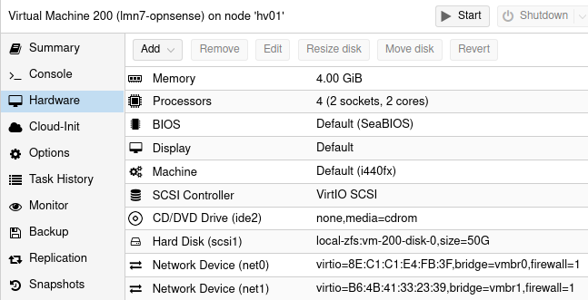
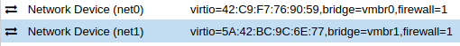
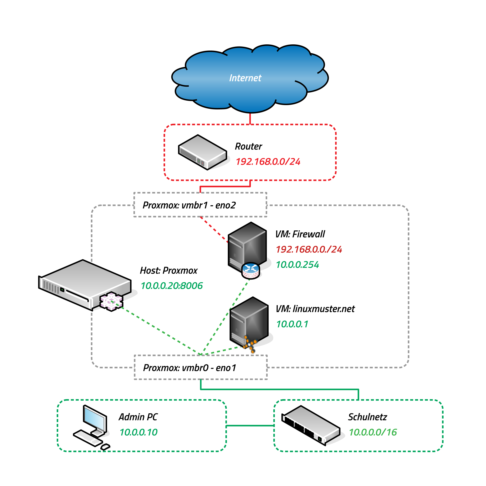
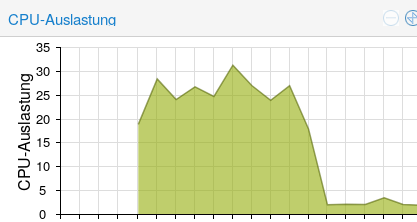

.. include:: /guided-inst.subst

.. _proxmox-ui-protection-label:

=========================
Absichern des Hypervisors
=========================

.. sectionauthor:: `@Name des Autors in ask <https://ask.linuxmuster.net/u/Dein_Name>`_

VM Netzwerkeinstellungen prüfen
-------------------------------

.. figure:: media/install-on-proxmox_34_network-after-import.svg
   :align: center
   :alt: Status Netzwerk nach dem Importieren

Die OPNsense®-VM weist zwei Netzwerkkarten auf, wie in der Grafik dargestellt.
In der Verwaltungs-Oberfläche von Proxmox zeigt sich das wie nachstehend dargestellt.

Die Netzwerkkarte `net0` ist mit der Bridge `vmbr0` verbunden. Diese ist derzeit noch für die Verbindung ins Intranet zuständig.

Die Netzwerkkarte `net1` ist mit der Bridge `vmbr1` verbunden.

Im nächsten Schritt wird dies geändert, so dass die VMs mit ihrer Verbindung ins Intranet (grünes Netz) an die Bridge `vmbr0` und die externe Schnittstelle der OPNsense®-VM auf die dann externe Bridge `vmbr1` angeschlossen sein wird.

Für die VMs `server (opsi, docker)` müssen die Einstellungen für die Netzwerkkarte ebenfalls überprüft werden.
Alle sollten mit ihrem `Network Device net0` mit der `bridge=vmbr0` verbunden sein.

Für die endgültige Verwendung kommentierst du jetzt am besten die Netzwerk-Schnittstellen deines Promox-Host entsprechend.

Wechsele auf deinen Host `hv01`, wähle unter `Network` die Bridge `vmbr0` aus und betätige den Edit-Button.

.. figure:: media/install-on-proxmox_37_edit-network-devices.png
   :align: center
   :alt: Proxmox Ansicht hv01 - Network - vmbr0 - Edit

Dann fügst du den Kommentar `intern / green` in das entsprechende Feld ein.
Die Felder `IPv4/CIDR` und `Gateway (IPv4)` sind unerheblich.

.. figure:: media/install-on-proxmox_38_vm-network-bridge-vmbr0-comment.png
   :align: center
   :alt: Hinzufügen eines Kommtentars bei vmbr0

Ebenso verfährst du der Brigde `vmbr1` und dem Kommentar `extern / red`.

.. figure:: media/install-on-proxmox_39_vm-network-bridge-vmbr1-comment.png
   :align: center
   :alt: Hinzufügen eines Kommtentars bei vmbr1

Proxmox - Host: Zugriff von außen unterbinden
=============================================

Das Management-Interface (WebUI) des Proxmox-Host ist immer auf `vmbr0` festgelegt. 

Um nach der Erstinstallation und -konfiguration den Zugriff auf den Proxmox-Host von außen zu unterbinden, ist die Netzwerkschnittstelle, die IP für den Proxmox-Host und die Verkabelung zu ändern.

Dies erledigst du mit folgenden Konfigurationsschritten:

1. Ändern der Interfaces.

   Du öffnest wie zuvor beschrieben die Shell des Proxmox-Host hv01.
   Darin editierst Du die Datei ``/etc/network/interfaces`` änderst du die Eintragungen wie folgt:

   .. code::

      auto lo
      iface lo inet loopback
  
      iface eno1 inet manual
  
      iface eno2 inet manual

      #Bridge green / intern
      auto vmbr0
      iface vmbr0 inet static
            address 10.0.0.20   # IP aus dem internen Netzwerkes (gruen) - IP des Proxmox-Host
            netmask 255.255.0.0 # Subnetzmaske 16 = 255.255.0.0
            gateway 10.0.0.254  # IP der OPNsense® Firewall
            bridge-ports eno1   # erste NIC an vmbr0 gebunden
            bridge-stp off
            bridge-fd 0

      #Bridge red / extern
      auto vmbr1
      iface vmbr1 inet manual
            bridge-ports eno2   # zweite NIC an vmbr1 gebunden 
            bridge-stp off
            bridge-fd 0

2. Ändern des Hostnames.

   Öffne die Datei ``/etc/hosts`` und ändere diese wie folgt:

     .. code::

        127.0.0.1 localhost.localdomain localhost
        10.0.0.20 hv01.linuxmuster.lan hv01

   IPv6 - Einträge mit `::1` oder mit `fe` und `ff` beginnend können so bleiben.

3. Ändern der DNS-Auflösung.

   Öffne die Datei ``/etc/resolv.conf`` und ändere diese wie folgt:

   .. code::

      search linuxmuster.lan
      nameserver 10.0.0.254

   Dies ist die interne IP-Adresse der OPNsense® Firewall.

4. Proxmox-Host anhalten.

   Zur Übernahme der Einstellungen ist der Proxmox-Host anzuhalten. (`Shutdown`)

5. Die physischen Netzwerkkabel an den Netzwerk-Schnittstellen tauschen.

6. Client Netzwerkeinstellungen ändern.

  Der Client mit dem du die Konfiguration vornimmst muss an dem Switch angeschlossen sein, den für das interne Netz (`grün`) vorgesehen hast. Die Netzwerkkonfiguration deines Clients muss du ändern:

  * IP 10.0.0.10/16
  * MASK 255.255.0.0
  * GATEWAY & DNS 10.0.0.254

Die WebUI des Proxmox-Host erreichst du ab sofort nun über die Adresse `https://10.0.0.20:8006`.

Virtuelle Maschinen starten
===========================

Nachdem du dich mit dem Proxmox-Host neu verbunden hast, starte zunächst die Firewall-VM (OPNsense®). 
Anschließend startest du die Server-VM und falls eingerichtet die optionalen VMs.

Nach dem ersten Start der Server-VM laufen diverse automatische Anpassungen ab, wie die Auslastung der CPU zeigt: 

Bevor du fortfährst warte ab, bis die Auslastung zurückgegangen ist. 

Nachdem dein Hypervisor läuft und die VMs erfolgreich gestartet sind, geht es mit mit den Test der Netzwerkverbindung der Server weiter.

+--------------------------------------------------------------------+-------------------------------------------+
| Weiter mit den Netzwerktest                                        | |follow_me2network-test_a|                |
+--------------------------------------------------------------------+-------------------------------------------+

Solltest du eine Migration anstreben, dann geht es hier weiter.

+--------------------------------------------------------------------+-------------------------------------------+
| Weiter mit der Migration                                           | |follow_me2migration_b|                   |
+--------------------------------------------------------------------+-------------------------------------------+
