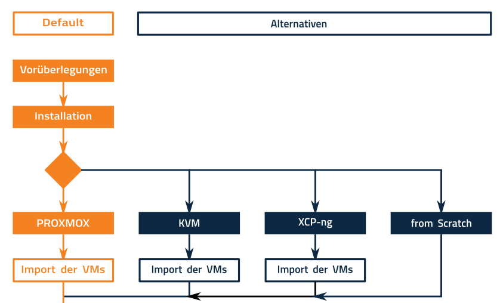
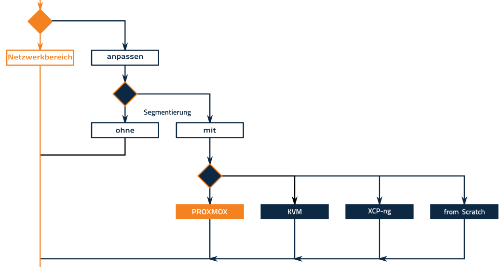

.. _install-overview-label:

=======================
Installation: Übersicht
=======================

.. sectionauthor:: `@cweikl <https://ask.linuxmuster.net/u/cweikl>`_,
                   `@MachtDochNix (pics) <https://ask.linuxmuster.net/u/MachtDochNix>`_

Übersicht zur Installation
==========================

Nachstehend finden Sie nach Installationsabschnitten gegliedert eine Übersicht zur Installation der 
linuxmuster.net v7 mit möglichen Installationsoptionen. Die Menüführung folgt diesem Ablauf.

Am Ende des Kapitels finden Sie den Gesamtablauf nochmals als Gesamtübersicht - auch zum Download.

Erster Teil der Installation
----------------------------

Im ersten Abschnitt geht es darum, die eigene Installation gemäß den eigenen Anforderungen 
und Rahmenbedingungen zu planen, den geeigneten Hypervisor auszusuchen und diesen zu installieren 
bzw. sich ggf. für eine Installation direkt auf der Hardware zu entscheidne. Bei der
Installation eines Hypervisors geht diese Dokumentation davon aus, dass Sie für den
jeweiligen Hypervisor die vorbereiteten virtuellen Machinen (VMs) importieren und danach
das Setup initiieren.

Zweiter Teil der Installation
-----------------------------

Im zweiten Abschnitt der Installation sind die Netzbereiche (IP-Adressen oder / und Netzsegmentierung)
auf die eigenen Anforderungen anzupassen und im Netz umzusetzen.

Dritter Teil der Installation
-----------------------------

Im dritten Abschnitt der Installation ist die Erstkonfiguration der Firewall und des Servrs oder alternativ 
die Migration einer bestehenden v6.2 Installation durchzuführen. Danach sind Benutzer anzulegen und
letzte Anpassungen vorzunehmen.

.. figure:: media/installation-process-part3.png
   :align: center
   :alt: Installation: Abschnitt 3

Installationsübersicht
----------------------

Nachstehende Grafik bietet Ihnen einen Gesamtüberblick über den Installationablauf der linuxmuster.net v7.

.. figure:: media/overview-installation-process.svg
   :align: center
   :alt: Installation: Übersicht

Nachstehend können Sie den Installationsablauf als Übersicht im PDF-Format herunterladen:

:download:`Übersicht als PDF-Datei <media/overview-installation-process.pdf>`

Nächste Schritte
----------------
PDF
Um die Planung der Installation stärker auf Ihre Bedürfnise hin abstimmen zu können, finden Sie im Kapitel
Vorüberlegungen entsprechende Hilfestellungen.

:ref:`Vorüberlegungen zur Installation von linuxmuster.net v7 <prerequisites-label>`

