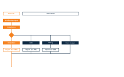
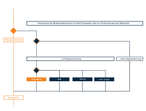
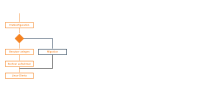

.. _install-overview-label:

=========================
 Installation: Übersicht
=========================

.. sectionauthor:: `@cweikl <https://ask.linuxmuster.net/u/cweikl>`_,
                   `@MachtDochNix (pics) <https://ask.linuxmuster.net/u/MachtDochNix>`_

Nachstehend findest du nach Installationsabschnitten gegliedert eine Übersicht zur Installation der 
linuxmuster.net v7 mit möglichen Installationsoptionen. Die Menüführung folgt diesem Ablauf.

Am Ende des Kapitels findest du den Gesamtablauf nochmals als Gesamtübersicht - auch zum Download.

Erster Teil der Installation
============================

Im ersten Abschnitt geht es darum, die eigene Installation gemäß den eigenen Anforderungen 
und Rahmenbedingungen zu planen, den geeigneten Hypervisor auszusuchen und diesen zu installieren 
bzw. sich ggf. für eine Installation direkt auf der Hardware zu entscheiden. Bei der
Installation eines Hypervisors geht diese Dokumentation davon aus, dass du die für den
jeweiligen Hypervisor die vorbereiteten virtuellen Machinen (VMs) importierst und danach
das Setup initiierst.

Zweiter Teil der Installation
=============================

Im zweiten Abschnitt der Installation sind die Netzbereiche (IP-Adressen oder / und Netzsegmentierung)
auf die eigenen Anforderungen anzupassen und im Netz umzusetzen.

Dritter Teil der Installation
=============================

Im dritten Abschnitt der Installation ist die Erstkonfiguration der Firewall und des
Servers oder eventuell die Migration einer bestehenden v6.2 Installation durchzuführen. 
Danach sind Benutzer anzulegen und letzte Anpassungen vorzunehmen.

Installationsübersicht
======================

Nachstehende Grafik bietet dir einen Gesamtüberblick über den Installationablauf der linuxmuster.net v7.

.. figure:: media/overview-installation-process.svg
   :align: center
   :alt: Installation: Übersicht

Nachstehend kannst du den Installationsablauf als Übersicht im PDF-Format herunterladen:

:download:`Übersicht als PDF-Datei <media/overview-installation-process.pdf>`

Nächste Schritte
================

Um die Planung der Installation stärker auf deine Bedürfnisse hin
abstimmen zu können, findest du im Kapitel `Vorüberlegungen` 
entsprechende Hilfestellungen.

- :ref:`Vorüberlegungen zur Installation von linuxmuster.net v7 <prerequisites-label>`

