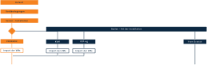
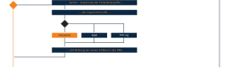
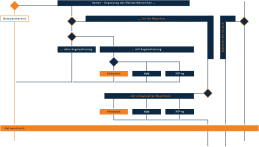
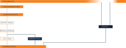
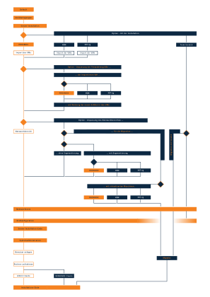

.. _install-overview-label:

Installation: Übersicht
=======================

.. sectionauthor:: `@cweikl <https://ask.linuxmuster.net/u/cweikl>`_,
                   `@MachtDochNix <https://ask.linuxmuster.net/u/MachtDochNix>`_

Nachstehend findest Du nach Installationsabschnitten gegliedert eine Übersicht zur Installation der 
linuxmuster.net v7 mit möglichen Installationsoptionen. Die Menüführung folgt diesem Ablauf.

Am Ende des Kapitels findest Du den Gesamtablauf nochmals als Gesamtübersicht - auch zum Download.

Erster Teil der Installation
++++++++++++++++++++++++++++

Im ersten Abschnitt geht es darum, die eigene Installation gemäß den eigenen Anforderungen 
und Rahmenbedingungen zu planen, den geeigneten Hypervisor auszusuchen und diesen zu installieren 
bzw. sich ggf. für eine Installation direkt auf der Hardware zu entscheiden. Bei der
Installation eines Hypervisors geht diese Dokumentation davon aus, dass du die für den
jeweiligen Hypervisor die vorbereiteten virtuellen Machinen (VMs) importierst und danach
das Setup initiierst.

Zweiter Teil der Installation
+++++++++++++++++++++++++++++

Im zweiten Abschnitt sind die Festplatten des Hypervisor an die eigenen Anforderungen anzupassen. Diese hängen im Großen und Ganzen von der Größe der Schule ab. Maßgebend sind hier vor allem die Anzahl der Nutzer und der verschiedenen Hardware-Klassen der Client Systeme und deren Betriebssysteme.

Dritter Teil der Installation
+++++++++++++++++++++++++++++

Im dritte Abschnitt der Installation sind die Netzbereiche (IP-Adressen oder / und Netzsegmentierung)
auf die eigenen Anforderungen anzupassen und im Netz umzusetzen.

Vierter Teil der Installation
+++++++++++++++++++++++++++++

Im vierten Abschnitt der Installation ist die Erstkonfiguration der Firewall und des
Servers vorzunehmen und Benutzer und Geräte anzulegen oder eventuell die Migration einer bestehenden v6.2 Installation durchzuführen. 
Abschließend sind letzte Anpassungen u.a. Aufnahme der Arbeitsstationen vorzunehmen.

Installationsübersicht
++++++++++++++++++++++

Nachstehende Grafik bietet dir einen Gesamtüberblick über den Installationablauf der linuxmuster.net v7.

Nachstehend kannst du den Installationsablauf als Übersicht im PDF-Format herunterladen:

:download:`Übersicht als PDF-Datei <media/overview-installation-process.pdf>`

Führung durch die Installation
++++++++++++++++++++++++++++++

Um dich durch die Installation zu führen, stehen dir unten auf den einzelnen Seiten jeweils die ``Next`` und ``Previous``- Buttons zur Verfügung. Diese werden automatisch von der von uns eingesetzten Dokumentationssoftware erstellt und folgen immer dem Aufbau des linken Menüs.

* Daraus ergibt sich, das ``Ǹext`` dich zum nächsten Schritt der Installation führt.
* Aber der ``Previous`` dich nicht immer zur zuletzt gesehenen Seite. Benutze besser den Zurück-Button deines Browsers.

  .. image:: /media/link_arrow.svg
     :width: 200 px
     :align: center
     :alt: Follow_me_Button

Dieser Pfeil wird dich durch die Installation führen, wenn es zu einer Verzweigung bzw. Zusammenführung im Ablaufplan kommt. Nutze ansonsten immer den ``Next``- Button. 

Nächste Schritte
++++++++++++++++

Um die Planung der Installation stärker auf deine Bedürfnisse hin
abstimmen zu können, findest du im Kapitel `Vorüberlegungen` 
entsprechende Hilfestellungen.

