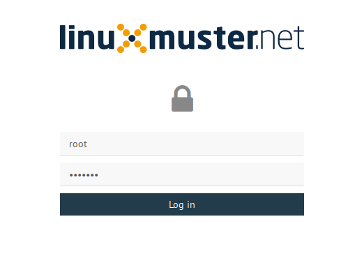
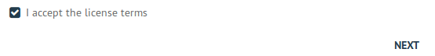
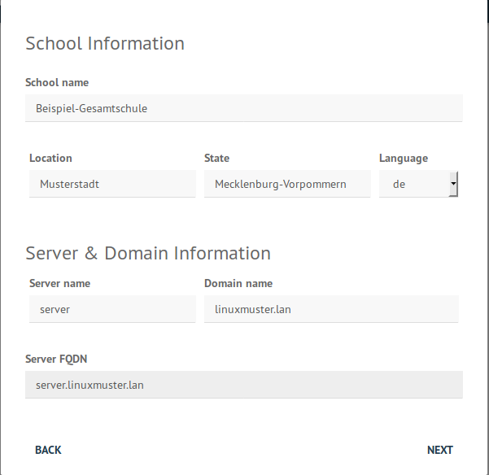

====================================
 Installation und Erstkonfiguration
====================================

Öffne auf dem Administrations-PC mit einem Webbrowser die URL
``http://10.0.0.1:8000``. Melde dich hier mit deinen root Logindaten an.

Es erscheint automatisch der
Einrichtungsassistent. Die Sprache kann ausgewählt werden und die EULA
muss akzeptiert werden.

   Disclaimer Dialog muss akzeptiert werden

Im nächsten Dialog müssen Schulnamen und Domäne eingetragen werden.

