Installation XenServer
======================

Herunterladen von XenServer
---------------------------

Das Installationsmedium kann von der Projekthomepage http://xenserver.org heruntergeladen werden. Diese Anleitung bezieht sich auf die Version 6.5. Unter älteren Versionen können die Xen-VMs lmn61 nicht importiert werden. Die ISO-Datei muss heruntergeladen und auf CD gebrannt werden.

Installieren von XenServer
--------------------------

..  figure:: media/installation_xenserver/install01.png
    :scale: 70%

    Von der CD booten und dem Setup folgen.

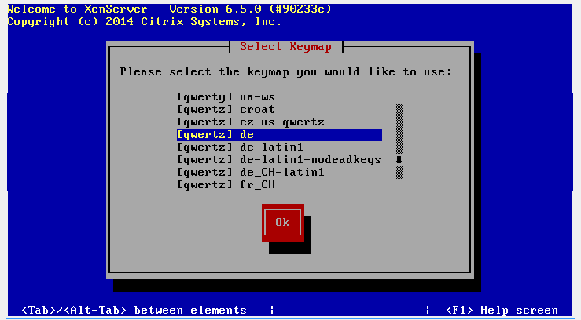
    
    Wählen Sie Ihr Tastaturlayout. Wir verwenden ``[querz] de``

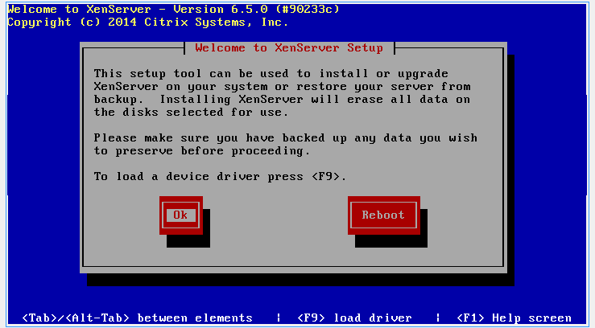
    
    Sollten Sie zusätzliche Treiber benötigen können Sie diese an dieser Stelle laden, indem Sie ``F9`` drücken. 
    Andernfalls setzen Sie die Installation durch Bestätigung mit ``OK`` fort. 

..  figure:: media/installation_xenserver/install04.png
    :scale: 70%
    
    Akzeptieren Sie die Lizenzbedingungen mit ``Ok``

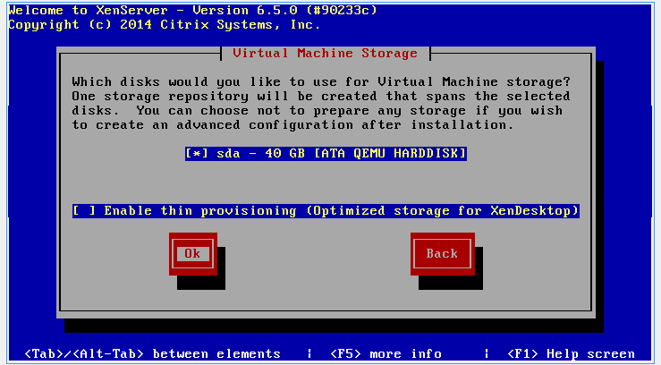
    
    Wählen Sie den Datenträger der zur Installation verwendet werden soll und bestätigen Sie mit ``Ok``

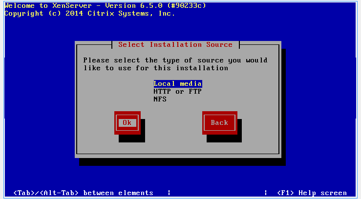
    
    Hier können Sie das Installationsmedium wählen. Wir verwenden den lokalen Datenträger
    (CD).

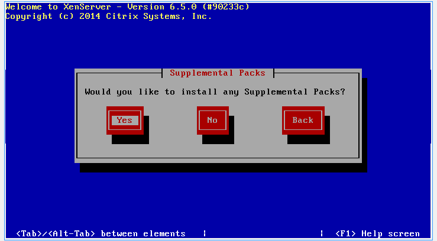
    
    Wählen Sie bei der Frage nach "Supplemental-Packs" ``Yes`` um die NI-XenServer-Tools installieren zu können.

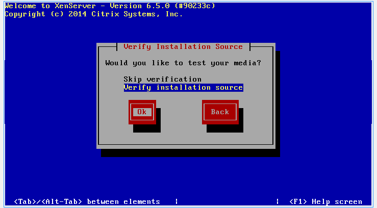
    
    Wählen Sie „Verify installation source“ und bestätigen Sie mit ``Ok``

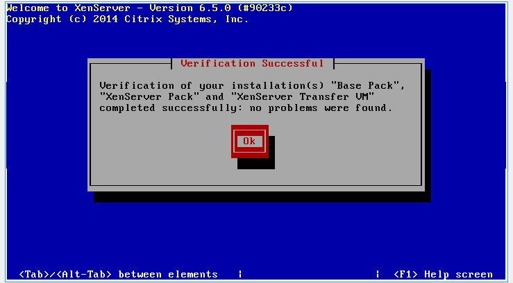

    Sofern „no problems were found“ angezeigt wird können Sie die Meldung mit Ok bestätigen.
    
..  figure:: media/installation_xenserver/install10.png
    :scale: 70%

    Tragen Sie hier Ihr gewünschtes root-Passwort ein. Dieses wird später benötigt um sich mit
    dem Hypervisor zu verbinden.
    
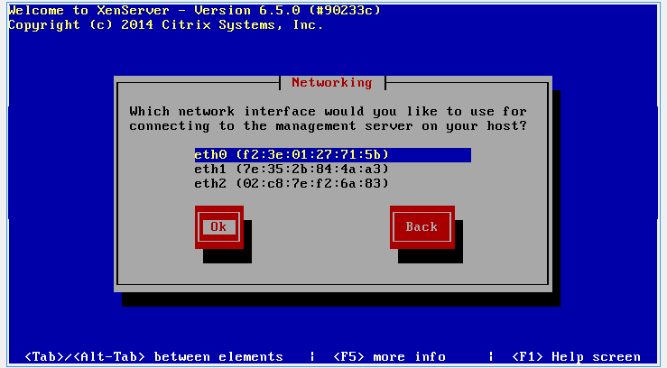
    
    Wählen Sie nun die Netzwerkkarte aus, an der später das grüne Netzwerk (GREEN)
    angeschlossen ist

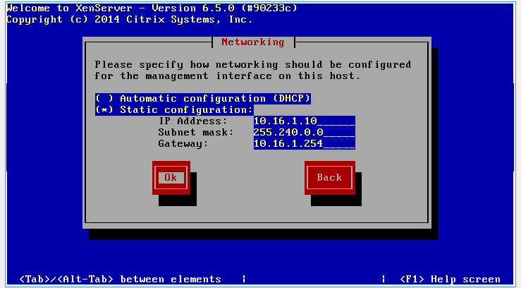

    Wählen Sie „Static configuration“ und tragen Sie die Adresse aus dem Screenshot ein.
    Bestätigen Sie die Eingabe mit ``Ok``

..  figure:: media/installation_xenserver/install13.png
    :scale: 70%

    Tragen Sie den gewünschten Hostnamen und die DNS-Server 10.16.1.1 und 10.16.1.254 ein

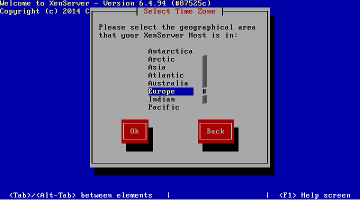

    Wählen Sie Ihre Zeitzone aus und bestätigen mit Ok

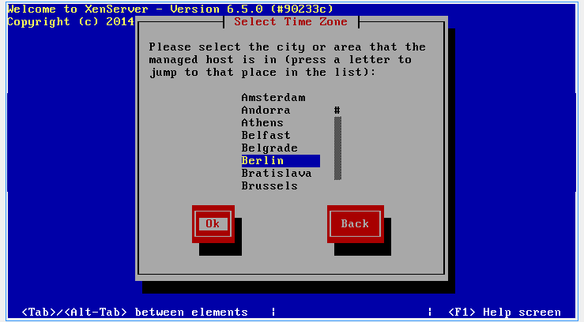

    Wählen Sie Ihre Zeitzone aus und bestätigen mit Ok

    
..  figure:: media/installation_xenserver/install16.png
    :scale: 70%

    Sollten Sie einen Zeitserver betrieben, können Sie diesen angeben. 
    Wir stellen die Zeit manuell
    ein. Wählen Sie ``Manual time entry`` und bestätigen Sie mit ``Ok``

..  figure:: media/installation_xenserver/install17.png
    :scale: 70%

    Starten Sie nun die Installation mit der Schaltfläche ``Install XenServer``

.. raw:: LaTeX

     \clearpage

..  figure:: media/installation_xenserver/install18.png
    :scale: 70%

    Legen Sie nun die CD "XenServerSupplementalPack" in das Laufwerk und bestätigen
    Sie die Meldung mit ``Ok``
    
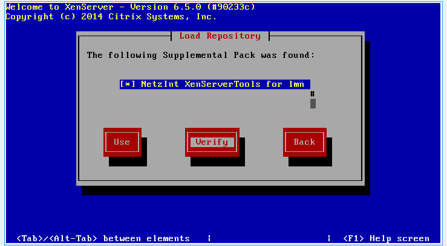

    NetzInt XenServer Tools sollten bereits ausgewählt sein. Prüfen Sie die CD mit ``Verify``

 

    Starten Sie den Test mit ``Ok``

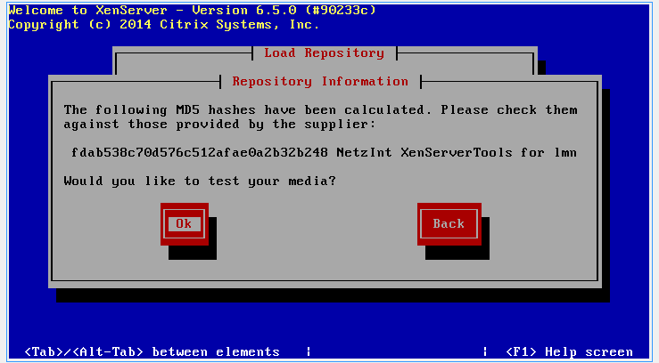

    Bestätigen Sie den erfolgreichen Test mit ``Ok``

..  figure:: media/installation_xenserver/install21.png
    :scale: 70%

    Wählen Sie nun die Schaltfläche ``Use`` und bestätigen Sie mit ``Ok``

..  figure:: media/installation_xenserver/install22.png
    :scale: 70%

    Nach der Installation werden Sie wieder aufgefordert weitere CDs einzulegen. 
    Wählen Sie ``Skip`` und bestätigen Sie mit ``Enter``.

..  figure:: media/installation_xenserver/install23.png
    :scale: 70%
    
    Stellen Sie die korrekte Uhrzeit ein und bestätigen Sie mit ``Ok``

..  figure:: media/installation_xenserver/install24.png
    :scale: 70%

    Nach erfolgreicher Installation können Sie mit ``Ok`` den Server neu starten

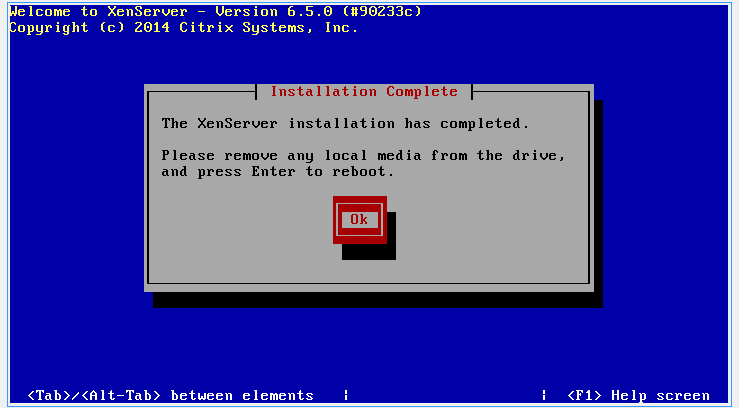

    Nach dem Setup erscheint diese Konsole und der Server kann verwaltet werden

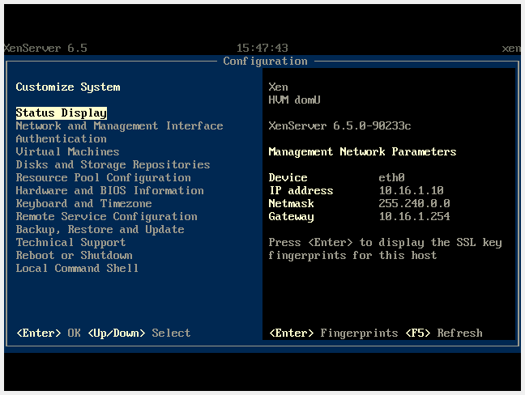

.. raw:: LaTeX

     \clearpage

XenServer initialisieren
------------------------

Nun kann man die neue XenServer-Installation mit den virtuellen Maschinen für linuxmuster.net initialisieren.

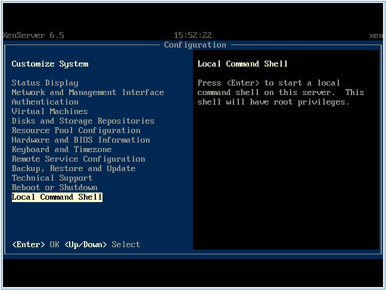

    Wählen Sie auf dem XenServer den Punkt ``Local Command Shell`` und drücken Sie Enter

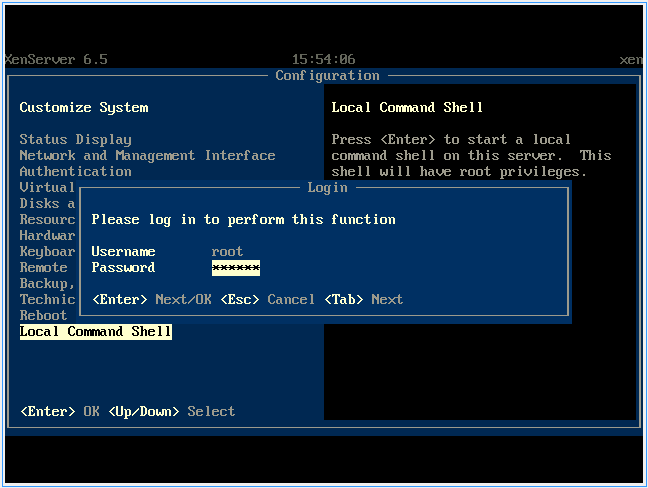

    Geben Sie den Benutzer ``root`` an und das Passwort das Sie während der 
    Installation vergeben haben

..  figure:: media/initialisieren_xenserver/03.png
    :scale: 70%

    Geben Sie in der Konsole den Befehl ``ni-setup --first`` ein und bestätigen Sie mit Enter

..  figure:: media/initialisieren_xenserver/04.png
    :scale: 70%
    
    Stecken Sie alle Netzwerkkabel aus. Lassen Sie das Netzwerkkabel für das Netz GREEN
    eingesteckt im Switch und Server. Bestätigen Sie dann mit Ok

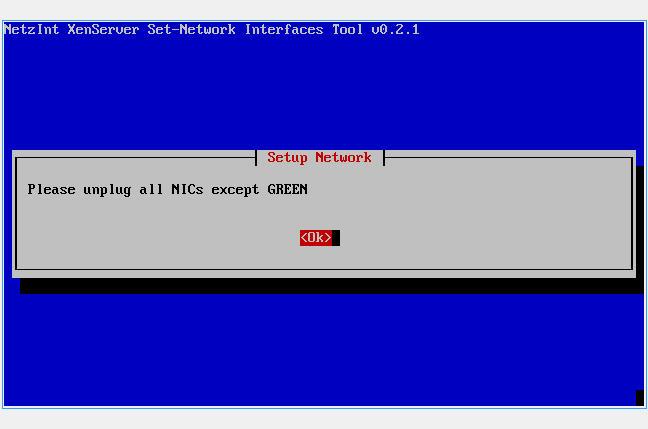
    
    Verbinden Sie nun die Netzwerkkarte RED mit Ihrem Modem oder 
    Switch für das Netz RED. Es wird die betroffene Netzwerkkarte erkannt 
    und konfiguriert.    

..  figure:: media/initialisieren_xenserver/06.png
    :scale: 70%
    
    Verbinden Sie nun das Netzwerk BLUE mit dem gewünschten Interface am Server.

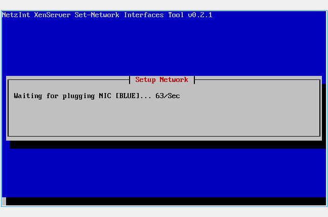
    
    Warten Sie ab, bis die blaue Netzwerkkarte erkannt wurde.

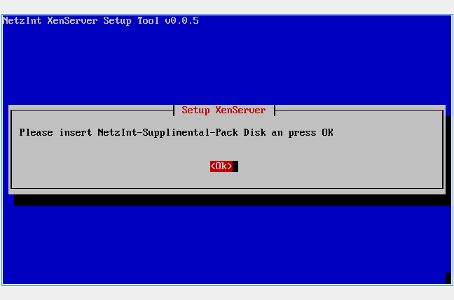
    
    Legen Sie nun die CD „XenServerSupplementalPack“ erneut in das Laufwerk 
    ein und bestätigen Sie mit Ok

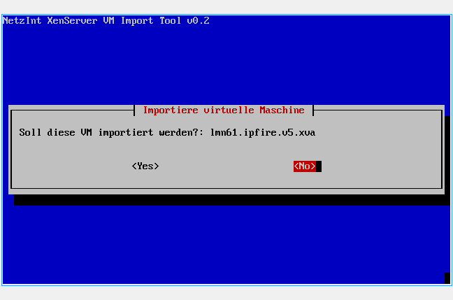
    
    Sie werden nun der Reihe nach abgefragt welche VMs Sie importieren wollen. 
    Wählen Sie jeweils ``Yes`` bzw. ``No`` und bestätigen Sie mit ``Enter``.
    
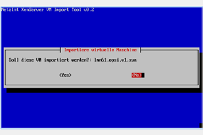
    
..  figure:: media/initialisieren_xenserver/11.png
    :scale: 50%

..  figure:: media/initialisieren_xenserver/12.png
    :scale: 50%

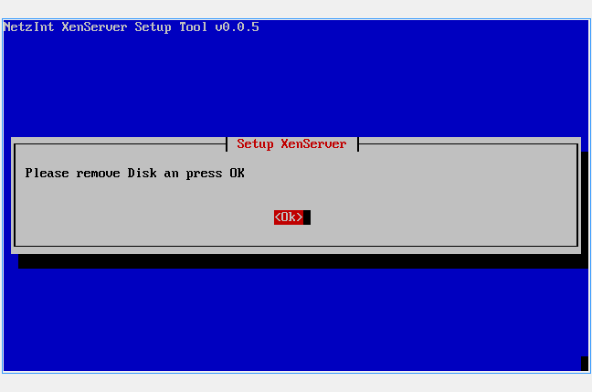

    Entnehmen Sie nun die CD und bestätigen Sie mit ``Ok``

..  figure:: media/initialisieren_xenserver/14.png
    :scale: 70%

    Sie werden nun gefragt ob Sie die Autostartfunktion nutzen wollen. Mit dieser werden die
    gewünschten VMs automatisch beim Start von XenServer gestartet auch nach einem
    Stromausfall oder dergleichen. Wählen Sie ``Yes`` oder ``No``. Wir empfehlen, die Server 
    von linuxmuster.net stets automatisch starten zu lassen.

..  figure:: media/initialisieren_xenserver/15.png
    :scale: 70%
   
    Sie werden nun der Reihe nach abgefragt welche VMs automatisch gestartet werden sollen.
    Wählen Sie jeweils Yes bzw. No und bestätigen Sie mit Enter

    
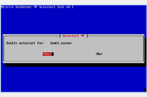

..  figure:: media/initialisieren_xenserver/17.png
    :scale: 70%

.. raw:: LaTeX

     \clearpage

..  figure:: media/initialisieren_xenserver/18.png
    :scale: 70%

    
..  figure:: media/initialisieren_xenserver/19.png
    :scale: 70%

    Sie können nun das System mit der Auswahl ``Yes`` neu starten
 
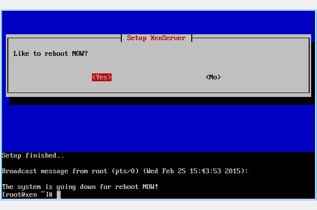

    Das System fährt herunter und startet danach wieder. 
    Die VMs die Sie importiert haben werden - wenn entsprechend konfiguriert - 
    direkt gestartet und sind bereit für die Konfiguration.

