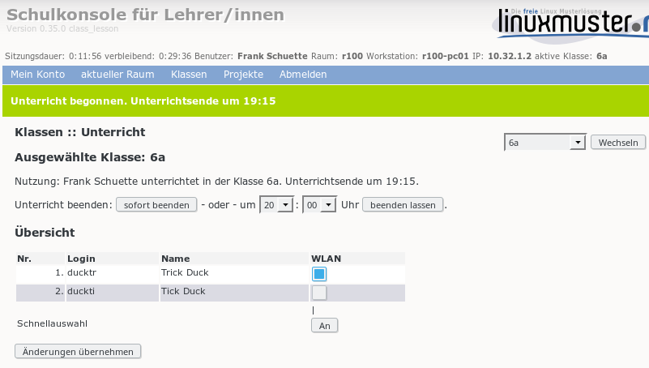
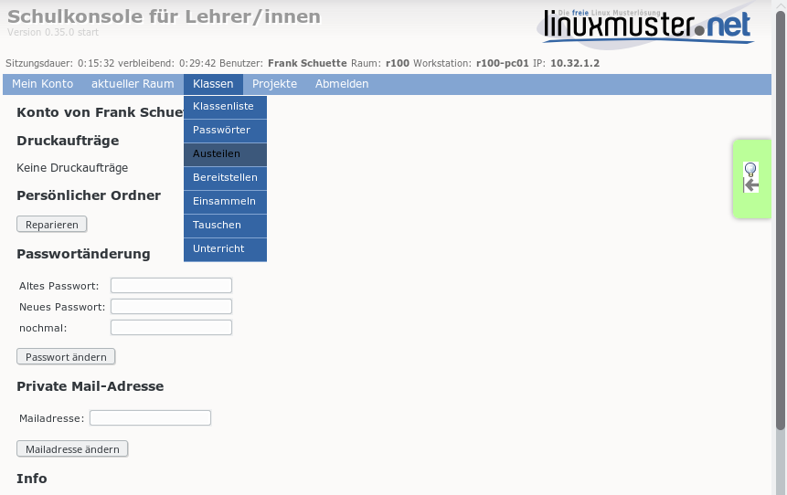
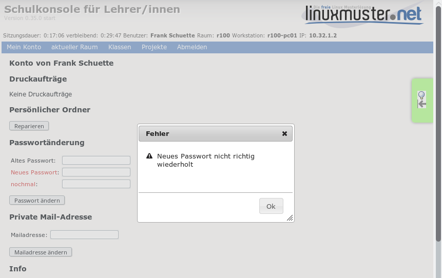
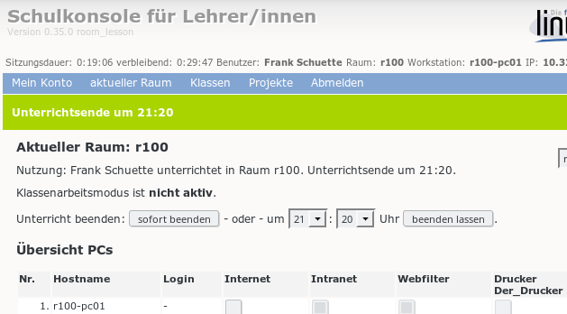
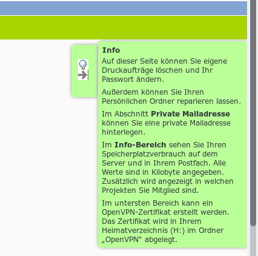

Neuerungen in der Schulkonsole
==============================

Die meisten Neuerungen gibt es für den Netzwerkbetreuer. Aber auch für die Lehrersicht und die Schülersicht gibt
es einige Neuerungen. Schließlich ist die Programmoberfläche insgesamt in Teilen überarbeitet worden.

Für den letzten Punkt wurde Javascript und jQuery verwendet. Daher ist es jetzt erforderlich, zumindest für
die Schulkonsole auf den Clients im Browser Javascript zu aktivieren.

Netzwerkbetreuersicht
---------------------

Reparaturen
^^^^^^^^^^^
Es gibt einige Reparaturmöglichkeiten für die Home-Verzeichnisse und andere wichtige Systemverzeichnisse. Diese
finden sich im Menü **Reparaturen** (diese Seiten rufen *sophomorix-repair* auf).

Einstellungen zu Reparaturen
""""""""""""""""""""""""""""
Es können Programmnamen mit deren Konfigurationsverzeichnissen verknüpft werden. Diese können dann auch für
Reparaturen herangezogen werden.

Benutzerverwaltung
^^^^^^^^^^^^^^^^^^

Passwörter
^^^^^^^^^^
Es gibt unter *Einstellungen -> Schulkonsole* die Möglichkeit, die Passwortgüte überprüfen zu lassen. Damit werden zu einfache Passwörter der Benutzer abgelehnt.

Einstellungen
"""""""""""""
Auf der Einstellungsseite zur Benutzerverwaltung gibt es viele weitere Einstellmöglichkeiten. Die wichtigste ist
die Kodierung für die jeweiligen Dateien.

Historie
""""""""
Unter *Benutzer* gibt es den neuen Menüpunkt **Historie**, über den man gezielt Passwortlisten zu einem bestimmten Zeitpunkt angelegter Benutzer herunterladen kann.

Anlegen, Versetzen, Löschen
"""""""""""""""""""""""""""
In diesem Bereich wird jetzt die log-Datei für einen laufenden Prozess automatisch angezeigt. Das erlaubt eine
bessere laufende Kontrolle.

Plugins
^^^^^^^

Es ist möglich, Plugins für die Schulkonsole zu schreiben. Das Schreiben von Plugins ist auf der Seite
https://www.linuxmuster.net/wiki/entwicklung:schulkonsole:sk_neue_plugin_seite dokumentiert.

Momentan gibt des 2 Plugins.

Druckerquotierung (Pykota)
""""""""""""""""""""""""""

Das Plugin ermöglicht die Einrichtung und Einstellung der Quotierung über die Schulkonsole. Das Paket dazu heißt **linuxmuster-pk-schulkonsole**. Es ergänzt das Menü des Netzwerkbetreuers um einen Menüpunkt im Menü Einstellungen und ein Menü Druckquotas.

Backup mit MondoRescue
""""""""""""""""""""""

`MondoRescue <http://www.mondorescue.org>`_ ist ein schon recht altes zuverlässiges Backupprogramm. Das Plugin **linuxmuster-schulkonsole-backup** ergänzt das Menü des Netzwerkbetreuers um einen Menüpunkt im Menü Einstellunglen zur Konfiguration der Backups.

Einstellungen für Klassen, Projekte
^^^^^^^^^^^^^^^^^^^^^^^^^^^^^^^^^^^
Für den Netzwerkbetreuer gibt es unter Einstellungen Menüpunkte für Klassen und Projekte. Dort können Standardeinstellungen festgelegt werden.

- Mailingliste gibt an, ob für die betreffende Gruppe eine Mailingliste angelegt wird.
- Mailalias gibt an, ob die Mitglieder der betreffenden Gruppe Mailalias-Einträge nach dem vorgegebenen Muster
  erhalten.
- WLAN gibt an, ob für die Mitglieder der betreffenden Gruppe das WLAN standardmäßig ein- oder ausgeschaltet
  ist.

Rechnerverwaltung
^^^^^^^^^^^^^^^^^

Hosts
"""""
Die **hosts**-Tabelle kann nach verschiedenen Spalten aufsteigend bzw. absteigend sortiert werden. Damit ist es einfacher, z.B. freie IP-Adressen eines Raums herauszufinden.

Bei einem *import_workstations*, also der Übernahme der Änderungen in das System wird die log-Datei angezeigt.

grub.cfg-Dateien
""""""""""""""""
In der Schulkonsole im Menü LINBO kann der Netzwerkbetreuer direkt grub-Startdateien einer Gruppe bearbeiten.

regpatch-Dateien
""""""""""""""""
Regpatch-Dateien können im Menü Linbo über den Eintrag Regpatch direkt bearbeitet werden.

start.conf
""""""""""
Es gibt mehrere Erweiterungen der start.conf-Datei, die zum Teil mit der Umstellung auf 
grub2 und der damit einhergehenden Unterstützung von UEFI-Rechnern zu tun hat.

- **efi** ist ein neuer Partitionstyp, der bei UEFI-Rechnern zum Starten benötigt wird.
- **Systemtyp** ist ein neues Feld, das den Rechnertyp (bios, bios64, efi, efi64) angibt.
- **Label** ist ein neues Feld, in welchem man für jede Partition ein Label eintragen kann. Dieses kann
  z.B. zum mounten verwendet werden.

Linbo
^^^^^
Im Linbo-Menü gibt es einen neuen Menüpunkt *Linbo-Remote*. Dort können neue Aufgaben erstellt, laufende Aufgaben überwacht und geplante Aufgaben wieder entfernt werden.

Lehrersicht
-----------

Reparaturen
^^^^^^^^^^^
Auf den Seiten Klassen und Projekte gibt es jeweils den Unterpunkt zur Reparatur der *Persönlichen Ordner* der jeweiligen Mitglieder.

WLAN-Zugriff steuern
^^^^^^^^^^^^^^^^^^^^

In den Menüs für Projekte, Klassen ist ein Menüpunkt **Unterricht**, über den sich der WLAN-Zugriff für ausgewählte Benutzer von Projekten, Klassen zeitgesteuert ein- und ausschalten lässt.

Austeilen, Einsammeln, Bereitstellen
^^^^^^^^^^^^^^^^^^^^^^^^^^^^^^^^^^^^

.. image:: media/schulkonsole_up_downloads.png

An vielen Stellen, an denen man bisher auf die *Unterstrich*-Verzeichnisse zugreifen musste, hat man jetzt in der Schulkonsole Knöpfe zum Herunterladen, Hochladen und ggf. Entfernen. Das macht für Windows-Clients das Hangeln durch lange Pfade überflüssig.

Projekte
^^^^^^^^
Ein Projektadministrator kann Schülerpassworte direkt im Menü Projekte ähnlich zu Schülerpassworten in Klassen ändern/anzeigen.

Schülersicht
------------

.. image:: media/schulkonsole_my.png

Wegen des Austeilens, Einsammelns, Bereitstellens, sind neue Schülermenüs (Mein Raum, Meine Klasse, Mein Projekt) hinzugekommen.

Alle Benutzer
-------------

Passwörter
^^^^^^^^^^
Hat der Netzwerkbetreuer die Passwortüberprüfung aktiviert, so werden neue Passwörter auf ihre Qualität überprüft.

Reparaturen
^^^^^^^^^^^
Auf der Startseite befindet sich ein Punkt zur Reparatur des eigenen *Persönlichen Ordners*.

Mailweiterleitung
^^^^^^^^^^^^^^^^^
Unter *Horde* kann man eine Mailweiterleitungsadresse einrichten. Das ist umständlich. Diese Einrichtung kann jeder Benutzer jetzt auch auf der Startseite der Schulkonsole vornehmen. Dieser Punkt ist nur vorhanden, wenn der Server auch als Mailserver eingerichtet worden ist.

Alternative Mailadresse
^^^^^^^^^^^^^^^^^^^^^^^
Abhängig von den Einstellungen für Mail (siehe mail-ldap-howto) kann auf der Startseite jeder Benutzer eine
vom Standard abweichende Mailadresse einrichten.

Oberfläche allgemein
--------------------

Menü
^^^^

Das Menü ist jetzt ein 2-Ebenenmenü, das nicht mehr soviel Bildschirmplatz benötigt und intuitiver zu bedienen ist.

Dialoge
^^^^^^^

Fehlerdialoge werden jetzt modal und zentriert und damit auffälliger dargestellt.

Statusmeldungen
^^^^^^^^^^^^^^^

Statusmeldungen erscheinen auffälliger unterhalb des Menüs.

Schwebende Hilfe
^^^^^^^^^^^^^^^^

Die schwebende Hilfe blendet sich zeitgesteuert aus und es kommt dadurch nicht mehr zur Verdeckung von wichtigen Seitenelementen.
