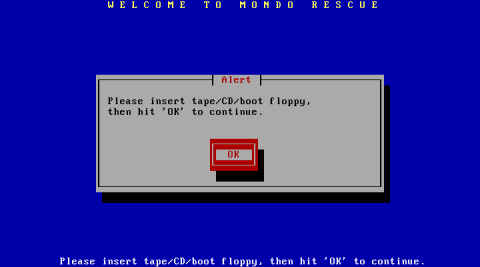

Dateiwiederherstellung im Live-Betrieb
--------------------------------------

Wiederherstellung von Dateien und Verzeichnissen im Live-Betrieb
````````````````````````````````````````````````````````````````

Dazu muss das Backupmedium unter ``/media/backup`` gemountet sein:

.. code-block:: bash

	mount /dev/sdb1 /media/backup

Starten Sie als ``root`` in einer Konsole das Programm *mondorestore*:

.. code-block:: bash

	mondorestore

Es begrüßt Sie der Startbildschirm von *Mondo Rescue*. Drücken Sie **ENTER**:



Wählen Sie als Backupmedium **Hard Disk** aus:

.. image::media/restore/restore2.png

Geben Sie nun den kompletten Pfad zu dem Backupset an, von dem Sie restaurieren wollen:

.. image:: media/restore/restore3.png

Im nächsten Schritt geben Sie das Präfix für die ISO-Dateien ein (in unserem Fall "server"):

.. image:: media/restore/restore4.png

Anschließend liest *mondorescue* die Dateilisten ein:

.. image:: media/restore/restore5.png

Sind alle Dateilisten geladen, wird Ihnen der zugegebenermaßen etwas umständlich zu bedienende Dateilisten-Editor präsentiert. Navigieren Sie mit den **Pfeiltasten** auf ein Verzeichnis. Mit der **TAB-Taste** gelangen Sie in das Menü und wieder heraus. Innerhalb des Menüs können Sie wiederum mit der **TAB-Taste** navigieren. Wählen Sie **More**, um den Verzeichnisbaum aufzuklappen, **Less** um ihn wieder zuzuklappen. Mit **Toggle** können Sie ein Verzeichnis oder eine Datei für den Restore markieren oder die Markierung wieder aufheben. Für den Restore markierte Elemente werden mit einem * gekennzeichnet. Haben Sie die Auswahl abgeschlossen, so navigieren Sie auf **OK** und drücken **ENTER**. Mit **Cancel** wird das Programm ohne Nachfrage verlassen.

.. image:: media/restore/restore7.png

Bestätigen Sie die folgende Sicherheitsabfrage, um schließlich den Zielpfad einzugeben. Es ist sicher eine gute Idee, erst einmal in ein temporäres Verzeichnis (z. Bsp. ``/var/tmp``) zu restaurieren, um die Dateien dann nach eingehender Prüfung an den vorgesehenen Ort zu verschieben.

.. image:: media/restore/restore8.png

Die ausgewählten Dateien und Verzeichnisse werden nun unter ``/var/tmp`` wieder hergestellt. Danach beendet sich *mondorestore* und Sie können das Backupmedium wieder unmounten.

Komplettrestore des Servers
---------------------------

Da dies nicht im Livebetrieb geschehen kann, muss ein Bootmedium hergestellt werden. Dazu brennen Sie die ISO-Datei ``mondorescue.iso`` aus dem Verzeichnis des jüngsten Vollbackupsets (vgl. Abschnitt :doc:`konfiguration`) mit einem handelsüblichen Brennprogramm auf einen CD-Rohling.

Schließen Sie gegebenenfalls die Backupfestplatte an den Server an oder stellen Sie sicher, dass Netzwerkverbindung zum NFS-Backup-Server besteht. Booten Sie dann den Server von der mondorescue-Boot-CD. Nach kurzer Zeit erscheint der Bootprompt von Mondo Rescue:

.. image:: media/restore/restore9.png

Hier haben Sie nun unter anderem folgende Möglichkeiten für die Restaurationsmethode:

nuke
	Im Abschnitt :doc:`restore-full` wird die automatische Restauration erläutert.

interactive
	Der interaktive Modus im Abschnitt :doc:`restore-interactive` beschreibt die Benutzer gesteuerte Wiederherstellung.
