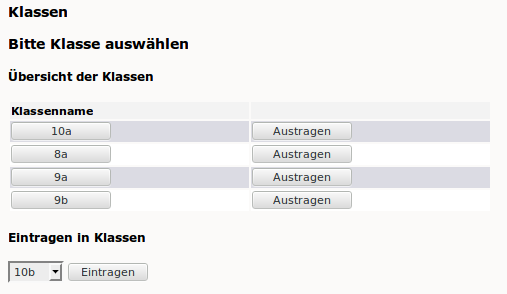
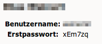

Zurücksetzen eines Schülerpasswortes
====================================

Vergisst ein Schüler sein Passwort, kann jede Lehrkraft das Passwort des Schülers über die Schulkonsole auf das Erstpasswort zurücksetzen. Dieses teilen Sie dem Schüler mit.

Dazu melden Sie sich an der Schulkonsole an und wählen unter „Klassen” den Menüpunkt „Passwörter“.

.. image:: media/01.png

Wählen Sie nun Ihre Klasse aus indem Sie auf die Klassenbezeichnung klicken.

.. note:: Falls Ihre Klasse nicht in der oberen Liste auftaucht, müssen Sie sich zunäst in die Klasse eintragen. Wählen Sie dazu im Dropdown-Menü die Klasse aus und klicken anschließend auf eintragen.

Setzen Sie hinter dem vergesslichen Schüler den Haken und scrollen Sie auf das Ende der Seite. Klicken Sie auf „Passwort auf Erstpasswort setzen“.

.. image:: media/03.png

Die Seite wird neu geladen. Klicken Sie neben dem Schülernamen auf „Erstpasswort anzeigen“.

.. image:: media/04.png

Teilen Sie da angezeigte Erstpasswort dem Schüler mit der Aufforderung mit, es in der Schulkonsole zu ändern.

