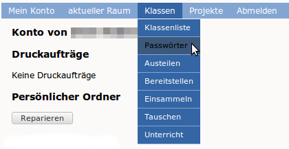
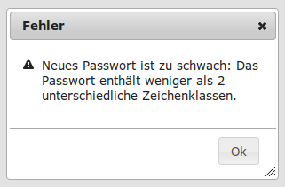

Ändern des Passwortes
=====================

Benutzernamen und Passwörter werden in der linuxmuster.net zentral verwaltet, d.h. Sie können sich an den Computern, an der Schulkonssole und in Horde mit dem selben Passwort anmelden.
Um Ihr Passwort zu ändern melden Sie sich mit Ihrem Benutzernamen (bestehend aus Kleinbuchstaben und event. Zahlen) und dem aktuellen Passwort an der Schulkonsole an.

Geben Sie unter „Passwortänderung“ nochmals Ihr aktuelles Passwort ein, sowie zweimal das neue Passwort.
Beachten Sie die Anforderungen an das neue Passwort:
  * Die Mindestlänge des Passwortes sind 8 Zeichen.
  * Das Passwort muss mindestens einen Großbuchstaben und einen Kleinbuchstaben oder eine Zahl enthalten.
  * Nicht alle Sonderzeichen können verwendet werden. Folgende Zeichen funktionieren **nicht**: äöüß$&{}![]+#

.. image:: media/03.png

Das erfolgreiche Ändern des Passwortes wird mit einer grünen Leiste unterhalb der Menüleiste bestätigt.

.. image:: media/03.png

Falls die Änderung nicht erfolgreich war erhalten Sie eine Fehlermeldung mit einem Hinweis auf den Fehler.

In dieser Beispielfehlermeldung bestand das Passwort nur aus Kleinbuchstaben.

