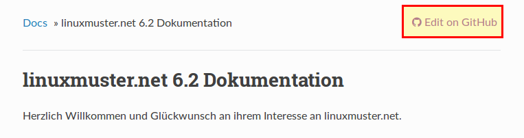
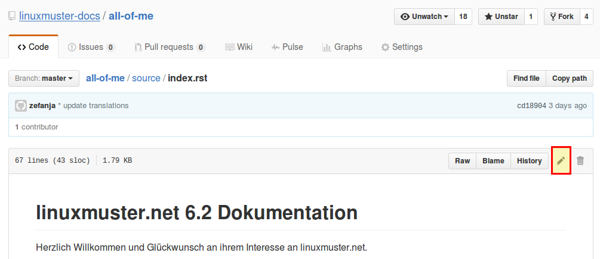

Dokumentation übersetzen
------------------------

Die Dokumentation kann auf der `Projektseite bei Transifex <https://www.transifex.com/linuxmusternet/official-documentation/>`_  übersetzt werden. Klicken Sie einfach auf den blauen "Help Translate 'official documentation'" und melden Sie sich mit ihrem Transifex-Konto an bzw. erstellen Sie ein neues.

Dokumentation verbessern
------------------------

Die Dokumentation ist in der Auszeichnungssprache "rST" geschrieben. `Hier <docutils.sourceforge.net/docs/user/rst/quickref.html>`_ finden Sie einen guten Überblick über die am häufigsten verwendeten Elemente.

.. warning::
   Bitte beachten Sie auch unbedingt die :doc:`Leitlinien zur Dokumenation <guidelines>`, damit ihre Änderungen schnell eingepflegt werden könnnen!

Wenn Sie einen Fehler (Rechtschreibfehler, inhaltliche Fehler, etc.) in der Dokumentation gefunden haben, klicken Sie einfach auf den "Edit on Github" Link am oberen Rand jeder Dokumentation.

Sie werden auf github.com geleitet.

.. note::
  Sie müssen sich bei Github anmelden, um ein Kapitel zu bearbeiten. Wenn Sie noch kein Konto bei Github haben, können Sie sich `hier eines anlegen <https://github.com/join>`_.
  
Mit einem Klick auf den Stift (siehe Bild) können Sie das aktuelle Kapitel bearbeiten.

Nachdem Sie alle Änderungen vorgenommen haben, geben Sie unten einen Titel und einen Kommentar ein. Die Änderungen können nun mit einem Klick auf "Propose file changes" eingereicht werden. 

.. figure:: media/proposeChanges.png
   :width:  450px
   :align: center
   :alt: Edit on Github 3
   :figwidth: 450px
