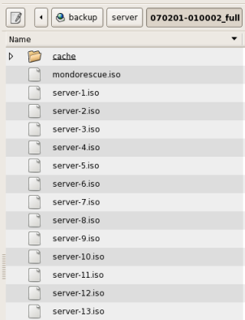

Konfiguration
-------------

Die Konfiguration des Backupverhaltens kann direkt in der Datei ``/etc/linuxmuster/backup.conf`` geschehen. Die Parameter im Einzelnen:

backupdevice
	Festplattenpartition oder NFS-Share, auf das gesichert werden soll, wird nach ``/media/backup`` gemountet. 
	
	Beispiele:
	
	.. code-block:: bash
		
		backupdevice=/dev/sdb1
		backupdevice=10.16.1.10:/home/nfs
		backupdevice="/dev/disk/by-uuid/ccfc9531-3486-4af0-9317-8f895f5a1c97"

	.. note::
		**Wichtiger Hinweis**

		Das Backupgerät darf nicht in ``/etc/fstab`` eingetragen sein, da alle dort eingetragenen Dateisysteme bei einer Komplettrestaurierung formatiert werden!

restoremethod
	Mögl. Werte: "hd" oder "nfs", je nachdem, ob von Festplatte oder NFS-Share restauriert werden soll.
	
	Standard:
	.. code-block:: bash
		
		restoremethod=hd

firewall
	Mögl. Werte: "yes" oder "no", je nachdem, ob die aktuellen Einstellungen des IPFire gesichert werden sollen. Es wird unter ``/var/backup/ipfire`` gesichert. Diese Sicherung kann nach einer Vollrestauration bei der Erstellung des IPFire eingespielt werden.
	
	Standard:
	
	.. code-block:: bash
		
		firewall=yes

verify
	Mögl. Werte: "yes" oder "no", je nachdem, ob die gesicherten Daten nach dem Backuplauf auf Konsistenz überprüft werden sollen.
	
	Standard:
	
	.. code-block:: bash
		
		verify=yes

isoprefix
	Wird für die Bezeichnung der ISO-Images und des Backup-Verzeichnisses verwendet.
	
	Standard:
	
	.. code-block:: bash
		
		isoprefix=server

mediasize
	mondo benutzt ISO-Images als Backup-Container, die bei Bedarf auch auf CD/DVD gebrannt werden können. Diese Option legt die Größe der Images in MB fest. Da Mondo Schwierigkeiten bei mehr als 50 Medien bekommt, sollte man die Größe seiner Installation anpassen. Falls die Medien nicht auf DVD gebrannt werden müssen, ist eine beliebige Größe möglich.
	
	Standard:
	
	.. code-block:: bash
	
		mediasize=4430

excludedirs
	Eine durch Kommas separierte Liste der Verzeichnisse, die nicht gesichert werden sollen. Die Standardeinstellung sollte nicht entfernt werden.
	
	Standard:
	
	.. code-block:: bash
		
		excludedirs=/var/tmp,/var/cache/apt/archives

includedirs
	Eine durch Kommas separierte Liste der Verzeichnisse, die gesichert werden sollen. Wird nichts angegeben (Standard), wird das gesamte Dateisystem gesichert.

services
	Mögliche Werte: "all" oder eine Komma separierte Liste der Dienste des aktuellen Runlevels, die vor dem Start des Backups heruntergefahren werden sollen. "all" fährt alle Dienste des aktuellen Runlevels herunter. Nach dem Backuplauf werden die Dienste wieder hochgefahren. Wird nichts angegeben, werden auch keine Dienste heruntergefahren. Die in der Standardeinstellung vorgesehenen Dienste sollten nicht entfernt werden. 
	
	Standard:
	
	.. code-block:: bash
	
		services=cups,nagios3,postgresql,mysql,slapd,smbd,nmbd,postfix,apache2,cyrus-imapd,saslauthd,clamav-daemon,clamav-freshclam,rsync,atftpd,nscd,cron,bittorrent,linbo-bittorrent,linbo-multicast

compression
	Kompressionsgrad, mögl. Werte 0-9, der Standardwert 3 ist ein guter Kompromiss zwischen Schnelligkeit und Komprimierung. Wert 0 bedeutet keine Komprimierung.
	
	Standard:
	
	.. code-block:: bash
		
		compression=3

unmount
	Mögl. Werte: "yes" oder "no", bei "yes" wird versucht das backupdevice nach dem Backup auszuhängen. Das klappt natürlich nur, wenn es nicht noch anderweitig in Gebrauch ist.
	
	Standard:
	
	.. code-block:: bash
	
		unmount=yes

keepfull
	Mögl. Werte: integer ab 1. Definiert die Anzahl der Vollbackups, die vorgehalten werden.
	
	Standard:
	
	.. code-block:: bash
	
		keepfull=1

keepdiff
	Mögl. Werte: integer ab 1. Definiert die Anzahl der differentiellen Backups, die vorgehalten werden.
	
	Standard:
	
	.. code-block:: bash
	
		keepdiff=3

keepinc
	Mögl. Werte: integer ab 1. Definiert die Anzahl der inkrementellen Backups, die vorgehalten werden. 
	
	Standard:
	
	.. code-block:: bash
	
		keepinc=7

cronbackup
	Mögl. Werte: boolean yes|no. Legt fest, ob automatisch tägliche inkrementelle und wöchentliche differentielle bzw. Vollbackups durchgeführt werden.
	
	Standard:
	
	.. code-block:: bash
	
		cronbackup=no

.. note::
	**Anmerkung**
	Alte Backups werden nur gelöscht, wenn das Backup zuvor fehlerfrei durchlief.

Die Backupsets werden in ISO-Dateien in ein Verzeichnis nach dem Schema ``<isoprefix>/<datum>_full``, ``<isoprefix>/<datum>_diff`` bzw. ``<isoprefix>/<datum>_inc`` auf das Backupmedium gesichert.

.. image:: media/konfiguration/backup1.png

Dabei werden die ISO-Dateien nach dem Schema ``<isoprefix>-1.iso``, ``<isoprefix>-2.iso`` usw. abgelegt. Die ISO-Dateien dienen als Backup-Container und können ggf. auch auf CD/DVD gebrannt werden, um davon zu restaurieren. Desweiteren wird bei einem Vollbackup das für die Restauration benötigte Bootimage ``mondorescue.iso`` im Backupverzeichnis abgelegt.

Im Homeverzeichnis des Benutzers ``administrator`` wird ein Link ``_backup`` zum Mountpoint ``/media/backup`` des Backupmediums angelegt, sodass er in der Lage ist, ISO-Images von einem Client aus auf einen Rohling zu brennen. Dazu muss jedoch das Backupmedium gemountet sein.
