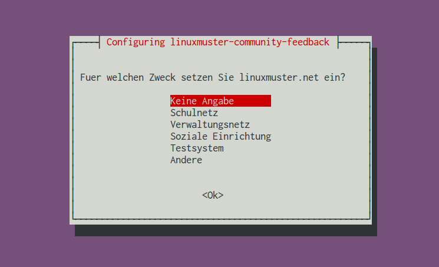
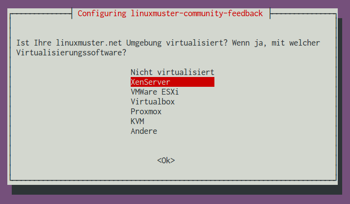
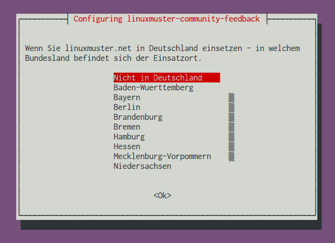
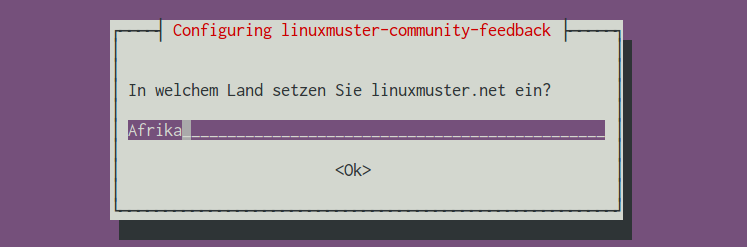
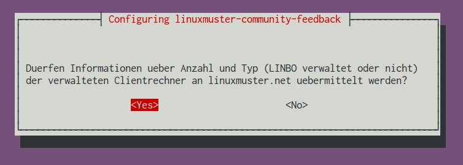
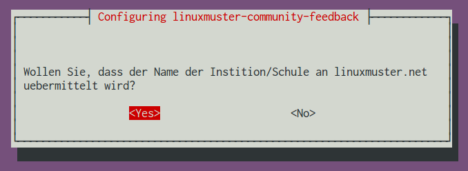
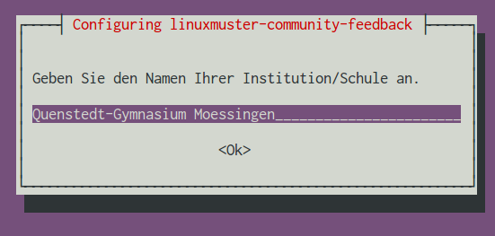
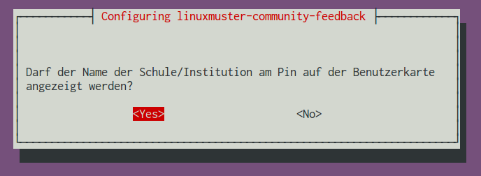
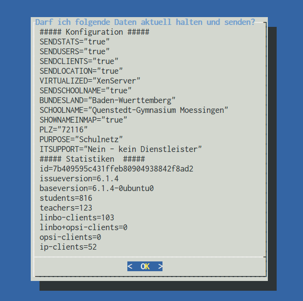
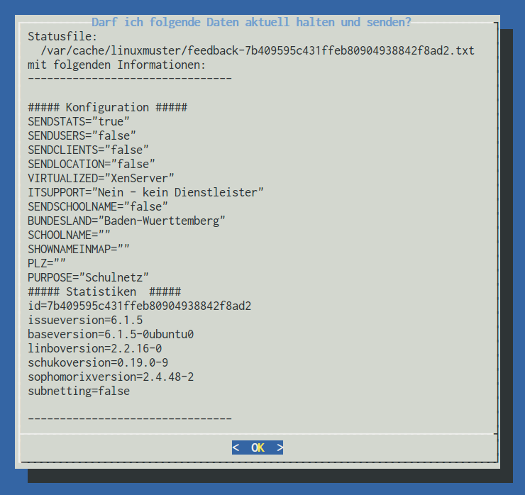

Installation des Pakets
===========================

Das Paket linuxmuster-community-feedback wird mit dem Paketverwaltungswerkzeug 
aus den linuxmuster Repositorys installiert. 

.. code:: bash

   apt-get update
   apt-get install linuxmuster-community-feedback 
   

Direkt nach der Installation wird detailliert abgefragt, welche Informationen 
übermittelt werden sollen, am Ende des Konfigurationsvorgangs wird angezeigt, welche 
Daten genau übermittelt werden.

Konfiguration
-------------

Nach der Paketinstallation wird zunächst die zentrale Frage gestellt: Sollen 
überhaupt Daten an linuxmuster.net übermittelt werden?

Wird hier mit ``Nein`` geantwortet, ist die Konfiguration des Pakets damit beendet, es werden 
keine weiteren Änderungen am System vorgenommen und keinerlei Daten an 
linuxmuster.net übermittelt. 

.. image:: media/1.png
   :alt: Sollen statistische Daten übermittelt werden oder nicht?
   :align: center

Wenn Statistiken übermittelt werden sollen, wird zunächst erfragt, in welchem Umfeld die linuxmuster.net-Installation zum Einsatz kommt.

Anschließend geben Sie bitte an, ob und wie die Installation von linuxmuster.net virtualisiert ist.

Wird die linuxmuster.net Installation ganz oder teilweise durch einen Dienstleister betreut oder liegen Installation und Pflege des Systems alleine an der Schule?

.. image:: media/3a.png
   :alt: Dienstleister?
   :align: center

Wo wird Ihre linuxmuster.net Installation eingesetzt? wenn Sie ``Nicht in Deutschland`` auswählen, können Sie im nächsten Schritt eine freie Angabe zum Einsatzort machen.

Diese Eingabemöglichkeit gibt es nur bei der Auswahl ``Nicht in Deutschland`` im vorigen Schritt:

Darf die Anzahl der Nutzer übermittelt werden? Wenn Sie hier mit ``YES``
antworten, ermittelt das Feedback-Paket aus den Dateien "schueler.txt" und
"lehrer.txt" die Anzahl der Schüler beziehungsweise der Lehrer. Dabei werden
keine personenbezogenen Daten erhoben.

.. image:: media/5.png
   :alt: Soll die Zahl der Benutzeraccounts übermittelt werden?
   :align: center

Dürfen Informationen über Zahl und Art der eingesetzten Clients übermittelt werden? 
Wenn Sie hier mit ``YES`` antworten, ermittelt das Feedback-Paket aus der Datei
"workstations" die Anzahl der dort eingetragenen Clientcomputer. Die Zahlen werden 
getrennt aufgelistet, je nachdem ob ein Clientrechner von linuxmuster.net
mit linbo, mit linbo und opsi mit opsi oder als IP-Host verwaltet wird. 

Weitere Informtionen zu den Clients wie Namen, Hardware Adresse, Hersteller
o.ä. werden weder ermittelt, noch übertragen.

Mit der Beantwortung der nächsten Frage entscheiden Sie, ob Ihre Datenübermittlung 
anonym bleibt oder nicht. Wenn Sie sich entscheiden, den Namen Ihrer Schule an
linuxmuster.net zu übertragen, können Sie später im Konfigurationsprozess
festlegen, ob Ihre Installation auf der Nutzerkarte erscheinen soll und ob der
Schulname auf der Karte dargestellt werden soll.

Der Schulname wird darüberhinaus nicht automatisiert veröffentlicht.

Der Schulname wird nur dann erfragt, wenn man im vorherigen Schritt der Übermittlung zugestimmt hat:

Darf Ihre Installation auf der Nutzerkarte erscheinen? Wenn ja, müssen Sie anschließende die Postleitzahl angeben.

.. image:: media/9.png
   :alt: Installation auf der Nutzerkarte anzeigen?
   :align: center

Die Postleitzahl muss nur angegeben werden, wenn ein Eintrag auf der Karte gewünscht ist:

.. image:: media/10.png
   :alt: Postleitzahl für die Kartendarstellung
   :align: center

Soll der Name am Kartenpin angezeigt werden? Diese Frage erscheint nur, 
wenn zuvor der Schulname angegeben wurde.

Am Ende der Konfiguration wird eine Übersicht angezeigt, welche Daten 
an linuxmuster.net übertragen werden. Die dargestellten Informationen sind 
dabei exakt der Inhalt der Datei, die später an den 
Projektserver übermittelt wird.

Bestätigung der Anfrage überträgt die Daten wie dargestellt zum linuxmuster.net Server und 
erstellt einen Cronjob, der diesen Vorgang einmal wöchentlich automatisch wiederholt.

Dabei werden die Werte im Anschnitt "Statistiken" jeweils nach den Vorgaben der Konfiguration 
neu ermittelt.

Beispielkonfiguration: Minimale Angaben
---------------------------------------

Der folgende Screenshot zeigt den minimalen Datensatz, der als Feedback übertragen wird:

Übertragen werden dabei Informationen zu:

* Virtualisierung
* Bundesland/Einsatzort
* Einsatzzweck
* Dienstleisterunterstützung

Außerdem werden einmal je Woche die installierten Versionen der linuxmuster-Basispakete

* linuxmuster-base
* linuxmuster-linbo
* linuxmuster-schulkonsole
* sophomorix2

und der Status der Einstellung "subnetting" ermittelt und in der Statistikdatei aktualisiert. 

.. note:: Die id der Installation wird aus der Mac-Adresse, dem Schulnamen und der Domäne
   ermittelt und mit MD5 gehasht, so dass das System zwar für statistische Zwecke
   anonym identifizierbar wird, aber ohne weitere Angaben keine Rückschlüsse auf
   die Ausgangswerte möglich sind.

Beispielkonfiguration: Maximale Angaben
---------------------------------------

Der folgende Screenshot zeigt den maximalen Datensatz, der als Feedback übertragen wird:

.. image:: media/maximal.png
   :alt: Maximaler Datensatz
   :align: center

Der maximale Datensatz enthält alle Informationen des minimalen Datensatzes, ergänzt um: 

* Schulname
* Postleitzahl
* Einverständnis zur Kartendarstellung und zur Darstellung des Schunamens am Kartenpin

Aktuell gehalten werden zusätzlich Informationen zu:

* Anzahl der Schüler/Lehreraccounts
* Anzahl der Clients, aufgeschlüsselt nach Kategorie

