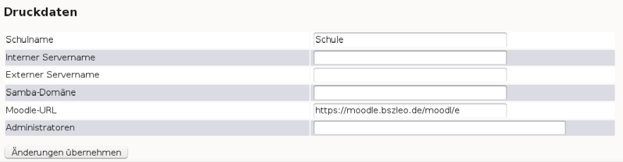

Grundkonfiguration der Benutzerverwaltung
-----------------------------------------

Einstellungen in der Datei sophomorix.conf vor dem ersten Anlegen von Benutzern
^^^^^^^^^^^^^^^^^^^^^^^^^^^^^^^^^^^^^^^^^^^^^^^^^^^^^^^^^^^^^^^^^^^^^^^^^^^^^^^

Nach Installation des Servers muss die Hauptkonfigurationsdatei *sophomorix.conf*, die man unter
``/etc/sophomorix/user/`` findet, angepasst werden [#f1]_. Dazu muss die Datei vom Benutzer root editiert werden. 
Dies können Sie direkt am Server machen, oder Sie gehen von einem Client des Netzwerks aus mittels *putty*
auf den Server.

*Putty* ist ein Freewareprogramm, das Sie sich herunterladen und dann starten können. Nach dem Aufruf 
geben Sie den Namen des Servers an und stellen auf *ssh* mit Port 22 um. Dann können Sie sich als root
anmelden und die Datei in einem Editor [#f2]_ aufrufen [#f3]_.

Die einzelnen Angaben sind sehr gut kommentiert und mit Beispielen versehen. Zeilen, die mit einem ``#`` beginnen, 
sind Kommentarzeilen.

Die meisten der Festlegungen können auch vom Benutzer administrator in der *Schulkonsole* im Menü unter
*Einstellungen* -> *Benutzerverwaltung* gemacht werden.

In der *sophomorix.conf* können viele Einstellungen gemacht werden, unter anderem folgende Dinge werden dort festgelegt:

*   der Schulname (Vorgabe: Schule), wird z.B. bei Passwortlisten benutzt
*   die Kodierung von Benutzerdateien
*   die zulässigen Geburtsjahreszahlen für Schüler
*   Mindest- und Maximalschüleranzahl pro Klasse
*   Anlegen von Schülern zukünftiger Klassen (Sternchenklassen)
*   Anzahl von Zeichen für Schüler/Lehrer Loginnamen
*   Zufallspasswörter verwenden (getrennt für Lehrer und Schüler)
*   Länge der Zufallspasswörter (getrennt für Lehrer und Schüler)
*   Einloggen per *ssh* (getrennt für Lehrer und Schüler), entspricht „Shell aktivieren“ in der Schulkonsole,
*   Erstpasswort ändern müssen beim ersten Anmelden unter Windows(getrennt für Lehrer und Schüler)
*   Duldungs- und Deaktivierungszeitraum vor dem Löschen von Benutzern
*   Zusammensetzung der E-Mailadressen
*   Warnung bei Plattenplatzmangel für E-Mails
*   Festlegung des Log-Levels
*   Einschalten der Quotas

.. _schulkonsole-einstellungen:

Grundeinstellungen in der Schulkonsole
^^^^^^^^^^^^^^^^^^^^^^^^^^^^^^^^^^^^^^

Aufgerufen wird die *Schulkonsole* mittels https://servername:242 in einem Webbrowser. Nach Anmeldung als
administrator findet man im Hauptmenü die Rubrik *Einstellungen* mit dem Menüpunkt *Benutzerverwaltung*.

In der Rubrik *Einstellungen* gibt es verschiedene Abschnitte, die wir hier kurz vorstellen:

+-----------------------------------+--------------------------------------------------------------------------------------------------------------+
| **Abschnitt Global**              | **Erläuterungen**                                                                                            |
|                                   |                                                                                                              |
+===================================+==============================================================================================================+
| *Logmeldungen*                    | Mit dieser Angabe stellen Sie ein, wie ausführlich *Sophomorix* Informationen über die aktuellen Aktionen    |
|                                   | ausgibt.                                                                                                     |
|                                   |                                                                                                              |
+-----------------------------------+--------------------------------------------------------------------------------------------------------------+
| *Anzahl der Schüler pro Klasse*   | Mit diesen Angaben werden die Schülerzahlen aus der Schulverwaltung auf Gültigkeit geprüft.                  |
|                                   |                                                                                                              |
|                                   |                                                                                                              |
+-----------------------------------+--------------------------------------------------------------------------------------------------------------+
| *Geburtsjahreszahl*               | Mit diesen Angaben werden die Geburtsdaten aus der Schulverwaltung auf Gültigkeit geprüft.                   |
| *für Schüler*                     |                                                                                                              |
|                                   |                                                                                                              |
+-----------------------------------+--------------------------------------------------------------------------------------------------------------+
| *Sternchenklassen*                | Im Schulverwaltungsprogramm                                                                                  |
| *filtern*                         | *Splan*                                                                                                      |
|                                   | werden vor die neuen Eingangsklassen für das nächste Schuljahr Sternchen gemacht. Diese Schüler              |
|                                   | können heraus gefiltert werden, damit sie in den anderen Report-Dateien nicht stören.                        |
|                                   |                                                                                                              |
+-----------------------------------+--------------------------------------------------------------------------------------------------------------+
| *Quota aktivieren*                | Hier können Sie angeben, ob die Benutzer nur begrenzten Plattenplatz zur Verfügung gestellt bekommen sollen. |
|                                   |                                                                                                              |
+-----------------------------------+--------------------------------------------------------------------------------------------------------------+
| *Standardquota*                   | Die Werte müssen für die einzelnen Partitionen getrennt eingegeben werden. Wie viele das sind hängt von der  |
|                                   | Partitionierung ihrer Serverplatte ab. Der letzte Eintrag ohne Partition bezieht sich auf Mailquota.         |
| *Lehrer / Schüler*                |                                                                                                              |
|                                   |                                                                                                              |
+-----------------------------------+--------------------------------------------------------------------------------------------------------------+
| *Schulweites Tauschen aktivieren* | Damit stellen Sie ein, ob allen Benutzer der Ordner                                                          |
|                                   | H:\__tauschen\tausch-Schule                                                                                  |
|                                   | zur Verfügung steht.                                                                                         |
|                                   |                                                                                                              |
+-----------------------------------+--------------------------------------------------------------------------------------------------------------+

.. image:: media/schulkonsole-einstellungen-global.png

+---------------------------+-----------------------------------------------------------------------------------------------------------+
| **Abschnitt Kodierungen** | **Erläuterungen**                                                                                         |
|                           |                                                                                                           |
+===========================+===========================================================================================================+
| *schueler.txt*            | Bestimmt die Kodierung, die diese Textdatei im System hat. Das spielt für die Interpretation der Zeichen  |
|                           | eine entscheidende Rolle. Bei Windows ist es meistens win1252, bei Linux utf8.                            |
+---------------------------+-----------------------------------------------------------------------------------------------------------+
| *lehrer.txt*              | Bestimmt die Kodierung der Datei, in der die Lehrer gespeichert werden.                                   |
|                           |                                                                                                           |
+---------------------------+-----------------------------------------------------------------------------------------------------------+
| *extraschueler.txt*       | Bestimmt die Kodierung der Datei, in der zusätzliche Schüler gespeichert werden, die nicht aus der        |
|                           | Schulverwaltung übernommen werden.                                                                        |
+---------------------------+-----------------------------------------------------------------------------------------------------------+
| *extrakurse.txt*          | Bestimmt die Kodierung der Datei, in der zusätzliche Kurse mit zusätzlichen Benutzern gespeichert werden, |
|                           | die nicht als Benutzer in Klassen der Schulverwaltung entnommen wurden.                                   |
+---------------------------+-----------------------------------------------------------------------------------------------------------+

.. image:: media/schulkonsole-einstellungen-kodierung.png

+--------------------------+------------------------------------------------------------------------------------------------------+
| **Abschnitt E-Mail**     | **Erläuterungen**                                                                                    |
|                          |                                                                                                      |
+==========================+======================================================================================================+
| *Mail-Alias*             | Der Mail-Alias ist eine alternative Mailadresse, die aussagekräftiger ist.                           |
|                          |                                                                                                      |
+--------------------------+------------------------------------------------------------------------------------------------------+
| *Mailquota-Warnungen*    | Bestimmt, ob Benutzern bei Überschreitungen eines bestimmten Kontingents Warnungen zugestellt werden |
|                          | sollen.                                                                                              |
+--------------------------+------------------------------------------------------------------------------------------------------+
| *Warnungen bei ...*      | Die Grenze, aber diese Warnungen zugestellt werden sollen. Die Grenze kann einmal absolut und einmal |
|                          | relativ festgelegt werden, da unterschiedliche Benutzer unterschiedliche Quoten haben können.        |
+--------------------------+------------------------------------------------------------------------------------------------------+
| *Überschreitung an root* | Hier kann bestimmt werden, ob root eine Kopie der Quota-Warnungen erhält.                            |
| *melden*                 |                                                                                                      |
+--------------------------+------------------------------------------------------------------------------------------------------+

.. image:: media/schulkonsole-einstellungen-email.png

Den Abschnitt gibt es je einmal für *Schüler* und *Lehrer*, da man für diese Benutzergruppen sicherlich teilweise unterschiedliche Werte
festlegen möchte. Für den Abschnitt *Löschen* gilt das ebenfalls. 

+--------------------------+--------------------------------------------------------------------------------------------------------------------------------------------------------------------------------------+
| **Abschnitt Login**      | **Erläuterungen**                                                                                                                                                                    |
|                          |                                                                                                                                                                                      |
+==========================+======================================================================================================================================================================================+
| *Zufallspasswort*        | Mit einem Haken an dieser Stelle wird für jeden neu angelegten Benutzer ein Zufallspasswort generiert. Andernfalls wird jedem neuen Benutzer das Passwort                            |
|                          | *linux *                                                                                                                                                                             |
|                          | vergeben, was eine Sicherheitslücke darstellt, wenn die Benutzer ihr Passwort nicht ändern. Die Loginkärtchen der neu angelegten Schüler können von jedem Lehrer ausgedruckt werden. |
|                          |                                                                                                                                                                                      |
+--------------------------+--------------------------------------------------------------------------------------------------------------------------------------------------------------------------------------+
| *Zufallspasswortzeichen* | Bestimmt die Länge der Zufallspasswörter                                                                                                                                             |
|                          |                                                                                                                                                                                      |
+--------------------------+--------------------------------------------------------------------------------------------------------------------------------------------------------------------------------------+
| *Shell aktivieren*       | Der Benutzer benötigt eine Shell, wenn er sich auf einem Linux-System mit                                                                                                            |
|                          | *gnome-*                                                                                                                                                                             |
|                          | Oberfläche anmelden will.                                                                                                                                                            |
|                          |                                                                                                                                                                                      |
+--------------------------+--------------------------------------------------------------------------------------------------------------------------------------------------------------------------------------+
| *Sambapasswort ändern*   | Ist das gewählt, müssen Benutzer bei der ersten Anmeldung ihr Passwort ändern. Das bezieht sich nur auf Windows.                                                                     |
|                          |                                                                                                                                                                                      |
+--------------------------+--------------------------------------------------------------------------------------------------------------------------------------------------------------------------------------+

+---------------------------+---------------------------------------------------------------------------------------------------------------------------------------------------------------------------------------+
| **Sektor Löschen**        | **Erläuterungen**                                                                                                                                                                     |
|                           |                                                                                                                                                                                       |
+===========================+=======================================================================================================================================================================================+
| *Duldungszeitraum*        | Das ist der Zeitraum, in dem sich ein Benutzer nach Löschung in der Schulverwaltung noch am System anmelden kann, dann aber keinen Zugriff mehr auf das Klassentauschverzeichnis hat. |
|                           |                                                                                                                                                                                       |
+---------------------------+---------------------------------------------------------------------------------------------------------------------------------------------------------------------------------------+
| *Deaktivierungs­zeitraum* | In dieser Zeit ist keine Anmeldung mehr möglich, allerdings kann der Netzwerkbetreuer den Benutzer mit all seinen Daten wieder aktivieren und ins System zurückholen.                 |
|                           |                                                                                                                                                                                       |
+---------------------------+---------------------------------------------------------------------------------------------------------------------------------------------------------------------------------------+

.. image:: media/schulkonsole-einstellungen-login.png

Die folgenden Daten werden z.B. für die Erstellung von Passwortzetteln mit Informationen genutzt, die neue Benutzer erhalten.

+--------------------------+----------------------------------------------------------------------------------------------------+
| **Abschnitt Druckdaten** | **Erläuterungen**                                                                                  |
|                          |                                                                                                    |
+==========================+====================================================================================================+
| *Schulname*              | So erscheint der Schulname auf Ausdrucken wie z.B. Passwortlisten.                                 |
|                          |                                                                                                    |
+--------------------------+----------------------------------------------------------------------------------------------------+
| *Interner Servername*    | Das ist der Name des Servers, unter dem er im Schulnetz angesprochen wird. Dieser Ausdruck dient   |
|                          | den Benutzern zur Orientierung.                                                                    |
+--------------------------+----------------------------------------------------------------------------------------------------+
| *Externer Servername*    | Hiermit ist ein Name, wie er z.B. über einen Service wie *dyndns* vergeben wird, gemeint.          |
|                          |                                                                                                    |
+--------------------------+----------------------------------------------------------------------------------------------------+
| *Samba-Domäne*           | Hier sollte der Wert eingestellt werden, den man bei der Installation für die Domäne der Schule    |
|                          | angegeben hat.                                                                                     |
+--------------------------+----------------------------------------------------------------------------------------------------+
| *Moodle-URL*             | Da ein eventuell betriebenes Moodle nicht unbedingt über den eigenen Server zu erreichen ist, kann |
|                          | diese URL hier explizit eingegeben werden.                                                         |
+--------------------------+----------------------------------------------------------------------------------------------------+
| *Administratoren*        | Die Namen der Administratoren können angegeben werden, damit neue Benutzer leichter einen          |
|                          | Ansprechpartner bei Problemen finden.                                                              |
+--------------------------+----------------------------------------------------------------------------------------------------+

Alle Änderungen werden erst in die Datei *sophomorix.conf* geschrieben und damit beim nächsten Durchlauf wirksam, wenn ganz unten auf geklickt wird.

.. rubric:: Footnotes

.. [#f1] Die Datei muss ggf. hinsichtlich des Alters der Schüler angepasst werden.
.. [#f2] Z.B. mcedit oder vim
.. [#f3] Es gibt noch weitere Möglichkeiten um von außen auf den Server zuzugreifen.