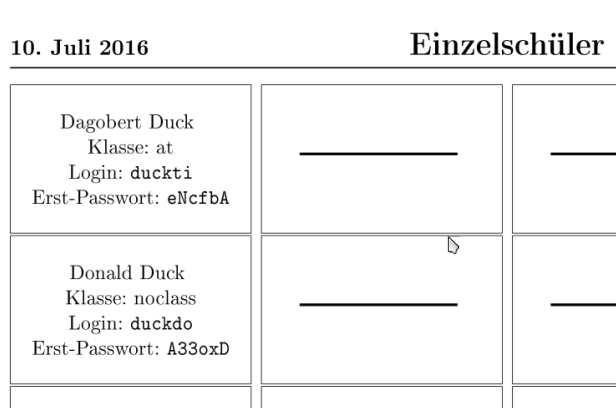

Passwörter verwalten
--------------------

Nach der Neuanlage von Benutzern können Passwörter und Anmeldekärtchen für die Lehrer vom administrator und für die Schüler von jedem Lehrer 
ausgedruckt und verwaltet werden.

Jeder Benutzer kann sein Passwort selbst ausschließlich über die Startseite der *Schulkonsole* ändern.
Zur Änderung muss einmal das alte und zweimal das neue Passwort eingegeben werden, um Tippfehler auszuschließen.

Verwaltung der Schülerpasswörter durch die Lehrer
^^^^^^^^^^^^^^^^^^^^^^^^^^^^^^^^^^^^^^^^^^^^^^^^^

Wenn ein Lehrer in der *Schulkonsole * eine Klasse ausgewählt hat, kann er über den Unterpunkt *Passwörter* die Passwörter der Klasse verwalten:

Die kompletten Anmeldekärtchen der Klasse können als *PDF*-Datei ausgedruckt oder als *CSV*-Datei heruntergeladen und mit einem 
Tabellenkalkulationsprogramm weiterverarbeitet werden. Außerdem kann das Passwort ausgewählter Schüler auf das Erstpasswort zurückgesetzt und mit
*Zufallspasswort setzen* oder *Passwort setzen* ein neues Erstpasswort vergeben werden.

Die Bezeichnung **Erstpasswort** bezieht sich dabei immer auf das zeitlich neueste über die Schulkonsole vergebene Passwort, also entweder das 
vergebene Passwort beim Anlegen des Schülers durch den Administrator oder das aktuellste Passwort, das eine Lehrperson über die Schulkonsole vergeben hat.

**Lehrkräfte können niemals ein vom Schüler geändertes Passwort einsehen oder ausdrucken.**

Verwaltung der Lehrerpasswörter durch den Administrator
^^^^^^^^^^^^^^^^^^^^^^^^^^^^^^^^^^^^^^^^^^^^^^^^^^^^^^^

Der Administrator hat in der *Schulkonsole* unter *Benutzer* -> *Lehrerpasswörter* die gleichen Möglichkeiten für die Passwörter der Lehrer, 
wie die Lehrer für die Passwörter der Schüler. Er kann die komplette Passwortliste als PDF ausdrucken oder als CSV-Datei weiter verarbeiten. 
Außerdem ist es möglich ein neues Erstpasswort zu setzen oder es sich für einzelne Lehrer anzuschauen.

**Der Administrator kann vom Lehrer geänderte Passwörter nicht einsehen.**

Ausdrucken von Passwortlisten für neu angelegte Benutzer durch den Administrator
^^^^^^^^^^^^^^^^^^^^^^^^^^^^^^^^^^^^^^^^^^^^^^^^^^^^^^^^^^^^^^^^^^^^^^^^^^^^^^^^

Der Administrator kann in der *Schulkonsole* unter *Bentuzer* -> *Passwortlisten** einsehen, zu welchen Zeitpunkten Benutzer neu angelegt wurden.

.. image:: media/schulkonsole-benutzer-passwortlisten.png

Er kann entweder eine **Gesamtliste** aller Benutzer mit deren Passworten erhalten oder aber einen bestimmten Zeitpunkt heraussuchen und dann die Liste 
der zu diesem Zeitpunkt angelegten Benutzer erhalten. Dabei kann er jeweils entweder eine Liste als *PDF*-Datei oder als *CSV*-Datei erhalten. Die *PDF*-Datei
enthält Anmeldekärtchen der Benutzer. Alternativ kann er sich über die Option **Ein Eintrag pro Seite** Seiten mit ausführlichen Anmeldeinformationen
ausgeben lassen.

.. image:: media/schulkonsole-benutzer-passwortlisten-pdf-detailiert.png
 