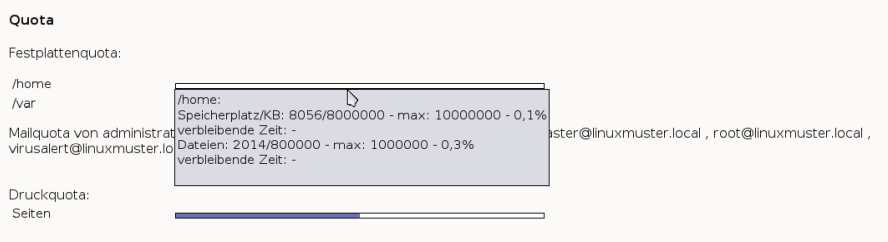
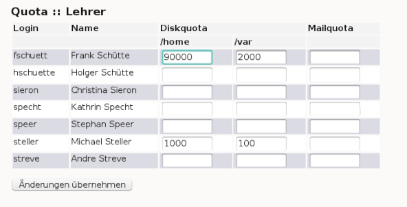

Festplattenplatz beschränken (Quota)
------------------------------------

Alle Benutzer im System dürfen Daten auf dem Server abspeichern. Es kann also vorkommen, dass Schüler und Lehrer so viele Daten abspeichern, dass 
der Festplattenplatz des Servers erschöpft ist, was bis zur Einstellung des Betriebes führen kann. Außerdem kann das „Vollmüllen“ des Servers auch 
vom Internet aus z.B. durch E-Mail-Bombing erfolgen.

Einziger Ausweg: Sie beschränken den Festplattenplatz eines jeden Benutzers und achten darauf, dass die Summe der vergebenen „Quota” nicht 
die Kapazität der Festplatten des Servers übersteigt.

Quota-Unterstützung ist auf dem Musterlösungsserver schon vorinstalliert. Die Zuteilung der Quota auf die einzelnen Benutzer wird von
*Sophomorix* verwaltet.

Die Standardeinstellungen für Lehrer und Schüler kann der Benutzer administrator in der Schulkonsole im Unterpunkt
*Einstellungen* -> *Benutzerverwaltung* im Abschnitt *Global* festlegen. Sie werden in der Datei ``quota.txt`` in ``/etc/sophomorix/user`` gespeichert.

Wirksam sind die geänderten Werte erst nach einem Durchlauf zum *Anlegen/Versetzen/Löschen* von Benutzern.

Der Benutzer administrator kann sich auf der Kommandozeile mittels des Befehls 

``quota <Benutzername>``

die Übersicht für einen einzelnen Benutzer anzeigen lassen.

Anzeigen des eigenen Plattenplatzes
^^^^^^^^^^^^^^^^^^^^^^^^^^^^^^^^^^^

Jeder Benutzer kann sich auf der Startseite der *Schulkonsole* über seinen verbrauchten Plattenplatz und seine Quota informieren. Um genauere 
Angaben zu bekommen, genügt es, mit dem Mauszeiger auf die entsprechende Leiste zu gehen:

In diesem Beispiel ist die Quota nur zu einem geringen Anteil ausgeschöpft. Die Maximalwerte stimmen mit den vorgegebenen nicht genau überein.

Das liegt daran, dass unter Linux zwischen einem sogenannten „soft limit“ und einem „hard limit“ unterschieden wird. Die vom
administrator eingestellten Werte (s. u.) werden als „hard limit“ gesetzt. Das „soft limit“ wird automatisch mit einem um 20% kleineren Wert 
gesetzt. Das „soft limit“ ist das Limit, das *Windows* anzeigt. Überschreitet das Datenvolumen diese Grenze, wird ein Warnhinweis ausgegeben, 
die Dateien werden aber noch bis zum Erreichen des „hard limit“ abgespeichert.

Bei Erreichen des „hard limit“ geht dann für diesen Benutzer wirklich nichts mehr, bis er wieder so viel Platz geschaffen hat, dass er unter 
das „soft-limit” rutscht. Da wir uns auf einem Linux-Server befinden, wird auch die Anzahl der Dateien begrenzt.

Beachten Sie auch, dass das gesetzte Quota immer für eine ganze Festplattenpartition auf dem Linux-Server gilt. Befindet sich z.B. das 
Klassentauschverzeichnis eines Schülers auf der selben Serverpartition wie das Heimatverzeichnis H:, werden die Daten auf dem Tauschverzeichnis 
zum verbrauchten Plattenplatz hinzugerechnet. Befinden sich alle Netzlaufwerke auf der selben Serverpartition, kann der Schüler also auf allen 
Netzlaufwerken zusammen nicht mehr als das voreingestellte Quota belegen.

Ändern von einzelnen Lehrerquota
^^^^^^^^^^^^^^^^^^^^^^^^^^^^^^^^

Benötigt ein Kollege mehr Platz, können Sie dessen Quota leicht über die *Schulkonsole* unter *Quota* -> *Lehrer* ändern:

Sind die Felder leer, gelten die Standardwerte. Mit einem Klick auf die Schaltfläche *Änderungen übernehmen* werden die geänderten Werte in die Datei
``lehrer.txt`` übernommen und auch gleich gesetzt.

Ändern von Klassen- und Projektquota
^^^^^^^^^^^^^^^^^^^^^^^^^^^^^^^^^^^^

Unter *Quota* -> *Klassen* kann der Benutzer administrator in der *Schulkonsole* die Quota für alle Schüler einer Klasse ändern.

Unter *Quota* -> *Projekte* kann er zusätzliche Quota für alle Schüler eines Projektes vergeben.

Mit *Änderungen übernehmen* werden die geänderten Quotas in diesen beiden Fällen nicht in einer Datei abgelegt, sondern gleich in die
*Sophomorix*-Datenbank geschrieben und sind damit sofort gültig.

Sonderquota: Quota für Administratoren und einzelne Schüler
^^^^^^^^^^^^^^^^^^^^^^^^^^^^^^^^^^^^^^^^^^^^^^^^^^^^^^^^^^^

Mittels *Quota* -> *Sonderquota* in der *Schulkonsole* kann der administrator Quota für

*   einzelne Schüler,
*   Administratoren und
*   den max. für Homepages zur Verfügung stehenden Platz (Webspace)

festlegen.

Für den *Webspace* und die *Administratoren * können einfach die Werte überschrieben werden und dann mittels
*Änderungen übernehmen* gesetzt werden.

Für einzelne Schüler müssen Sonderquota erst neu angelegt werden, indem der Login-Name und die gewünschten Quota eingegeben werden.

Nach einem Klick auf *Änderungen übernehmen* ist dann der Schüler in einer Schülerliste unterhalb des Abschnitts für die Administratoren aufgeführt.

Für bereits dort vorhandene Schüler können Sie einfach die Quotawerte überschreiben und dann mittels *Änderungen übernehmen* setzten.
