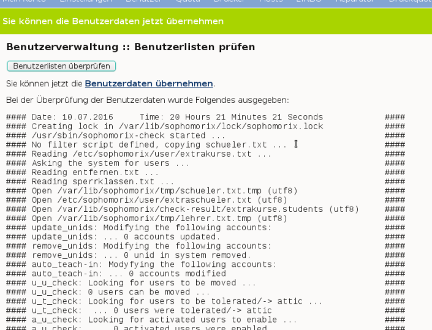

Anlegen, Versetzen und Löschen von Benutzern
--------------------------------------------

Normalerweise werden an einem Linux-Server die Benutzer durch Aufruf eines Programms angelegt, dem man den Benutzernamen des anzulegenden Benutzers 
und die Gruppe mitteilt, in welche der Benutzer zugeordnet werden soll.

Für eine Schule ist dieses Vorgehen nicht praktikabel, da meist mehrere hundert bis einige tausend Schüler als Benutzer angelegt werden müssen. 
Deshalb übernimmt bei der *linuxmuster.net* das Programm *Sophomorix* diese Aufgabe.

*Sophomorix* liest alle Schüler aus einer Text-Datei ein, die aus dem Schulverwaltungsprogramm der Schule bezogen oder von Hand mit Hilfe 
eines Editors erstellt wurde. Anschließend werden alle Schüler dieser Liste, die im System noch nicht vorhanden sind, angelegt, solche mit 
einer neuen Klasse versetzt und nicht mehr aufgeführte Schüler im System gelöscht.

Mit der *Schulkonsole* gibt es für den Netzwerkbetreuer ein webbasiertes Werkzeug, das ihm die Bedienung von *Sophomorix *
sehr erleichtert. Die einzelnen Schritte werden im Folgenden erläutert. Der Netzwerkbetreuer muss nur noch in Ausnahmefällen 
mit der Kommandozeile arbeiten.

Um Benutzer neu aufzunehmen, zu versetzen oder zu löschen müssen die folgenden Schritte nacheinander ausgeführt werden:

*   Schüler und Lehrerliste aus dem Schulverwaltungsprogramm exportieren.
*   Die Benutzerlisten auf dem Server aktualisieren. Dazu gehört im Einzelnen:

    *   die Schülerliste in das System übertragen,
    *   die Änderungen bei den Lehrern einzeln eingeben,
    *   evtl. eine Extraliste für Gast- und Kooperationsschüler, die nicht in das Schulverwaltungsprogramm aufgenommen werden, pflegen,
    *   evtl. eine Extraliste für Kurse mit schulfremden Teilnehmern pflegen.

*   Alle Benutzerlisten auf Fehleingaben, oder Ähnlichkeiten mit vorhandenen Benutzern prüfen.
*   Danach evtl. die Benutzerlisten entsprechend korrigieren.
*   Benutzerdaten übernehmen, d.h. Benutzer jetzt tatsächlich anlegen, versetzen oder löschen
*   Passwortlisten bzw. Anmeldekärtchen ausdrucken

Änderung von Benutzerdaten
^^^^^^^^^^^^^^^^^^^^^^^^^^

Sind Sie an der *Schulkonsole* als administrator angemeldet, erhalten Sie unter der Rubrik *Benutzer* die folgenden Menüpunkte, in der schwebenden Hilfe
erhalten Sie eine Übersicht mit einer kurzen Beschreibung der Vorgehensweise zum Anlegen, Versetzen und Löschen von Benutzern:

.. image:: media/schulkonsole-benutzer-menue.png

Diese Vorgänge zum Aufnehmen, Versetzen und Löschen von Benutzern können beliebig oft im Verlauf eines Schuljahres durchgeführt werden.

.. image:: media/schulkonsole-benutzer-hilfe.png

Export von Schüler- und Lehrerliste aus dem Schulverwaltungsprogramm
""""""""""""""""""""""""""""""""""""""""""""""""""""""""""""""""""""

Die meisten Schulverwaltungsprogramme bieten die Möglichkeit, eine Schüler- und eine Lehrerliste für die *linuxmuster.net*
zu exportieren. Dabei werden die Daten mit dem benötigten Datensatzformat untereinander in eine Textdatei geschrieben. 
Für die Schülerliste gilt folgendes Format:

``Klasse;Nachname;Vorname;Geburtsdatum;Nr;``

Dabei ist das letzte Feld optional. Es enthält die im Schulverwaltungsprogramm eindeutig vergebene Schülernummer. Ist sie vorhanden, sollte man sie
unbedingt mit übernehmen, das sie die Identifikation des richtigen Datensatzes bei Versetzungen, Namensänderungen usw. erheblich erleichtert. Falls
die Nummer nicht vorhanden ist, besteht jede Zeile nur aus den 4 Feldern

``Klasse;Nachname;Vorname;Geburtsdatum;``

Auch wenn Ihr Schulverwaltungsprogramm keine direkte Ausgabe für die Musterlösung vorsieht, können die Daten meist unter Angabe der benötigten 
Felder und mit dem Semikolon als Trennzeichen exportiert werden.

Wichtig ist noch, die Kodierung zu wissen, da man diese in der Schulkonsole unter :ref:`schulkonsole-einstellungen` **vor dem ersten Import** einstellen
muss. [#f1]_

Pflege der Schülerdatei
"""""""""""""""""""""""

.. image:: media/schulkonsole-schueler-pflegen.png

Die Datei aus dem Schulverwaltungsprogramm können Sie mittels *Durchsuchen* auswählen und dann mittels *Hochladen*
auf den Server kopieren. Sie wird automatisch umbenannt und liegt dann als Datei ``schueler.txt`` im Verzeichnis ``/etc/sophomorix/user``. 
Dort befinden sich alle Benutzer- und Konfigurationsdateien von *Sophomorix.*

Im Abschnitt *Editieren* können Sie zwar die Datei schueler.txt editieren und anschließend *Änderungen übernehmen*
anklicken, davon sollten Sie jedoch nur in Ausnahmefällen Gebrauch machen, da mit dem Einspielen einer neuen Datei aus dem Schulverwaltungsprogramm 
Ihre Änderungen wieder überschrieben werden.

Wenn Daten korrigiert werden müssen, geben Sie Rückmeldung an das Sekretariat z.B. mit Hilfe des
*Report für das Sekretariat*, damit die Daten dort korrigiert werden. Spielen Sie die geänderte Datei dann neu ein.

Wollen Sie zusätzliche Schüler eingeben, die nicht in das Schulverwaltungsprogramm aufgenommen werden, so verwenden Sie dazu die Datei
``extraschueler.txt``, die Sie über *Extralisten pflegen* editieren können.

Pflege der Lehrerdatei
""""""""""""""""""""""

Für die Lehrer besteht die Möglichkeit einen Wunsch-Login-Namen anzugeben. Der Datensatz aus dem Schulverwaltungsprogramm wird also um ein 
Feld ergänzt. Der Klassenname ist für alle Lehrer *lehrer*, somit ist das Format der Datei ``lehrer.txt``:

``lehrer;Nachname;Vorname;Geburtsdatum;Wunschlogin;``

Außerdem werden von *Sophomorix* noch die für einzelne Lehrer gesondert eingegebenen Quotas hinten angehängt.

Aus diesem Grund macht es keinen Sinn, eine vorhandene Lehrerdatei mit derjenigen aus dem Schulverwaltungsprogramm zu überspielen, 
da Sie dann für alle Lehrer *Wunschlogin* und *Sonderquota* wieder neu eingeben müssten.

Sie erhalten deshalb in der Schulkonsole nur dann die Gelegenheit eine Datei auf den Server zu spielen, wenn noch keine Datei
``lehrer.txt`` vorhanden ist: Ist bereits eine Datei ``lehrer.txt`` im System vorhanden, entfällt der Abschnitt
*Datei importieren* und Sie haben nur die Möglichkeit, die vorhandenen Lehrer zu editieren, wobei Sie den Loginnamen, der unter Kürzel steht, 
nicht ändern können:

.. image:: media/schulkonsole-lehrer-pflegen.png

Nach gemachten Änderungen müssen Sie *Änderungen übernehmen* anklicken, damit die geänderten Daten in die Datei ``lehrer.txt``
übernommen werden. [#f2]_

Unterhalb des Abschnitts *Lehrer hinzufügen* finden Sie noch zwei weitere Abschnitte, um Lehrer zu editieren oder zu entfernen:

Auch hier gilt wieder: *Änderungen übernehmen* schreibt die Änderungen in die ``lehrer.txt``, vollzieht sie aber noch nicht im System.

Pflege der Extraschüler und Extrakurse
""""""""""""""""""""""""""""""""""""""

Zur Verwaltung von Schülern, die nicht im Schulverwaltungsprogramm aufgenommen sind, gibt es für den administrator
in der *Schulkonsole* unter der Rubrik *Benutzer* den Unterpunkt *Extralisten pflegen*:

Im Bereich *Extraschüler editieren* können Schüler von Kooperationsschulen oder Austausch- bzw. Gastschüler eingegeben werden. Die Syntax 
ist oben im Editierfenster erläutert und dieselbe wie bei der Schülerdatei, ergänzt um ein Feld für einen Wunschanmeldenamen:

``Klasse;Nachname;Vorname;Geburtsdatum;Wunschlogin;``

Der Name für die Klasse ist frei wählbar, z.B: *koop* (für Kooperation) oder *at* (für Austausch). Es können aber, gerade auch bei Kooperationsschülern, 
die **bestehenden** Klassennamen verwendet werden. Dies ist wichtig, falls der Zugriff auf das Klassentauschverzeichnis
der Klasse ermöglicht werden soll. Bei neuen Gruppennamen, wird auch ein neues Klassentauschverzeichnis angelegt.

.. image:: media/schulkonsole-extraschueler.png

Hier wurden einige Schüler ohne Wunschloginnamen aufgenommen, teils in die Jahrgangsstufe 12 (*12*), teils in eine Extragruppe
*at*(Austauschschüler), die damit ein eigenes Tauschverzeichnis haben. Durch Anklicken von *Änderungen speichern*
werden die geänderten Daten in die Datei ``/etc/sophomorix/user/extraschueler.txt`` übernommen.

Unterhalb von *Extraschüler editieren* befindet sich *Extrakurse editieren.*

Für VHS-Kurse oder Lehrerfortbildungen mit schulfremden Lehrern können hier zeitlich befristete Gastkonten für einen gesamten Kurs mit einheitlichem 
Passwort generiert werden. Die Syntax ergibt sich aus der Beschreibung oben im Editierfenster.

Mit *Änderungen übernehmen* werden die geänderten Daten in die Datei ``/etc/sophomorix/user/extrakurse.txt`` geschrieben.

Übernahme geänderter Daten in das System
^^^^^^^^^^^^^^^^^^^^^^^^^^^^^^^^^^^^^^^^

Durch die Änderungen der Dateien werden die Benutzer **noch nicht** in das System übernommen, da dieser Vorgang unter Umständen recht zeitaufwändig ist.
Nachdem man alle gewünschten Änderungen vorgenommen hat, geschieht das ''in einem Rutsch''.

Benutzerlisten prüfen
"""""""""""""""""""""

Über den Schaltknopf *Benutzerlisten überprüfen* im Unterpunkt *Benutzerlisten prüfen* werden alle Dateien [#f3]_ von sophomorix-check daraufhin überprüft,

*   ob die Geburtsdaten im Rahmen der Vorgaben liegen,
*   ob die Benutzer schon im System vorhanden sind,
*   ob abgegangene Schüler gelöscht werden sollen, oder
*   ob Benutzer ähnlichen Namens zum Entfernen vorgesehen sind.

Nach erfolgtem Check wird ein Protokoll ausgegeben, aus dem man weitergehende Informationen entnehmen kann. Außerdem kann man im Erfolgsfall mit dem dann neu ausgewiesenen Link
*Benutzerdaten übernehmen* gleich weitergehen:

Beim Überprüfen der Benutzerlisten werden intern alle Datensätze aus den vier Dateien sortiert in Benutzer,

*   die neu angelegt werden sollen,
*   die unverändert bleiben sollen,
*   die in eine andere Klasse versetzt werden sollen,
*   die entfernt werden sollen und solche,
*   die daraufhin überprüft werden sollen, ob sie mit kleinen Abweichungen anderen entsprechen, die aus dem System gelöscht werden sollen.

Benutzerdaten übernehmen
""""""""""""""""""""""""

Hat man den Punkt *Benutzerlisten prüfen* erfolgreich durchlaufen, können die Daten jetzt in das System übernommen werden, d.h. die neuen Benutzer angelegt (
sophomorix-add), die zu versetzenden versetzt (sophomorix-move) und die zu löschenden gelöscht (sophomorix-kill) werden. Unter dem Unterpunkt
*Benutzerdaten übernehmen* bekommt man die Benutzer angezeigt, die zum Anlegen, Versetzen und Löschen vorgesehen sind:

Im Normalfall wird man alle drei Aktionen direkt nacheinander ablaufen lassen durch einen Klick auf die Schaltfläche
*Benutzer anlegen/versetzen/löschen.*
Man kann jedoch auch die Operationen einzeln ausführen lassen.

.. image:: media/schulkonsole-benutzer-uebernehmen.png

In obigem Beispiel würden zwei Benutzer neu angelegt. Während der Bearbeitung werden die laufenden Systemmeldungen ausgegeben.

.. image:: media/schulkonsole-benutzer-uebernehmen-log.png

Benutzer anlegen
^^^^^^^^^^^^^^^^

Beim Anlegen wird jedem neuen Benutzer ein Benutzername (Loginname) und eine Gruppe, zu der er gehört und deren Rechte er hat, zugewiesen.

Der Benutzername wird bei Schülern aus Vor- und Nachnamen standardmäßig in der Form ”sechs Buchstaben des Nachnamens plus zwei Buchstaben des Vornamens” 
gebildet (bei kürzerem Nachnamen entsprechend weniger Buchstaben). Beim Anlegen der Benutzer werden Sonderzeichen umgeschrieben, d.h. ä, ö, ü und ß 
wird zu ae, oe, ue und ss. Bei Lehrern wird der Wunschloginname schon in der Datei ``lehrer.txt`` festgelegt. Das Geburtsdatum dient zur 
Unterscheidung bei gleichnamigen Benutzern. Ist der Benutzername bereits vorhanden, wird an den zweiten sonst gleichen Benutzernamen eine 1 angehängt.

In der *linuxmuster.net* wird jedem Schüler als Gruppe seine Klasse zugewiesen. Der Klassenbezeichner ist beliebig aber auf 8 Zeichen begrenzt. 
Dieser Bezeichner wird als primäre Gruppe verwendet. Alle Lehrer gehören der Gruppe ``teachers`` an.

Jeder neue Benutzer bekommt ein Passwort zugewiesen und erhält die angegebenen Standardquota.

Dies alles wird von ``sophomorix-add`` erledigt.

Benutzer versetzen
^^^^^^^^^^^^^^^^^^

Zum neuen Schuljahr sind bei den Schülerdaten aus dem Schulverwaltungsprogramm die neuen Klassen angegeben.
``sophomorix-move`` versetzt diese Schüler automatisch in die neuen Klassen.

Beim Versetzen bzw. Löschen ist folgende Besonderheit zu beachten:

Ist der Datensatz eines Benutzers nicht mehr in der zugehörigen Textdatei (z.B. bei Schülern in der schueler.txt)
vorhanden, wird er nicht sofort gelöscht, sondern er wird auf den Dachboden (Gruppe attic) geschoben und bekommt den Status

``T`` (tolerated). 

Ab sofort wird der Benutzer nur noch geduldet, d.h. er kann sich noch anmelden, hat aber keinen Zugriff mehr auf sein Klassentauschverzeichnis.

Ist der *Duldungszeitraum* abgelaufen, bekommt er nach dem nächsten Überprüfen der Benutzerdaten den Status

``D``(disabled). 

Jetzt beginnt der *Reaktivierungszeitraum*, der Benutzer kann sich jetzt nicht mehr anmelden. Seine Daten werden aber noch nicht gelöscht und 
befinden sich weiterhin auf dem Dachboden (attic). Ist der Reaktivierungszeitraum beendet, wird der Benutzer mit dem nächsten
*Benutzerdaten überprüfen* durch Vergabe des Status

``R``(removable) 

zum Löschen freigegeben und beim nächsten Aufruf von *Löschen* ``sophomorix-kill`` tatsächlich gelöscht.

Benutzer löschen
^^^^^^^^^^^^^^^^

Durch Auswahl von *Benutzer löschen* werden zum Löschen markierte Benutzer mitsamt ihren Daten aus dem System entfernt und können nicht wieder 
zurückgeholt werden.

Berichte
^^^^^^^^

Im Unterpunkt *Berichte* finden Sie unter *Administrator-Report* ein Protokoll des letzten Durchlaufs zu *anlegen/versetzen und löschen*
evtl. versehen mit dem Hinweis *Teach-in* aufzurufen, was über *Benutzerlisten prüfen* gemacht werden kann.

Unter *Protokoll für das Sekretariat* finden Sie Angaben zu Datensätzen, die nicht den Vorgaben von *Sophomorix* entsprechen.

Diese Fehler sollten im Schulverwaltungsprogramm korrigiert werden, dann die Datei neu exportiert und wieder ins System übernommen werden. 
(Nicht von Hand editieren unter *Schülerliste pflegen*!)

Sollte sich hier herausstellen, dass die Umlaute und Sonderzeichen, wie z.B. é, nicht richtig übernommen wurden, liegt das wahrscheinlich an 
unterschiedlich eingestellten Zeichensätzen der beteiligten PCs. Dann kann z.B. mittels Aufruf der Datei ``schueler.txt``
als *csv*-Datei in *LibreOffice* der Zeichensatz geändert werden (z.B. auf *utf8*). Danach sollte dann die Übertragung problemlos 
möglich sein.

Benutzer reaktivieren
^^^^^^^^^^^^^^^^^^^^^

Sind Schüler oder Lehrer, die bereits einen Benutzernamen haben, nicht mehr in den Benutzerlisten aufgeführt, so werden sie auf den **Dachboden** verschoben.
War das Entfernen aus den Benutzerlisten ein Versehen, können Benutzer vom Dachboden wieder vollwertig in das System zurückgeholt (reaktiviert) 
werden, indem man folgende Schritte nacheinander ausführt.

*   Die Benutzer werden wieder in die Benutzerlisten eingetragen,
*   *Benutzer* -> *Benutzerlisten prüfen*,
*   *Benutzer* -> *Benutzerdaten übernehmen* -> *Benutzer versetzen*.

Danach können sich die Benutzer wieder anmelden und haben wieder alle ihre Daten im *Home-* und den *Tausch-Verzeichnissen* zur Verfügung.

.. [#f1] Die Kodierung kann auch nachträglich geändert werden. Dabei ist die Reihenfolge wichtig: Zuerst die neue Kodierung einstellen, 
         dann die Benutzer in das System übernehmen, damit sie in der richtigen Kodierung übernommen werden. Eine Kontrolle der Umlaute ist
         ein gutes Indiz für die richtig eingestellte Kodierung.

.. [#f2] Damit ist jetzt die Datei ``lehrer.txt`` geändert, aber die Daten sind noch nicht geprüft oder gar in das System übernommen.

.. [#f3] schueler.txt, lehrer.txt, extraschueler.txt und extrakurse.txt
