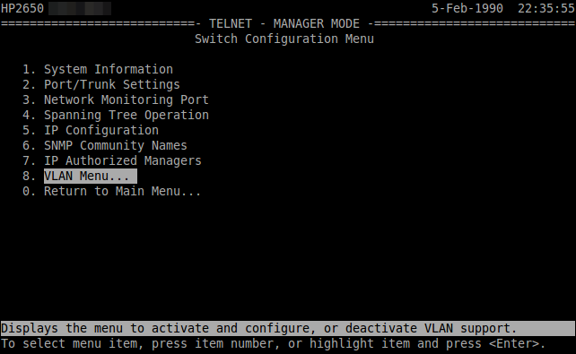

Vorbereitung der Switches im Netzwerk
=====================================

In Vorbereitung auf das Subnetting sollten auf allen L2 Switches im Netzwerk
die VLANs mit den IDs ``16``, ``17``, und ``18`` angelegt werden, damit später
die Portkonfiguration aller Switches leicht passend eingestellt werden kann.

Je nachdem wie die Geräte der einzelnen Subnetze im Schulhaus verteilt sind,
ist es nicht zwar unbeding notwendig, alle Subnetze auf allen Switches
einzurichten, es richtet aber keinen Schaden an und vereinheitlicht das
Vorgehen. Ausserdem können spätere Erweiterungen der Infrastruktur mit weniger
Konfigurationsaufwand umgesetzt werden, beispielsweise wenn in einem
Gebäuteteil in dem zunächst nur Schülergeräte angeschlossen waren ein
Lehrerarbeitsraum eingerichtet werden soll.

Das genaue Vorgehen kann hier nicht umfassend dokumentiert werden, das es von
Art und Hersteller des Switches abhängt, exemplarisch sollen folgende Beispiele
stehen.

Hewlett Packard HP2650
----------------------

.. image:: media/hp2650_01.png
   :alt: VLANs HP2650
   :align: right

Einige HP-Switches haben eine textbasierte "Menükonsole", hier geht man prinzipiell folgendermaßen vor:

* Mit telnet/ssh auf die Switchkonsole verbinden 
* Das Konfigurationsmenü öffnen
* Nach  ``Switch-Konfiguration``, ``VLAN Menu``, ``VLAN Names`` wechseln und
  dort die VLans mit den IDs ``16``, ``17`` und ``18`` anlegen.

.. image:: media/hp2650_02.png
   :alt: VLANs HP2650
   :align: center

.. image:: media/hp2650_04.png
   :alt: VLANs HP2650
   :align: center

Auf diesem Switch gibt es bereits 2 VLANs (mit den IDs ``2`` und ``3``) für andere Zwecke, diese stören nicht.

.. image:: media/hp2650_05.png
   :alt: VLANs HP2650
   :align: center

