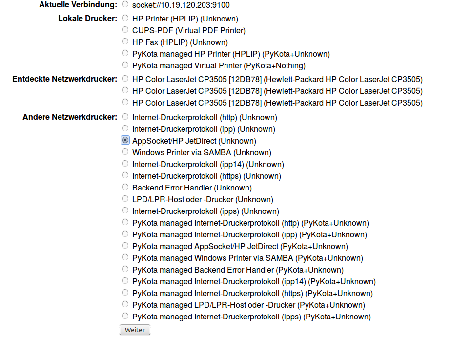

Vorbereitung der workstations-Datei
===================================

Zunächst bearbeitet man die Workstations-Datei derart, dass alle Rechner, die
später im Lehrernetz sein sollen, Adressen mit dem Beginn ``10.17.x.x``
erhalten. Rechner die sich später im Schülersegment befinden sollen Adressen
mit dem Beginn ``10.18.x.x`` erhalten.

Dabei ist es unerheblich, ob die Veränderungen im Serverterminal oder in der
Schulkonsole vorgenommen werden.

Ausgangszustand
---------------

Die Rechner sind Raumweise einsortiert, beispielsweise haben alle Rechner in
Raum r120 IP-Adressen der Form ``10.16.120.x``.

Die Workstations-Datei soll nun so umstrukturiert werden, dass später

* alle Rechner in Raum r120 und der Rechner rhm-ws01 im Lehrernetz sind
* alle übrigen Rechner im Schülernetz sind

Dazu ersetzt man bei den betreffenden Rechnern die Zahl im zweiten  Oktett der IP-Adresse
(derzeit bei allen die ``16``) durch die entsprechende Zahl für das spätere Subnetz 
(``17`` für das Lehrernetz, ``18`` für das Schülernetz). Die Drucker werden dabei 
ebenfalls in das entsprechende Teilnetz verlegt, hier sind später 
noch weitere Anpassungen auf dem Server nötig.

.. code::

   r120;r120-ws01;qgm;C4:34:6B:7E:71:10;10.16.120.1;255.240.0.0;1;1;1;1;1
   r120;r120-ws02;qgm;64:51:06:38:B6:6F;10.16.120.2;255.240.0.0;1;1;1;1;1
   r120;r120-printer-color;printer;00:1E:0B:12:DB:78;10.16.120.202;255.240.0.0;1;1;1;1;0
   r120;r120-printer-bw;printer;00:18:FE:A3:A8:60;10.16.120.203;255.240.0.0;1;1;1;1;0
   r210;r210-ws01;qgm;64:51:06:38:B6:64;10.16.210.1;255.240.0.0;1;1;1;1;1
   r116a;r116a-ws01;sozpaed;88:AE:1D:EF:E3:3B;10.16.6.1;255.240.0.0;1;1;1;1;0
   nwt100;r100-ws01;qgm;64:51:06:43:D2:62;10.16.100.1;255.240.0.0;1;1;1;1;1
   nwt100;r100-ws02;qgm;64:51:06:43:D3:21;10.16.100.2;255.240.0.0;1;1;1;1;1
   nwt100;r100-ws03;qgm;64:51:06:4B:C5:78;10.16.100.3;255.240.0.0;1;1;1;1;1
   prota;prota-ws07;qgm;EC:A8:6B:FE:0B:09;10.16.242.7;255.240.0.0;1;1;1;1;1
   r138;r138-ws01;qgm;00:0F:FE:96:02:1E;10.16.138.1;255.240.0.0;1;1;1;1;1
   r138;r138-ws02;qgm;00:0F:FE:88:15:D8;10.16.138.2;255.240.0.0;1;1;1;1;1
   r138;r138-ws03;qgm;64:51:06:38:3E:FF;10.16.138.3;255.240.0.0;1;1;1;1;1
   rhm;rhm-ws01;qgm;64:51:06:38:B7:AC;10.19.111.1;255.240.0.0;1;1;1;1;1

Endzustand
----------

Alle Rechner die später im Lehrernetz sein sollen, haben nun Adressen der Form
``10.17.x.x``, alle Rechner die später im Schülernetz sein sollen haben
Adressen der Form ``10.18.x.x``.

Nun übernimmt man die Änderungen durch ausführen des Befehls
``import_workstations`` oder entsprechend in der Schulkonsole.

Nach dem nächsten Rechnerstart erhalten die geänderten Rechner die neuen
IP-Adressen.

.. code::

   r120;r120-ws01;qgm;C4:34:6B:7E:71:10;10.17.120.1;255.240.0.0;1;1;1;1;1
   r120;r120-ws02;qgm;64:51:06:38:B6:6F;10.17.120.2;255.240.0.0;1;1;1;1;1
   r120;r120-printer-color;printer;00:1E:0B:12:DB:78;10.17.120.202;255.240.0.0;1;1;1;1;0
   r120;r120-printer-bw;printer;00:18:FE:A3:A8:60;10.17.120.203;255.240.0.0;1;1;1;1;0
   r210;r210-ws01;qgm;64:51:06:38:B6:64;10.18.210.1;255.240.0.0;1;1;1;1;1
   r116a;r116a-ws01;sozpaed;88:AE:1D:EF:E3:3B;10.18.6.1;255.240.0.0;1;1;1;1;0
   nwt100;r100-ws01;qgm;64:51:06:43:D2:62;10.18.100.1;255.240.0.0;1;1;1;1;1
   nwt100;r100-ws02;qgm;64:51:06:43:D3:21;10.18.100.2;255.240.0.0;1;1;1;1;1
   nwt100;r100-ws03;qgm;64:51:06:4B:C5:78;10.18.100.3;255.240.0.0;1;1;1;1;1
   prota;prota-ws07;qgm;EC:A8:6B:FE:0B:09;10.18.242.7;255.240.0.0;1;1;1;1;1
   r138;r138-ws01;qgm;00:0F:FE:96:02:1E;10.18.138.1;255.240.0.0;1;1;1;1;1
   r138;r138-ws02;qgm;00:0F:FE:88:15:D8;10.18.138.2;255.240.0.0;1;1;1;1;1
   r138;r138-ws10;qgm;64:51:06:38:3E:FF;10.18.138.99;255.240.0.0;1;1;1;1;1
   rhm;rhm-ws01;qgm;64:51:06:38:B7:AC;10.17.111.1;255.240.0.0;1;1;1;1;1

Geänderte Drucker auf dem Server anpassen
-----------------------------------------

Hat man bei der Neustrukturierung IP-Adressen von Druckern geändert, die in
CUPS auf dem Server als Netzwerkdrucker eingerichtet sind, muss man dort die
neue IP-Adresse anpassen, da diese Änderungen durch den erneuten Import der
Arbeitsstationen nicht übernommen werden.

Am Beispiel des Druckers ``r120-printer-bw`` wird das Vorgehen kurz dargestellt.

Dazu öffnet man die CUPS Seite auf dem Server und bearbeitet den betreffenden
Drucker - man sieht, die ursprüngliche IP-Adresse ``10.16.120.203``.
 
.. image:: media/cups01.png
   :alt: CUPS Einstellungen anpassen
   :align: center

Zunächst wählt man im Administrationsmenü ``Drucker ändern``.

.. image:: media/cups01a.png
   :alt: CUPS Einstellungen anpassen
   :align: center

Jetzt wählt man die bisherige Anschlussart, im Beispiel ``AppSocket/HP
JetDirect``, im nächsten Bildschirm werden dann die bisherigen Einstellungen angezeigt.

In diesem Fall, wie zu sehen ``socket://10.16.120.203:9100``. 

.. image:: media/cups03.png
   :alt: CUPS Einstellungen anpassen
   :align: center

Jetzt ändert man die IP-Adresse auf den neuen Wert und lässt den Rest unverändert.

.. image:: media/cups04.png
   :alt: CUPS Einstellungen anpassen
   :align: center

Im weiteren Änderungsverlauf werden jeweils die bisherigen Einstellungen
angezeigt, die man stets übernimmt. Um die Änderungen abzuschliessen, muss man 
am Ende das ``root``-Passwort angeben.

Auf diese Weise müssen alle zuvor geänderten Drucker auf Ihre neue IP-Adresse
angepasst werden. 

