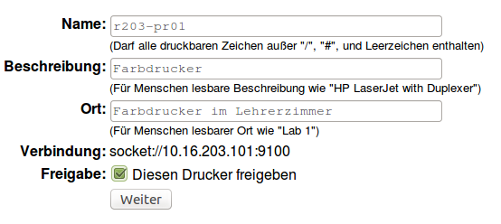
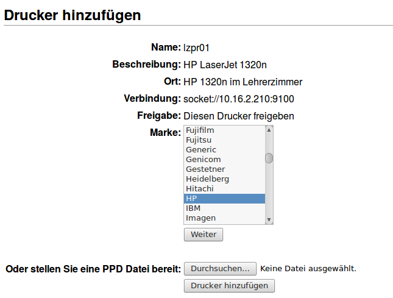
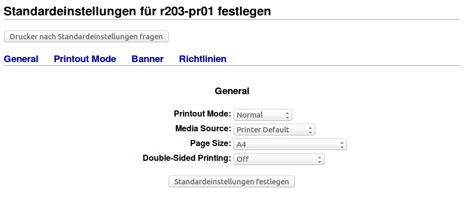
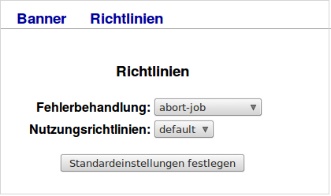

Wie richte ich Drucker am Server ein?
=====================================

Um die eingesetzten Netzwerkdrucker serverseitig einzurichten, sind diese mithilfe eines Browsers hinzuzufügen und einzurichten.

.. note:: 

   Auf dem Server ist automatisch ein PDF-Drucker eingerichtet. Auf den PDF-Drucker kann aus beliebigen Anwendungen heraus gedruckt werden. Die "gedruckte" PDF-Datei wird im Heimatverzeichnis des jeweiligen Benutzers im Ordner PDF abgelegt. Wird dieser später als Standard-Drucker festgelegt, so wird versehentliches Drucken auf einen nicht gewünschten Drucker unterbunden.

Starten Sie auf einem Rechner einen Browser, um das sog. CUPS-Webinterface zur weiteren Einrichtung der Drucker aufzurufen. Hierzu fügen Sie nachstehende URL in der Adresszeile Ihres Browsers ein:

.. code-block:: bash

   https://<server-ip>:631

Verwaltung via Browser
----------------------

Melden Sie sich am CUPS-Webinterfae als admin an. Danach haben Sie über verschiedene Reiterkarten die Möglichkeit, Drucker zu verwalten (hinzufügen, konfigurieren, Drcukaufträge verwalten, Druckerklassen definieren, Druckerstatus abzufragen).

Rufen Sie zunächst die **Reiterkarte Verwaltung** auf. Es erscheint nachstehende Maske:

.. image:: ./media/drucker_einrichten_cups/cups_server1.png
 

Drucker hinzufügen
------------------

Klicken Sie auf der Maske unter **Drucker** --> **Drucker hinzufügen**.
Es erscheint nachstehende Maske:

In dieser Maske muss für den Drucker ein Name vergeben werden (zum Beispiel *lzpr01* oder *h109drucker*). Der hier vergebene Name gilt zugleich als Freigabename für Linux- und für Windows-Clients. Die restlichen Angaben sind zwar optional, sollten aber eingegeben werden, um die Zuordnung nachvollziehbar zu halten. Dies kann ähnlich wie in nachstehender Eingabemaske erfolgen:

.. image:: ./media/drucker_einrichten_cups/cups_server3.png

Klicken Sie auf **WEITER**, um in den Einrichtungs-Dialog für den Drucker zu gelangen.

.. image:: ./media/drucker_einrichten_cups/cups_server4.png
 
In diesem Dialog müssen Sie angeben, auf welche Weise der Drucker mit dem Server verbunden ist. 
Bei einem Netzwerkdrucker ist dies im Normalfall die Option AppSocket/HP JetDirect. Sind Sie unsicher, schauen Sie im Handbuch des Druckers / Printservers nach, welche Option für Ihren Drucker zutrifft.

Klicken Sie auf **WEITER**, um zum nächsten Dialog zu gelangen:

Im Falle eines Netzwerkdruckers müssen Sie hier die IP-Adresse oder den Hostnamen und zusätzlich bei Verwendung eines Print-Servers, der über mehrere Anschlüsse verfügt, noch die Warteschlange anzugeben. 

Zum Beispiel:

.. code-block:: bash

   socket://10.16.203.22/lpt1

Im Zweifelsfall sollte auch hier die Bedienungsanleitung des Printservers weiterhelfen. 

Klicken Sie auf **WEITER**, um zur Auswahl des Druckermodells zu gelangen.

.. image:: ./media/drucker_einrichten_cups/cups_server6.png

Wählen Sie in Liste Ihr Druckermodell aus. Stehen für Ihr Modell mehrere Treiber zur Auswahl stehen, wählen Sie den empfohlenen Treiber (recommended) aus. Sollte Ihr Modell nicht in der Liste erscheinen, laden Sie über den Button **Durchsuchen** die sog. PPD-Datei für Ihren Drucker 
hoch. Die PPD-Datei ist beinhaltet einen Treiber für den Drucker für Linux. Diese Treiber erhalten Sie auf der Seite Ihres Druckerherstellers. Laden Sie diese lokal herunter. Danach können Sie die PPD-Datei auf den linuxmuster.net Server mit o.g. Dialog hochladen.

Mit Klick auf **Drucker hinzufügen** schließen Sie die Druckerinstallation. 

Danach gelangen Sie zur Einstellungsseite des Druckers. 

Hier können Sie abhängig vom Druckermodell verschiedene Einstellungen für das Standardverhalten des Druckertreibers vornehmen (zum Beispiel die Seitengröße auf A4 einstellen, Duplexdruck etc., falls dies nicht standardmäßig vorgesehen ist). 

Klicken Sie im Dialog für die Standardeinstellungen auf den Menüpunkt **Richtlinien**, um hier das Verhalten des Druckers im Fehlerfall festzulegen.

Geben Sie hier **abort-job** an, um sicherzustellen, dass der Drucker im Fehlerfall den Druckjob löscht.

Über den Button **Standardeinstellungen festlegen** und Klick auf den Druckernamen gelangen Sie schließlich zur Verwaltungsseite des neu eingerichteten Druckers: 

.. image:: ./media/drucker_einrichten_cups/cups_server8.png

Hier können Sie

- eine Testseite ausdrucken lassen,
- den Drucker anhalten und wieder starten,
- die Entgegennahme von Druckaufträgen sperren und wieder freischalten,
- die Druckereinrichtung wiederholen, um IP-Adresse oder Druckertreiber zu ändern,
- die Druckereinstellungen anpassen oder
- erlaubte Benutzer festlegen.

Nun ist Ihr Netzwerkdrucker betriebsbereit und kann auf den Arbeitsstationen eingerichtet werden. 

Angesprochen wird obiger Drucker über die URL:

.. code-block:: bash

  http://<servername>:631/printers/lzpr01

PDF-Drucker aktivieren
----------------------

Der standardmäßig eingerichtete PDF-Drucker wird über die URL

.. code-block:: bash

   http://<servername>:631/printers/PDF-Printer

angesprochen. Jetzt kann auch über den PDF-Drucker in eine PDF-Datei gedruckt werden, die auf dem Server im Homeverzeichnis des Benutzers im Unterverzeichnis PDF abgelegt wird.

