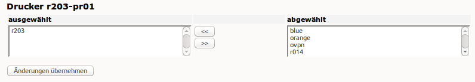

Wie verwalte ich den Zugriff auf die Drucker?
=============================================

Zunächst ist jeder neu eingerichtete Netzwerkdrucker im gesamten Netz an jeder Arbeitsstation verfügbar. 
Sie können jedoch den Druckerzugriff auf bestimmte Räume und/oder Arbeitsstationen beschränken.

Melden Sie sich dazu als Benutzer **administrator** auf der *Schulkonsole* ein und gehen Sie zur Druckerseite.
Diese erreichen Sie entweder über den Menüpunkt Drucker in der Schulkonsole, oder Sie geben in der Adresszeile der Browser nachstehende Adresse ein:

https://server:242/schulkonsole/printers

Sie sehen eine Liste mit den in Ihrem Schulnetz verfügbaren Netzwerkdruckern.

.. image:: ./media/drucker_zugriffssteuerung/drucker_overview.png

Sind einem Drucker Räume oder Rechner zugeordnet, sind diese hier ebenfalls aufgelistet. Ist ein Drucker weder einem Raum noch einem Rechner zugeordnet, ist er ohne Einschränkung netzweit verfügbar.

Um einem Drucker einen Raum zuzuordnen, klicken Sie auf **Bearbeiten** und ordnen über die Pfeile wie im unten abgebildeten Dialog den Raum zu.

.. attention::

   Ist ein Drucker einem Raum bzw. Rechner zugeordnet, so ist der
   Zugriff von anderen Räumen bzw. Rechnern aus gesperrt.  In diesem
   Fall müssen Sie dem Drucker zusätzlich diejenigen Räume/Rechner
   zuordnen, die ebenfalls Zugriff auf den Drucker haben sollen.  Nur
   wenn ein Drucker einem entsprechenden Raum zugeordnet wurde, kann
   ein Lehrer über die Schulkonsole (im Bereich Aktueller Raum) den
   Zugriff auf diesen Drucker steuern.

