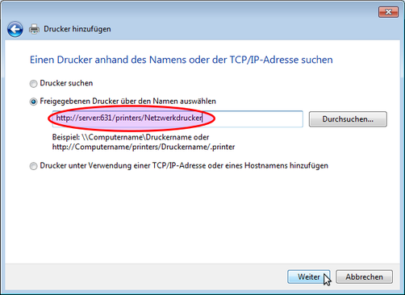

Wie richte ich Drucker auf den Clients ein?
===========================================

Clientseitig müssen Drucker über das HTTP-Protokoll eingerichtet werden, damit die raumbezogene Druckerzugriffskontrolle 
über die Schulkonsole funktioniert. 
Die URL für die Druckerverbindung wird nach folgendem Schema zusammengesetzt:

.. code-block:: bash

   http://<servername>:631/printers/<Druckername>

**PDF Drucker**

Beispielhaft wird der standardmäßig eingerichtete PDF-Drucker über die URL

.. code-block:: bash

  http://<servername>:631/printers/PDF-Printer

angesprochen. Damit der PDF-Drucker auf dem Client genutzt werden kann, muss auf dem Client ein Standard-Postskript-Drucker eingerichtet werden.

Linux Clients
-------------

.. todo::

  Bilder für die Linux-Clients fehlen noch!

Die Druckerinstallation auf dem Linux-Client lässt sich wie auf dem Server mit Hilfe des CUPS-Webinterfaces 
bewerkstelligen. Loggen Sie sich auf dem Client mit einem Browser über die URL http://localhost:631/admin als lokaler 
Benutzer **administrator** auf der CUPS-Administrationsseite ein und klicken Sie auf **Drucker hinzufügen**. 
Die Eingabe des Druckernamens ist zwingend, die anderen Felder sind optional: 

.. image:: media/drucker_einrichten_client_linux/drucker_linux1.png

Wählen Sie im nächsten Schritt für „Gerät“ Internet Printing Protocol (http): 

.. image:: media/drucker_einrichten_client_linux/drucker_linux2.png

Geben Sie nun die Geräte-URI für den Drucker nach dem Schema

.. code-block:: bash

  http://<servername>:631/printers/<Name des Druckers>

Die weiteren Einrichuntsschritte entsprechen denen, wie sie auf dem Server bereits ausgeführt wurden.

.. attention::

   Hier finden Sie die einzelnen Schritte:

   :doc:`3_drucker_einrichten_cups`  

Windows Clients
---------------

Melden Sie sich lokal am Windows-Client als **administrator** an und rufen Sie den Druckerinstallations-Assistnten auf, oder starten Sie den Druckerinstallations-Assistenten als Benutzer **administrator**. 
Den Druckerinstallations-Assistenten rufen Sie wie folgt auf:
** Systemsteuerung --> Hardware und Sound --> Geräte und Drucker --> Drucker** 

Wählen Sie im Assistnten im Dialog **Drucker hinzufügen** die Option **Einen Netzwerk-, Drahtlos- oder Bluetoothdrucker hinzufügen**.

.. image:: media/drucker_einrichten_client_windows/win7druck1.png

Im folgenden Dialogfenster beenden Sie die Druckersuche und gehen über die Schalftfläche Der gesuchte Drucker ist nicht aufgeführt zum nächsten Schritt. 

.. image:: media/drucker_einrichten_client_windows/win7druck2.png

Wählen Sie nun die Option *Freigegebenen Drucker* über den Namen auswählen und schreiben die Drucker-URL gemäß der Vorgabe aus dem 
Abschnitt Druckereinrichtung in das Eingabefeld (Beispiel http://server:631/printers/Netzwerkdrucker).

Nach Abschluss der Treiberinstallation steht der Drucker in unserem Beispiel als Netzwerkdrucker auf http://server:631 zur Verfügung. 

**Beispiel: PDF-Drucker**

Für die Nutzung des PDF-Druckers muss ein Postskript-Drucker eingerichtet werden. 
Starten Sie über den Druckerinstallations-Assistenten die Installation eines Netzwerkdruckers und geben als Netzwerkpfad die URL des 
PDF-Printers an (siehe :doc:`2_drucker_hinzufuegen`). Wählen Sie im weiteren Verlauf des Installationsdialogs das 
**Druckermodell MS Publisher Color Printer**, das unter **Hersteller Generic** aufgeführt ist:

.. image:: media/drucker_einrichten_client_windows/win7druck4.png 
 
Nach Abschluss der Druckerinstallation steht der PDF-Drucker als PDF-Printer an http://server:631 zur Verfügung. 

