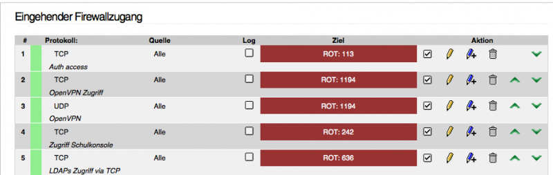
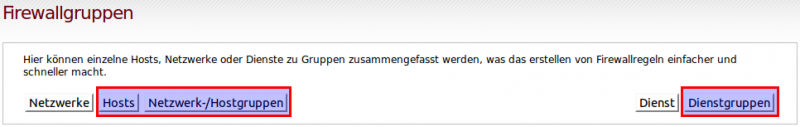
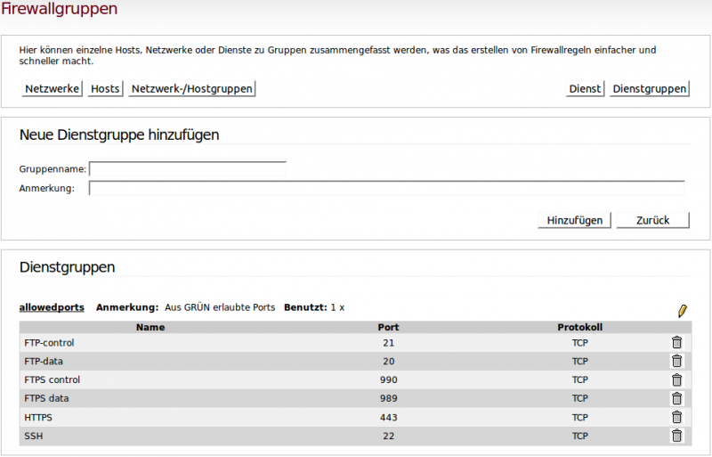

Dokumentation der eigenen Firewallregeln 
========================================

Um linuxmuster.net 6.0 (Codename ObenBleiben) auf linuxmuster.net 6.1 (Codename Babo) zu aktualisieren, ist es erforderlich, die externe Firewall **IPFIRE** auf sog. IP-basierte Reglen umzustellen. Das beschriebe Upgrade erledigt dies. Allerdings sind die selbst definierten und in IPFire eingetragenen Regeln vorab zu dokumentieren, da diese nach dem Upgrade neu in IPFire eingetragen werden müssen.

Screenshots erstellen
---------------------

Die derzeit im IPFire eingetragenen Regeln müssen alle doumentiert werden. Dazu müssen die Regeln / Einstellungen aus den folgenden IPFire-Bereichen erfasst werden:

- Eingehende Firewallregeln

- Ausgehende Firewallregeln

- Eingehender Firewallzugang

- Ausgehender Firewallzugang

- Standardverhalten der Firewall

Zu diesen Bereichen sind sinnvollerweise Screenshots zu erstellen, um so die Regeln erfassen. Diese werden später nach dem Upgrade der Firewall benötigt, um die eigenen Regeln wieder einpflegen zu können.

Als Referenz dient zudem nachstehende Dokumentation des Auslieferungszustands des IPFire.

Auslieferungszustand des IPFire
-------------------------------

Webproxy
````````

- Netze GRÜN und BLAU sind transparent aktiviert.
- Cachemanager ist aktiviert.
- URL-Filter ist nicht aktiviert.
- Die Netze GRÜN und BLAU sind als erlaubte Subnetze eingetragen.

DHCP-Server
```````````

- Für Netz BLAU aktiviert.
- IP-Range 172.16.[16xn].1 bis 172.16.[16xn].200 ist vorkonfiguriert.

OpenVPN
```````

- Ist auf ROT und BLAU aktiviert.
- Ein selbstsigniertes Zertifikat ist erstellt.
- OpenVPN ist als Dienst mit der Netzadresse 172.16.18.0/2255.255.255.0 mit dem Protokoll UDP und 
  dem Port 1194 aktiviert. Diese Daten werden auch für alle weiteren Firewallregeln benötigt.
  In den erweiterten Serveroptionen ist Redirect-Gateway def1 aktivert. Soll bei einer Remote-
  Verbindung der Internet-Zugriff lokal erfolgen, so muss die Option deaktiviert werden.

Zeitserver
``````````

Unter „Dienste|Zeitserver“ sind folgende Optionen aktiviert

- Uhrzeit von einem Netzwerk Zeitserver ermitteln.
- Uhrzeit dem lokalen Netzwerk zur Verfügung stellen.
- Erzwinge das Setzen der Systemzeit im Bootvorgang.

Firewall
--------

Firewallregeln
``````````````

Wenn man eine Portweiterleitung aus dem Internet benötigt z.B. HTTP/80 oder HTTPS/443, so muss dazu AUSSCHLIESSLICH die Regel unter [Firewallregeln] durch setzen des Häkchens aktiviert werden, sofern das Häkchen noch nicht gesetzt ist.

Es sind acht Firewallregeln vordefiniert (im Menü unter Firewall|Firewallregeln):

Eingehend (Portforwarding):
```````````````````````````

- Eingehender TCP-Port 2222 wird auf Port 22 der Server-IP weitergeleitet (SSH), aktiv.
- Eingehender TCP-Port 25 wird auf Port 25 der Server-IP weitergeleitet (SMTP), nicht aktiv.
- Eingehender TCP-Port 443 wird auf Port 443 der Server-IP weitergeleitet (HTTPS), nicht aktiv.
- Eingehender TCP-Port 636 wird auf Port 636 der Server-IP weitergeleitet (LDAPS), nicht aktiv.

Ausgehend:
``````````

- Server darf auf allen Ports raus, aktiv.
- Rechnergruppe allowedhosts darf auf Ports raus, die in der Dienstgruppe allowedports definiert 
  sind, aktiv (wird für Internetsperre genutzt).
- Netzwerkgruppe allowednetworks darf auf Ports raus, die in der Dienstgruppe allowedports 
  definiert sind, aktiv (wird für Internetsperre genutzt, wenn bei aktiviertem Subnetting für 
  Subnetze Internetzugriff zugelassen wurde).

Firewallregeln
--------------

.. image:: media/1_upgrade_60_to_61/fw_rules.png
   :alt: Firewallregeln
   :align: center

Eingehender Firewallzugang
--------------------------

Hier sind nur die Regeln einzutragen, die dazu führen, dass man vom Internet auf den IPFire selbst zugreifen kann - also sollte hier außer dem Port 1194 GARNICHTS stehen.
Alles andere wäre ein Sicherheitsrisiko 
**Hinweis:** Administration des IPFire von zu Hause aus über einen OpenVPN-Tunnel oder über eine Portweiterleitung per ssh möglich. 



Werden Regeln nicht benötigt, so können diese einfach deaktiviert werden. In obiger Abbildung ist z.B. sowohl für den Zugriff via UDP als auch via TCP auf Port 1194 eine Regel eingetragen. Sollte nur UDP verwendet werden, so könnte diese für TCP gelöscht oder deaktiviert werden.


Ausgehender Firewallzugang
--------------------------

Firewallgruppen
```````````````

Unter

- Hosts
- Netzwerk-/Hostgruppen
- Dienstgruppen

sind drei Firewallgruppen vordefiniert (im Menü unter Firewall|Firewallgruppen). 



Zu den Konfigurationsseiten der Firewallgruppen gelangt man über die entsprechende Schaltfläche.

Hosts
`````

Hier sind alle Hosts des Systems mit ihrer MAC-Adresse eingetragen. Der Workstationsimport auf dem Server aktualisiert diese Liste. Eigene Einträge sind hier nicht vorgesehen.

Hostgruppen
```````````

Die Hostgruppe allowedhosts ist vordefiniert und wird vom System verwaltet. Die Internetsperre trägt die IP-Adresse freigeschalteter Hosts in diese Gruppe ein. Eigene Hostgruppen können hinzugefügt und selbst verwaltet werden. Die allowedhosts-Gruppe sollte nicht geändert werden, da sie bei jeder Änderung der Internetsperre neu geschrieben wird.
Dienstgruppen

Es ist eine Dienstgruppe allowedports vordefiniert, die für die Internetsperre genutzt wird. Sie enthält zusätzliche Ports (Port 80 wird vom Webproxy verwaltet), die für freigeschaltete Hosts (Hostgruppe allowedhosts und ggf. Netzwerkgruppe allowednetworks) geöffnet sind. 



Im Auslieferungszustand sind die Ports für die Dienste SSH, HTTPS, FTP und FTPS für freigeschaltete Hosts zugelassen. Falls weitere Ports zugelassen werden sollen, müssen sie in dieser Gruppe ergänzt werden.

Netzwerkgruppen bei aktiviertem Subnetting
``````````````````````````````````````````

Bei aktiviertem Subnetting werden automatisch alle definierten Subnetze unter **Firewall|Firewallgruppen|Netzwerke** aufgelistet. 

Beispiel: 

.. image:: media/1_upgrade_60_to_61/fw_rules_groups_net.png
   :alt: Netzwerke
   :align: center

Subnetze, für die in der Datei /etc/linuxmuster/subnets auf dem Server Internetzugriff freigeschaltet wurde, werden automatisch in die Netzwerkgruppe allowednetworks eingetragen. Subnetze in dieser Gruppe erhalten Internetzugriff über den Webproxy und zusätzlich über die Ports, die in der Dienstgruppe allowedports definiert sind. 

Beispiel: 

.. image:: media/1_upgrade_60_to_61/fw_rules_allowed_networks.png
   :alt: Zugelassene Netzwerke
   :align: center

Standardverhalten der Firewall
``````````````````````````````

Das Standardverhalten der Firewall ist im Auslieferungszustand so eingestellt, dass ausgehende und eingehende Verbindungen blockiert werden, wenn keine entsprechenden Allow-Regeln definiert sind (im Menü unter **Firewall|Firewalloptionen**). 

.. image:: media/1_upgrade_60_to_61/fw_rules_standards.png
   :alt: Standardverhalten der Firewall
   :align: center

Es wird dringend empfohlen diese Einstellungen zum Standardverhalten beizubehalten.
