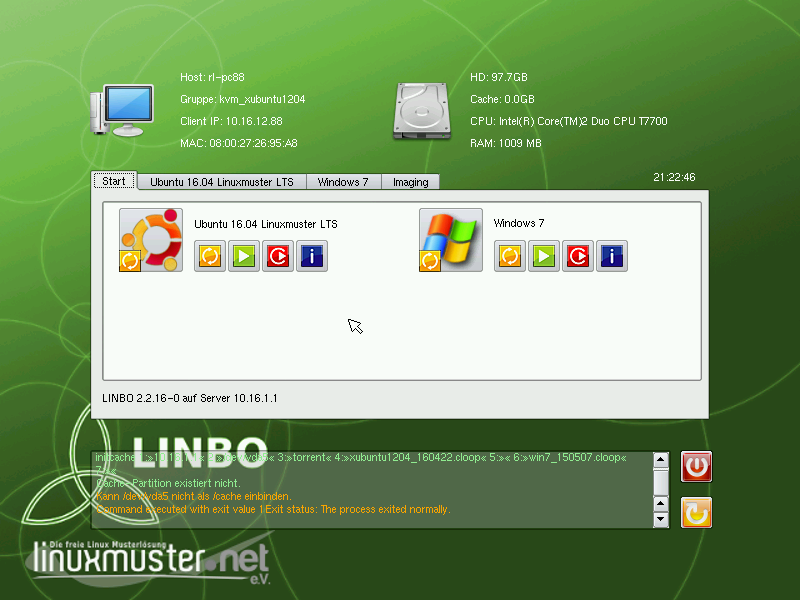

===========================
 Der LINBO Startbildschirm
===========================

Wird der Arbeitsplatzrechner (Client-PC) über das Netzwerk gebootet,
startet LINBO und zeigt folgenden Bildschirm, wenn der PC noch nicht aufgenommen / registriert wurde.

.. figure:: ./media/linbo_mainscreen_unregistered.png
   :alt: Linbo Startbildschirm eines nicht aufgenommenen Client

   Linbo Startbildschirm eines nicht aufgenommenen Clients

Sobald der Client registriert wurde, zeigt der Startbildschirm weitere Optionen an.

   Linbo Startbildschirm eines aufgenommenen Clients

Informationen
=============

Im oberen Teil in LINBO werden Informationen zum Client angezeigt.

Host
   Der festgelegte Hostname oder "pxeclient", wenn der Client nicht registriert ist

Gruppe
   Die festgelegte Hardwareklasse

IP, MAC
   Die festgelegten Netzwerkadressen oder "OFFLINE", wenn der Client ohne
   Netzwerkverbindung zum Server gestartet wurde.

HD, Cache, CPU, RAM
   Zeigt die entsprechend verbaute Hardware des Clients an.

Start-Reiter
============

Pro festgelegter Partition (mit Betriebssystem oder ohne) erscheinen
im Start-Reiter ein großer Knopf und vier kleinere Knöpfe.

   
