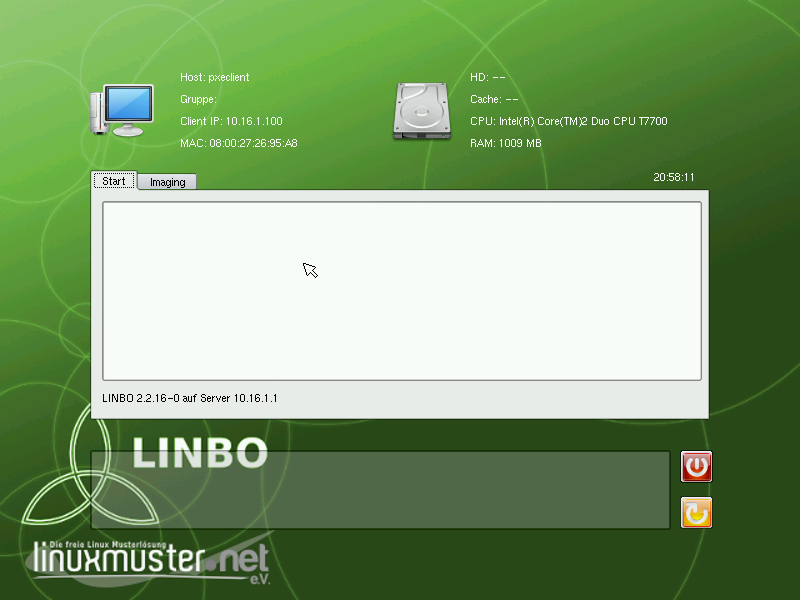
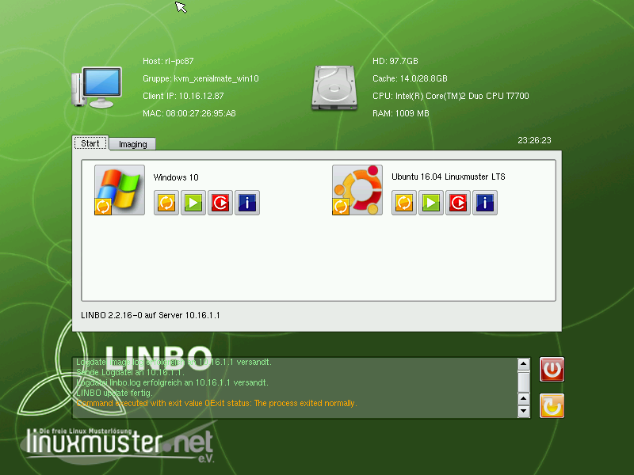

===========================
 Der LINBO Startbildschirm
===========================

Wird der Arbeitsplatzrechner (Client-PC) über das Netzwerk gebootet,
startet LINBO und zeigt folgenden Bildschirm, wenn der PC noch nicht aufgenommen / registriert wurde.

   Linbo Startbildschirm eines nicht aufgenommenen Clients

Sobald der Client registriert wurde, zeigt der Startbildschirm weitere Optionen an.

   Linbo Startbildschirm eines aufgenommenen Clients

Informationen
=============

Im oberen Teil in LINBO werden Informationen zum Client angezeigt.

Host
   Der festgelegte Hostname oder "pxeclient", wenn der Client nicht registriert ist

Gruppe
   Die festgelegte Hardwareklasse

IP, MAC
   Die festgelegten Netzwerkadressen oder "OFFLINE", wenn der Client ohne
   Netzwerkverbindung zum Server gestartet wurde.

HD, Cache, CPU, RAM
   Zeigt die entsprechend verbaute Hardware des Clients an:
   Festplattengröße, Partitionsgröße der Cache-Partition, Prozessor
   und Hauptspeicherinformationen

Neben der (vermutlich) aktuellen Uhrzeit auf dem Client werden im
unteren Teil Status- und Rückmeldungen der einzelnen Aktionen in einem
scrollbaren Texftfeld angezeigt, die bei einer Fehlersuche
Informationen liefern können.

Reboot
======

Das Icon

.. figure:: ./media/linbo_mainscreen/system-reboot-32x32.png

erzwingt einen Neustart und 

.. figure:: ./media/linbo_mainscreen/system-shutdown-32x32.png

lässt den Client herunterfahren.

Start-Reiter
============

Pro festgelegter Partition (mit Betriebssystem oder ohne) erscheinen
im Start-Reiter ein großer Knopf und vier kleinere Knöpfe mit
folgenden Bedeutungen

.. figure:: ./media/linbo_mainscreen/sync+start-22x22.png
   :align: left
	
   Sync+Start Knopf
	    
   synchronisiert das System mit dem letzten aktuellen Abbild.  Bei
   Windows-Systemen wird eine bereitgestellte Registry-Patch-Datei
   angewendet. Bei Linux-Systemen werden Hostname und Rootpartition
   gepatcht. Falls ein neueres Abbild auf dem Server liegt, wird dies
   zunächst heruntergeladen.

.. figure:: ./media/linbo_mainscreen/start-22x22.png

   Start Knopf

   startet das System im aktuellen Zustand, unsynchronisiert, keine
   Patches werden angewandt.
	    
.. figure:: ./media/linbo_mainscreen/new+start-22x22.png
   :align: left

   Neu+Start Knopf

   formatiert die relevante Parition neu, synchronisiert das System
   von Grund auf mit dem aktuellen Image und startet das System wie
   bei "Sync+Start".

.. figure:: ./media/linbo_mainscreen/information-22x22.png
   :align: left

   Information

   zeigt Informationen über das aktuell hinterlegte Abbild an.
   
.. figure:: ./media/linbo_mainscreen/ubuntu.png
   :align: left

   Standardknopf

   führt die Startmethode aus, die als solche definiert wurde.
