Installation und Konfiguration der Firewall
===========================================

Installation der Firewall
-------------------------

Booten Sie den für die Firewall vorgesehenen Server von der IPFire-CD. Bestätigen Sie durch Drücken der ``ENTER``-Taste, dass Sie den IPFire installieren möchten.

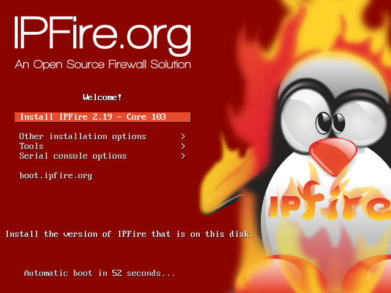

   Bestätigen Sie, dass Sie den IPFire installieren möchten.

Wählen Sie mit den Pfeiltasten die Sprache aus und bestätigen Sie ihre Auswahl mit der ``ENTER``-Taste.

.. figure:: media/firewall/020.png
   :width:  350px
   :align: center
   :alt: Schritt 2 der Installation der Firewall
   :figwidth: 350px

   Wählen Sie die gewünschte Sprache aus.

Bestätigen Sie durch Drücken der ``ENTER``-Taste, dass Sie den IPFire installieren möchten.

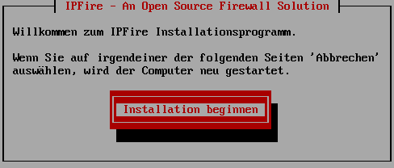

   Bestätigen Sie, dass Sie den IPFire installieren möchten

Akzeptieren Sie die Lizenz. Springen Sie dazu mit der ``TAB``-Taste auf das Bestätigungsfeld und drücken die  ``Leer``-Taste. Bestätigen Sie anschließend mit der  ``ENTER``-Taste.

.. figure:: media/firewall/040.png
   :width:  450px
   :align: center
   :alt: Schritt 4 der Installation der Firewall
   :figwidth: 450px

   Akzeptieren Sie die Lizenz

Bestätigen Sie durch Drücken der ``ENTER``-Taste, dass in den folgenden Schritten die Festplatte partitioniert und formatiert werden soll. Dabei gehen alle auf der Festplatte vorhandenen Daten verloren.

.. figure:: media/firewall/050.png
   :width:  350px
   :align: center
   :alt: Schritt 5 der Installation der Firewall
   :figwidth: 350px

   Bestätigen Sie die Partitionierung und Formatierung der Festplatte.

Wählen Sie durch Drücken der ``ENTER``-Taste **ext4** als Dateisystem.

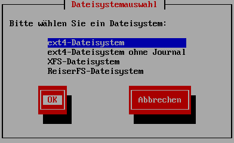

   Wählen Sie **ext4** als Dateisystem

Nach der Installation entfernen Sie die CD und bestätigen Sie den Reboot durch Drücken der ``ENTER``-Taste.

.. figure:: media/firewall/070.png
   :width:  350px
   :align: center
   :alt: Schritt 7 der Installation der Firewall
   :figwidth: 350px

   Entfernen Sie die CD und bestätigen Sie den Reboot.

Konfiguration der Firewall
--------------------------

Nach dem Reboot erfolgt die Erstkonfiguration des IPFire. Wählen Sie mit den ``Pfeil``-Tasten das Tastaturlayout und bestätigen Sie ihre Auswahl durch Drücken der ``ENTER``-Taste.

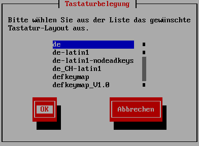

   Wählen Sie das Tastaturlayout.

Wählen Sie mit den ``Pfeil``-Tasten die Zeitzone aus und bestätigen Sie ihre Auswahl durch Drücken der ``ENTER``-Taste.

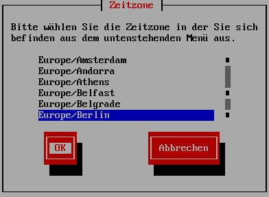

   Wählen Sie die Zeitzone aus.

Geben Sie als Hostname **ipfire** ein und bestätigen Sie durch Drücken der ``ENTER``-Taste.

.. figure:: media/firewall/100.png
   :width:  350px
   :align: center
   :alt: Schritt 3 der Erstkonfiguration der Firewall
   :figwidth: 350px

   Geben Sie als Hostname **ipfire** ein.

Geben Sie den Domänennamen ein und bestätigen Sie durch Drücken der ``ENTER``-Taste. Empfehlung: Verwenden Sie `linuxmuster-net.lokal`

  .. warning::
   Verwenden Sie **nicht** `local` als Teil des Domänennamens.

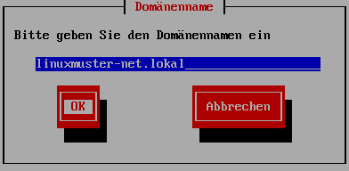

   Geben Sie den Domänennamen ein.

Geben Sie das Passwort für den Benutzer `root` ein und bestätigen Sie Ihre Eingabe mit der ``ENTER``-Taste. Mit diesem Benutzer melden Sie sich später an der Konsole des IPFire an.

  .. note::
   Sie sehen das Passwort bei der Eingabe nicht, auch nicht in Form der sonst üblichen Sterne.


.. figure:: media/firewall/120.png
   :width:  350px
   :align: center
   :alt: Schritt 5 der Erstkonfiguration der Firewall
   :figwidth: 350px

   Wählen Sie das Passwort für den Benutzer **root**.

Geben Sie das Passwort für den Benutzer `admin` ein und bestätigen Sie Ihre Eingabe mit der ``ENTER``-Taste. Mit diesem Benutzer melden Sie sich später am Webinterface des IPFire an.

.. figure:: media/firewall/130.png
   :width:  350px
   :align: center
   :alt: Schritt 6 der Erstkonfiguration der Firewall
   :figwidth: 350px

   Wählen Sie das Passwort für den Benutzer **admin**.

Wählen Sie den Punkt `Typ der Netzwerkkonfiguration` durch Drücken der ``ENTER``-Taste aus.

.. figure:: media/firewall/140.png
   :width:  350px
   :align: center
   :alt: Schritt 7 der Erstkonfiguration der Firewall
   :figwidth: 350px

   Wählen Sie den Punkt `Typ der Netzwerkkonfiguration`.

Wählen Sie den Punkt `GREEN + RED + BLUE` mit den ``Pfeil``-Tasten aus und bestätigen Sie Ihre Auswahl mit der ``ENTER``-Taste.

  .. note::
   - Im `grünen Netz` befinden sich später die Computer der Schule.
   - Über das `rote Netz` wird der IPFire über den Router mit dem Internet verbunden.
   - Das `blaue Netz` ist das Gästenetz, in diesem befinden sich später BYOD-Geräte oder per WLAN verbundene Geräte.

  .. warning::
   Wählen Sie die Konfiguration auch dann, wenn Sie nicht vorhaben, ein Gästenetz anzubieten. Die weitere Installation schlägt sonst fehl.

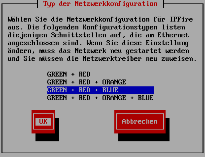

   Wählen Sie den Punkt `GREEN + RED + BLUE`.

Wählen Sie  den Punkt `Netzwerkkartenzuordnungen` mit den mit den ``Pfeil``-Tasten  aus und bestätigen Sie Ihre Auswahl mit der ``ENTER``-Taste.

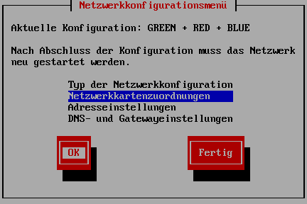

   Wählen Sie den Punkt `Netzwerkkartenzuordnungen`.

Im Folgenden ordnen Sie die einzelnen Netzwerkkarten anhand ihrer MAC-Adresse die Netze zu.

  .. note::
   Falls Sie nicht wissen, welche MAC-Adressen zu welcher Netzwerkkarten gehört, können Sie die Netzwerkkartenzuordnung an dieser Stelle beliebig vornehmen und später feststellen, welche Netzwerkkarte sich in welchem Netz befindet.

Wählen Sie den Punkt `GREEN` mit den mit den ``Pfeil``-Tasten  aus und bestätigen Sie ihre Auswahl mit der ``ENTER``-Taste.

.. figure:: media/firewall/170.png
   :width:  350px
   :align: center
   :alt: Schritt 10 der Erstkonfiguration der Firewall
   :figwidth: 350px

   Wählen Sie den Punkt `GREEN`.

Wählen Sie die Netzwerkkarte für das grüne Netzwerk mit den ``Pfeil``-Tasten  aus und bestätigen Sie Ihre Auswahl mit der ``ENTER``-Taste.

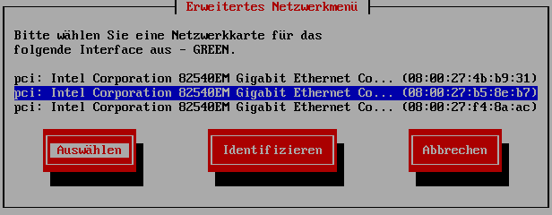

   Wählen Sie die Netzwerkkarte für das grüne Netzwerk.

Wählen Sie den Punkt `RED` mit den mit den ``Pfeil``-Tasten  aus und bestätigen Sie Ihre Auswahl mit der ``ENTER``-Taste.

.. figure:: media/firewall/190.png
   :width:  350px
   :align: center
   :alt: Schritt 12 der Erstkonfiguration der Firewall
   :figwidth: 350px

   Wählen Sie den Punkt `RED`.

Wählen Sie die Netzwerkkarte für das rote Netzwerk mit den ``Pfeil``-Tasten  aus und bestätigen Sie Ihre Auswahl mit der ``ENTER``-Taste.

.. figure:: media/firewall/200.png
   :width:  350px
   :align: center
   :alt: Schritt 13 der Erstkonfiguration der Firewall
   :figwidth: 350px

   Wählen Sie die Netzwerkkarte für das rote Netzwerk.

Wählen Sie den Punkt `BLUE` mit den mit den ``Pfeil``-Tasten  aus und bestätigen Sie Ihre Auswahl mit der ``ENTER``-Taste.

.. figure:: media/firewall/210.png
   :width:  350px
   :align: center
   :alt: Schritt 14 der Erstkonfiguration der Firewall
   :figwidth: 350px

   Wählen Sie den Punkt `BLUE`.

Wählen Sie die Netzwerkkarte für das blaue Netzwerk mit den ``Pfeil``-Tasten  aus und bestätigen Sie Ihre Auswahl mit der ``ENTER``-Taste.

.. figure:: media/firewall/220.png
   :width:  350px
   :align: center
   :alt: Schritt 15 der Erstkonfiguration der Firewall
   :figwidth: 350px

   Wählen Sie die Netzwerkkarte für das blaue Netzwerk.

Bestätigen Sie das Ende der Netzwerkkartenzuordnungen. Wählen mit mit den ``Pfeil``-Tasten den Punkt `FERTIG` aus und bestätigen Sie Ihre Auswahl mit der ``ENTER``-Taste.

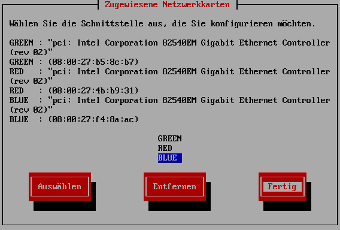

   Bestätigen Sie das Ende der Netzwerkkartenzuordnungen.

Wählen Sie  den Punkt `Adresseinstellungen` mit den mit den ``Pfeil``-Tasten  aus und bestätigen Sie Ihre Auswahl mit der ``ENTER``-Taste.

.. figure:: media/firewall/240.png
   :width:  350px
   :align: center
   :alt: Schritt 17 der Erstkonfiguration der Firewall
   :figwidth: 350px

   Wählen Sie den Punkt `Adresseinstellungen`.

Wählen Sie  den Punkt `GREEN` mit den mit den ``Pfeil``-Tasten  aus und bestätigen Sie Ihre Auswahl mit der ``ENTER``-Taste.

.. figure:: media/firewall/250.png
   :width:  350px
   :align: center
   :alt: Schritt 18 der Erstkonfiguration der Firewall
   :figwidth: 350px

   Wählen Sie den Punkt `GREEN`.

Bestätigen Sie den Sicherheitshinweis durch Drücken der ``ENTER``-Taste.

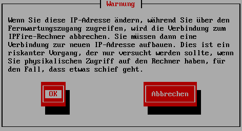

   Bestätigen Sie den Sicherheitshinweis.

Geben Sie als IP-Adresse `10.16.1.254` und als Netzmaske `255.240.0.0` ein und bestätigen Sie Ihre Auswahl mit der ``ENTER``-Taste.

.. note::
  Wenn Sie einen anderen Adressbereich gewählt haben, müssen Sie diese Eingabe anpassen.

.. figure:: media/firewall/270.png
   :width:  350px
   :align: center
   :alt: Schritt 19 der Erstkonfiguration der Firewall
   :figwidth: 350px

   Geben Sie als IP-Adresse `10.16.1.254` und als Netzmaske `255.240.0.0` ein.

Wählen Sie  den Punkt `BLUE` mit den mit den ``Pfeil``-Tasten  aus und bestätigen Sie Ihre Auswahl mit der ``ENTER``-Taste.

.. figure:: media/firewall/280.png
   :width:  350px
   :align: center
   :alt: Schritt 18 der Erstkonfiguration der Firewall
   :figwidth: 350px

   Wählen Sie den Punkt `BLUE`.

Geben Sie als IP-Adresse `172.16.16.254` und als Netzmaske `255.255.255.0` ein und bestätigen Sie Ihre Auswahl mit der ``ENTER``-Taste.

.. note::
  Wenn Sie einen anderen Adressbereich gewählt haben, müssen Sie diese Eingabe anpassen.

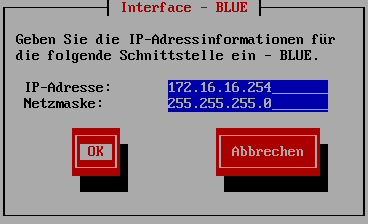

   Geben Sie als IP-Adresse `172.16.16.254` und als Netzmaske `255.255.255.0` ein.

Wählen Sie den Punkt `RED` mit den mit den ``Pfeil``-Tasten  aus und bestätigen Sie Ihre Auswahl mit der ``ENTER``-Taste.

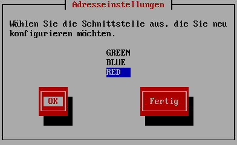

   Wählen Sie den Punkt `RED`.

Wählen Sie entsprechend Ihrer Internetverbindung die passende Option mit den ``Pfeil``-Tasten  aus und bestätigen Sie Ihre Auswahl mit der ``ENTER``-Taste.

  .. note::
   Schulen in Baden-Württemberg sind oft mit einem Router von BelWü ausgestattet und besitzen damit eine statische IP. In diesem Fall wählen Sie `Statisch` aus.

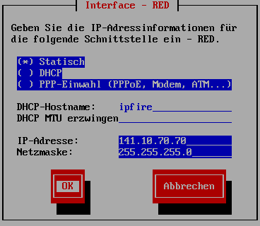

.. |STAT2| image:: media/firewall/340.png
   :width:  290px
   :align: middle
   :alt: Schritt 22a der Erstkonfiguration der Firewall

.. |STAT3| image:: media/firewall/350.png
   :width:  290px
   :align: middle
   :alt: Schritt 23a der Erstkonfiguration der Firewall

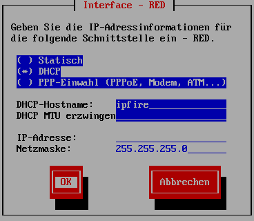

.. |DHCP2| image:: media/firewall/330.png
   :width:  290px
   :align: middle
   :alt: Schritt 22b der Erstkonfiguration der Firewall

Statisch
````````

Falls Sie `Statisch` gewählt haben, geben Sie die Daten, die Sie von Ihrem Provider (z.B. Belwü der ``ENTER``Tasten erhalten haben, ein und bestätigen Sie mit der ``ENTER``-Taste.

|STAT1|

Falls Sie im letzten Schritt `Statisch` gewählt haben, navigieren Sie mit ``Pfeil``-Tasten auf `DNS- und Gatewayeinstellungen` und bestätigen Sie mit der ``ENTER`` -Taste.

|STAT2|

Geben Sie nun Ihren `primären` und `sekundären` DNS sowie das Standard-Gateway ein und bestätigen Sie Ihre Eingabe mit der ``ENTER``-Taste.

|STAT3|

Navigieren Sie mit ``Pfeil``-Tasten auf `Fertig` und bestätigen Sie Ihre Auswahl mit der ``ENTER``-Taste.

|DHCP2|

DHCP
````

Falls Sie `DHCP` gewählt bestätigen Sie mit der ``ENTER``-Taste.

|DHCP1|

Falls Sie im letzten Schritt `DHCP` gewählt haben, navigieren Sie mit ``Pfeil``-Tasten auf `Fertig` und bestätigen Sie Ihre Auswahl mit der ``ENTER`` -Taste.

|DHCP2|

Abschluss der Konfiguration
```````````````````````````

Aktivieren Sie **nicht** den DHCP-Dienst für das grüne Netzwerk, diese Funktionalität übernimmt der der linuxmuster.net-Server selbst. Navigieren Sie mit den ``Pfeil``-Tasten auf die Schaltfläche `OK` und bestätigen Sie Ihre Auswahl mit der ``ENTER``-Taste.

.. figure:: media/firewall/360.png
   :width:  350px
   :align: center
   :alt: Schritt 24 der Erstkonfiguration der Firewall
   :figwidth: 350px

   Aktivieren Sie **nicht** den DHCP-Dienst.

Bestätigen Sie das Ende des Setups mit der `ENTER`-Taste.

.. figure:: media/firewall/370.png
   :width:  350px
   :align: center
   :alt: Schritt 25 der Erstkonfiguration der Firewall
   :figwidth: 350px

   Bestätigen Sie das Ende des Setups.


Zuordnen der Netze zu den Netzwerkkarten
-----------------------------------------
Falls Sie während des Setup nicht sicher waren, welche Netzwerkkarte sich in welchem Netz befindet erfolgt nun die Zuordnung. Anderenfalls fahren Sie bitte mit dem :ref:`ssh-config-label` fort.

Zuordnen der Netzwerkkarte zum grünen Netz
``````````````````````````````````````````
Verbinden Sie eine der drei Netzwerkkarten mit einem Switch. Im Folgenden wird geprüft, ob diese Netzwetzwerkkarte dem grünen Netz zugeordnet ist. Verbinden Sie als nächstes einen Computer Ihrer Wahl mit diesem Switch und geben Sie dem Computer eine feste IP. Sie benötigen dazu folgende Daten:

.. note::
  Wenn Sie einen anderen Adressbereich gewählt haben, müssen Sie diese Eingabe anpassen.

* IP: `10.16.1.2`
* Netzmaske: `255.240.0.0`
* Gateway: `10.16.1.254`

.. note::
     An diesen Switch dürfen während des Testens keine weiteren Geräte angeschlossen sein.

Pingen Sie nun auf die IP `10.16.1.254`. Erhalten Sie eine Antwort befindet sich diese Netzwerkkarte im grünen Netz. Fahren Sie in diesem Fall mit der :ref:`red-network` fort.

Erhalten Sie keine Antwort, ziehen Sie das Kabel aus der 1. Netzwerkkarte des IPFires ab und stecken Sie es in die zweite.
Pingen Sie erneut auf die IP `10.16.1.254`. Erhalten Sie eine Antwort befindet sich diese Netzwerkkarte im grünen Netz. Fahren Sie in diesem Fall mit :ref:`red-network` fort.

Erhalten Sie keine Antwort, ziehen Sie das Kabel aus der 2. Netzwerkkarte ab und stecken Sie es in die dritte.
Testen Sie dies sicherheitshalber, indem Sie erneut auf die IP `10.16.1.254` pingen. Sie erhalten nun eine Antwort.

.. _red-network:

Zuordnen der Netzwerkkarte zum roten Netz
`````````````````````````````````````````
Melden Sie sich mit dem Benutzer `root` und dem von Ihnen gewählten Passwort an der Konsole des IPFire an.

.. code-block:: console

  ipfire login: root
  Password:

.. note::
   Sie sehen das Passwort bei der Eingabe nicht, auch nicht in Form der sonst üblichen Sterne.

Verbinden Sie nun eine der beiden noch nicht angeschlossenen Netzwerkkarten mit Ihrem Router. Starten Sie danach das Netzwerk neu.

.. code-block:: console

  [root@ipfire ~]:# /etc/init.d/network restart

Bringen Sie danach die Paketlisten auf den neuesten Stand, um die Verbindung zum Internet zur Prüfen.

.. code-block:: console

  [root@ipfire ~]:# pakfire update

Wird der Befehl ohne Rückmeldung ausgeführt, befindet sich die Netzwerkkarte im roten Netz (und somit die dritte noch nicht verkabelte im blauen Netz, die belassen sie auch vorerst so). Fahren Sie mit dem :ref:`ssh-config-label` fort.
Gibt der Befehl

.. code-block:: console

  [root@ipfire ~]:# pakfire update
  PAKFIRE ERROR: You need to be online to run pakfire!

zurück befindet sich die Netzwerkkarte im blauen Netz.
Verbinden Sie in diesem Fall die verbleibende dritte Netzwerkkarte mit Ihrem Router und führen danach den Befehl

.. code-block:: console

  [root@ipfire ~]:# /etc/init.d/network restart

erneut aus. Die „blaue Netzwerkkarte“ bleibt vorerst unverkabelt.

.. _ssh-config-label:

Anpassen der SSH-Konfiguration
------------------------------
Damit der linuxmuster.net-Server bei der Installation auf den IPFire zugreifen kann, muss der SSH-Server aktiviert werden. Die ist auf zwei alternativen Wegen möglich: auf der :ref:`Konsole <ssh-config-console-label>` des IPFire oder im :ref:`Webinterface <ssh-config-webinterface-label>` des IPFire. Beide Wege sind gleichwertig.

.. _ssh-config-webinterface-label:

Konfiguration über das Webinterface
```````````````````````````````````
Öffnen Sie in dem an den Switch angeschlossenen Computer einen Browser und rufen die Adresse https://10.16.1.254:444 auf. Akzeptieren Sie den Sicherheitshinweis, in dem Sie zunächst auf ``Ich kenne das Risiko`` klicken.

.. note::
  Je nach Browser könne die folgenden Bilder variieren. Hier wurde der Firefox verwendet.

.. figure:: media/firewall/450.png
   :width:  350px
   :align: center
   :alt: Schritt 26 der Erstkonfiguration der Firewall
   :figwidth: 350px

   Rufen Sie die Adresse `https://10.16.1.254:444 <https://10.16.1.254:444>`_ auf und akzeptieren Sie den Sicherheitshinweis.

Klicken Sie auf ``Ausnahme hinzufügen``.

.. figure:: media/firewall/460.png
   :width:  350px
   :align: center
   :alt: Schritt 27 der Erstkonfiguration der Firewall
   :figwidth: 350px

   Klicken Sie auf ``Ausnahme hinzufügen``.

Klicken Sie auf ``Sicherheits-Ausnahme bestätigen``.

.. figure:: media/firewall/470.png
   :width:  350px
   :align: center
   :alt: Schritt 27 der Erstkonfiguration der Firewall
   :figwidth: 350px

   Klicken Sie auf ``Sicherheits-Ausnahme bestätigen``

Melden Sie sich mit dem Benutzer `admin` und dem von Ihnen gewählten Passwort an.

.. figure:: media/firewall/480.png
   :width:  350px
   :align: center
   :alt: Schritt 28 der Erstkonfiguration der Firewall
   :figwidth: 350px

   Geben Sie Ihre Anmeldedaten ein.

Klicken Sie unter ``System`` auf ``SSH-Zugriff``.

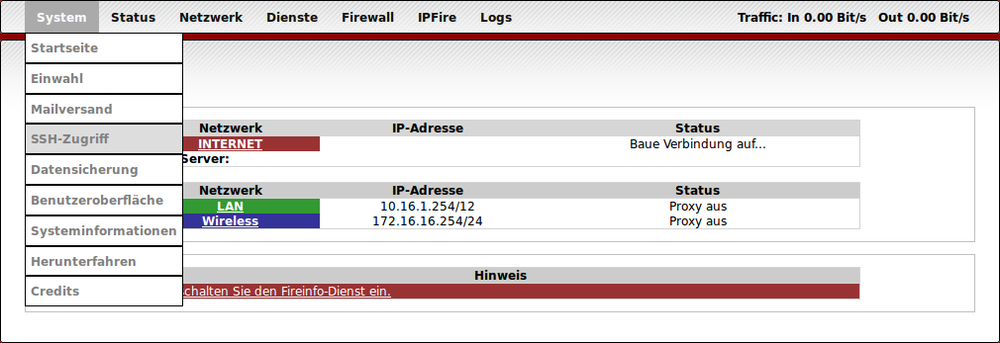

   Klicken Sie unter ``System`` auf ``SSH-Zugriff``.

Setzen Sie zusätzlich Haken bei

 - SSH-Zugriff
 - Authentifizierung auf Basis öffentlicher Schlüssel zulassen

und bestätigen Sie Ihre Auswahl durch Klicken auf die Schaltfläche ``Speichern``.

 .. figure:: media/firewall/500.png
   :width:  550px
   :align: center
   :alt: Schritt 30 der Erstkonfiguration der Firewall
   :figwidth: 550px

   Erlauben sie den SSH-Zugriff sowie die Authentifizierung auf Basis öffentlicher Schlüssel

.. note::
  Werden in der Weboberfläche des IPFire Aktualisierungen gemeldet, spielen Sie diese bitte **nicht** ein. Nutzen Sie stattdessen nach der Installation des linuxmuster.net-Servers den Befehl ``linuxmuster-ipfire --upgrade``. So ist sichergestellt, dass die Version des IPFires mit der Version des linuxmuster.net-Servers kompatibel sind. Siehe dazu auch :doc:`Aktualisierung der Firewall IPFire <../../howtos/keep-lmn-uptodate/2-update-ipfire/>`

Fahren Sie nun mit der :ref:`Konfiguration des Proxys <proxy-config-label>` fort.


..
   review t.kuechel


.. _ssh-config-console-label:

Konfiguration über die Konsole
```````````````````````````````
Melden Sie sich an der Konsole mit dem Benutzer ``root`` und dem von Ihnen vergebenen Passwort an.
Bearbeiten Sie die Datei ``/var/ipfire/remote/settings`` mit dem Editor ``vi``, sodass diese den folgenden Inhalt hat. Die letzte Zeile muss nicht angepasst werden.

.. code::

    ENABLE_SSH_KEYS=on
    ENABLE_SSH_PROTOCOLL1=off
    ENABLE_SSH_PASSWORDS=on
    ENABLE_SSH_PORTFW=off
    ENABLE_SSH=on
    __CGI__=CGI=HASH(0x840b7a0)


Außerdem legt man mit den Befehlen

.. code::

   [root@ipfire ~]:# touch /var/ipfire/remote/enablessh
   [root@ipfire ~]:# chown nobody:nobody /var/ipfire/remote/enablessh

die Datei ``enablessh`` an, damit der SSH-Dienst gestartet werden kann. Der Befehl

.. code::

   [root@ipfire ~]:# /etc/rc.d/init.d/sshd restart

startet den Dienst schließlich, was auf der Konsole mit einem [OK] quittiert wird.

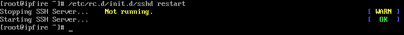

   Starten Sie den SSH-Dienst neu.

Fahren Sie nun mit der :ref:`Konfiguration des Proxys <proxy-config-label>` fort.

.. _proxy-config-label:

Proxy-Zugriff für den Server aktivieren
----------------------------------------
Der linuxmuster.net-Server darf uneingeschränkt auf das Internet zugreifen. Hierzu muss der Webproxy konfiguriert werden, es gibt wieder zwei gleichwertige Alternativen: :ref:`Webinterface <proxy-config-webinterface-label>` oder :ref:`Konsole <proxy-config-console-label>`.

.. _proxy-config-webinterface-label:

Konfiguration über das Webinterface
````````````````````````````````````
Öffnen Sie in dem an den Switch angeschlossenen Computer einen Browser und rufen die Adresse `https://10.16.1.254:444` auf. Akzeptieren Sie den Sicherheitshinweis, in dem Sie zunächst auf ``Ich kenne das Risiko`` klicken.

.. note::
  Je nach Browser könne die folgenden Bilder variieren. Hier wurde der Firefox verwendet.

.. figure:: media/firewall/450.png
   :width:  350px
   :align: center
   :alt: Schritt 26 der Erstkonfiguration der Firewall
   :figwidth: 350px

   Rufen Sie die Adresse `https://10.16.1.254:444` auf und akzeptieren Sie den Sicherheitshinweis.

Klicken Sie auf ``Ausnahme hinzufügen``.

.. figure:: media/firewall/460.png
   :width:  350px
   :align: center
   :alt: Schritt 27 der Erstkonfiguration der Firewall
   :figwidth: 350px

   Klicken Sie auf ``Ausnahme hinzufügen``.

Klicken Sie auf ``Sicherheits-Ausnahme bestätigen``.

.. figure:: media/firewall/470.png
   :width:  350px
   :align: center
   :alt: Schritt 27 der Erstkonfiguration der Firewall
   :figwidth: 350px

   Klicken Sie auf ``Sicherheits-Ausnahme bestätigen``

Melden Sie sich mit dem Benutzer `admin` und dem von Ihnen gewählten Passwort an.

.. figure:: media/firewall/480.png
   :width:  350px
   :align: center
   :alt: Schritt 28 der Erstkonfiguration der Firewall
   :figwidth: 350px

   Geben Sie Ihre Anmeldedaten ein.

Klicken Sie unter ``Netzwerk`` auf ``Web-Proxy``.

.. figure:: media/firewall/520.png
   :width:  350px
   :align: center
   :alt: Schritt 28 der Erstkonfiguration der Firewall
   :figwidth: 350px

   Klicken Sie unter ``Netzwerk`` auf ``Web-Proxy``.

Tragen Sie im Abschnitt Netzwerkbasierte Zugriffskontrolle im Eingabefeld unterhalb von ``Uneingeschränkte IP-Adressen (eine pro Zeile)``: die IP-Adresse des Servers also ``10.16.1.1`` ein. Betätigen Sie danach die Schaltfläche Speichern und Neustart auf der Seite unten.

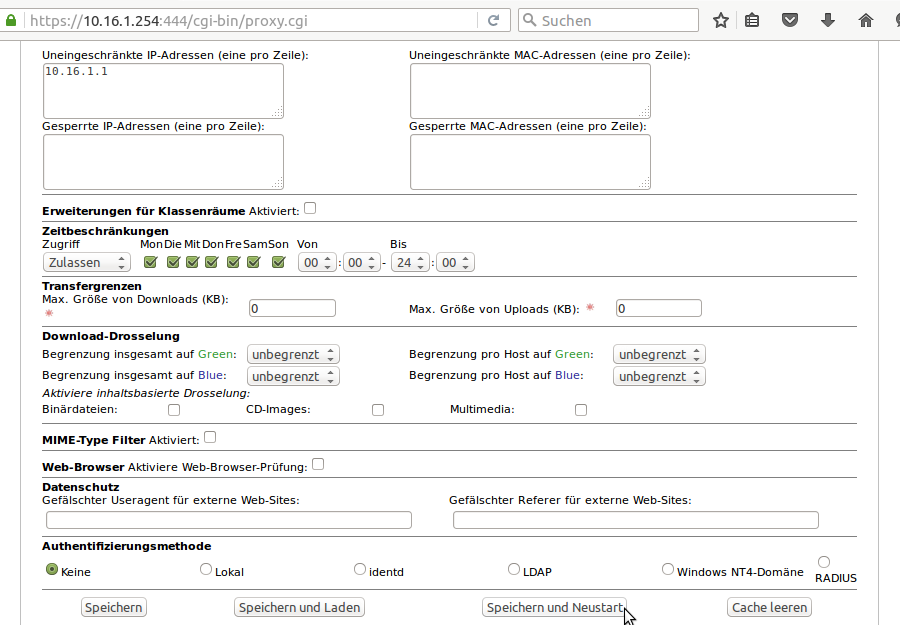

   Gestatten Sie dem Server uneingeschränkten Zugriff auf das Internet.

.. note::
  Werden in der Weboberfläche des IPFire Aktualisierungen gemeldet, spielen Sie diese bitte **nicht** ein. Nutzen Sie stattdessen nach der Installation des linuxmuster.net-Servers den Befehl ``linuxmuster-ipfire --upgrade``. So ist sichergestellt, dass die Version des IPFires mit der Version des linuxmuster.net-Server kompatibel sind. Siehe dazu auch :doc:`Aktualisierung der Firewall IPFire <../../howtos/keep-lmn-uptodate/2-update-ipfire/>`

Fahren Sie nun mit der :ref:`Installation des Servers <server-install-label>` fort.

.. _proxy-config-console-label:

Konfiguration über die Konsole
```````````````````````````````
Zunächst wird ein neuer Ordner ``acls`` angelegt und dessen recht angepasst.

.. code::

    [root@ipfire ~]:# mkdir /var/ipfire/proxy/advanced/acls
    [root@ipfire ~]:# chown nobody:nobody /var/ipfire/proxy/advanced/acls

In diesem Ordner wird die Datei ``src_unrestricted_ip.acl`` erzeugt und ihre Rechte angepasst.

.. code::

    [root@ipfire ~]:# touch /var/ipfire/proxy/advanced/acls/src_unrestricted_ip.acl
    [root@ipfire ~]:# chown nobody:nobody /var/ipfire/proxy/advanced/acls/src_unrestricted_ip.acl

In die erstellte Datei mit dem Editor ``vi`` die IP des Servers eingetragen.

.. note::
  Wenn Sie einen anderen Adressbereich gewählt haben, müssen Sie diese Eingabe anpassen.

.. code::

    10.16.1.1

Abschließend wird Webproxy-Dienst neu gestartet.

.. code::

    [root@ipfire ~]:# /etc/rc.d/init.d/squid restart

Bei Erfolg wieder keinerlei Ausgabe erzeugt.

.. note::
  Werden in der Weboberfläche des IPFire Aktualisierungen gemeldet, spielen Sie diese bitte **nicht** ein. Nutzen Sie stattdessen nach der Installation des linuxmuster.net-Servers den Befehl ``linuxmuster-ipfire --upgrade``. So ist sichergestellt, dass die Version des IPFires mit der Version des linuxmuster.net-Server kompatibel sind. Siehe dazu auch :doc:`Aktualisierung der Firewall IPFire <../../howtos/keep-lmn-uptodate/2-update-ipfire/>`

Fahren Sie nun mit der :ref:`Installation des Servers <server-install-label>` fort.