.. |br| raw:: html

   <br />
   
.. |br| raw:: latex

   \\

.. _server-install-label:   
   
Installation und Konfiguration des Servers
==========================================

Installation des Ubuntu-Servers
-------------------------------


Verbinden Sie die Netzwerkkarte des Servers mit dem Switch, an welchem die „grüne“ Netzwerkkarte des IPFire hängt. |br|

.. note::
   Lesen Sie unbedingt die Hinweise bzgl. den einsetzbaren Versionen.

Grundeinstellungen   
`````````````````` 
Booten Sie den für den linuxmuster.net vorgesehenen Server von der Ubuntu-Server-CD. Wählen Sie mit den Pfeiltasten die gewünschte Sprache aus und bestätigen Sie Ihre Auswahl mit der ``ENTER``-Taste.

.. figure:: media/server/010.png
   :width:  350px
   :align: center
   :alt: Schritt 1 der Installation des Ubuntu-Servers
   :figwidth: 350px

   Wählen Sie die gewünschte Sprache aus.
   
Bestätigen Sie durch Drücken der ``ENTER``-Taste, dass Sie Ubuntu installieren möchten. 

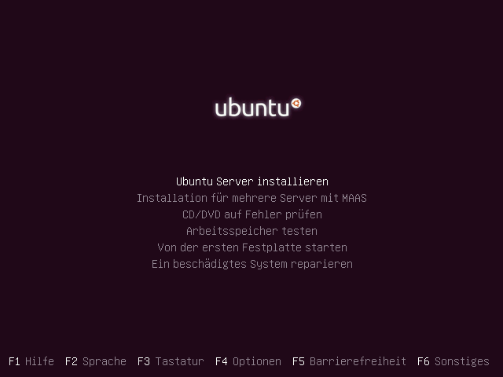

   Bestätigen Sie, dass Sie Ubuntu installieren möchten.

Bestätigen Sie durch Drücken der ``ENTER``-Taste den Hinweis, dass das gewählte Sprachpaket möglicherweise nicht vollständig sei. 

.. figure:: media/server/030.png
   :width:  350px
   :align: center
   :alt: Schritt 3 der Installation des Ubuntu-Servers
   :figwidth: 350px

   Bestätigen Sie den Hinweis, dass gewählte Sprachpaket möglicherweise nicht vollständig ist.

Wählen Sie mit den Pfeiltasten den Standort aus und bestätigen Sie Ihre Auswahl durch Drücken der ``ENTER``-Taste.

.. figure:: media/server/040.png
   :width:  350px
   :align: center
   :alt: Schritt 4 der Installation des Ubuntu-Servers
   :figwidth: 350px

   Geben Sie den Standort an.

Verneinen Sie die automatische Tastaturmodellerkennung.    
 
.. figure:: media/server/050.png
   :width:  350px
   :align: center
   :alt: Schritt 5 der Installation des Ubuntu-Servers
   :figwidth: 350px

   Verneinen Sie die automatische Tastaturmodellerkennung.

Wählen Sie das Herkunftsland der Tastatur.   

.. figure:: media/server/060.png
   :width:  350px
   :align: center
   :alt: Schritt 6 der Installation des Ubuntu-Servers
   :figwidth: 350px

   Wählen Sie das Herkunftsland der Tastatur.
   
Wählen Sie das die Tastaturbelegung.  

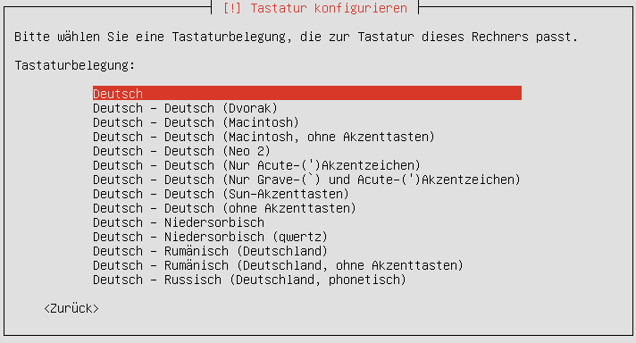

   Wählen Sie das die Tastaturbelegung.

Einrichten des Netzwerks   
````````````````````````    
   
Der automatische Bezug einer IP-Adresse schlägt zunächst fehl, da kein DHCP-Server vorhanden ist.

.. figure:: media/server/080.png
   :width:  350px
   :align: center
   :alt: Schritt 8 der Installation des Ubuntu-Servers
   :figwidth: 350px

   Der automatische Bezug einer IP-Adresse schlägt zunächst fehl.

Das Netzwerk richten Sie manuell ein.

.. figure:: media/server/090.png
   :width:  350px
   :align: center
   :alt: Schritt 9 der Installation des Ubuntu-Servers
   :figwidth: 350px

   Das Netzwerk richten Sie manuell ein.
   
Geben Sie als IP-Adresse `10.16.1.1` ein.

.. note::
  Wenn Sie einen anderen Adressbereich gewählt haben, müssen Sie die folgende Eingabe anpassen.
  
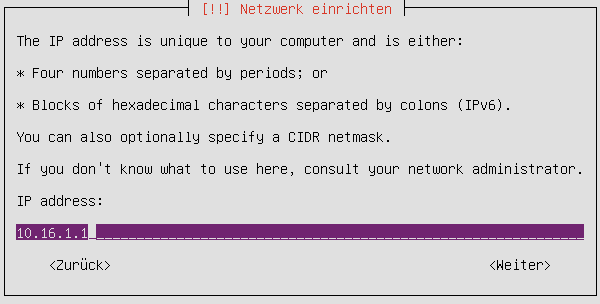

   Geben Sie als IP-Adresse `10.16.1.1` ein.

Geben Sie als Netzmaske `255.240.0.0` ein.

.. figure:: media/server/110.png
   :width:  350px
   :align: center
   :alt: Schritt 11 der Installation des Ubuntu-Servers: Eingabe der Netzmaske
   :figwidth: 350px

   Geben Sie als Netzmaske ``255.240.0.0`` ein.   

Geben Sie als Gateway ``10.16.1.254`` ein.

.. note::
  Wenn Sie einen anderen Adressbereich gewählt haben, müssen Sie die folgende Eingabe anpassen.

.. figure:: media/server/120.png
   :width:  350px
   :align: center
   :alt: Schritt 12 der Installation des Ubuntu-Servers: Eingabe des Gateways
   :figwidth: 350px

   Geben Sie als Gateway ``10.16.1.254`` ein.   
   
Geben Sie als DNS-Server ``10.16.1.254`` ein.

.. note::
  Wenn Sie einen anderen Adressbereich gewählt haben, müssen Sie die folgende Eingabe anpassen.

.. figure:: media/server/130.png
   :width:  350px
   :align: center
   :alt:  Eingabe des DNS-Servers
   :figwidth: 350px

   Geben Sie als DNS-Server ``10.16.1.254`` ein.    
   
Geben Sie den gewünschten Namen des Servers ein.

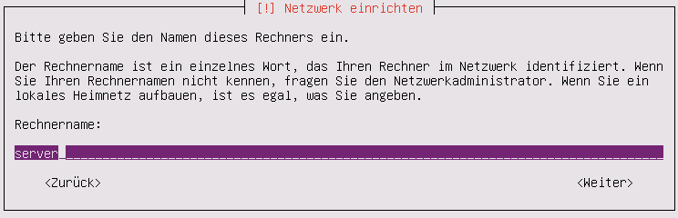

   Geben Sie den gewünschten Namen des Servers ein.    
   
Geben Sie lokale Domäne ein, die Sie bereits bei der Konfiguration des IPFires gewählt haben.

.. figure:: media/server/150.png
   :width:  350px
   :align: center
   :alt: Eingabe der lokalen Domäne
   :figwidth: 350px

   Geben Sie lokale Domäne ein.   

Einrichten des administrativen Benutzers   
````````````````````````````````````````
   
Geben Sie den gewünschten Benutzernamen ein. 

.. note::
  Es gibt vom System reservierte Namen, die nicht verwendet werden können, darunter auch ``admin``.

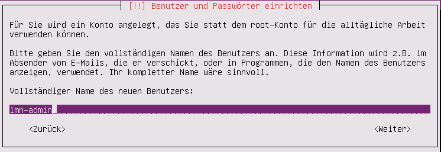

   Geben Sie den gewünschten Benutzernamen ein.     
   
Geben Sie den gewünschten Kontonamen zum Benutzernamen ein. 

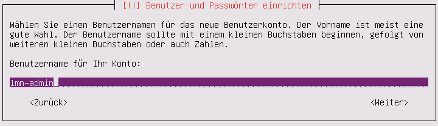

   Geben Sie den gewünschten Kontonamen zum Benutzernamen ein.      

Geben Sie das gewünschte Passwort ein. 

.. note::
  Falls Sie an dieser Stelle darauf hingewiesen werden, dass Ihr eingegebenes Passwort schwach sei vergeben Sie bitte ein stärkeres. Die Sicherheit des Systems hängt von der Qualität des Passwortes ab!

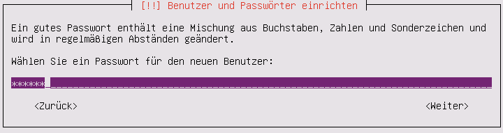

   Geben Sie das gewünschte Passwort ein. 
   
Geben Sie das Passwort nochmals ein.

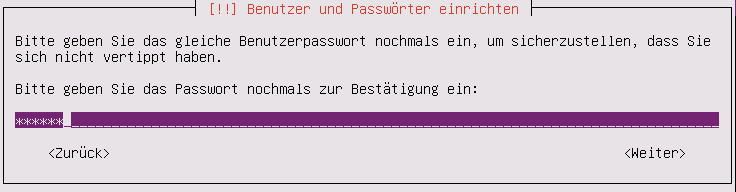

   Geben Sie das Passwort nochmals ein. 
   
Verschlüsseln Sie ihren persönlichen Ordner **nicht**.

.. figure:: media/server/210.png
   :width:  350px
   :align: center
   :alt: Verneinen der Verschlüsselung des persönlichen Ordners.
   :figwidth: 350px

   Verschlüsseln Sie ihren persönlichen Ordner **nicht**.   
   
Bestätigen bzw. ggf. korrigieren Sie die Zeitzone.

.. figure:: media/server/220.png
   :width:  350px
   :align: center
   :alt: Bestätigen der Zeitzone.
   :figwidth: 350px

   Bestätigen bzw. ggf. korrigieren Sie die Zeitzone.
   
Partitionierung
```````````````
   
Partitionieren Sie nach Ihren Bedürfnissen. Hier gibt es nur eine linuxmuster.net spezifischen Vorgabe: 

.. note::
    Es muss nur darauf geachtet werden, dass die Dateisysteme unter /home und /var mit den Quotaoptionen ``usrquota`` und ``grpquota`` versehen werden. 

Im folgenden wird beispielhaft gezeigt wie auf einer einzigen Festplatte drei Partitionen (root-, home- und var-Partition) angelegt werden.

In der Regel sind einem einem Server mehrere Festplatten verbaut. Bitte lesen Sie den im Anhang den Abschnitt zum Thema „Partitionierung im Expertenmodus“ um zu erfahren, wie ein solches System - auch unter optionaler Benutzung des lvm und von Software-RAIDs- partitioniert wird.

An dieser Stelle wird auf eine Swap-Partition verzichtet. 

Partitionieren Sie manuell.

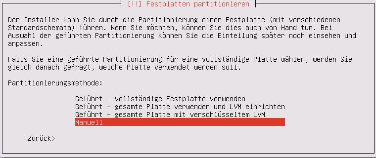

   Partitionieren Sie manuell.

Wählen Sie die zu partitionierende Festplatte aus.

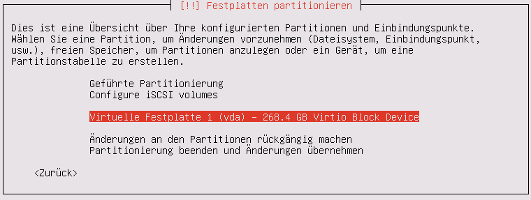

   Wählen Sie die zu partitionierende Festplatte aus.   

Bestätigen Sie das Erstellen der Partitionstabelle.

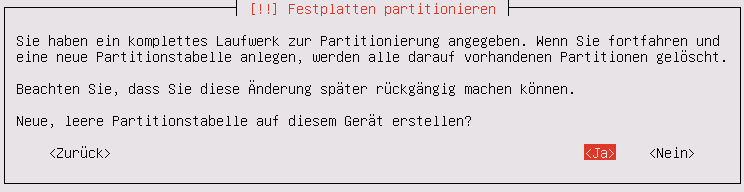

   Bestätigen Sie das Erstellen der Partitionstabelle.   
 
Wählen Sie den freien Speicher zum Anlegen der ersten Partition.

.. figure:: media/server/270.png
   :width:  350px
   :align: center
   :alt: Auswahl des freien Speichere zum Anlegen der ersten Partition.
   :figwidth: 350px

   Wählen Sie den freien Speicher zum Anlegen der ersten Partition.  

Bestätigen Sie das Anlegen der ersten Partition.

.. figure:: media/server/280.png
   :width:  350px
   :align: center
   :alt: Bestätigung des Anlegens der ersten Partition.
   :figwidth: 350px

   Bestätigen Sie das Anlegen der ersten Partition.  

Wählen Sie die Größe der Partition.

.. note::
  Die Größen der Partitionen auf den folgenden Screenshots stammen von einen Testsystem, an welches andere Anforderungen gestellt werden als ein Produktivsystem. Lesen Sie im Anhang den Abschnitt „Hinweise zur Größe von Partitionen“ um eine Gefühl für die notwendigen Größe der Partitionen zu erhalten.

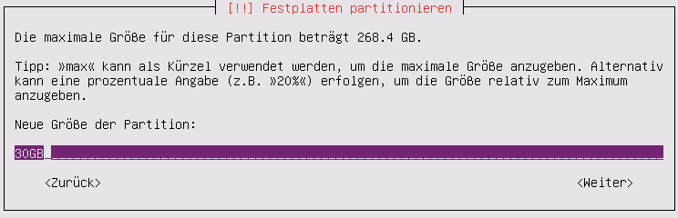

   Wählen Sie die Größe der Partition.   
 
Wählen Sie als Typ der Partition ``primär``. 
 
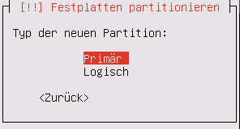

   Wählen Sie als Typ der Partition ``primär``.
   
Bestätigen Sie, dass die neue Partition am Anfang des freien Speichers angelegt werden soll.
  
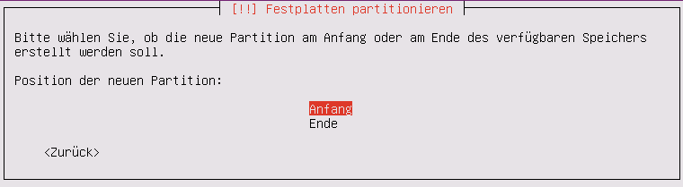

   Bestätigen Sie, dass die neue Partition am Anfang des freien Speichers angelegt werden soll.

Abschließend bestätigen Sie das Anlegen der Partition. Als Einbindungspunkt wurde automatisch die Wurzel ``/`` gewählt.
  
.. figure:: media/server/320.png
   :width:  350px
   :align: center
   :alt: Bestätigung des Anlegens der Partition.
   :figwidth: 350px

   Abschließend bestätigen Sie das Anlegen der Partition.

Nun folgt das Anlegen der zweiten Partition, auf welcher die HOME-Verzeichnisse der Nutzer liegen werden.    
Wählen Sie den freien Speicher zum Anlegen der zweiten Partition.

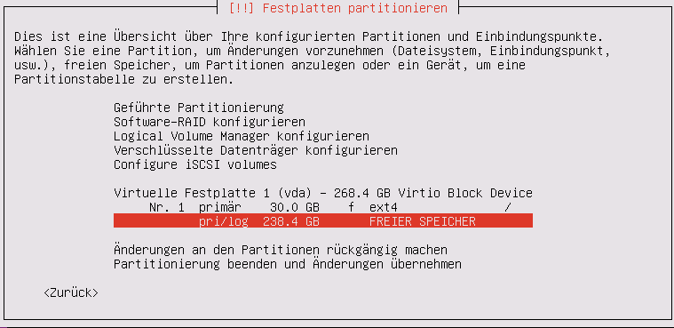

   Wählen Sie den freien Speicher zum Anlegen der zweiten Partition.  

Bestätigen Sie das Anlegen der zweiten Partition.

.. figure:: media/server/340.png
   :width:  350px
   :align: center
   :alt: Bestätigung des Anlegens der zweiten Partition.
   :figwidth: 350px

   Bestätigen Sie das Anlegen der zweiten Partition.  

Wählen Sie die Größe der Partition.

.. figure:: media/server/350.png
   :width:  350px
   :align: center
   :alt: Auswahl der Größe der Partition.
   :figwidth: 350px

   Wählen Sie die Größe der Partition.   
 
Wählen Sie als Typ der Partition ``primär``. 
 
.. figure:: media/server/360.png
   :width:  350px
   :align: center
   :alt: Wahl des Typs der Partition.
   :figwidth: 350px

   Wählen Sie als Typ der Partition ``primär``.
   
Bestätigen Sie, dass die neue Partition am Anfang des freien Speichers angelegt werden soll.
  
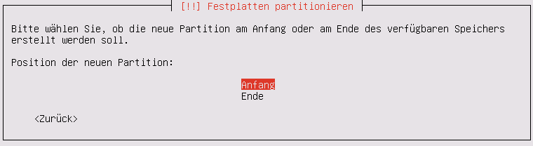

   Bestätigen Sie, dass die neue Partition am Anfang des freien Speichers angelegt werden soll.

Als Einbindungspunkt wurde automatisch ``/home`` gewählt. Jetzt müssen die Einbindungsoptionen angepasst werden. 
  
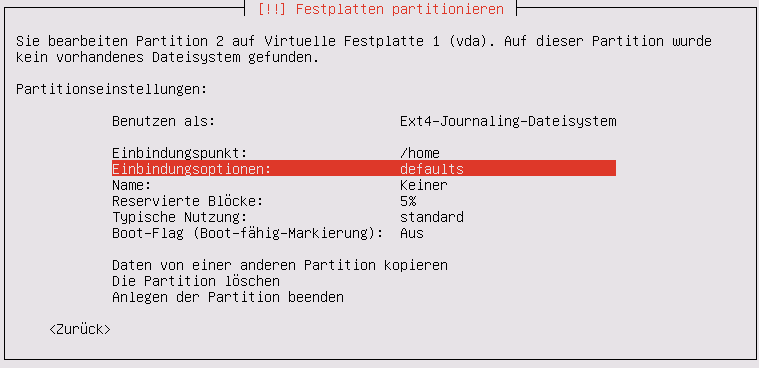

   Wählen die den Punkt Einbindungsoptionen.

Mit der ``Leertaste`` werden nun die Einbindungsoptionen ``usrquota`` und ``grpquota``
  
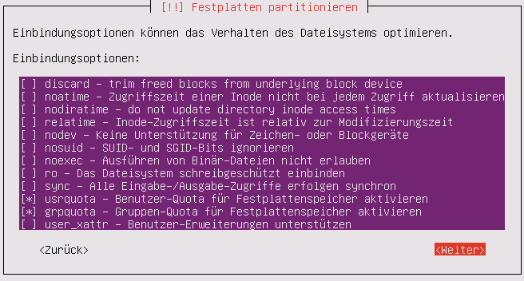

   Wählen die den Punkt Einbindungsoptionen ``usrquota`` und ``grpquota``.

Abschließend bestätigen Sie das Anlegen der Partition. 
  
.. figure:: media/server/400.png
   :width:  350px
   :align: center
   :alt: Bestätigung des Anlegens der Partition.
   :figwidth: 350px

   Abschließend bestätigen Sie das Anlegen der Partition.


Nun folgt das Anlegen der dritten Partition, auf welcher die Images der Clienten liegen werden.    
Wählen Sie den freien Speicher zum Anlegen der dritten Partition.

.. figure:: media/server/410.png
   :width:  350px
   :align: center
   :alt: Auswahl des freien Speichere zum Anlegen der dritten Partition.
   :figwidth: 350px

   Wählen Sie den freien Speicher zum Anlegen der dritten Partition.  

Bestätigen Sie das Anlegen der dritten Partition.

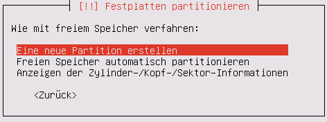

   Bestätigen Sie das Anlegen der dritten Partition.  

Wählen Sie die Größe der Partition.

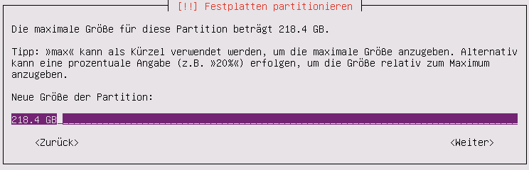

   Wählen Sie die Größe der Partition.   
 
Wählen Sie als Typ der Partition ``primär``. 
 
.. figure:: media/server/440.png
   :width:  350px
   :align: center
   :alt: Wahl des Typs der Partition.
   :figwidth: 350px

   Wählen Sie als Typ der Partition ``primär``.
     
     
Als Einbindungspunkt muss manuell ``/var`` gewählt. 
  
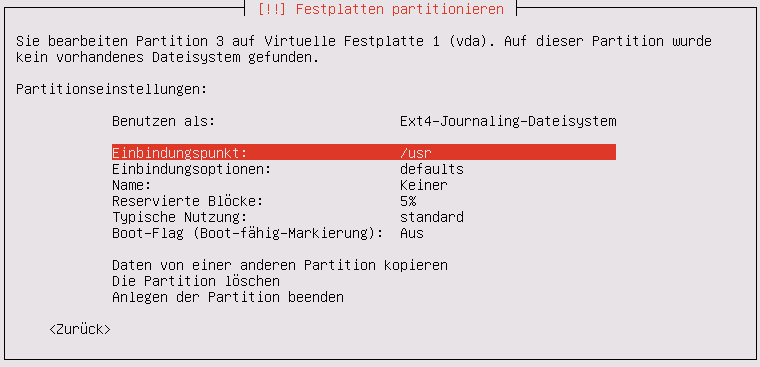

   Wählen Sie den Einbindungspunkt.

Mit der ``Leertaste`` wird ``/var`` als  Einbindungsort gewählt.
  
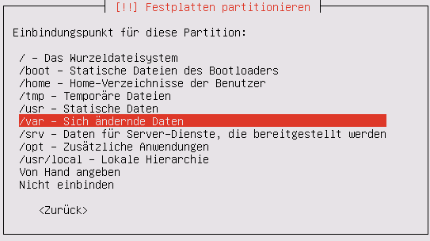

   Mit der ``Leertaste`` wird ``/var`` als  Einbindungsort gewählt.
 
Nun werden die Einbindungsoptionen gewählt.
  
.. figure:: media/server/470.png
   :width:  350px
   :align: center
   :alt: Wahl der Einbindungsoptionen.
   :figwidth: 350px

   Wählen die den Punkt Einbindungsoptionen. 
 
Mit der ``Leertaste`` werden nun die Einbindungsoptionen ``usrquota`` und ``grpquota`` gewählt.
  
.. figure:: media/server/480.png
   :width:  350px
   :align: center
   :alt: Wahl der Einbindungsoptionen.
   :figwidth: 350px

   Wählen die den Punkt Einbindungsoptionen ``usrquota`` und ``grpquota``.

   
Abschließend bestätigen Sie das Anlegen der Partition. 
  
.. figure:: media/server/500.png
   :width:  350px
   :align: center
   :alt: Bestätigung des Anlegens der Partition.
   :figwidth: 350px

   Abschließend bestätigen Sie das Anlegen der Partition.
   
Das System weist darauf hin, dass kein SWAP-Speicher angelegt wurde. Verneinen Sie die Frage, ob dies nachgeholt werden soll.  

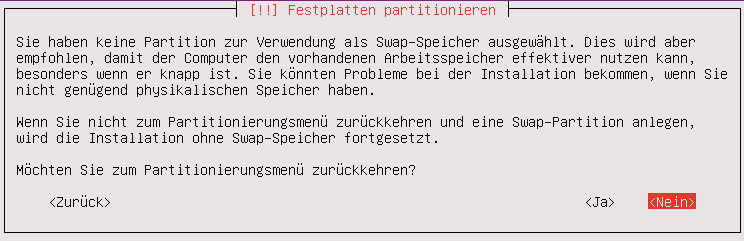

   Verneinen Sie die Frage, ob doch noch eine SWAP-Partion angelegt werden.

Bestätigen Sie, dass die vorbereiteten Änderungen der Partition tatsächlich auf die Festplatte geschrieben werden.

.. figure:: media/server/520.png
   :width:  350px
   :align: center
   :alt: Bestätigen Sie das Schreiben der Änderungen der Partitionen.
   :figwidth: 350px

   Bestätigen Sie das Schreiben der Änderungen der Partitionen.

Der Server ist nicht über einen Proxy angebunden, fahren Sie mit „Weiter“ fort.   

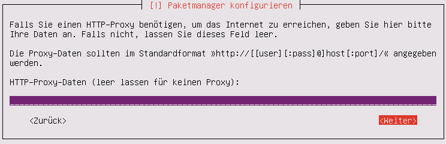

   Der Server ist nicht über einen Proxy angebunden, fahren Sie mit „Weiter“ fort.

Es wird ausdrücklich davon abgeraten, Updates automatisch einzuspielen. Sie als Administrator sollten stets wissen, wann sich etwas im System ändert, um z.B. zuvor eine Sicherung zu erstellen.

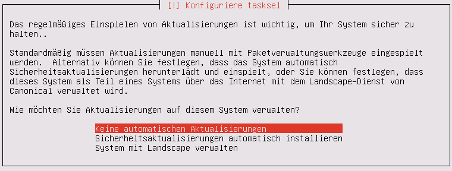

   Wählen Sie „keine automatischen Updates“ aus.

.. note::
   Das bedeutet keineswegs, dass Sie das System nicht updaten sollen, nur eben nicht automatisch. Bitte lesen Sie dazu :doc:`Linuxmuster.net aktuell halten <../../howtos/keep-lmn-uptodate/index/>` 
     
Wählen Sie keine Software zum Installieren aus. Alle benötigten Pakete werden später durch ein Skript installiert, u.a. auch ein ``OpenSSH server``.

.. figure:: media/server/550.png
   :width:  350px
   :align: center
   :alt: Kein Software auswählen.
   :figwidth: 350px

   Wählen Sie keine Software aus, fahren Sie mit „Weiter“ fort.

Bestätigen Sie, dass der Bootloader in den Master Boot Record installiert werden soll.  

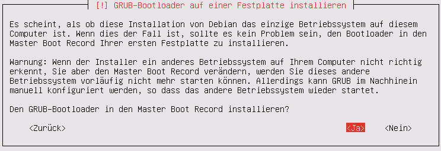

   Bestätigen Sie, dass der Bootloader in den Master Boot Record installiert werden soll.
   
Zum Abschluss der Installation wird das System neu gestartet.

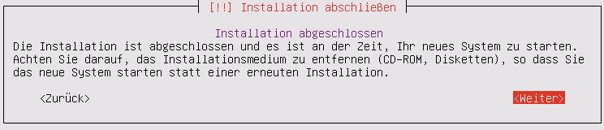

   Zum Abschluss der Installation wird das System neu gestartet.

Nach dem Neustart
`````````````````
Melden Sie sie nach dem Neustart mit Ihrem bei der Installation gewählten Nutzer und Passwort an.

.. code-block:: console
    
    linuxmuster.net 6.2.0 / Codename Babo
    server login:lmn-admin
    Passwort:

Nach dem Login werden sie möglicherweise darauf hingewiesen, dass ein „neues Release 14.04.4 LTS“ zur Verfügung stehe. Führen Sie den Vorschlag „do-release-upgrade“ **keinesfalls** durch. 
Alle andere Updates sollten wie im Folgenden gezeigt eingespielt werden. Zunächst verleihen Sie sich dauerhaft ``root``-Rechte
   
.. code-block:: console

    lmn-admin@server:~$ sudo -i
    Password:
    server ~ #
    
Nun holen Sie die aktuellen Paketlisten

.. code-block:: console

    server ~ # apt-get update
    
.. note::

    Sollte dies nicht funktionieren (erkennbar z.B. an der Ausgabe „Fehlschlag beim Holen von ...“) führen Sie folgende Schritte aus: 

    .. code-block:: console

        server ~ # rm -rf /var/lib/apt/lists/*
        server ~ # apt-get clean
        server ~ # apt-get update
        server ~ # apt-get dist-upgrade
        
Spielen Sie nun alle Updates ein.

.. code-block:: console

    server ~ # apt-get dist-upgrade

Danach starten Sie den Server neu 

.. code-block:: console

   server ~ # reboot
    
Prüfen Sie auch, ob das Sprachpaket zu der während der Installation gewählten Sprache installiert wurde. Z.B. für „Deutsch“ mit

.. code-block:: console

    lmn-admin@server:~$ dpkg -l | grep language-pack-de
    
Man erwartet in etwa folgende Ausgabe, Versionsnummern können variieren. 

.. code-block:: console

    ii  language-pack-de         1:12.04+20120618      translation updates for language German
    ii  language-pack-de-base    1:12.04+20120508      translations for language German

Installieren Sie ggf. die fehlende deutsche Sprachunterstützung nach:

.. code-block:: console

   lmn-admin@server:~$ sudo apt-get install language-pack-de
   
Setup des linuxmuster.net Paketes
---------------------------------
Diese Anleitung beschreibt wie aus dem Ubuntu Server ein linuxmuster.net Server wird.

Zunächst verleihen Sie sich dauerhaft ``root``-rechte

.. code-block:: console

    lmn-admin@server:~$ sudo -i

Vorbereitungen
``````````````
Erstellen Sie mit dem Editor ihrer Wahl (z.B. ``vi`` oder ``nano``) auf dem Server die Datei ``/etc/apt/sources.list.d/linuxmuster-net.list`` mit folgendem Inhalt:

.. code-block:: console

    deb http://pkg.linuxmuster.net/ babo/
    deb-src http://pkg.linuxmuster.net/ babo/

    deb http://pkg.linuxmuster.net/ babo62/
    deb-src http://pkg.linuxmuster.net/ babo62/

Damit das System der linuxmuster.net-Quelle vertraut, muss noch der linuxmuster.net-Schlüssel installiert werden. Laden Sie zunächst den Schlüssel herunter.

.. code-block:: console

    server ~ # wget http://pkg.linuxmuster.net/linuxmuster.net.key 
    
Importieren Sie den Schlüssel in Ihre System

.. code-block:: console

    server ~ # apt-key add linuxmuster.net.key

Löschen Sie den nun nicht weiter benötigte Schlüsseldatei.

.. code-block:: console

    server ~ # rm linuxmuster.net.key
    

Aktualisieren Sie die Paketlisten.

.. code-block:: console

   server ~ # apt-get update
    
Installieren Sie das Paket ``linuxmuster-base``.

.. code-block:: console

    server ~ # apt-get install linuxmuster-base

.. note::
     
   Sollte die Installation von linuxmuster-base scheitern, weil Pakete ungelöste Abhängigkeiten haben, gehen Sie wie folgt vor: 
   
   Entfernen Sie alle Paketlisten vom System
   
   .. code-block:: console
     
       server ~ # rm -rf /var/lib/apt/lists/*
       
   Entfernen Sie alle Pakete aus dem Zwischenspeicher
   
   .. code-block:: console

      server ~ #  apt-get clean
       
   Aktualisieren Sie die Paketlisten
   
   .. code-block:: console
   
       server ~ # apt-get update
       
   Spielen Sie alle Updates ein.
   
   .. code-block:: console
   
       server ~ # apt-get dist-upgrade

Bei der ``postfix``-Konfiguration kommt evtl. die Nachfrage nach der allgemeinen Konfiguration. Wählen Sie dann „Keine Konfiguration“.

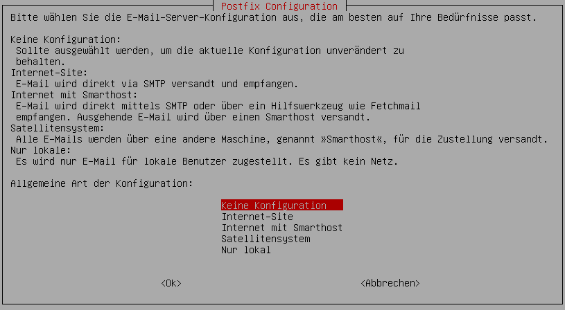

   Wählen Sie „keine Konfiguration“
   
Setup
`````
Starten Sie nun zur Ersteinrichtung des Systems das Setupskript: 

.. code-block:: console

    server ~ # linuxmuster-setup --first
    
In der Folge werden zunächst für das Serversetup benötigte Softwarepakete heruntergeladen und installiert. Das kann - abhängig von Internetanbindung und verwendeter Hardware - einige Minuten in Anspruch nehmen.

Sind alle Pakete installiert, erfolgen die Abfragen der Konfigurationswerte. Sollten Sie während des Konfigurationsdialogs Fehleingaben machen, können Sie die Konfiguration zunächst fortführen und im letzten Dialog, im Netzwerkkarten-Menü, die Konfiguration abbrechen. 

Bestätigen Sie die Hinweise.

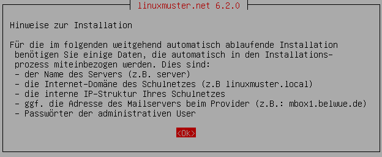

   Bestätigen Sie die Hinweise.
   
Geben Sie das internationale Länderkürzel ein. Erlaubt sind zwei Großbuchstaben, für Deutschland z.B. „DE“.

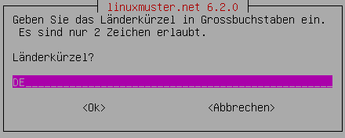

   Geben Sie das internationale Länderkürzel ein.

Geben Sie die Kurzbezeichnung des Bundeslandes ein.

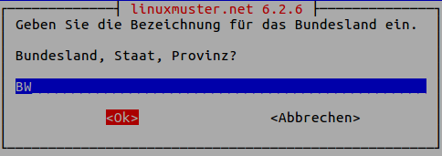

   Geben Sie die Kurzbezeichnung des Bundeslandes ein.

Geben Sie den Orts- oder Stadtnamen Ihrer Schule ein.

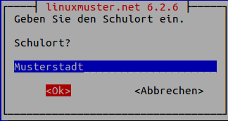

   Geben Sie den Orts- oder Stadtnamen Ihrer Schule ein.


Geben Sie den Schulnamen ein, falls der Schulort Teil des Schulnamens ist, lassen Sie ihn hier weg. Es sind keine Leerzeichen erlaubt.

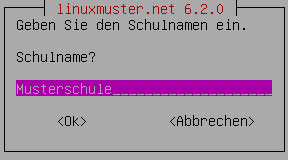

   Geben Sie den Schulnamen ein.

Geben Sie den Namen der Samba-Domäne ein, es sind Buchstaben erlaubt.

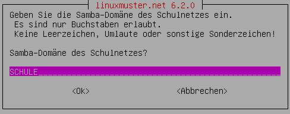

   Geben Sie den Namen der Samba-Domäne ein.

Geben Sie den Hostname des Servers ein, es sind nur Buchstaben, Ziffern und das Minuszeichen erlaubt.

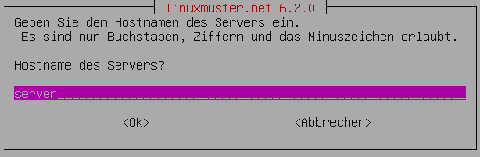

   Geben Sie den Hostname des Servers ein.

Geben Sie die Internet-Domänenname ein, sie darf nur aus Buchstaben, Ziffern, Minuszeichen und Punkten bestehen.

.. note::

    Falls Sie den externen Zugriff auf Ihren Server über eine dynamische DNS-Adresse realisieren wollen, können Sie sich einiges an händischer Nachkonfiguration ersparen, wenn Sie den dynamischen Domänennamen auch für das Intranet verwenden.

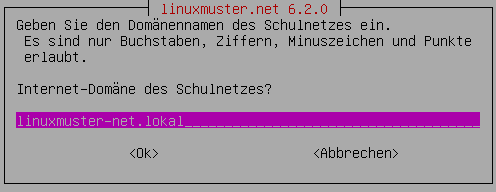

   Geben Sie die Internet-Domänenname ein.    
    
Wählen Sie den IP-Bereich für das interne Netz aus. Mit den Pfeiltasten können Sie in der Liste navigieren. Bestätigen Sie Ihre Auswahl mit der ENTER-Taste.    

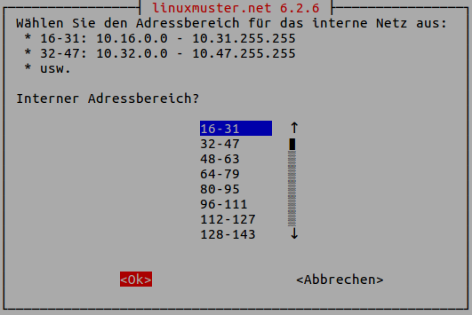

   Wählen Sie den IP-Bereich für das interne Netz aus. 

Geben Sie den externen Servernamen ein, wenn der Server von außen unter einem anderen Namen erreichbar ist. Dieser Namen wird u.a. für die OpenVPN-Konfiguration auf der Firewall verwendet.  

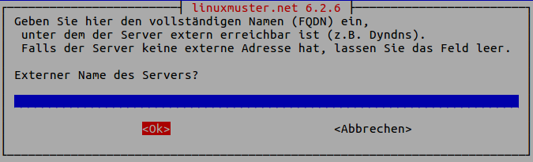

   Geben Sie den externen Servernamen ein.

Bestätigen Sie, IPFire als Firewall nutzen zu wollen. Prinzipiell können Sie eine beliebige Firewall (custom) nutzen, allerdings ist mit eingeschränkter Funktionalität [#FN-CustomFirewall]_.

.. figure:: media/server/680.png
   :width:  250px
   :align: center
   :alt: Wahl der Firewalllösung.
   :figwidth: 250px

   Wählen Sie die Firewalllösung.

Fall der Server E-Mails über das Internet verschicken soll, geben Sie hier die Internetadresse des Mailservers Ihres Providers. Falls nicht, lassen Sie das Feld leer.

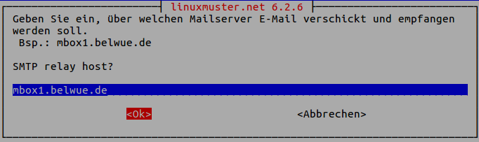

   Geben Sie die Internetadresse des Mailservers Ihres Providers ein.

Entscheiden Sie, ob Sie Subnetze verwenden wollen oder nicht. Falls Sie nicht wissen, was Subnetze sind, wählen Sie „nein“.

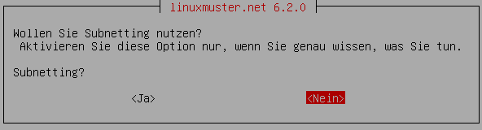

   Entscheiden Sie, ob Sie Subnetze verwenden wollen oder nicht.

Wählen Sie ein Passwort für den Benutzer ``administrator``.

.. note::

   Es werden Klein- und Großbuchstaben akzeptiert. Sonderzeichen sind nur zum Teil erlaubt, folgende Zeichen sind **nicht** erlaubt:
   
   äöüß$&{}![]+#

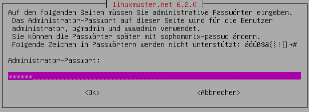

   Wählen Sie ein Passwort für den Benutzer ``administrator``.   
   
Geben Sie das Passwort erneut ein.

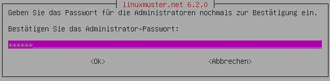

   Geben Sie das Passwort für den Benutzer ``administrator`` nochmals ein. 
   
Geben Sie das Passwort des Benutzer ``root`` auf dem IPFire ein, das Sie bei der Installation des IPFires eingegeben haben.

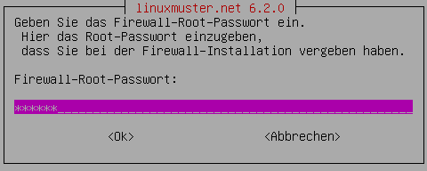

   Geben Sie das Passwort für den Benutzer ``root`` auf dem IPFire ein. 

Geben Sie das Passwort erneut ein.

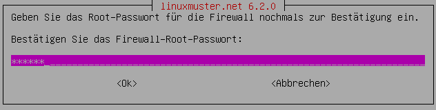

   Geben Sie nochmals das Passwort für den Benutzer ``root`` auf dem IPFire ein.

Wählen Sie die Netzwerkkarte, die mit dem grünen Netz verbunden ist. Durch Betätigen der Schaltfläche ``OK`` wird die Konfiguration erstellt. 


   Wählen Sie die Netzwerkkarte, die mit dem grünen Netz verbunden ist.

Die Installation wird nun abgeschlossen.   
Starten Sie den Server neu.

.. code-block:: console

    reboot
  
Nach dem Neustart begrüßt Sie der Login-Prompt von `linuxmuster.net 6.2.0 / Codename Babo`.

Als nächstes können Sie Arbeitsplatzrechner einbinden, besonders reizvoll ist dabei der :doc:`„Standard-Linuxclient“ <../../howtos/linuxclients/index/>`, das ist ein komplett installiertes und konfiguriertes LTS-Ubuntu, das Sie innerhalb weniger Minuten in das System integrieren können.
Alternativ können Sie z.B. auch selbst ein :doc:`Windows 10 <../../howtos/windows10clients/index/>` installieren. 

.. [#FN-CustomFirewall] Bei Verwendung einer eigenen Firewalllösung funktionieren weder Internetsperre noch Webfilter. Weiterhin die Firewall in ihrem internen Netz (beim IPFire „grünes Netz“ genannt) die IP ``10.16.1.254`` und die Netzmaske ``255.240.0.0`` besitzen, sonst haben weder Server noch Clienten Internetzugang.     
