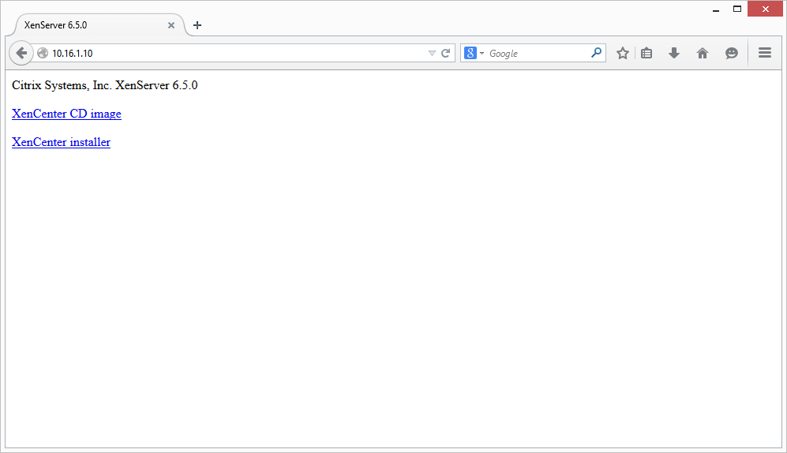
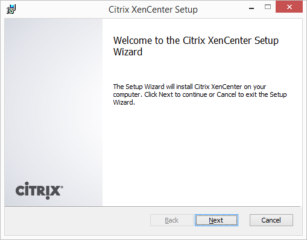
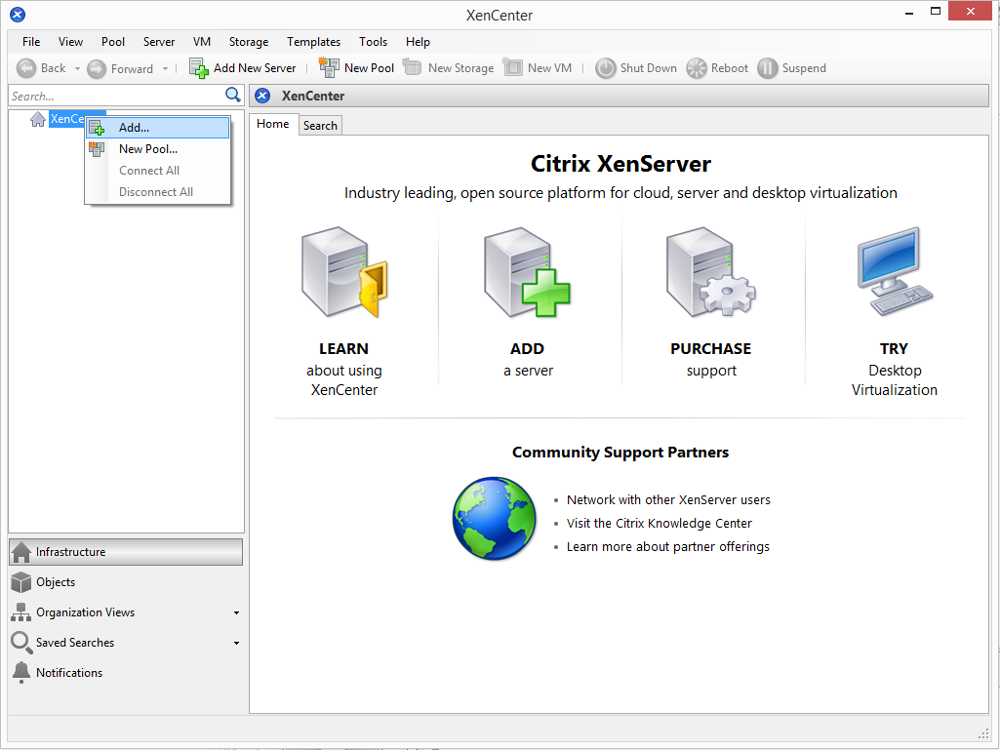
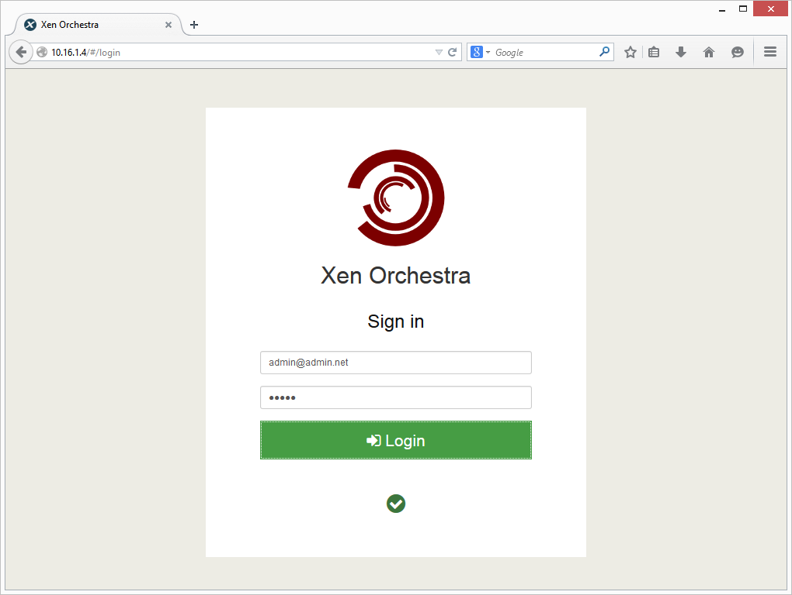
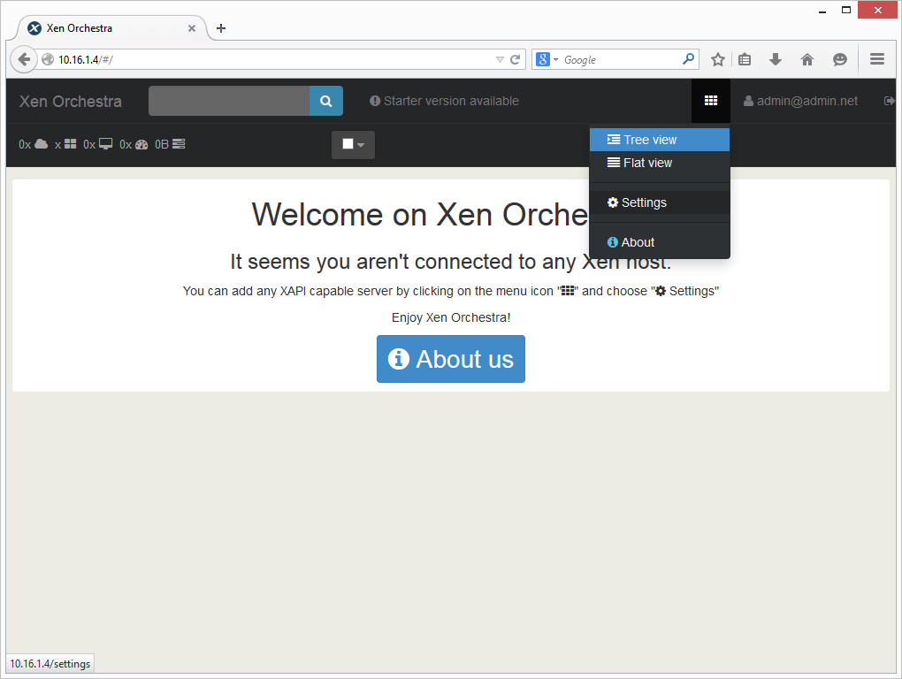
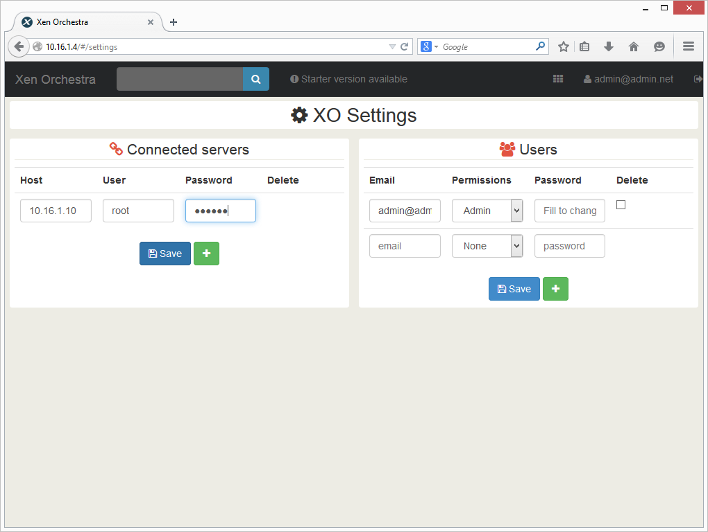
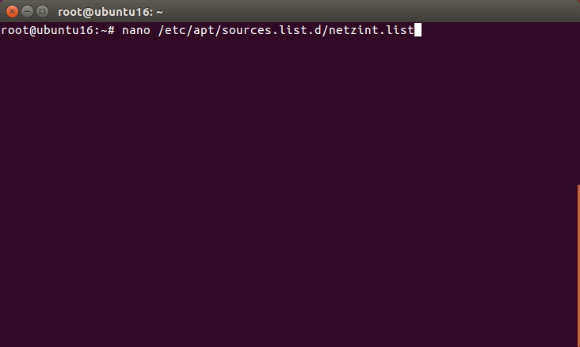
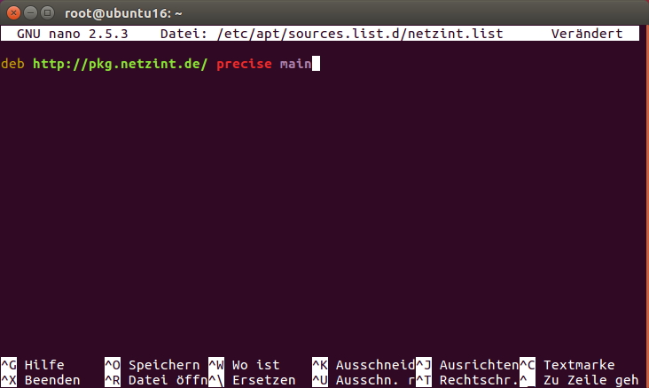
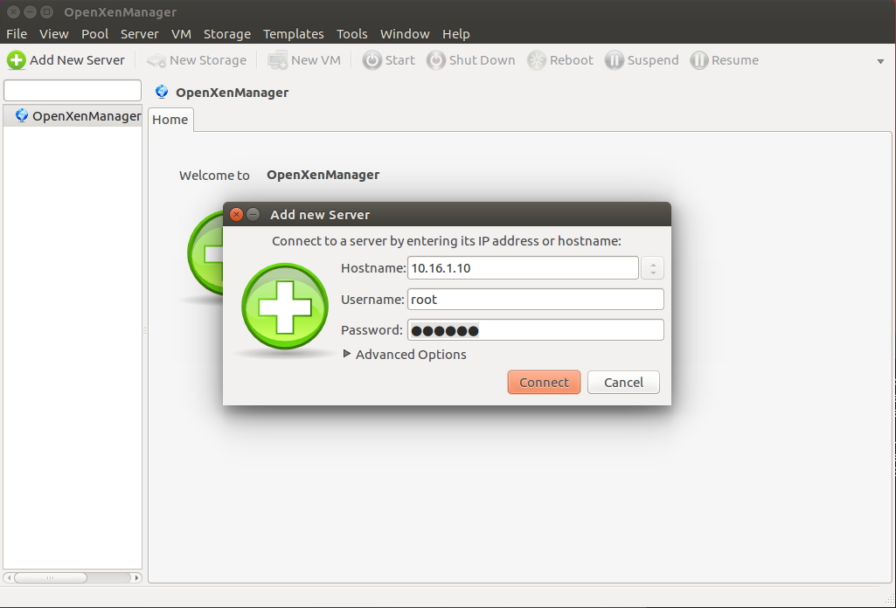
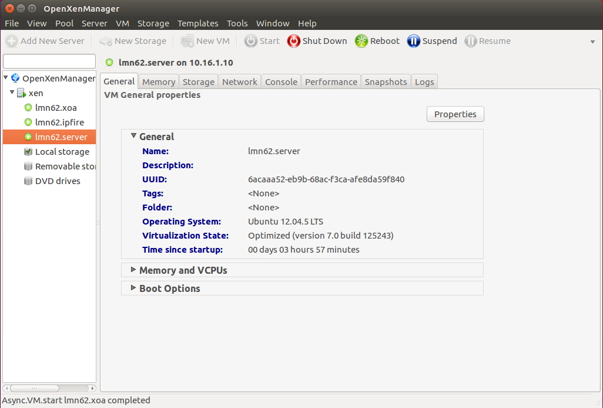

Möglichkeiten der Administration
================================

Für die Bedienung stehen Ihnen mehrere Möglichkeiten zur Verfügung.
Sofern Sie einen Windows-Rechner im Netzwerk haben, können Sie das
Programm XenCenter verwenden.

Für Linuxrechner gibt es einen Clone von XenCenter namens
OpenXenManager.

Alternativ können Sie, sofern Sie die VM „lmn62.xoa“ importiert haben,
die Bedienung Plattformunabhängig im Webbrowser durchführen.

XenCenter
---------

Öffnen Sie einen Webbrowser und wechseln auf die Seite ``http://10.16.1.10``.

Klicken Sie auf „XenCenter installer“ und speichern die Datei bzw. führen diese direkt aus. Folgen Sie dem Assistenten um das Programm zu  installieren

Starten Sie das Programm und klicken mit der rechten Maustaste auf XenCenter. Wählen Sie ``Add``.

Geben Sie die IP-Adresse ``10.16.1.10`` und die Benutzerdaten ein.

.. figure:: media/administration/image46.png
   :width:  450px
   :align: center
   :alt: XenCenter Schritt 4
   :figwidth: 450px

Klicken Sie nun auf eine VM aus der Liste und wechseln auf den Reiter ``Console``. Sie können nun die VM bedienen.

.. figure:: media/administration/image47.png
   :width:  450px
   :align: center
   :alt: XenCenter Schritt 5
   :figwidth: 450px

Xen Orchestra (XOA)
-------------------

.. note::
 Um XOA nutzen zu können, muss die lmn62.xoa importiert sein!

Öffnen Sie einen Webbrowser und wechseln auf die Seite ``http://10.16.1.4``. Geben Sie den User ``admin@admin.net`` mit dem Passwort ``admin`` ein und klicken Sie auf Login.

Klicken Sie auf das Kachelsymbol rechts oben und wählen Settings.

Tragen Sie links die IP-Adresse ``10.16.1.10`` ein und das Passwort, das Sie vergeben haben. Klicken Sie zum Übernehmen auf ``Save``.

Wenn Sie mit der Maus über eine VM fahren erscheinen direkt einige Schaltflächen. Klicken Sie auf VM Console um eine Maschine zu bedienen.

.. figure:: media/administration/image51.png
   :width:  450px
   :align: center
   :alt: XOA Schritt 4
   :figwidth: 450px

Sie können nun die Virtuelle Maschine bedienen.

.. figure:: media/administration/image52.png
   :width:  450px
   :align: center
   :alt: XOA Schritt 5
   :figwidth: 450px

OpenXen Manager
---------------

Um OpenXen Manager zu verwenden müssen Sie zunächst das Paket installieren. Gehen Sie dazu wie folgt vor.

Öffnen Sie ein Terminal und geben folgenden Befehl ein:

.. code-block:: console

   $ nano /etc/apt/sources.list.d/netzint.list

Schreiben Sie nun in die Zeile:

.. code-block:: console

   deb http://pkg.netzint.de/ precise main

Verlassen Sie den Editor in dem Sie ``Strg+x`` drücken. Sie werden gefragt ob Sie die Änderungen speichern wollen. Drücken Sie ``Y`` und bestätigen den Speicherort/Dateinamen mit ``Enter``.

Schreiben Sie folgende Befehle in die Konsole und bestätigen Sie jeweils mit ``Enter``:

.. code-block:: console

   $ wget http://pkg.netzint.de/netzint.pub.key
   $ apt-key add netzint.pub.key

.. figure:: media/administration/image55.png
   :width:  450px
   :align: center
   :alt: OpenXen Manager Schritt 3
   :figwidth: 450px

Schreiben Sie den Befehl ``apt-get update`` in die Konsole und drücken Sie ``Enter``.

.. code-block:: console

   $ apt-get update

.. figure:: media/administration/image56.png
   :width:  450px
   :align: center
   :alt: OpenXen Manager Schritt 4
   :figwidth: 450px

Schreiben Sie den Befehl ``apt-get install netzint-xenmanager`` in die Konsole und drücken ``Enter``. Bestätigen Sie die Abfrage fortzufahren mit ``Y``.

.. code-block:: console

   $ apt-get install netzint-xenmanager

.. figure:: media/administration/image57.png
   :width:  450px
   :align: center
   :alt: OpenXen Manager Schritt 5
   :figwidth: 450px

Nach der Installation starten Sie OpenXenmanager mit dem Befehl

.. code-block:: console

   $ xenmanager

.. figure:: media/administration/image58.png
   :width:  450px
   :align: center
   :alt: OpenXen Manager Schritt 6
   :figwidth: 450px

Klicken Sie auf ``Add New Server`` und geben die IP-Adresse sowie den Benutzernamen root und das Passwort ein. Bestätigen Sie mit ``Connect``

Sie sehen nun die Verwaltungsoberfläche mit der Sie den XenServer administrieren können.

