Konfiguration linuxmuster.net
=============================

Konfiguration IPFire
--------------------

Geben Sie als Benutzername ``root`` und als Passwort ``muster`` ein. Bestätigen Sie jeweils mit ``Enter``. Anschließend geben Sie den Befehl ``setup`` ein und bestätigen mit ``Enter``.

.. code-block:: console

   $ setup

.. figure:: media/configuration/image61.png
   :width:  450px
   :align: center
   :alt: Konfiguration Schritt 1
   :figwidth: 450px

Wählen Sie „Networking“ und bestätigen Sie mit ``Enter``.

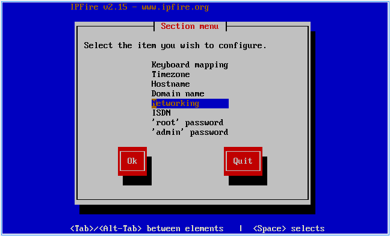

Wählen Sie „Drivers and card assigments“ und bestätigen mit ``Enter``.

.. figure:: media/configuration/image63.png
   :width:  450px
   :align: center
   :alt: Konfiguration Schritt 3
   :figwidth: 450px

Wählen Sie „GREEN“ und bestätigen Sie mit ``Enter``.

.. figure:: media/configuration/image64.png
   :width:  450px
   :align: center
   :alt: Konfiguration Schritt 4
   :figwidth: 450px

Wählen Sie die zugehörige Netzwerkkarte aus und bestätigen Sie mit ``Enter``.

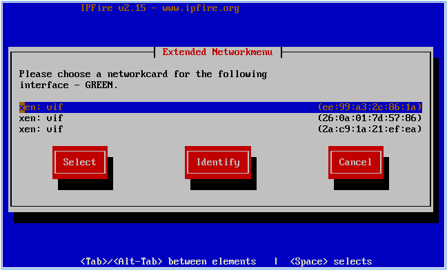

.. note::
 Sie finden die passende Netzwerkkarte anhand der MAC-Adresse heraus. Diese können Sie hier abgleichen:

.. figure:: media/configuration/image66.png
   :width:  450px
   :align: center
   :alt: Konfiguration Schritt 6
   :figwidth: 450px

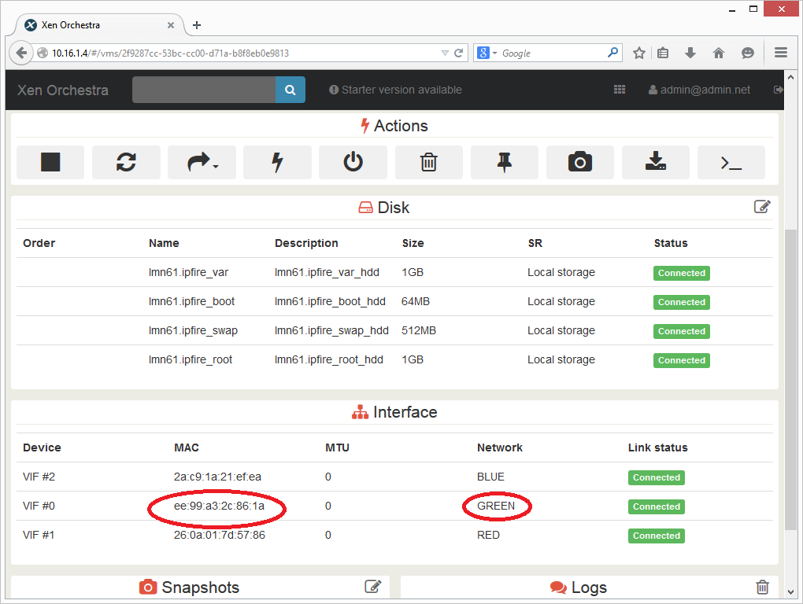

In der Standardkonfiguration stimmt die Reihenfolge der NICs meist, es muss dann nur der Reihe nach ausgewählt werden.

Wiederholen Sie den Vorgang für das Interface RED und BLUE. Wählen Sie im Anschluss „Done“ und bestätigen mit ``Enter``.

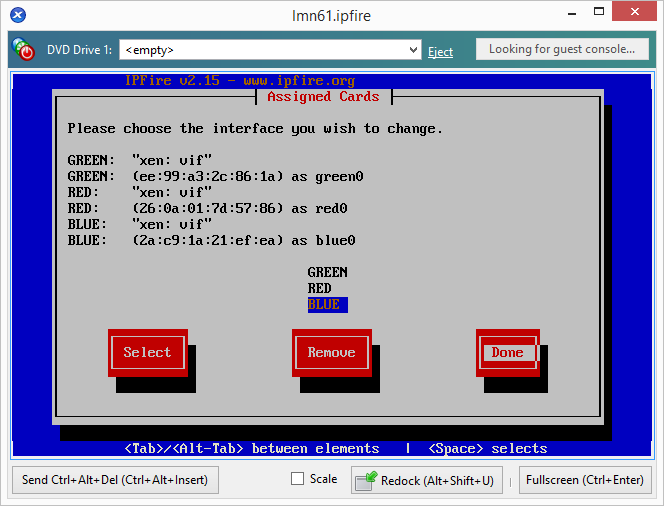

Bestätigen Sie Ihre Eingaben mit ``Done``.

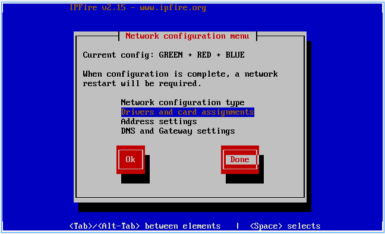

Wählen Sie „´root´ password“ und bestätigen Sie mit ``Enter``.

.. figure:: media/configuration/image70.png
   :width:  450px
   :align: center
   :alt: Konfiguration Schritt 10
   :figwidth: 450px

Geben Sie ein neues Passwort für den Account root ein und bestätigen mit ``Ok``.

.. figure:: media/configuration/image71.png
   :width:  450px
   :align: center
   :alt: Konfiguration Schritt 11
   :figwidth: 450px

Wiederholen Sie den Vorgang für den Benutzer „admin“. Mit diesem Benutzer / Passwort melden Sie sich später an der Weboberfläche der Firewall an. Verlassen Sie das Setup mit der Schaltfläche ``Quit``.

.. figure:: media/configuration/image72.png
   :width:  450px
   :align: center
   :alt: Konfiguration Schritt 12
   :figwidth: 450px

Führen Sie ggf. mit dem Befehl „reboot“ einen Neustart durch.

Konfiguration Server
--------------------

Geben Sie als Benutzername ``root`` ein und als Passwort ``muster``. Anschließend geben Sie den Befehle

.. code-block:: console

   $ aptitude update
   $ aptitude upgrade
   $ aptitude dist-upgrade

ein und bestätigen jeweils mit ``Enter`` bzw. ``Y``.

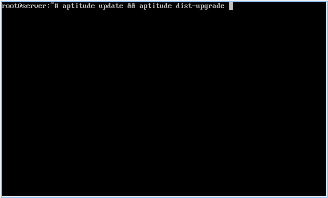

.. note::
 Mit diesem Befehl aktualisieren Sie den Server auf den neusten Stand. Sie müssen ggf. mit der Eingabe ``Y`` das Update bestätigen.

Geben Sie den Befehl

.. code-block:: console

   $ passwd

ein um das root-passwort zu ändern.

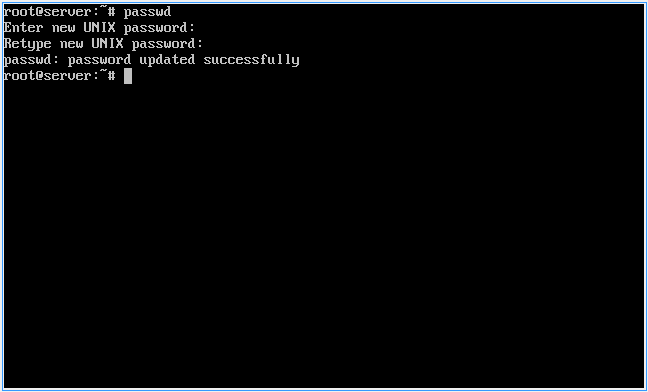

Geben Sie den Befehl

.. code-block:: console

   linuxmuster-setup --first

ein und bestätigen Sie mit ``Enter``.

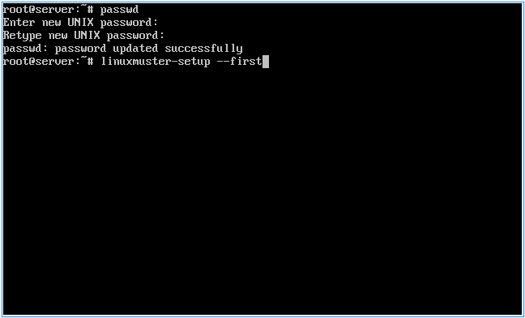

Bestätigen Sie die Meldung mit den Hinweisen mit der Schaltfläche ``Ok``.

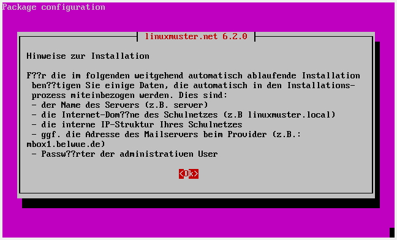

Geben Sie Ihr Länderkürzel ein bzw. bestätigen „DE“ mit ``Enter``.

.. figure:: media/configuration/image77.png
   :width:  450px
   :align: center
   :alt: Konfiguration Schritt 17
   :figwidth: 450px

Geben Sie Ihr Bundesland ein bzw. bestätigen Sie „BW“ mit ``Enter``.

.. figure:: media/configuration/image78.png
   :width:  450px
   :align: center
   :alt: Konfiguration Schritt 18
   :figwidth: 450px

Geben Sie den Schulstandort ein (Stadt).

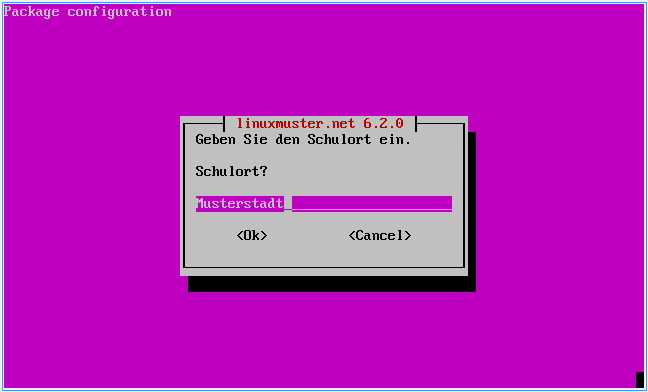

Geben Sie den Schulnamen Ihrer Schule an.

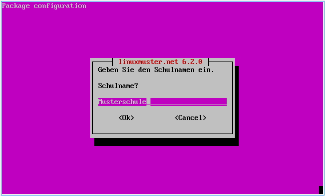

Geben Sie den Domänennamen ein den Sie verwenden möchten. Im Beispiel „SCHULE“.

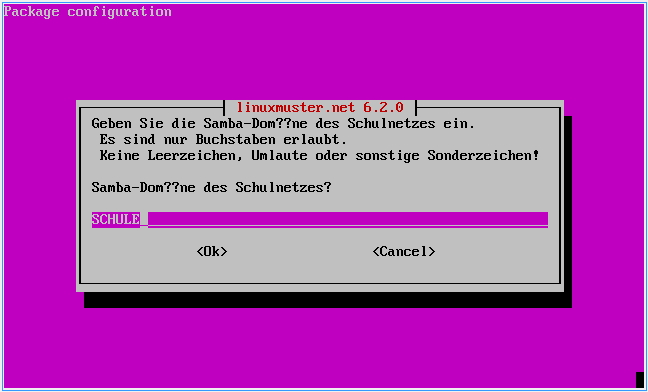

Geben Sie den Servernamen ein. Es ist zu empfehlen den Server ``server`` zu nennen.

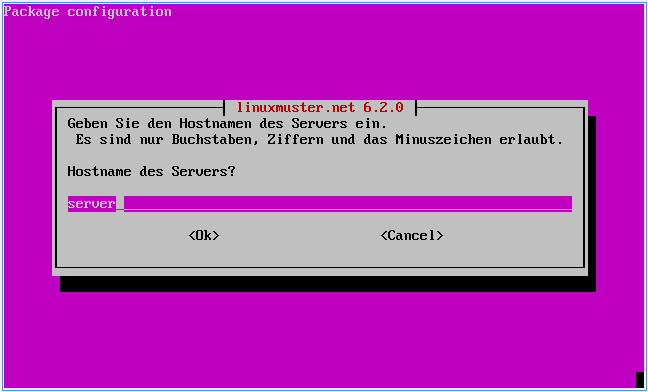

Geben Sie den Internetdomänennamen des Schulnetzes an den Sie verwenden möchten. Beispielsweise „schule.lokal“.

.. figure:: media/configuration/image83.png
   :width:  450px
   :align: center
   :alt: Konfiguration Schritt 23
   :figwidth: 450px

Wählen den gewünschten IP-Adressbereich aus den Sie verwenden möchten.

.. figure:: media/configuration/image84.png
   :width:  450px
   :align: center
   :alt: Konfiguration Schritt 24
   :figwidth: 450px

Geben Sie den externen Domänennamen an, auf dem Ihr Server im Internet erreichbar ist. Sofern keine externe Kommunikation vorgesehen ist, können Sie das Feld auch leer lassen.

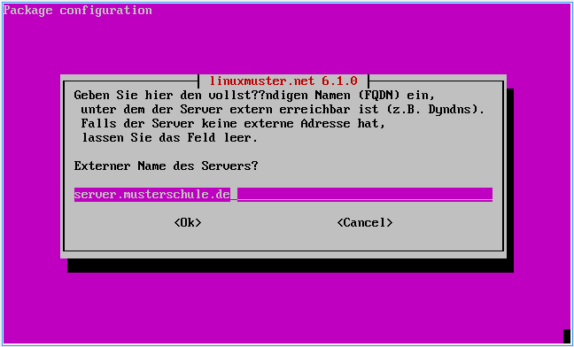

Geben Sie an welche Firewall Sie verwenden. In der XenAppliance wird ``ipfire`` verwendet.

.. figure:: media/configuration/image86.png
   :width:  450px
   :align: center
   :alt: Konfiguration Schritt 26
   :figwidth: 450px

Tragen Sie für die Emailfunktion einen SMTP-Host ein mit dem der Server kommunizieren kann. Beispielsweise ``mbox1.belwue.de``.

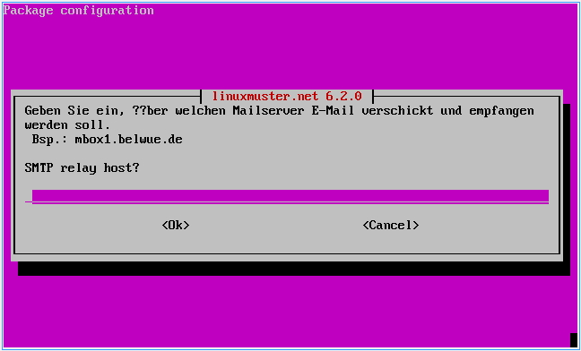

Sofern Sie Subnetting nutzen möchten, können Sie dies hier aktivieren.

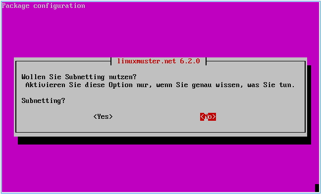

Wählen Sie für die administrativen Domänenbenutzer ein Passwort.

.. figure:: media/configuration/image89.png
   :width:  450px
   :align: center
   :alt: Konfiguration Schritt 29
   :figwidth: 450px

Geben Sie das root-Passwort der Firewall ein das Sie im Schritt „Konfiguration IPFire“ vergeben haben.

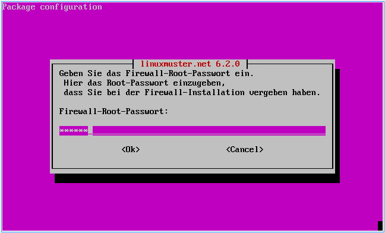

Wählen Sie die Netzwerkkarte aus, die mit dem Schulnetz (GREEN) verbunden ist. Sofern Sie keine zusätzlichen Adapter installiert haben bestätigen Sie die Auswahl mit ``Enter``.

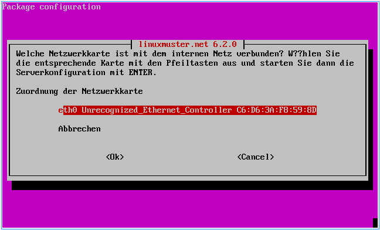

Installation Netzint-lmntoolbox
===============================

Um das LVM auf der VM Server zu vergrößern steht in der Netzint ``lmn-toolbox`` ein Skript bereit. Dieses Tool wird später in der Anleitung verwendet, daher sollte die Toolbox installiert werden. Es gibt aber auch weitere nützliche Tools um beispielsweise das LDAP zu editieren, Linbo anzupassen, unifi zu steuern, oder auch das Netzint-Multitool.

.. figure:: media/configuration/image92.png
   :width:  450px
   :align: center
   :alt: Konfiguration Schritt 32
   :figwidth: 450px

Erstellen und bearbeiten Sie eine Repository-Liste in dem Sie folgenden Befehl auf dem Server eingeben:

.. code-block:: console

   $ nano /etc/apt/sources.list.d/netzint.list

.. figure:: media/configuration/image93.png
   :width:  450px
   :align: center
   :alt: Konfiguration Schritt 33
   :figwidth: 450px

Schreiben Sie in die Datei folgende Zeile:

.. code-block:: console

   deb http://pkg.netzint.de/ precise main

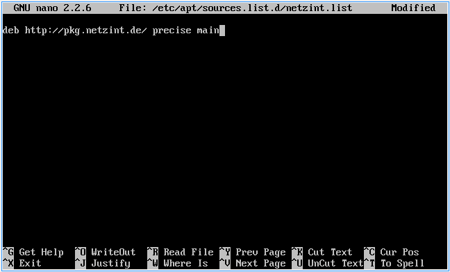

Verlassen Sie den Editor in dem Sie ``Strg+x`` drücken. Sie werden gefragt, ob Sie die Änderungen speichern wollen. Drücken Sie ``Y`` und bestätigen den Speicherort/Dateinamen mit ``Enter``.

Schreiben Sie folgende Befehle in die Konsole und bestätigen Sie jeweils mit ``Enter``:

.. code-block:: console

   $ wget http://pkg.netzint.de/netzint.pub.key
   $ apt-key add netzint.pub.key

.. figure:: media/configuration/image95.png
   :width:  450px
   :align: center
   :alt: Konfiguration Schritt 35
   :figwidth: 450px

Schreiben Sie den Befehl

.. code-block:: console

   $ apt-get update

in die Konsole und drücken ``Enter``.

.. figure:: media/configuration/image96.png
   :width:  450px
   :align: center
   :alt: Konfiguration Schritt 36
   :figwidth: 450px

Schreiben Sie den Befehl

.. code-block:: console

   $ apt-get install netzint-lmntoolbox

in die Konsole und drücken ``Enter``. Bestätigen Sie die Abfrage fortzufahren mit ``Y``.

.. figure:: media/configuration/image97.png
   :width:  450px
   :align: center
   :alt: Konfiguration Schritt 37
   :figwidth: 450px

Erstellen Sie die Grundkonfigurationsdateien mit dem Befehl

.. code-block:: console

   $ /usr/share/netzint/tools/createdefaults.sh

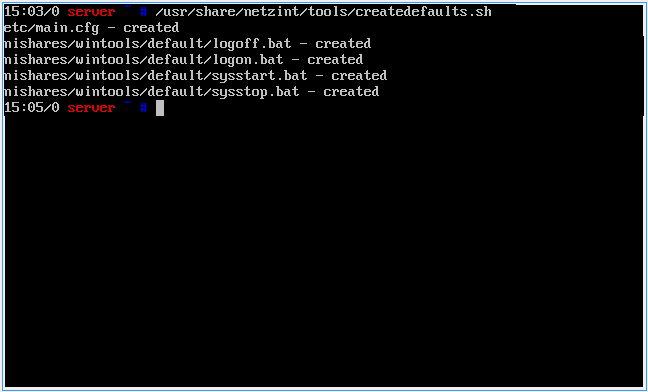

Mit dem Befehl

.. code-block:: console

   $ nano /usr/share/netzint/etc/main.cfg

können Sie die Grundeinstellungen für einige Tools bearbeiten.

.. figure:: media/configuration/image99.png
   :width:  450px
   :align: center
   :alt: Konfiguration Schritt 39
   :figwidth: 450px

Anpassen der Systemressourcen
=============================

XenCenter
---------

Klicken Sie mit der rechten Maustaste auf den Server und wählen ``Herunterfahren``. Wechseln Sie auf den Reiter General und klicken auf ``Properties``.

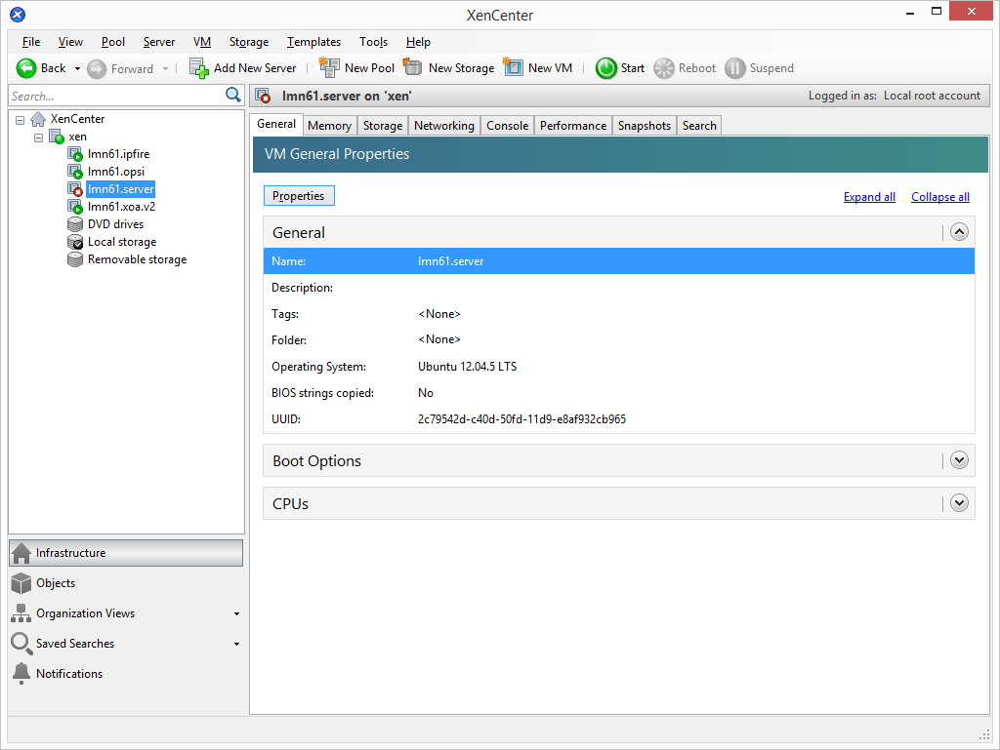

Wählen Sie auf der linken Seite CPU und tragen die gewünschte Anzahl virtueller Kerne ein und bestätigen die Einstellung mit ``Ok``.

.. figure:: media/configuration/image101.png
   :width:  450px
   :align: center
   :alt: Konfiguration Schritt 41
   :figwidth: 450px

Wechseln Sie auf den Reiter Memory und klicken auf die Schaltfläche ``Edit...``.

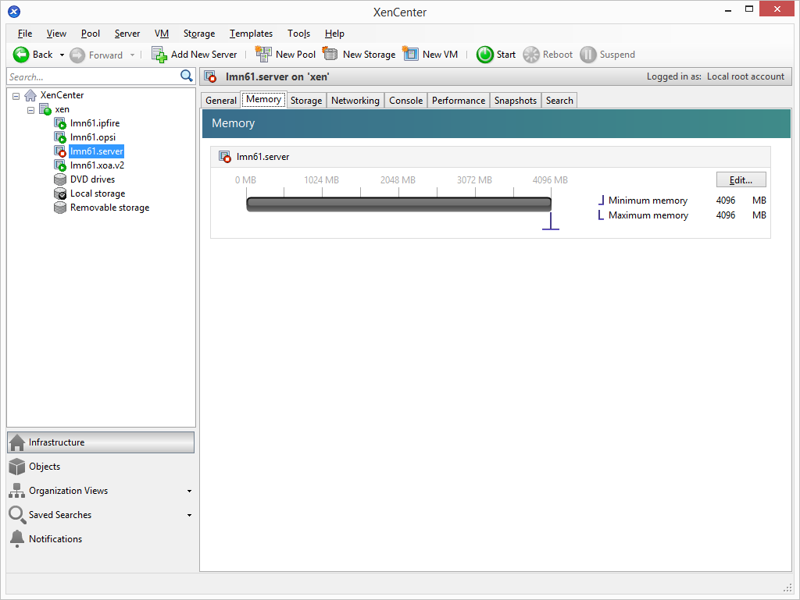

Tragen Sie die gewünschte Größe des Arbeitsspeichers ein und bestätigen Sie die Einstellung mit ``OK``.

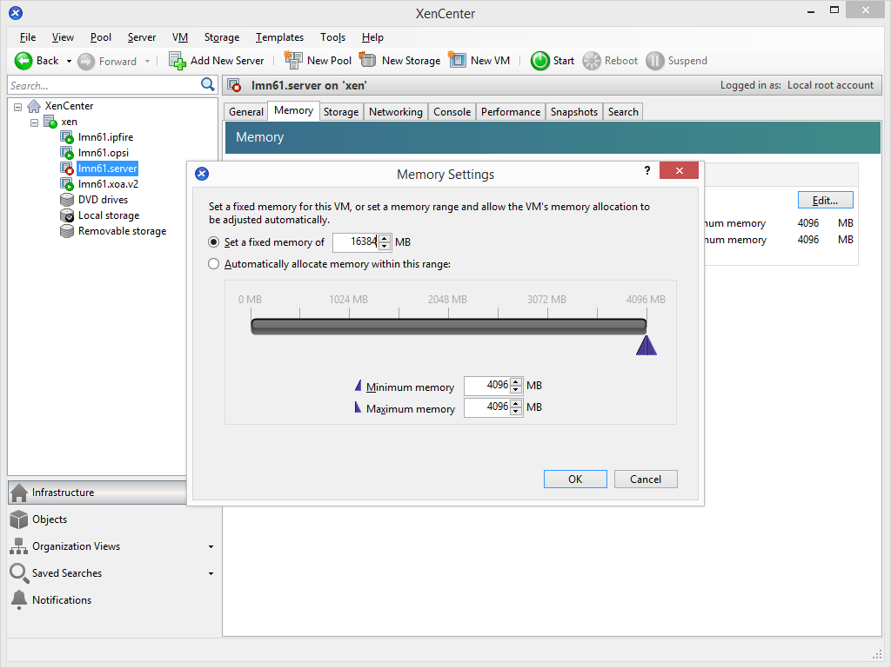

Wiederholen Sie die Schritte für die Anpassung für CPU und Memory für die anderen Virtuellen Maschinen in Ihrem Pool.

Wählen Sie aus der Bestandsliste links den Server an und wechseln Sie auf den Reiter Storage. Doppelklicken Sie die Festplatte ``..._home`` bzw. wählen diese aus und klicken auf ``Properties``.

.. figure:: media/configuration/image104.png
   :width:  450px
   :align: center
   :alt: Konfiguration Schritt 44
   :figwidth: 450px

Tragen Sie im Feld Size die gewünschte Festplattengröße ein und bestätigen Sie die Eingabe mit ``OK``.

.. figure:: media/configuration/image105.png
   :width:  450px
   :align: center
   :alt: Konfiguration Schritt 45
   :figwidth: 450px

.. note::
 Info: Hier werden später die Homeverzeichnisse der Schüler und Lehrer sowie die Tauschverzeichnisse abgelegt.

Wiederholen Sie den Schritt mit der Festplatte ``..._var``. Hier werden später die Images der Schulnetzrechner abgelegt.

XOA / XenKonsole
----------------

Öffnen Sie XOA in einem Webbrowser und melden Sie sich an. Klicke Sie bei dem Server auf das Stopp-Symbol um diesen herunterzufahren. Klicken Sie dann auf den Server um auf dessen Übersichtseite zu gelangen.

.. figure:: media/configuration/image106.png
   :width:  450px
   :align: center
   :alt: Konfiguration Schritt 46
   :figwidth: 450px

Klicken Sie auf das Bearbeiten-Symbol im Bereich General. Tragen Sie die gewünschte Anzahl virtueller CPUs sowie die Größe des Arbeitsspeichers für die VM ein und übernehmen die Einstellung mit der Schaltfläche ``Save``.

.. figure:: media/configuration/image107.png
   :width:  450px
   :align: center
   :alt: Konfiguration Schritt 47
   :figwidth: 450px

Wechseln Sie auf dem XenServer auf die Konsole mit dem Benutzer ``root``.

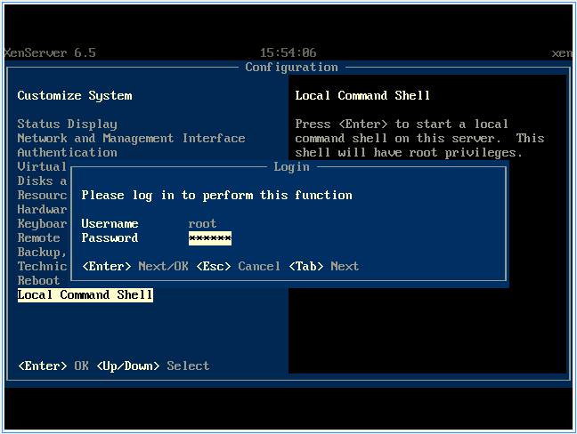

Geben Sie den Befehl

.. code-block:: console

   $ xe vm-disk-list vm=lmn62.server

ein und bestätigen Sie mit ``Enter``.

.. figure:: media/configuration/image109.png
   :width:  450px
   :align: center
   :alt: Konfiguration Schritt 49
   :figwidth: 450px

.. note::
  INFO: Mit der Taste „TAB“ können Sie die Autovervollständigung nutzen. Sobald Sie die ersten Buchstaben eines Befehls oder des Namens der VM eingegeben haben wird durch TAB der Befehl bzw. der Name vervollständigt.

Es werden Ihnen nun alle Virtuellen Festplatten der Servers „lmn62.server“ aufgelistet. Sie müssen in der Ausgabe die Virtual Disk (VDI) suchen deren name-label mit ``..._var`` endet. Notieren Sie sich die ersten Zeichen der UUID.

.. figure:: media/configuration/image110.png
   :width:  450px
   :align: center
   :alt: Konfiguration Schritt 50
   :figwidth: 450px

Geben Sie den Befehl

.. code-block:: console

   $ xe vdi-resize uuid=<UUID> disk-size=XXXGiB

ein und bestätigen mit ``Enter``.

.. figure:: media/configuration/image111.png
   :width:  450px
   :align: center
   :alt: Konfiguration Schritt 51
   :figwidth: 450px

.. note::
  INFO: Nutzen Sie die Autovervollständigung! Geben Sie bei der uuid die ersten Zeichen ein und drücken dann „TAB“ um die uuid einzutragen.

Wiederholen Sie den Vorgang für die VDI ``..._home``.

Starten Sie nun die VM mit dem Befehl

.. code-block:: console

   $ xe vm-start vm=lmn62.server

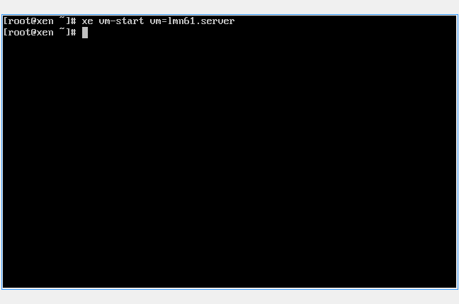

Expandieren des LVMs auf dem Server
-----------------------------------

Tragen Sie in der Konsole des Servers folgende Befehle nacheinander ein und bestätigen Sie jeweils mit ``Enter``:

.. code-block:: console

   $ /usr/share/netzint/tools/resize.sh --home
   $ /usr/share/netzint/tools/resize.sh --var

.. figure:: media/configuration/image113.png
   :width:  450px
   :align: center
   :alt: Konfiguration Schritt 53
   :figwidth: 450px

Mit dem Befehl

.. code-block:: console

   $ df –lh

können Sie die Speichergröße überprüfen:

.. figure:: media/configuration/image114.png
   :width:  450px
   :align: center
   :alt: Konfiguration Schritt 54
   :figwidth: 450px

Abschluss der Grundinstallation
===============================

Ihre Umgebung ist nun für den regulären Einsatz von linuxmuster.net vorbereitet.

Für die meisten Aufgaben der Administration können Sie nun die Schulkonsole verwenden. Diese öffnen Sie im Schulnetz mit einem Webbrowser unter ``https://server:242``.

Sofern Sie die neue linuxmuster-WebUI bereits installiert haben können Sie diese über ``https://server:8000`` aufrufen.

Beachten Sie dass sie die Schulkonsole wie auch ssh auf den Server nur von Rechnern aus nutzen können die der Server in der Workstationsdatei gelistet hat. Wie Sie Rechner aufnehmen und auch wie Sie Linbo benutzen erfahren Sie auf linuxmuster.net.

Konfiguration automatisches Backup
==================================

Um Ihre Server zu sichern ist in den ``linuxmuster-hv-tools`` ein Skript enthalten welches Snapshots erstellt und auf einen Datenträger Ihrer Wahl verschiebt. Beachten Sie dabei, dass die Backups nicht inkrementell abgelegt werden und dadurch viel Speicherplatz in Anspruch nehmen. Es können daher meist nur einige Vollbackups gespeichert werden. In der Datei main.cfg können Sie mit dem Parameter ``Maxage`` beeinflussen wieviele Backups auf dem Datenträger beibehalten werden. Diese Backups werden hauptsächlich im Desaster-Fall genutzt. Für versionssichere Backups über längeren Zeitraum empfehlen wir spezielle Software.

Sie können jeden Storage verwenden den Sie möchten (NAS, USB-Disk, interne Disk, ...). Den Speicherort für das Backup kann in der Datei ``/usr/share/netzint/etc/main.cfg`` eingetragen werden. Sofern nichts eingetragen ist, wird nach einem SR gesucht, welches als BackupStore
beschriftet ist. Dieses wird dann als Target verwendet. In unserem *Beispiel* verbinden wir uns mit einer NFS-Freigabe auf einer NAS mit
der IP 10.16.1.9.

Konfiguration XenCenter
-----------------------

Öffnen Sie XenCenter und klicken Sie mit der rechten Maustaste auf ``xen``, wählen Sie ``New SR``.

.. figure:: media/configuration/image115.png
   :width:  450px
   :align: center
   :alt: Konfiguration Schritt 55
   :figwidth: 450px

Wählen Sie einen Punkt unter **ISO library**.

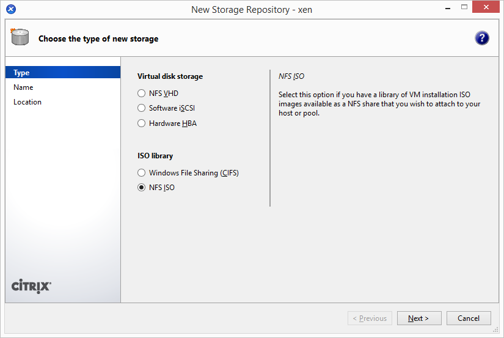

Bennen Sie Ihren Storage. Sofern Sie den Namen "BackupStore" verwenden müssen Sie später die main.cfg nicht anpassen. Dieser Name wird automatisch als Target erkannt.

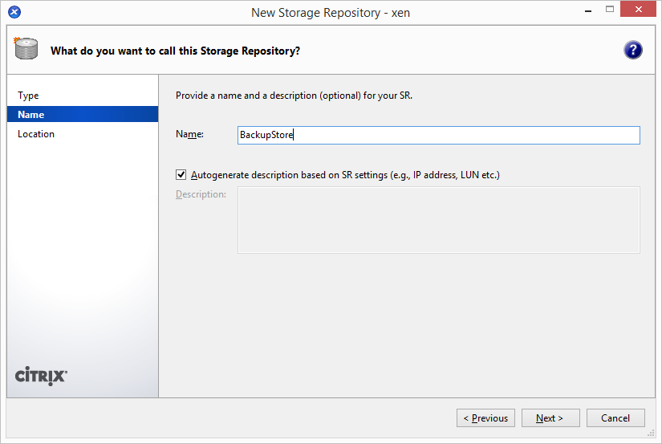

Tragen Sie den Pfad zur Freigabe ein, welchen Sie verwenden wollen und klicken auf ``Finish``.

.. figure:: media/configuration/image118.png
   :width:  450px
   :align: center
   :alt: Konfiguration Schritt 58
   :figwidth: 450px

Sie haben den Storage erfolgreich eingerichtet, wenn er links in der Übersicht angezeigt wird.

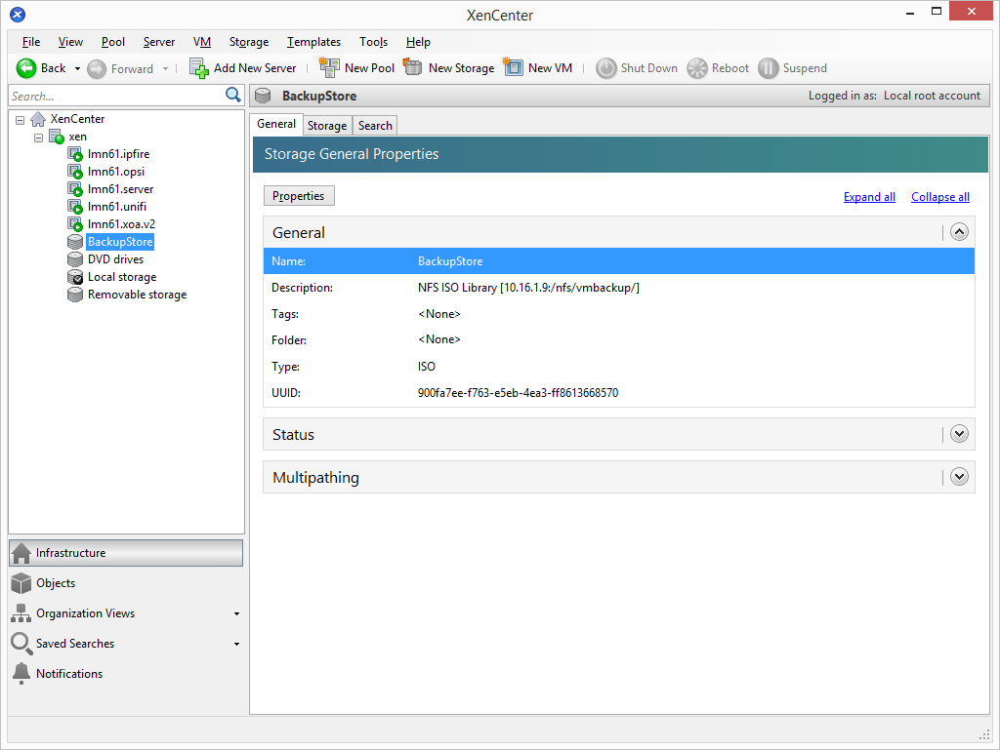

Um einzustellen, welche VMs gesichert werden sollen, genügt es bei den zu sichernden VMs einen bestimmten Tag zu setzen. Klicken Sie dazu mit der rechten Maustaste auf die gewünschte VM und wählen ``Properties``.

.. figure:: media/configuration/image120.png
   :width:  450px
   :align: center
   :alt: Konfiguration Schritt 60
   :figwidth: 450px

Im Feld ``General`` klicken Sie unten auf ``Edit tags...``.

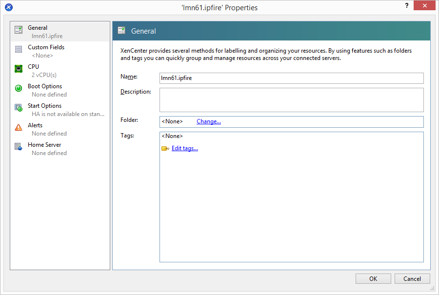

Tragen Sie als Tag ``ni-backup`` ein. Klicken Sie auf ``Create`` und dann auf ``OK``. Durch diesen Tag wird die Maschine in die Sicherung mit aufgenommen. Bei allen weiteren Maschinen wird der Tag bereits aufgelistet und es muss nur noch die Checkbox aktiviert werden.

.. figure:: media/configuration/image122.png
   :width:  450px
   :align: center
   :alt: Konfiguration Schritt 62
   :figwidth: 450px

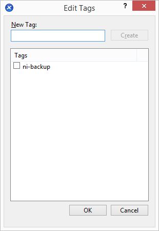

Konfiguration XenServer
-----------------------

Um ein Backup zu starten, wechseln Sie auf die Konsole des XenServers und geben folgenden Befehl ein:

.. code-block:: console

   $ /usr/share/netzint/tools/backup.sh

und bestätigen mit ``Enter``.

.. figure:: media/configuration/image124.png
   :width:  450px
   :align: center
   :alt: Konfiguration Schritt 64
   :figwidth: 450px

Nach Abschluss finden Sie in Ihrer Freigabe einen Snapshot, den Sie im Notfall wiederherstellen können.

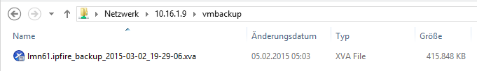

Automatische Backups
--------------------

Um Backups automatisch zu bestimmten Zeitpunkten auszuführen, können Sie einen Cronjob anlegen. Geben Sie dazu in der XenServer-Konsole den Befehl

.. code-block:: console

   $ nano /etc/crontab

ein und bestätigen Sie mit ``Enter``.

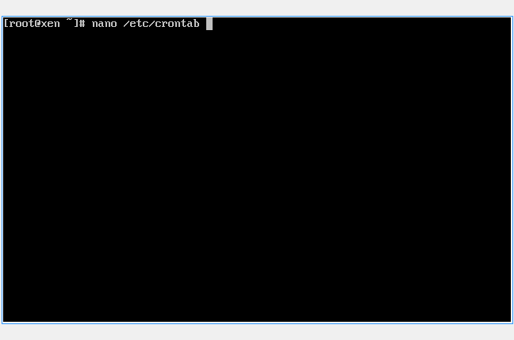

Tragen Sie für ein wöchentliches Backup, dass jeden Freitag um 20:00 Uhr startet, folgende Zeile in die Datei ein:

.. code-block:: console

   0 20 \* \* 5 /usr/share/netzint/tools/backup.sh

.. figure:: media/configuration/image127.png
   :width:  450px
   :align: center
   :alt: Konfiguration Schritt 67
   :figwidth: 450px

Verlassen Sie den Editor und speichern Sie die Datei. Die Zeit für das Backup folgt dieser Zeitangabe die als Filter gelesen wird:

+--------------------+---------------------+------------------------+-------------------------+-----------------------+
| Nur bei Minute 0   | Nur bei Stunde 20   | Nur bei Tag \*         | Nur bei Monat \*        | Nur bei Wochentag 5   |
| [0-60]             | [0-20]              | (Jeder Tag im Monat)   | (Jeder Monat im Jahr)   | [0-7] 0,7=Sonntag     |
|                    |                     | [1-31]                 | [1-12]                  |                       |
+====================+=====================+========================+=========================+=======================+
| 0                  | 20                  | \*                     | \*                      | 5                     |
+--------------------+---------------------+------------------------+-------------------------+-----------------------+