Installation XenServer
======================

Herunterladen von XenServer
---------------------------

Der Hypervisor kann von der Projekthomepage www.xenserver.org
heruntergeladen werden. Diese Anleitung bezieht sich auf die Version
7.0. Unter älteren Versionen können die Xen-VMs lmn62 nicht importiert
werden.

Die ISO-Datei muss heruntergeladen und auf CD gebrannt werden.

Installieren von XenServer
--------------------------

Von der CD booten und dem Setup folgen:

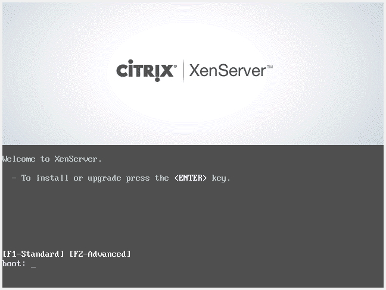

Wählen Sie Ihr Tastaturlayout. Wir verwenden ``[querz] de``.

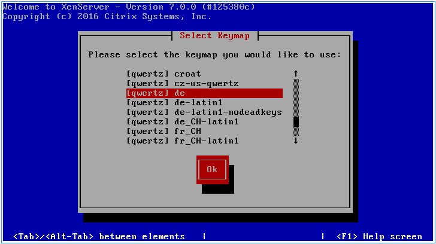

Sollten Sie zusätzliche Treiber benötigen können Sie diese nun laden in dem Sie ``F9`` drücken.

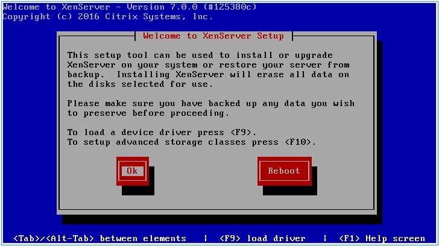

Akzeptieren Sie die Lizenzbedingungen mit Accept EULA.

.. figure:: media/xenserver/image4.png
   :width:  450px
   :align: center
   :alt: Schritt 4 der Installation des XenServers
   :figwidth: 450px

Wählen Sie den Datenträger, der verwendet werden soll und setzen Sie den Haken bei „Enable thin provisioning“. Bestätigen Sie mit ``Ok``.

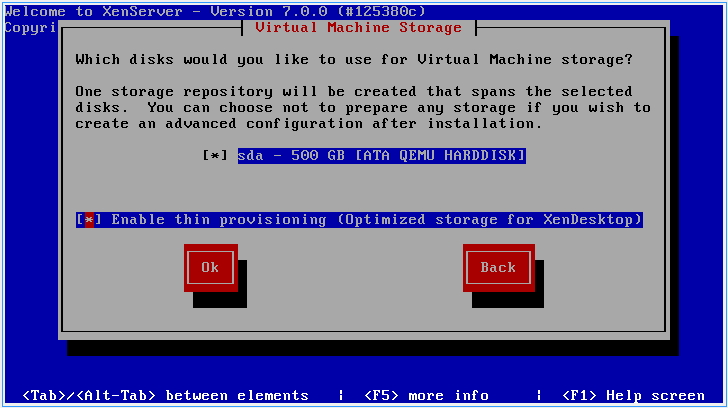

Hier können Sie das Installationsmedium wählen. Wir verwenden den lokalen Datenträger (CD).

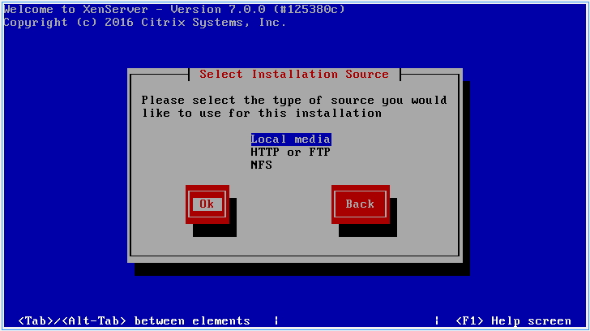

Wählen Sie bei der Abfrage ``Yes`` um die NI-XenServer-Tools installieren zu können.

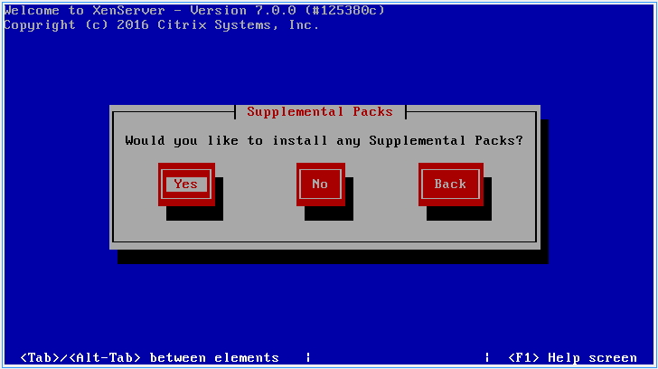

Wählen Sie „Verify installation source“ und bestätigen Sie mit ``Ok``.

.. figure:: media/xenserver/image8.png
   :width:  450px
   :align: center
   :alt: Schritt 8 der Installation des XenServers
   :figwidth: 450px

Sofern „no problems were found“ angezeigt wird können Sie die Meldung mit ``Ok`` bestätigen.

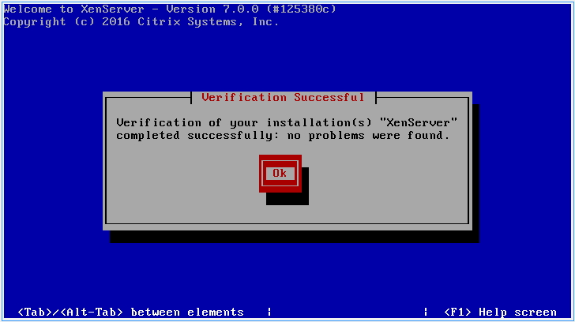

Tragen Sie hier Ihr gewünschtes root-Passwort ein. Dieses wird später benötigt um sich mit dem Hypervisor zu verbinden.

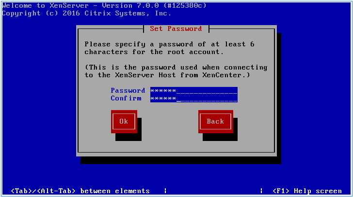

Wählen Sie nun die Netzwerkkarte aus, an der später das grüne Netzwerk (GREEN) angeschlossen ist.

.. figure:: media/xenserver/image11.png
   :width:  450px
   :align: center
   :alt: Schritt 11 der Installation des XenServers
   :figwidth: 450px

Wählen Sie „Static configuration“ und tragen Sie die Adresse aus dem Screenshot ein. Bestätigen Sie die Eingabe mit ``Ok``.

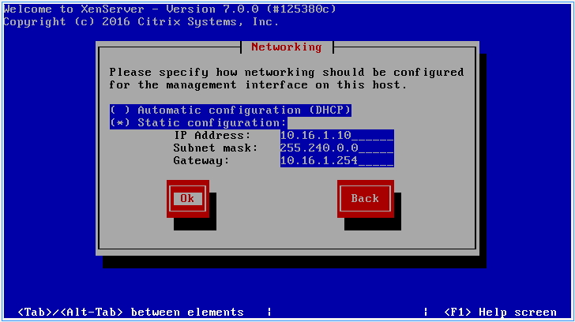

Tragen Sie den gewünschten Hostnamen und die DNS-Server ``10.16.1.1`` und ``10.16.1.254`` ein.

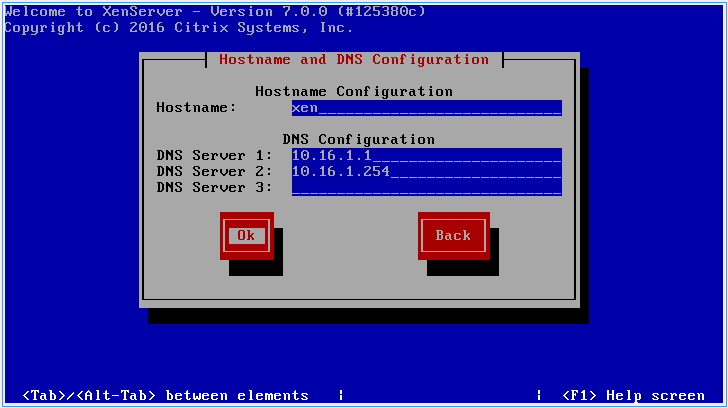

Wählen Sie Ihre Zeitzone aus und bestätigen mit ``Ok``.

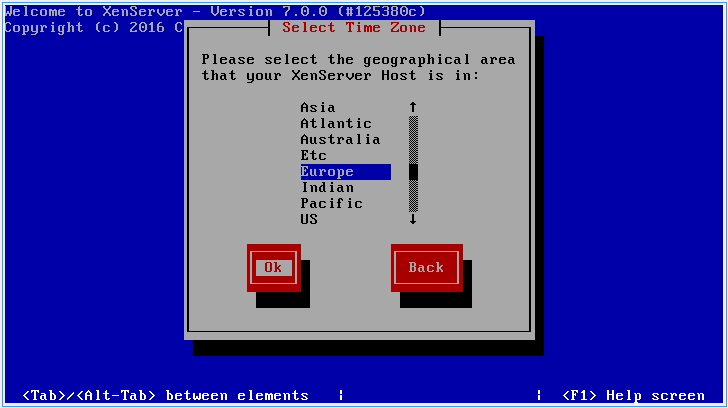

Wählen Sie Ihre Zeitzone aus und bestätigen mit ``Ok``.

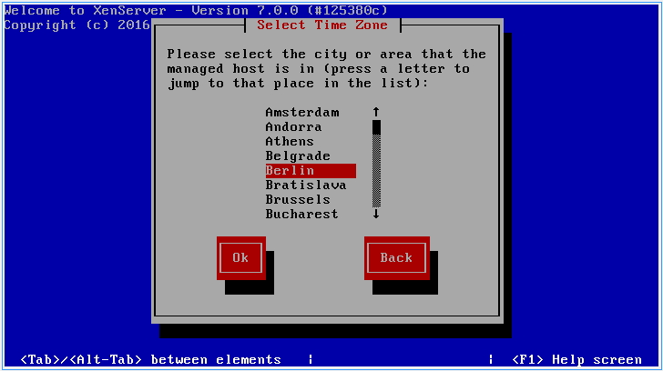

Sollten Sie einen Zeitserver betrieben, können Sie diesen angeben. Wir stellen die Zeit manuell ein. Wählen Sie „Manual time entry“ und  bestätigen Sie mit ``Ok``.

.. figure:: media/xenserver/image16.png
   :width:  450px
   :align: center
   :alt: Schritt 16 der Installation des XenServers
   :figwidth: 450px

Starten Sie nun die Installation mit der Schaltfläche ``Install XenServer``.

.. figure:: media/xenserver/image17.png
   :width:  450px
   :align: center
   :alt: Schritt 17 der Installation des XenServers
   :figwidth: 450px

Legen Sie nun die CD „linuxmuster-SupplementalPack“ in das Laufwerk und bestätigen Sie die Meldung mit ``Ok``.

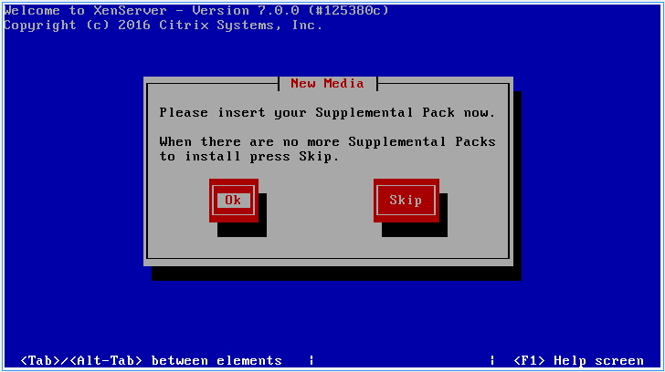

„linuxmuster-hv-tools“ sollten bereits ausgewählt sein. Prüfen Sie die CD mit ``Verify``.

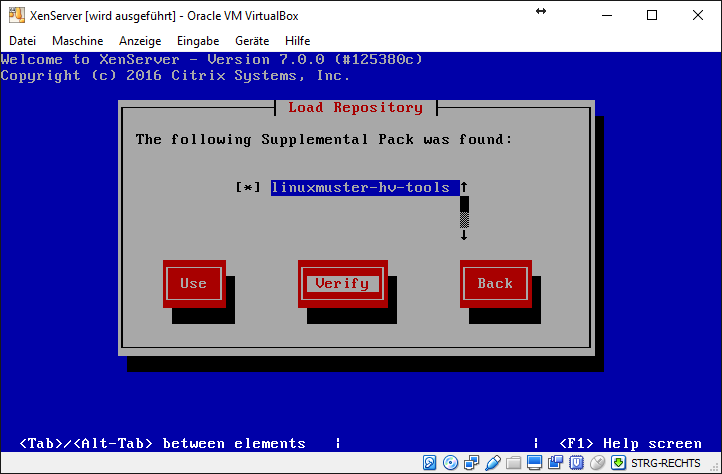

Starten Sie den Test mit ``Ok``.

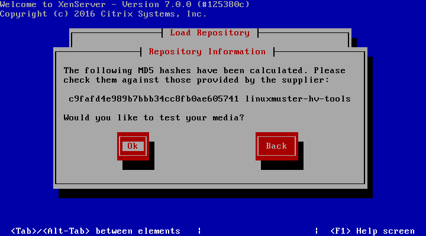

Bestätigen Sie den erfolgreichen Test mit ``Ok``.

.. figure:: media/xenserver/image21.png
   :width:  450px
   :align: center
   :alt: Schritt 21 der Installation des XenServers
   :figwidth: 450px

Wählen Sie nun die Schaltfläche ``Use`` und bestätigen Sie mit ``Ok``.

Nach der Installation werden Sie wieder aufgefordert weitere CDs einzulegen. Wählen Sie ``Skip`` und bestätigen Sie mit ``Enter``.

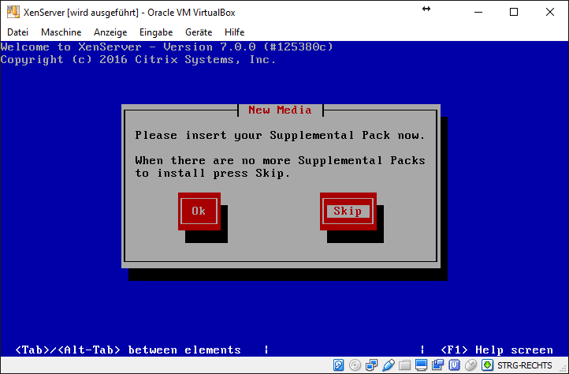

Stellen Sie die korrekte Uhrzeit ein und bestätigen Sie mit ``Ok``.

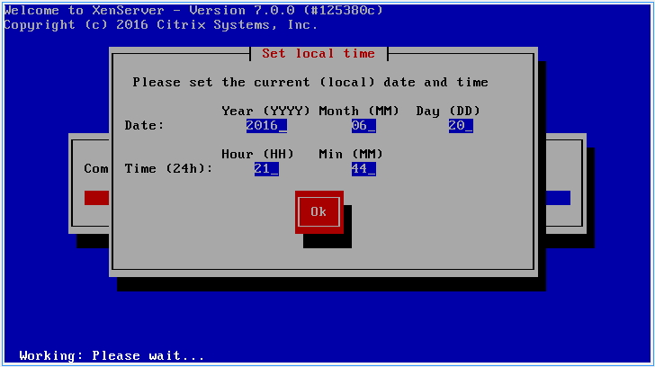

Nach erfolgreicher Installation können Sie mit ``Ok`` den Server neu starten.

.. figure:: media/xenserver/image24.png
   :width:  450px
   :align: center
   :alt: Schritt 24 der Installation des XenServers
   :figwidth: 450px

Nach dem Setup erscheint diese Konsole und der Server kann verwaltet werden.

.. figure:: media/xenserver/image25.png
   :width:  450px
   :align: center
   :alt: Schritt 25 der Installation des XenServers
   :figwidth: 450px

XenServer initialisieren
------------------------

Wählen Sie auf dem XenServer den Punkt ``Local Command Shell`` und drücken Sie ``Enter``.

.. figure:: media/xenserver/image26.png
   :width:  450px
   :align: center
   :alt: Schritt 26 der Installation des XenServers
   :figwidth: 450px

Geben Sie den Benutzer root an und das Passwort das Sie während der Installation vergeben haben.

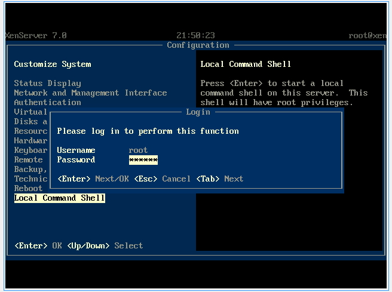

Geben Sie in der Konsole den Befehl ``linuxmuster-hv-setup --first`` ein und bestätigen Sie mit Enter

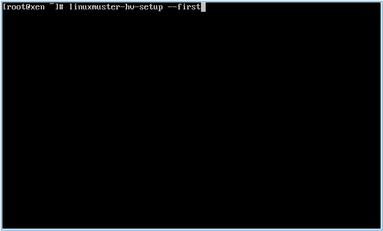

Starten Sie die Installation mit ``Ok``

.. figure:: media/xenserver/image29.png
   :width:  450px
   :align: center
   :alt: Schritt 29 der Installation des XenServers
   :figwidth: 450px

Sofern genügend Netzwerkkarten vorhanden sind erscheint diese Meldung:

.. figure:: media/xenserver/image30.png
   :width:  450px
   :align: center
   :alt: Schritt 30 der Installation des XenServers
   :figwidth: 450px

Stecken Sie alle Netzwerkkabel außer das Netzwerkkabel GREEN (internes Schulnetz) aus. Es muss eine Verbindung zwischen Switch und Server stehen. Bestätigen Sie dann mit ``Ok``.

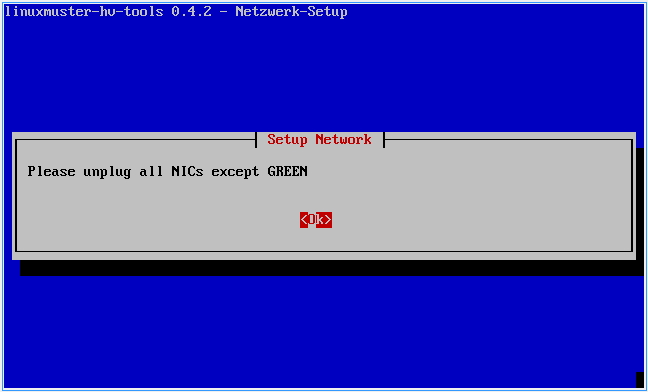

Verbinden Sie nun die Netzwerkkarte RED mit Ihrem Modem oder Switch für das Netz RED. Es wird die betroffene Netzwerkkarte erkannt und  konfiguriert.

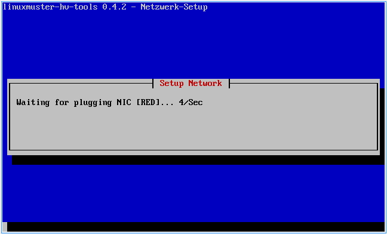

Verbinden Sie nun das Netzwerk BLUE mit dem gewünschten Interface am Server.

.. figure:: media/xenserver/image33.png
   :width:  450px
   :align: center
   :alt: Schritt 33 der Installation des XenServers
   :figwidth: 450px

Legen Sie nun die CD „linuxmuster-SupplementalPack“ erneut in das Laufwerk ein und bestätigen Sie mit ``Ok``.

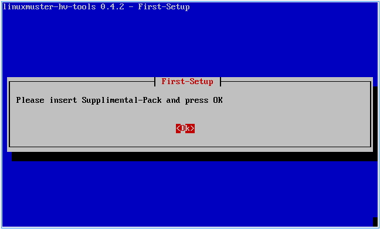

Sie werden nun der Reihe nach abgefragt welche VMs Sie importieren wollen. Wählen Sie jeweils ``Yes`` bzw. ``No`` und bestätigen mit ``Enter``.

.. figure:: media/xenserver/image35.png
   :width:  450px
   :align: center
   :alt: Schritt 35 der Installation des XenServers
   :figwidth: 450px

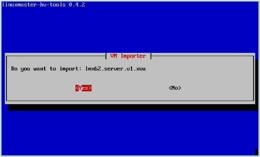

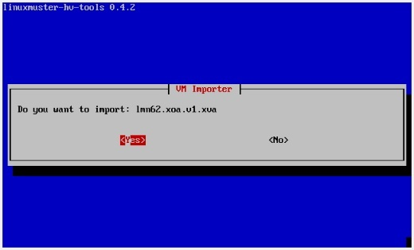

Entnehmen Sie nun die CD und bestätigen Sie mit ``Ok``.

.. figure:: media/xenserver/image38.png
   :width:  450px
   :align: center
   :alt: Schritt 38 der Installation des XenServers
   :figwidth: 450px

Sie werden nun gefragt ob Sie die Autostartfunktion nutzen wollen. Wenn Sie diese Funktion aktivieren können im Folgeschritt VMs ausgewählt werden, die beim Start des XenServers automatisch gestartet werden sollen. Wählen Sie ``Yes`` oder ``No``.

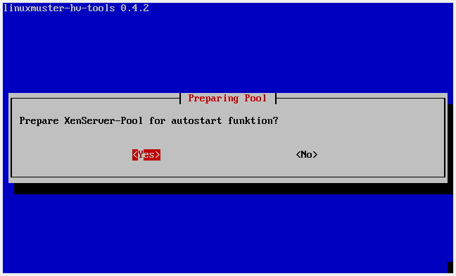

Sie werden nun der Reihe nach abgefragt welche VMs automatisch gestartet werden sollen. Wählen Sie jeweils ``Yes`` bzw. ``No`` und bestätigen Sie mit ``Enter``.

.. figure:: media/xenserver/image40.png
   :width:  450px
   :align: center
   :alt: Schritt 40 der Installation des XenServers
   :figwidth: 450px

.. figure:: media/xenserver/image41.png
   :width:  450px
   :align: center
   :alt: Schritt 41 der Installation des XenServers
   :figwidth: 450px

Sie können nun das System mit der Auswahl ``Yes`` neu starten.

.. figure:: media/xenserver/image42.png
   :width:  450px
   :align: center
   :alt: Schritt 42 der Installation des XenServers
   :figwidth: 450px

Das System fährt herunter und startet danach wieder. Die VMs, die Sie importiert haben, werden - sofern entsprechend konfiguriert - direkt gestartet und sind bereit für die Konfiguration.