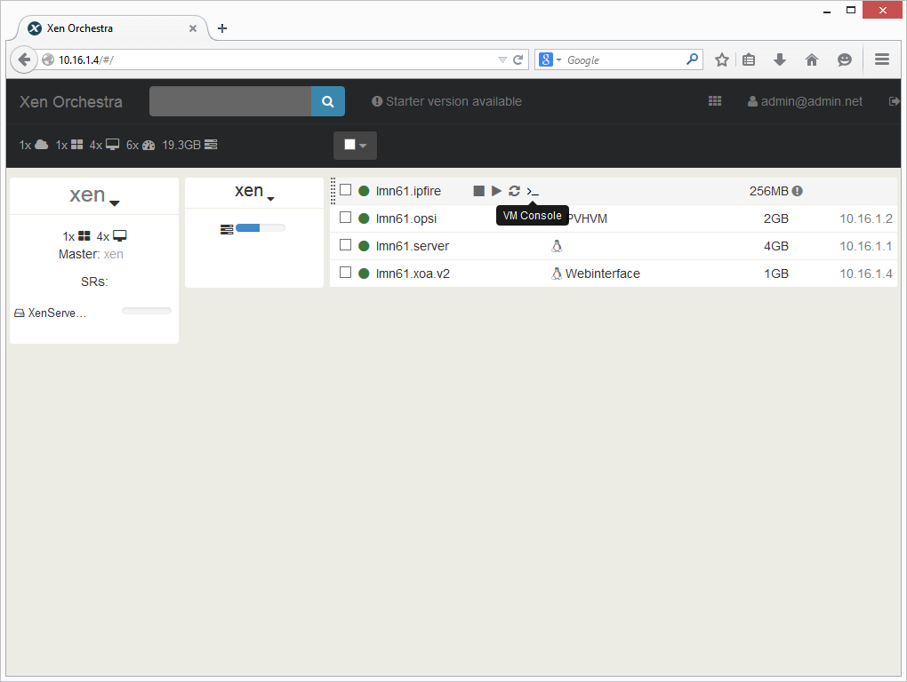

Möglichkeiten der Administration
================================

Für die Bedienung von XenServer stehen Ihnen mehrere Möglichkeiten zur Verfügung. Sofern Sie einen
Windows-Rechner im Netzwerk haben, können Sie das Programm **XenCenter** verwenden. Damit stehen 
alle Funktionen, die XenServer bietet in einer grafischen Oberfläche zur Verfügung.

Sofern Sie die bei der Installation die VM „lmn61.xoa.v2“ importiert haben, können Sie auf alle wesentlichen 
Funktionen von XenServer plattformunabhängig im Webbrowser zugreifen.

XenCenter
---------

..  figure:: ./media/administrationsmoeglichkeiten/xencenter_bild01.png
    :scale: 70%

Öffnen Sie einen Webbrowser und wechseln auf die Seite http://10.16.1.10

..  figure:: ./media/administrationsmoeglichkeiten/xencenter_bild02.png
    :scale: 70%

Klicken Sie auf „XenCenter installer“ und speichern die Datei bzw. führen diese direkt aus.
Folgen Sie dem Wizard um das Programm zu installieren

..  figure:: ./media/administrationsmoeglichkeiten/xencenter_bild03.png
    :scale: 70%

Starten Sie das Programm und klicken mit der rechten Maustaste auf XenCenter. Wählen Sie
``Add...``

..  figure:: ./media/administrationsmoeglichkeiten/xencenter_bild04.png
    :scale: 70%

Tragen Sie die IP-Adresse ``10.16.1.10`` ein und geben die Zugangsdaten ein,
XenCenter verbindet sich dann mit Ihrem Server und zeigt die virtuellen
Maschinen an.

..  figure:: ./media/administrationsmoeglichkeiten/xencenter_bild05.png
    :scale: 70%

Klicken Sie nun auf eine VM aus der Liste und wechseln auf den Reiter Console. 
Sie können nun
in der gewählten VM arbeiten, wie wenn Sie vor einem physischen Server sitzen würden.

Xen Orchestra (XOA) Web Interface
---------------------------------

.. attention:: Das XOA Webinterface steht nur zur Verfügung, wenn Sie bei der Installation die VM „lmn61.xoa.v2“ importiert haben.

..  figure:: ./media/administrationsmoeglichkeiten/xoa_bild01.png
    :scale: 70%

Öffnen Sie einen Webbrowser und wechseln auf die Seite ``http://10.16.1.4`` Geben Sie den User
``admin@admin.net`` mit dem Passwort ``admin`` ein, klicken Sie auf ``Login``.

..  figure:: ./media/administrationsmoeglichkeiten/xoa_bild02.png
    :scale: 70%

Klicken Sie auf das Kachelsymbol rechts oben und wählen ``Settings``

..  figure:: ./media/administrationsmoeglichkeiten/xoa_bild03.png
    :scale: 70%

Tragen Sie links die IP-Adresse ``10.16.1.10`` ein und das Passwort das Sie vergeben haben.
Klicken Sie zum Übernehmen auf ``Save``. Dann wird auch dort eine Liste mit den VMs angezeigt.

Wenn Sie mit der Maus über eine VM fahren erscheinen direkt einige Schaltflächen. Klicken Sie
auf ``VM Console`` um eine Maschine zu bedienen.

..  figure:: ./media/administrationsmoeglichkeiten/xoa_bild05.png
    :scale: 70%

Sie können nun
in der gewählten VM arbeiten, wie wenn Sie vor einem physischen Server sitzen würden.
