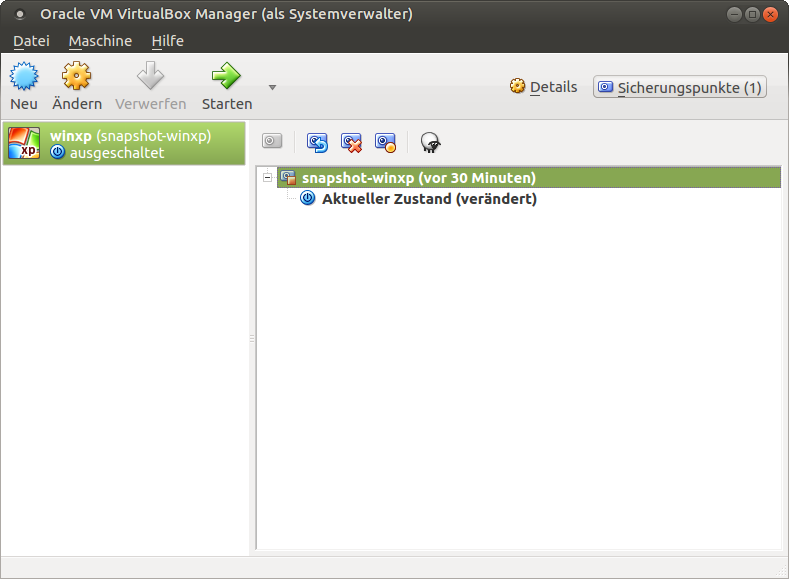

Snapshots und Basis verwalten
=============================

Jede virtuelle Maschine besitzt neben der Basis
``/PFAD/MASCHINENNAME/MASCHINENNAME.vdi`` einen Standard-Snapshot.

Bezüglich dieser Basis können weitere Snapshots erzeugt werden.

Ebenso kann man die Basis erneuern, woraufhin aber alle darauf
basierenden weiteren Snapshots wieder unbrauchbar werden.

Neue Snapshots erzeugen
-----------------------

Bezüglich der Basis können für verschiedene Varianten der virtuellen
Maschine weitere Snapshots angelegt werden.

Nachfolgendes Skript :download:`leoclient2-snapshot-create
<media/leoclient2-snapshot-create>` legt mit dem aktuellen Zustand der
VM einen neuen auswählbaren Snapshot oder setzt ohne Angabe eines
Snapshot-Namens den Standard-Snapshot neu.

.. hint::
   
   Die Basis, d.h. die zugrundeliegende Basisfestplatte wird dabei nicht
   verändert. Eine veränderte Hardwarekonfiguration speichert das Skript
   auch nicht.
   
Vorgehensweise:

- Laden Sie das Skript herunter: :download:`leoclient2-snapshot-create <media/leoclient2-snapshot-create>`
- Legen Sie es unter ``/usr/bin/leoclient2-snapshot-create`` ab und machen Sie es ausführbar. 

  .. code-block:: console
     
     $ sudo mv leoclient2-snapshot-create /usr/bin/
     $ sudo chmod 755 /usr/bin/leoclient2-snapshot-create
  
- Starten Sie als Benutzer die VM (z.B. hier winxp)

  .. code-block:: console

     $ leovirtstarter2
  
- Installieren Sie Software nehmen Sie die Änderungen vor, fahren Sie die VM herunter.
- Rufen Sie das Skript (als root) ohne Argument auf, um den Standard-Snapshot neu zu setzen, 

  .. code-block:: console
   
     $ sudo leoclient2-snapshot-create -m winxp

- oder mit einem Argument ``-s Software2016``, um einen neuen Snapshot zu erzeugen.

  .. code-block:: console
     
     $ sudo leoclient2-snapshot-create -m winxp -s Software2016

  Jetzt erscheint im Auswahlmenü von ``leovirtstarter2`` ein neue
  Snapshot mit dem Namen ``Software2016``.

VM-Basis erneuern
-----------------

.. hint::
   
   Durch eine Erneuerung der Basis werden alle darauf aufbauenden
   Snapshots unbrauchbar.

Nach dem Aufruf des Skripts ``leoclient2-base-snapshot-renew`` mit root-Rechten

.. code-block:: console

   # sudo leoclient2-base-snapshot-renew

sind einige selbsterklärende Fragen zu beantworten.

-   Soll der Vorgang abgebrochen werden? (J/N)
-   Name der virtuellen Maschine?          (VM, die erneuert werden soll)
-   Speicherort der virtuellen Maschine?   (VM, die erneuert werden soll)

Das Skript startet dann zunächst VirtualBox, um die Sicherungspunkte
zu löschen. 
Eine eventuelle Warnung, die aufgrund fehlender Verbinungen erscheint,
kann ignoriert werden. Die Ursache ist z.B. bei dem vorkonfigurierten
Ubuntu von linuxmuster.net die fehlende Verbindung zu den Homes als
linuxadmin.

   VirtualBox-Optionen für Snapshots

Klicken Sie rechts oben auf die Schaltfläche "Sicherungspunkte (1)".
Klicken Sie auf den Snapshot, löschen Sie diesen mit einem Rechtsklick
oder mit dem entsprechenden Icon und bestätigen Sie mit "Löschen" den
nächsten Dialog.
Löschen Sie so alle bestehenden Sicherungspunkte.

Im Anschluss kann die VM gestartet werden und die gewünschten
Änderungen durchgeführt werden.  Schalten Sie die VM aus. Beendet man
VirtualBox, wird eine neue Basisfestplatte unter
``/PFAD/MASCHINENNAME/MASCHINENNAME.vdi`` erzeugt und gezippt. Darüber
hinaus wird noch ein neuer Standard-Snapshot in
``/PFAD/MASCHINENNAME/snapshot-store/standard`` erzeugt und
gezippt. Der Name des neuen Snapshots, ``{..neuerSnapshot..}.vdi``,
erscheint in der Konsolenausgabe. Man sollte ihn sich merken, um im
Anschluss den alten Snapshot in ``/snapshot-store/standard`` zu
löschen.

Dazu als root auf der Konsole

``# rm /PFAD/MASCHINENNAME/{..alterSnapshot..}.vdi*``

eingeben.

