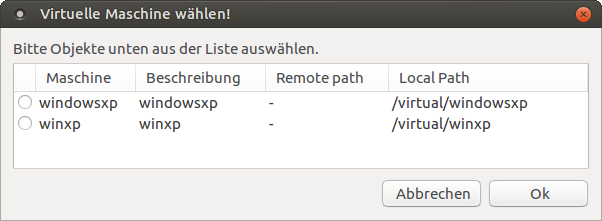

Virtuelle Maschinen starten
===========================

Das Script ``leovirtstarter2`` findet automatisch jede verfügbare VM
(Eintrag in ``/etc/leoclient2/machines``) und bietet diese zum Starten
an.  Es kann im Ubuntu Dash (Virtualbox Snapshotstarter) oder über die
Konsole gestartet werden:

.. code-block:: console

   $ leovirtstarter2

   Wählen Sie eine virtuelle Maschine

Nachdem eine VM gewählt wurde, werden mehrere Optionen angeboten

.. figure:: media/leovirtstarter2_dialog2.png
   :align: center
   :alt: Optionen zum Starten der virtuellen Maschine

   Optionen zum Starten der virtuellen Maschine

*<VM> wie vorgefunden* startet den aktuellen, unveränderten Zustand
   der VM

*<VM> Standard* verwendet den Standard-Snapshot und startet die VM,
   d.h. die virtuelle Maschine wird auf den Zustand des Snapshots
   zurückgesetzt.

*optional weitere Snapshots* wenn konfiguriert, tauchen weitere lokal
   oder auf einem Serverlaufwerk gespeicherte Snapshots auf

*Virtuelle Grafik* Diese Optionen sind bisher ohne Funktion

*Virtueller Arbeitsspeicher (RAM)* Arbeitsspeicherzuweisung an die
   VM - vorausgewählt ist ein automatisch an den vorhandenen realen
   Hauptspeicher angepasster Wert. Mit der Auswahl kann man den
   Hauptspeicher der VM etwas erhöhen oder vermindern.

Nach Auswahl wird die VM mit dem Button ``Starten!`` gestartet.
