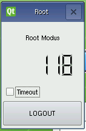

Client-Registrierung ====================

Neue Rechner werden entweder durch direkten Eintrag in die Datei ``/etc/linuxmuster/workstations`` und anschließendem Aufruf von ``import_workstations`` aufgenommen oder durch direkten Eintrag auf der Hosts-Seite der Schulkonsole -- angemeldet als `administrator` -- ins System importiert.

Registrierung über LINBO
------------------------

Die LINBO-Oberfläche (:doc:`Bedienungsanleitung LINBO <../../manuals/linbo/index>`) auf dem Client bietet jedoch auch eine Möglichkeit die Aufnahme neuer Rechner ins System vorzubereiten. 

Starten Sie den Rechner per PXE-Boot

.. image:: media/registration/linbo-empty-startpage.jpg

Klicken Sie auf den Reiter ''Imaging'' und loggen Sie sich mit dem LINBO-Passwort ein. 

.. note::
   
   Im Passwordfeld wird nichts angezeigt. Sie müssen es "blind" eintippen.

.. image:: media/registration/linbo-passwordentry.png

Nun sind Sie LINBO-Administrator. Auf der Imaging-Seite fällt das Timeout-Fenster auf, welches die Zeit anzeigt, nach der man automatisch ausgeloggt wird. Mit einem Klick auf die Checkbox, kann der Timeout deaktiviert werden. 

Über die Schaltfläche `Registrieren` öffnen Sie im nächsten Schritt das Dialogfenster ``Rechner registrieren``, das Eingabefelder für die Clientdaten anbietet. 

.. image:: media/registration/linbo-registrationdialog.png

.. note::

   Raumbezeichnung
      Geben Sie hier den Namen des Raums (z.B. r100 oder g1r100) ein. Beachten Sie bitte, dass die Bezeichnung des Raumes oder auch des Gebäudes mit einem Kleinbuchstaben beginnen muss. Sonderzeichen sind nicht erlaubt.
   Rechnername 
      z.B. in der Form r100-pc01 (max. 15 Zeichen), (evtl. Gebäude berücksichtigen g21r100-pc01 ) eingeben. Beachten Sie bitte, dass als Zeichen nur Buchstaben und Zahlen erlaubt sind. Als Trennzeichen darf nur das Minus-Zeichen „-“ verwendet werden. Leerzeichen, Unterstriche oder andere Sonderzeichen (wie z.B. Umlaute, ß oder Satzzeichen) dürfen Sie hier unter keinen Umständen verwenden.
   IP Adresse  
      Die IP-Adresse sollte zum Raum passen und außerhalb des Bereichs des DHCP-Servers liegen. Abhängig von Ihren Netzdaten z.B. 10.16.100.1 für diesen PC eingeben, üblicherweise *nicht* zwischen 10.16.1.100 und 10.16.1.200.
   Rechnergruppe 
      Die Rechnergruppe, bspw. `ubuntuclient`, wurde zuvor in der zugehörigen Datei ``start.conf.<rechnergruppe>`` festgelegt.

Ist alles korrekt ausgefüllt, werden die Clientdaten über die Schaltfläche `Registrieren` auf den Server hochgeladen. 

.. note::

   Werden weitere Clients registriert, dann muss man die Felder nicht mehr ausfüllen. Linbo inkrementiert an der richtigen
   Stelle automatisch. Z.B. wird aus `r100-pc01` = `r100-pc02` und aus der IP-Adresse `10.16.100.1` =  `10.16.100.2`.
   Es versteht sich von selbst dass, will man das Feature nutzen, man die Rechner in der richtigen Reihenfolge registrieren
   muss!

Registrierung übernehmen
------------------------

.. note::

   Sobald alle Rechner aufgenommen wurden, müssen Sie den Import der Rechner entweder in der Schulkonsole oder an der Konsole 
   starten! 

In der Schulkonsole -- angemeldet als `administrator` -- erscheinen alle neuen Clients als `noch nicht ins System übernommen`. 
Dies muss in der Schulkonsole bestätigt werden. Ein Klick auf die Schaltfläche `Hosts jetzt übernehmen` erledigt das und 
die neu registrierten Clients sind importiert.

Alternativ werden alle registrierten Clients mit dem Konsolenbefehl

::

   server ~# import_workstations

ins System übernommen.
