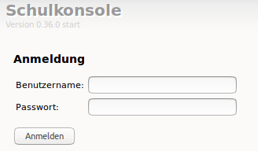

Klassenliste aktualisieren
==========================

Zu Schuljahresbeginn müssen Sie als Lehrer einmalig die Klassenliste aktualisieren. Sie fügen neue Klasse, die Sie unterrichten, hinzu und tragen Klassen aus, die Sie abgegeben haben.

Um die Klassenliste zu aktualisieren, melden Sie sich zunächst als Lehrer an der Schulkonsole an.

Klassenliste auswählen
----------------------

Nach erfolgreicher Anmeldung in der Schulkonsole für Lehrer, wählen Sie aus dem Menü `Klassen` und danach den Unterpunkt `Klassenliste` aus.

.. image:: media/menue-class.png

Sie sehen dann die bereits zugeordneten Klassen. 

.. image:: media/classoverview.png

Unter den bereits zugeordneten Klassen finden Sie ein Drop-down Menü, in dem Sie diejenigen Klassen finden, die Sie sich noch zuordnen können.

.. image:: media/getclasses.png

Wählen Sie aus dieser Liste nun diejenige Klasse aus, die Sie hinzufügen möchten und klicken auf den Button `eintragen`.
Benötigen Sie mehrere neue Klasse, so fügen Sie diese nacheinander hinzu.

Abschliessend müssen Sie sich von Ihrem Client abmelden und wieder neu anmelden, damit die Netzlaufwerke korrekt zugeordnet sind.

Dies können Sie kontrollieren, indem Sie nach der erneuten Anmeldung mit dem Dateimanger prüfen, ob für die neue Klasse ein Tauschverzeichnis vorhanden ist.
