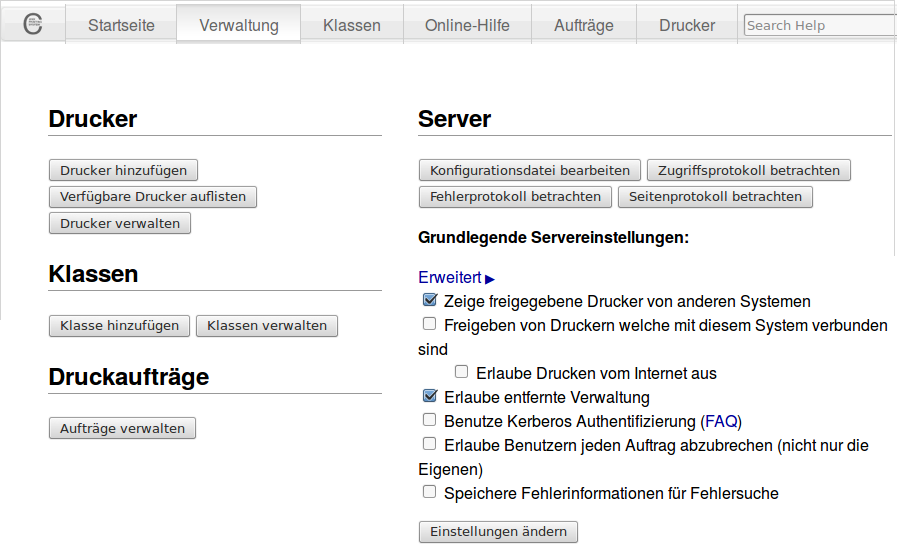

Wie richte ich Drucker am Server ein?
=====================================

Um die eingesetzten Netzwerkdrucker serverseitig einzurichten, sind diese mithilfe eines Browsers hinzuzufügen und einzurichten.

.. note:: 

   Auf dem Server ist automatisch ein PDF-Drucker eingerichtet. Auf den PDF-Drucker kann aus beliebigen Anwendungen heraus gedruckt werden. Die "gedruckte" PDF-Datei wird im Heimatverzeichnis des jeweiligen Benutzers im Ordner PDF abgelegt. Wird dieser später als Standard-Drucker festgelegt, so wird versehentliches Drucken auf einen nicht gewünschten Drucker unterbunden.

Starten Sie auf einem Rechner einen Browser, um das sog. CUPS-Webinterface zur weiteren Einrichtung der Drucker aufzurufen. Hierzu fügen Sie nachstehenden URL in der Adresszeile Ihres Browsers ein

https://server:631

Da meist nur ein selbst-signiertes Zertifikat auf dem Server installiert ist, ist es sicher nötig, dem benutzen Browser die sichere Kommunikation ausnahmsweise zu erlauben (SSL-Zertifikat akzeptieren).

Drucker hinzufügen
------------------

Rufen Sie zunächst die **Reiterkarte Verwaltung** auf. Es erscheint
nachstehende Maske:

..
   Aktivieren Sie eventuell die nötigen Kontrollkästchen. DAs
   Kontrollkästchen "Erlaube Benutzern jeden Auftrag abzubrechen" ist in
   manchen Situation hilfreich, da Lehrer oder Schüler "hängen
   gebliebene" Druckaufträge löschen können.
   
   Danach haben Sie über verschiedene Reiterkarten die Möglichkeit,
   Drucker zu verwalten (hinzufügen, konfigurieren, Drcukaufträge
   verwalten, Druckerklassen definieren, Druckerstatus abzufragen).

.. warning::

   Ändern Sie keine Konfiguration auf dieser Seite, das bleibt den
   Skripten von linuxmuster.net und einer manuellen Konfiguration in
   den Textdateien auf dem Server vorbehalten.

Klicken Sie auf der Maske unter **Drucker** --> **Drucker hinzufügen**.
Es erscheint nachstehende Maske:

.. image:: ./media/drucker-einrichten-cups/cups-server3.png

In diesem Dialog müssen Sie angeben, auf welche Weise der Drucker mit
dem Server verbunden ist. Unter Umständen werden Netzwerkdrucker
erkannt (im Beispiel "HP Officejet").

Bei nicht erkannten Netzwerkdruckern ist im Normalfall die Option
"AppSocket/HP JetDirect" korrekt. Sind Sie unsicher, schauen Sie im
Handbuch des Druckers / Printservers nach, welche Option für Ihren
Drucker zutrifft.

Klicken Sie auf **Weiter**, um zum nächsten Dialog zu gelangen.  Wurde
eine Option unter "Andere Netzwerkdrucker" ausgewählt, so muss die
genaue Verbindung manuell angegeben werden und es folgt folgender
Dialog, andernfalls wird folgender Dialog übersprungen:

.. image:: ./media/drucker-einrichten-cups/cups-server4.png
 
Im Falle eines Netzwerkdruckers müssen Sie hier die IP-Adresse oder
den Hostnamen und zusätzlich bei Verwendung eines Print-Servers, der
über mehrere Anschlüsse verfügt, noch die Warteschlange anzugeben. Zum
Beispiel:

.. code-block:: bash

   socket://10.16.203.101/lpt1

Im Zweifelsfall sollte auch hier die Bedienungsanleitung des
Printservers weiterhelfen. Klicken Sie auf **Weiter**, um zum nächsten
Dialog zu gelangen.

.. image:: ./media/drucker-einrichten-cups/cups-server2.png

In dieser Maske muss für den Drucker ein Name vergeben werden (zum
Beispiel *r203-pr01* oder *h109drucker*). Der hier vergebene Name gilt
zugleich als Freigabename für Linux- und für Windows-Clients. Die
restlichen Angaben sind zwar optional, sollten aber eingegeben werden,
um die Zuordnung nachvollziehbar zu halten. 

Klicken Sie auf **Weiter**, um zur Auswahl des Druckermodells zu gelangen.

.. image:: ./media/drucker-einrichten-cups/cups-server5.png

Wählen Sie in Liste Ihr Druckermodell aus. Mit **Weiter** werden
Treiber zur Auswahl angeboten. Stehen für Ihr Modell mehrere Treiber
zur Auswahl stehen, wählen Sie den empfohlenen Treiber (recommended)
aus. Sollte Ihr Modell nicht in der Liste erscheinen, laden Sie
über den Button **Durchsuchen** die sog. PPD-Datei für Ihren Drucker
hoch. Die PPD-Datei ist beinhaltet einen Treiber für den Drucker für
Linux. Diese Treiber erhalten Sie auf der Seite Ihres
Druckerherstellers. Laden Sie diese lokal herunter. Danach können Sie
die PPD-Datei auf den linuxmuster.net Server mit o.g. Dialog
hochladen.

.. image:: ./media/drucker-einrichten-cups/cups-server6.png

Eventuell kann Ihr Drucker auch mit der Marke "Generic" und einem
entsprechenden Treiber (z.B. "Generic PCL 5e ... (recommended)")
bereits drucken.

Mit Klick auf **Drucker hinzufügen** schließen Sie die
Druckerinstallation. Dafür benötigt das CUPS-Webinterface die
Authentifizierung als **administrator**.

.. image:: ./media/drucker-einrichten-cups/cups-server-anmeldung.png

Danach gelangen Sie zur Einstellungsseite des
Druckers.

Drucker konfigurieren
---------------------

.. image:: ./media/drucker-einrichten-cups/cups-server7.png

Hier können Sie abhängig vom Druckermodell verschiedene Einstellungen für das Standardverhalten des Druckertreibers vornehmen (zum Beispiel die Seitengröße auf A4 einstellen, Duplexdruck etc., falls dies nicht standardmäßig vorgesehen ist). 

Klicken Sie im Dialog für die Standardeinstellungen auf den Menüpunkt **Richtlinien**, um hier das Verhalten des Druckers im Fehlerfall festzulegen.

.. image:: ./media/drucker-einrichten-cups/cups-server7a.png

Geben Sie unter "Fehlerbehandlung"  **abort-job** an, um sicherzustellen, dass CUPS im Fehlerfall den Druckjob löscht.

Über den Knopf **Standardeinstellungen festlegen** werden Sie schließlich zur Verwaltungsseite des neu eingerichteten Druckers weitergeleitet:

.. image:: ./media/drucker-einrichten-cups/cups-server8.png

Hier können Sie

- eine Testseite ausdrucken lassen,
- den Drucker (die Ausführung von Druckaufträgen) stoppen und wieder starten,
- die Entgegennahme von Druckaufträgen sperren und wieder freischalten,
- die Druckereinrichtung wiederholen, um IP-Adresse oder Druckertreiber zu ändern,
- die Druckereinstellungen anpassen oder
- erlaubte Benutzer festlegen.

Nun ist Ihr Netzwerkdrucker betriebsbereit und kann auf den Arbeitsstationen eingerichtet werden. 

Angesprochen wird obiger Drucker über den URL:

http://server:631/printers/r203-pr01

PDF-Drucker aktivieren
----------------------

Der standardmäßig eingerichtete PDF-Drucker wird über den URL

http://server:631/printers/PDF-Printer

angesprochen. Jetzt kann auch über den PDF-Drucker in eine PDF-Datei gedruckt werden, die auf dem Server im Homeverzeichnis des Benutzers im Unterverzeichnis PDF abgelegt wird.

