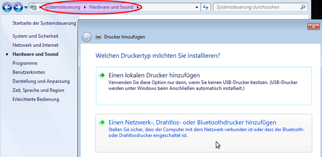

Wie richte ich Drucker auf den Clients ein?
===========================================

Clientseitig müssen Drucker über das HTTP-Protokoll eingerichtet werden, damit die raumbezogene Druckerzugriffskontrolle
über die Schulkonsole funktioniert.
Die URL für die Druckerverbindung wird nach folgendem Schema zusammengesetzt:

.. code-block:: bash

   http://<servername>:631/printers/<Druckername>

**PDF Drucker**

Beispielhaft wird der standardmäßig eingerichtete PDF-Drucker über die URL

http://server:631/printers/PDF-Printer

angesprochen. Damit der PDF-Drucker auf dem Client genutzt werden kann, muss auf dem Client ein Standard-Postskript-Drucker eingerichtet werden.

Linux Clients
-------------

Die Druckerinstallation auf den Clients erfolgt automatisch mithilfe eines sog. universellen Postsync - Scripts. Voraussetzung ist, dass die Drucker bereits auf dem Server eingerichtet wurden und als Linux Client das vorkonfigurierte Musterimage (Cloop) genutzt wird. Dieses gibt es für Ubuntu 14.04 (trusty) und Ubuntu 16.04 (xenial).

Auf dem Server existiert dann folgende Datei in einem der Verzeichnisse:

.. code::

   /var/linbo/linuxmuster-client/trusty/common/etc/hosts
   /var/linbo/linuxmuster-client/xenial/common/etc/hosts

Diese Datei weist nachstehende Rechte auf:

.. code::

   -rw-r--r-- 1 root root 459 Jul 18 2014 hosts

In dieser Hosts Datei findet sich folgender Inhalt, der dann mithilfe des Postsync-Scripts rechnerspezifisch angepasst wird:

.. code::

   # Diese Datei wird per postsync gepatcht. Zu bearbeiten ist sie auf dem Server.
   # Pfad: /var/linbo/linuxmuster-client/trusty/common/etc/hosts
   # HOSTNAME wird im Postsyncskript mit dem echten Namen gepatcht
   127.0.0.1    HOSTNAME
   #Die nächste Zeile enthält die Hostnamen so, wie sie auf dem Server eingetragen sind...
   #SERVERIP server.linuxmuster.local server
   # damit CUPS zufrieden ist, muss noch diese Zeile hier dazu:
   #SERVERIP  server.lokal server.local

Das Postsync-Script liegt im Verzeichnis:

.. code::

   /var/linbo/<LinuxImagename>.cloop.postsync

Es weist folgende Rechte auf:

.. code::

   -rw-rw---- 1 root root

In dem Postsync-Script finden sich folgende Eintragungen (hier für Trusty-Cloop):

.. code::

    echo "##### trusty-linuxmuster POSTSYNC BEGIN #####"

    # IP-Adresse des Server
    SERVERIP=10.16.1.1
    STARTCONF=/cache/start.conf

    # Raum feststellen. Dieses Skript geht davon aus
    # dass die Rechner Namen der Form
    # raumname-hostname haben, also z.B. cr01-pc18
    RAUM=${HOSTNAME%-*}
    # wenn der string leer ist, raum auf unknown setzen
    if [ "x${RAUM}" == "x" ]; then
        RAUM="unknown"
    fi

    # Das Verzeichnis, in dem die Serverpatches
    # local synchronisiert werden.
    PATCHCACHE=/linuxmuster-client/serverpatches
    # UVZ auf dem Server. Mit diesem Variablen kann
    # man verschiedene Images bedienen (was bei linux
    # selten nötig ist)
    PATCHCLASS="trusty"

    echo ""
    echo "Hostname:      ${HOSTNAME}"
    echo "Raum:          ${RAUM}"
    echo "Patchcache:    ${PATCHCACHE}"
    echo "Patchclass:    ${PATCHCLASS}"
    echo ""
    if [ ! -d /cache/${PATCHCACHE}/${PATCHCLASS} ]; then
      echo "Patchklasse ist nicht vorhanden."
      echo "Auf dem Server mit mkdir -p /var/linbo/linuxmuster-client/${PATCHCLASS}/common/ das Grundverzeichnis anlegen und dort die gepatchten Dateien ablegen."
    fi

    # -----------------------------------------
    # Patchdateien auf das lokale Image rsyncen
    # -----------------------------------------
    echo " - getting patchfiles"

    # RAUM     -> Raumname
    # HOSTNAME -> Rechnername
    # Verzeichnis anlegen, damit es sicher existiert
    mkdir -p /cache/${PATCHCACHE}
    rsync --progress -r "${SERVERIP}::linbo/linuxmuster-client/${PATCHCLASS}" "/cache/${PATCHCACHE}"

    echo " - patching local files"
    # zuerst alles in common
    if [ -d /cache/${PATCHCACHE}/${PATCHCLASS}/common ]; then
        cp -ar /cache/${PATCHCACHE}/${PATCHCLASS}/common/* /mnt/
    fi

    # dann raumspezifisch
    if [ -d /cache/${PATCHCACHE}/${PATCHCLASS}/${RAUM} ]; then
        cp -ar /cache/${PATCHCACHE}/${PATCHCLASS}/${RAUM}/* /mnt/
    fi

    # dann rechnerspezifisch
    if [ -d /cache/${PATCHCACHE}/${PATCHCLASS}/${HOSTNAME} ]; then
        cp -ar /cache/${PATCHCACHE}/${PATCHCLASS}/${HOSTNAME}/* /mnt/
    fi

    # -----------------------------------
    # Berechtigungen anpassen, wenn nötig
    # -----------------------------------
    echo " - setting permissions of patched local files"

    # printers.conf
    #[ -f /mnt/etc/cups/printers.conf ] && chmod 600 /mnt/etc/cups/printers.conf

    # .ssh verzeichnis
    #chmod 700 /mnt/root/.ssh/
    #chmod 600 /mnt/root/.ssh/authorized_keys

    # hostname in /etc/hosts patchen
    sed -i "s/HOSTNAME/$HOSTNAME/g" /mnt/etc/hosts
    sed -i "s/#SERVERIP/$SERVERIP/g" /mnt/etc/hosts

    # fstab anpassen, damit Swap-Partition stimmt
    echo "---- hier beginnen wir mit dem debuggen:"
    SWAPZEILENNR=$(grep -i "^fstype" $STARTCONF | cut -d"#" -f1 | grep -n -i "swap" | cut -d":" -f1)
    echo Swapzeilennummer: $SWAPZEILENNR
    SWAP=$(grep -i "^dev" -m $SWAPZEILENNR $STARTCONF | tail -n1 | cut -d"=" -f2 | tr -d [:blank:]|head -c9)
    echo Swap: $SWAP
    sed -i "s|#dummyswap|$SWAP|g" /mnt/etc/fstab

    echo "##### trusty-linuxmuster POSTSYNC END #####"

.. note::
   
   **Hinweis für linuxmuster.net Version 6.2**

   Sollte bei Verwendung des Postsync-Scripts auf dem Client ein Drucker nicht ansteuerbar sein, obwohl
   dieser am Server eingerichtet wurde, so sollten noch am CUPS-Dienst des Servers alle sog. 
   **CUPS-browsed** Einträge und für den **CUPS-Dienst** des Clients alle Browse-Poll Einträge entfernt 
   werden. Dies liegt daran, dass auf dem Server eine ältere CUPS-Version installiert ist als auf den 
   Clients, deren CUPS-Version ab Ubuntu 14.04 aktueller ist.

   Die Einträge sind wie folgt zu entfernen:

   **Server-Cups: Datei /etc/cups/cupsd.conf** - alle Einträge mit cups-browsed auskommentieren
   **Client-Cups: Datei /etc/cups/cupsd.conf** - alle Einträge mit BrowsePoll auskommentieren
   

.. seealso::

   https://ask.linuxmuster.net/t/netzwerkdrucker-verschwinden/181

Alternativ: Druckerinstallation manuell
^^^^^^^^^^^^^^^^^^^^^^^^^^^^^^^^^^^^^^^

Die Druckerinstallation auf dem Linux-Client lässt sich wie auf dem Server mit Hilfe des CUPS-Webinterfaces
bewerkstelligen. Loggen Sie sich auf dem Client mit einem Browser über die URL http://localhost:631/admin als lokaler
Benutzer **administrator** auf der CUPS-Administrationsseite ein.

.. image:: media/drucker-einrichten-client-linux/drucker-linux1.png

Klicken Sie hier unter der Rubrik Drucker auf **Drucker hinzufügen**.

.. image missing: media/drucker-einrichten-client-linux/drucker-linux2.png

Wählen Sie im nächsten Schritt als Netzwerkdrucker **Internet-Druckprotokoll (https)**.

.. image missing: media/drucker-einrichten-client-linux/drucker-linux3.png

Wählen Sie im nächsten Schritt für unter Drucker hinzufügen die korrekte Adresse. Wird der Netzwerkdrucker über den linuxmuster.net Server angesteuert, so ist dessen Adressen anzugeben:

.. code::

  **https://10.16.1.1/printers<druckername>**

.. image missing: media/drucker-einrichten-client-linux/drucker-linux4.png

Wählen Sie danach die korrekte Druckermarke für den einzurichtenden Drucker aus.

.. image missing: media/drucker-einrichten-client-linux/drucker-linux5.png

Wählen Sie abschliessend das geeignete Druckermodell aus, oder wählen Sie eine eigene sog. PPD-Datei aus, die auf dem Client installiert werden soll.

.. image missing: media/drucker-einrichten-client-linux/drucker-linux6.png

Die weiteren Einrichuntsschritte entsprechen denen, wie sie auf dem Server bereits ausgeführt wurden.

.. attention::

   Hier finden Sie die einzelnen Schritte:

   :doc:`3-drucker-einrichten-cups`

Windows Clients
---------------

Melden Sie sich lokal am Windows-Client als **administrator** an und rufen Sie den Druckerinstallations-Assistnten auf, oder starten Sie den Druckerinstallations-Assistenten als Benutzer **administrator**.
Den Druckerinstallations-Assistenten rufen Sie wie folgt auf:
** Systemsteuerung --> Hardware und Sound --> Geräte und Drucker --> Drucker**

Wählen Sie im Assistnten im Dialog **Drucker hinzufügen** die Option **Einen Netzwerk-, Drahtlos- oder Bluetoothdrucker hinzufügen**.

Im folgenden Dialogfenster beenden Sie die Druckersuche und gehen über die Schalftfläche Der gesuchte Drucker ist nicht aufgeführt zum nächsten Schritt.

.. image:: media/drucker-einrichten-client-windows/win7druck2.png

Wählen Sie nun die Option *Freigegebenen Drucker* über den Namen auswählen und schreiben die Drucker-URL gemäß der Vorgabe aus dem
Abschnitt Druckereinrichtung in das Eingabefeld (Beispiel http://server:631/printers/Netzwerkdrucker).

.. image:: media/drucker-einrichten-client-windows/win7druck3.png

Nach Abschluss der Treiberinstallation steht der Drucker in unserem Beispiel als Netzwerkdrucker auf http://server:631 zur Verfügung.

**Beispiel: PDF-Drucker**

Für die Nutzung des PDF-Druckers muss ein Postskript-Drucker eingerichtet werden.
Starten Sie über den Druckerinstallations-Assistenten die Installation eines Netzwerkdruckers und geben als Netzwerkpfad die URL des
PDF-Printers an (siehe :doc:`2-drucker-hinzufuegen`). Wählen Sie im weiteren Verlauf des Installationsdialogs das
**Druckermodell MS Publisher Color Printer**, das unter **Hersteller Generic** aufgeführt ist:

.. image:: media/drucker-einrichten-client-windows/win7druck4.png

Nach Abschluss der Druckerinstallation steht der PDF-Drucker als PDF-Printer an http://server:631 zur Verfügung.

