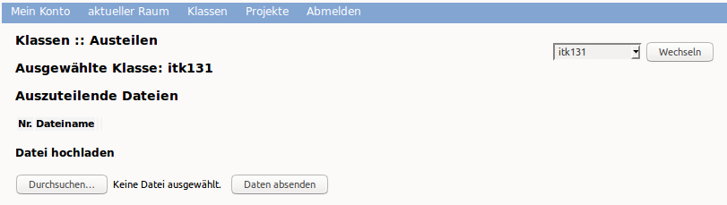
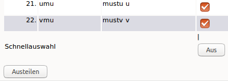
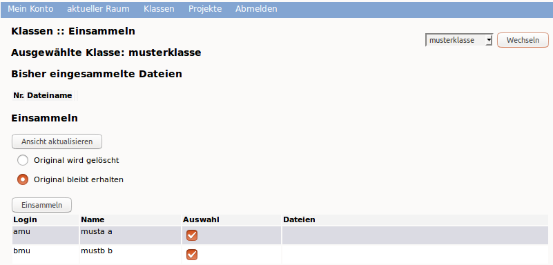

Unterricht: Austeilen von Dateien und weitere Funktionen
========================================================

Mithilfe der Schulkonsole können Sie in Ihrem Unterricht folgende Funktionen nutzen:

* Austeilen
* Einsammeln
* Klassenarbeit

Wollen Sie die Funktionen unmittelbar in dem Raum nutzen, in dem Sie unterrichten, wählen Sie diese Funktionen im Menü `aktueller Raum`. 

Möchten Sie vorbereitend diese Funktionen für eine Ihrer Klassen verwenden, wählen Sie die gewünschte Funktion aus dem Menü `Klassen` aus.

Austeilen
---------

Nachdem Sie sich an der Schulkonsole als Lehrer angemeldet haben, gehen Sie zu dem Menüpunkt `Klassen` und dort zum Unterpunkt `Auteilen`.

Sie sehen dann die Übersicht der auszuteilenden Dateien für eine Klasse.

Wählen Sie nun oben rechts die gewünschte Klasse im Drop-don Menü aus. Danach klicken Sie auf den Button Durchsuchen`, um eine auszuteilende Datei hochzuladen. Es erscheint Ihr Dateimanager. Hier wählen Sie aus dem geeigenten Verzeichnis die gewünschte Datei aus. Danach erscheint der Dateiname in der Liste der auszuteilenden Dateien. Um diese noch für das Austeilen zur Verfügung zu stellen, klicken Sie auf den Button `Daten absenden`.

Alle zu verteilende Dateien erscheinen in der darüber angezeigten Dateiliste. Wollen Sie weitere Dateien hinzufügen, so ist o.g. Vorgang entsprechend zu wiederholen.

.. image:: media/copy-files-class.png

Um die so bereitgestellten Dateien nun zu verteilen, wählen Sie die Schüler der Klasse aus, denen Sie die Dateien zur Verfügung stellen wollen. Hierzu klicken Sie pro Schüler in der Spalte `Auswahl` auf die Auswahlbox. Sollen alle Schüler der Klasse die Dateien erhalten, so können Sie hierzu die Auswahlbox unterhalb der Spalte nutzen. Danach klicken Sie auf den Button `austeilen`.
Auszuteilende Dateien liegen dann in Ihrem Heimatverzeichnis unter `_auszuteilen -> auszuteilen-Klasse`.

Die auszuteilenden Dateien liegen nun in den Heimatverzeichnissen der Schüler/innen in dem Ordner `__austeilen -> austeilen-Klasse`.

Einsammeln
----------

Haben Schüler Dateien erstellt, die Sie als Lehrkraft einsammeln möchten, so müssen Sie Schüler die Dateien in ihrem Heimatverzeichnis im Ordner `__einsammeln` ablgen. Es kann auch in diesem Ordner ein Verzeichnis angelegt werden, in das mehrere Dateien abgelegt werden. Beim Einsammlen würden dann pro Schüler das Verzeichnis mit allen enthaltenden Dateien eingesammelt werden.

Haben die Schüler ihre Dateien entsprechend kopiert, rufen Sie in der Schulkonsole das Menü `Klassen` und dort das Untermenü `Einsammeln` auf.

Sie sehen hinter jedem Schüler, ob und welche Dateien bereitgestellt wurden.
Wählen Sie aus, ob die einzusammelnden Dateien erhalten bleiben oder gelöscht werden sollen.
Wählen Sie die Schüler/innen, von denen Sie einsammeln wollen, oder die ganze Klasse aus. 

Sie finden die eingesammelten Arbeiten in Ihrem Heimatverzeichnis unter „_eingesammelt -> eingesammelt-Klasse“.

Klassenarbeit
-------------

Im Klassenarbeitsmodus

