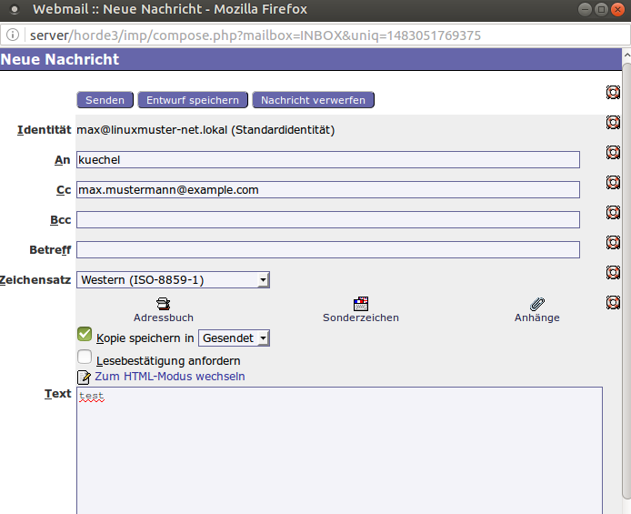
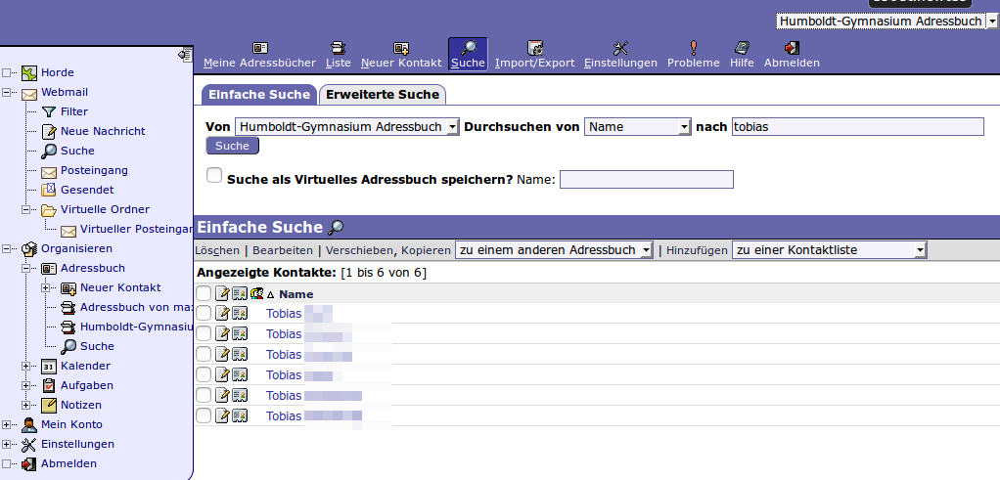
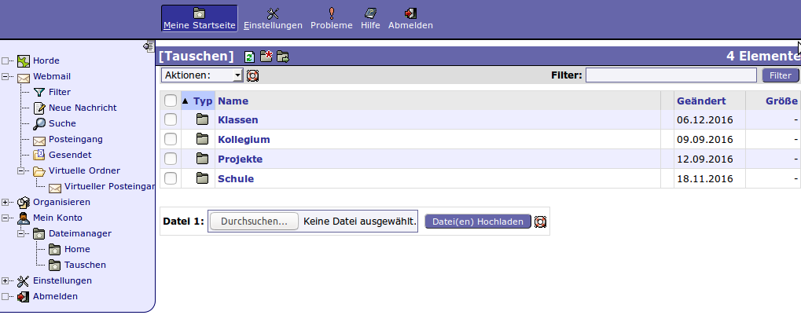

===================================
Schulinternen E-Mail-Versand nutzen
===================================

Diese Schritt-für-Schritt-Anleitung erklärt, wie Sie im Schulnetzwerk
E-Mails mit Hilfe eines Webmailers versenden und empfangen können. In
dem Webmailer ist auch die Möglichkeit enthalten, Weiterleitungen auf
externe E-Mail-Adressen einzurichten und auf die "Home_auf_Server" und
"Tausch"-Verzeichnisse zuzugreifen.

Auf dem Schulserver läuft ein Webmail-Programm mit dem Namen
*Horde*. Rufen Sie im Browser die Adresse

https://server/horde3

auf. Üblicherweise ist diese Adresse nur von innerhalb des
Schulnetzwerkes erreichbar.

.. figure:: media/horde-login-https.png

Melden Sie sich mit Ihrem Benutzernamen und Passwort des Schulkontos
an.  Auf der Startseite können Sie das Speicherplatzkontingent
einsehen. 

.. figure:: media/horde-defaultscreen.png

Unter *Webmail* -> *Posteingang* erreichen Sie ihr Mail-Konto.  Unter
*Neue Nachricht* wird ein neues Fenster geöffnet.

Ihre eigene E-Mail-Adresse wird unter "Identität" angezeigt und ist -
je nach Schulkonfiguration - auf "benutzername@linuxmuster-net.lokal"
eingestellt. Das bedeutet, dass Sie mit dieser E-Mail-Adresse nur
interne E-Mails von anderen Schülern oder Lehrern bekommen können,
denn "linuxmuster-net.lokal" ist keine weltweit eindeutige Adresse.

Für interne Adressen kann die E-Mail-Domäne weggelassen werden. Man
kann aber auch weltweit gültige E-Mail-Adressen als Empfänger
einstellen.

.. warning::
   
   Standardmäßig wird der Versand an weltweite Adressen
   erlaubt. Vorsicht: Die Empfänger dieser E-Mail können nicht darauf
   antworten, wenn "linuxmuster-net.lokal" als Domäne in Ihrer Schule
   voreingestellt ist.

Adressbuch verwenden
====================

Um Schüler und Lehrer im Adressbuch zu finden, wählen Sie im Menü *Organisieren* -> *Adressbuch* -> *Suche* aus und suchen Sie nach Namensbestandteilen.

  
Weiterleitung an externe E-Mail-Adressen konfigurieren
======================================================

Horde erlaubt die Einrichtung vieler unterschiedlicher sogenannter
Filter für das Mailsystem. Der wohl wichtigste davon ist der
vordefinierte Filter *Weiterleitung*, den man im Menü über
*Einstellungen* -> *Filter* und dann im oberen Menü *Weiterleitung*
erreicht. Man trägt dort ein oder mehrere gewünschte Adressen zur
Weiterleitung ein und entscheidet, ob zusätzlich eine Kopie im 
Postfach an der Schule verbleiben soll.

.. figure:: media/horde-forwarding.png

Zugriff auf Tauschordner und Heimatverzeichnis
==============================================

Um auf die eigenen Dateien auf dem Server ("Home_auf_Server") und auf die Tauschverzeichnisse zuzugreifen, wählen Sie im Menü *Mein Konto* -> *Dateimanager* -> *Home* bzw. *Tauschen*.

.. warning:: 

   Sollten Umlaute im Dateinamen vorkommen, kann man die Dateien nicht
   herunterladen. Ändern Sie den Dateinamen am Schulcomputer im
   dortigen Dateimanager.

   Dateien, die heruntergeladen werden, sollten standardmäßig
   abgespeichert werden, da ein direktes Ausführen meist nicht
   funktioniert.

Melden Sie sich nach getaner Arbeit über *Abmelden* ab.	  
