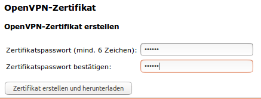

OpenVPN nutzen
==============

Um auf den linuxmuster.net Server von außen zuzugreifen, können Sie eine VPN-Verbindung herstellen. Diese ermöglicht es eine verschlüsselte Verbindung zum Server aufzubauen.

Hierzu hat der Netzwerkbetreuer auf dem IPFire-Server bereits den OpenVPN-Server aktiviert und für die Benutzer ein Zertifikat  eingerichtet. 

Ob dies so ist könen Sie selbst in der Schulkonsole einsehen. 

VPN-Zertifikat herunterladen
----------------------------

Melden Sie sich an der Schulkonsole an und gehen Sie mit der Bildlaufleiste zum Ende der Übersichtseite Ihres Kontos. Dort finden Sie unter `OpenVPN-Zertifikat` zwei Möglichkeiten:

Sie sehen dann die Übersicht der auszuteilenden Dateien für eine Klasse.

.. image:: media/download-vpn-certificate.png

Wählen Sie nun oben rechts die gewünschte Klasse im Drop-don Menü aus. Danach klicken Sie auf den Button Durchsuchen`, um eine auszuteilende Datei hochzuladen. Es erscheint Ihr Dateimanager. Hier wählen Sie aus dem geeigenten Verzeichnis die gewünschte Datei aus. Danach erscheint der Dateiname in der Liste der auszuteilenden Dateien. Um diese noch für das Austeilen zur Verfügung zu stellen, klicken Sie auf den Button `Daten absenden`.

Alle zu verteilende Dateien erscheinen in der darüber angezeigten Dateiliste. Wollen Sie weitere Dateien hinzufügen, so ist o.g. Vorgang entsprechend zu wiederholen.

.. image:: media/copy-files-class.png

Um die so bereitgestellten Dateien nun zu verteilen, wählen Sie die Schüler der Klasse aus, denen Sie die Dateien zur Verfügung stellen wollen. Hierzu klicken Sie pro Schüler in der Spalte `Auswahl` auf die Auswahlbox. Sollen alle Schüler der Klasse die Dateien erhalten, so können Sie hierzu die Auswahlbox unterhalb der Spalte nutzen. Danach klicken Sie auf den Button `austeilen`.
Auszuteilende Dateien liegen dann in Ihrem Heimatverzeichnis unter
