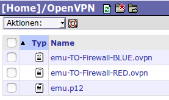
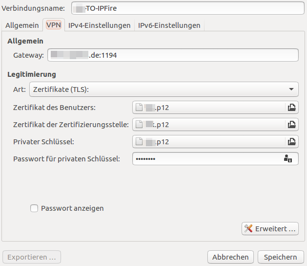
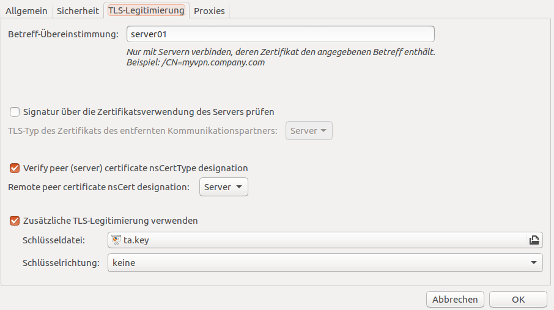

OpenVPN nutzen
==============

Externer Zugang zum Schulnetz
-----------------------------

**Funktionsweise**

Sie können auch von extern auf das Schulnetzwerk zugreifen. Hierzu müssen Sie Ihren Computer (temporär) in das Schulnetzwerk integrieren. Dies funktioniert über ein sogenanntes „Virtual Private Network“, kurz VPN genannt. Dies erstellt über Ihre Internetverbindung einen abhörsicheren Tunnel in die Schule und integriert Ihren PC in das Schulnetzwerk. Sie bekommen (temporär) eine schulinterne IP-Adresse. Voraussetzung ist, dass Ihr Schulserver mithilfe einer Internet-Adresse (URL) erreichbar ist. Ob dies so ist, kann Ihnen Ihr Administrator des Schulnetzes sagen. 

Alle Aktivitäten, die Sie mit geöffnetem VPN-Tunnel im Internet durchführen, laufen über den Schulserver bzw. die Schul-Internetleitung. Es gilt somit die Nutzervereinbarung der Schule. Da die Schule i.d.R. nur über eine einfache DSL-Leitung verfügt, sollten Sie z.B. das Herunterladen oder das Bereitsstellen von größeren Dateien in den Tauschordner (v.a. während der Unterrichtszeit) vermeiden.

.. warning::

   Je nach Einstellung kann es sein, dass sie auf Ihr Netzwerk zu Hause (Netzwerkdrucker, Network    
   Attached Storage, Netzwerkfreigaben) während eines geöffneten Tunnels nicht zugreifen können.
   Die Internet-Geschwindigkeit ist durch die geringe Upload-Geschwindigkeit der Schul-Internetverbindung   
   langsam. 

.. note::

   VPN ist nicht für einen Internet-Zugriff gedacht.

Der VPN-Tunnel wird verschlüsselt, damit der Datenverkehr nicht abgehört werden kann. Hierfür benötigen Sie ihren persönlichen Schlüssel, der zusätzlich mit einem Passwort gesichert ist.

Hierzu hat der Netzwerkbetreuer auf dem IPFire-Server bereits den OpenVPN-Server aktiviert.

Ob dies so ist, können Sie selbst in der Schulkonsole kontrollieren.

VPN-Zugang einrichten
--------------------- 

VPN-Zertifikat erstellen
^^^^^^^^^^^^^^^^^^^^^^^^

Melden Sie sich an der Schulkonsole an und gehen Sie mit der Bildlaufleiste zum Ende der Übersichtseite Ihres Kontos zum Bereich `OpenVPN-Zertifikat`.

Sehen Sie nachstehende Eingabemöglichkeit,

.. image:: media/create-vpn-certificate.png

so erstellen Sie für sich ein OpenVPN-Zertifikat, indem Sie ein Kennwort für das Zertifikat festlegen. Bestätigen Sie dieses Kennwort in der darunter liegenden Zeile und klicken Sie dann den Button `Zertifikat erstellen und herunterladen`.

Danach erhalten Sie die Bestätigung, dass das Zertifikat für Sie erstellt wurde:

.. image:: media/creation-vpn-certificate-validated-1.png

.. image:: media/creation-vpn-certificate-validated-2.png

Die Dateien des Zertifikates finden Sich nun in Ihrem Home-Laufwerk im Verzeichnis `OpenVPN`.

Laden Sie diese Dateien herunter. Sie benötigen diese zur Nutzung Ihres VPN-Clients.
Haben Sie Zertifikate für sich erstellt und heruntergeladen, müssen Sie Ihren Administrator bitten, diese noch zu aktivieren.

VPN-Client einrichten
^^^^^^^^^^^^^^^^^^^^^

Haben Sie sich die Schlüssel- und Konfigurationsdateien heruntergeladen, benötigen Sie noch eine Client- Software für den Zugriff via OpenVPN.

Windows-Client
""""""""""""""

Sie benötigen den aktuellen OpenVPN-Client 2.4 (OpenSource - `Download OPenVPN Windows <https://swupdate.openvpn.org/community/releases/openvpn-install-2.4.2-I601.exe>`_) 

**Konfiguration**

Bei der Installation des OpenVPN Clients werden unter Windows neue Netzwerkadapter (TUN- und TAP-Devices installiert. Der OpenVPN-Client wird dabei in das Verzeichnis ``C:\Programme\OpenVPN\`` installiert.

Kopieren Sie nun die heruntergeladenen Dateien in das Unterverzeichnis ``c:\Programme\OpenVPN\config\``. 
Öffnen Sie nun als Administrator die Datei ``<dateiname>-RED.ovpn`` und passen Sie ggf. Einträge an. 

Für Windows haben sich bislang folgende Einträge bewährt:

.. code::

   #OpenVPN Server conf
   tls-client
   client
   dev tun
   proto udp
   tun-mtu 1400
   remote <IP des Servers oder Adresse> 1194
   pkcs12 <benutzer>.p12
   cipher BF-CBC
   comp-lzo
   verb 3
   ns-cert-type server
   route-method exe
   route-delay 2

Testen Sie nun die Verbindung, indem Sie mit der rechten Maustaste auf das Symbol des OpenVPN-Clients klicken und diesen dann *als Administrator* starten. Rechts unten in der Symbolleiste finden Sie dann das Symbol des gestarteten OpenVPN-Clients. Klicken Sie mit der rechten Maustaste hierauf und wählen Sie den Menüpunkt `Connect` aus. Sie werden nach dem Kennwort gefragt. Haben Sie das Kennwort des OpenVPN-Zertifikats erfolgreich eingegeben, wird eine Verbindung aufgebaut. War dieser Vorgang erfolgreiche, sehen Sie unten rechts in der Symbolleiste einen grünen Tunnel.

Linux-Clients
"""""""""""""

Sie benötigen ebenfalls den aktuellen OpenVPN-Client. Installieren Sie diesen mit Ihrer Paketverwaltung. Unter Ubuntu geben Sie bitte folgende Befehle zur Installation an:

.. code::

   sudo apt-get update
   sudo apt-get install openvpn

**Konfiguration**

Es kann mithilfe der grafischen Oberfläche Gnome der sog. Netzwerkmanager zur Konfiguration genutzt werden. Damit dieser ebenfalls für VPN-Verbindungen genutzt werden kann, muss noch das Plugin hierfür installiert werden.

Hierzu sind folgende Befehle auf der Konsole anzugeben:

.. code::

   sudo apt-get update
   sudo apt-get install network-manager-openvpn network-manager-openvpn-gnome

Nach der Installation ist der Netzwerkmanager wie folgt neu zu starten:

.. code::

   sudo service network-manager restart

Legen Sie einen neuen Ordner OpenVPN in Ihrem Benutzerverzeichnis (`Persönlicher Ordner`) an. Kopieren Sie die zuvor heruntergeladenen Dateien in dieses Verzeichnis.

.. image:: media/openvpn-config-files-ubuntu.png

Klicken Sie jetzt auf das Doppelpfeil-Symbol in der Kopfleiste, um den Netzwerkmanagers aufzurufen. Wählen Sie den Menüpunkt `VPN Verbindungen bearbeiten` aus. 

.. image:: media/openvpn-ubuntu-network-manager-setup.png

Wählen Sie im neuen Fenster `Netzwerkverbindungen` Den Button `Hinzufügen`. Wählen Sie dann als Verbindungstyp `OpenVPN` aus und klicken den Button `Erzeugen`.

In dem neuen Fenster geben Sie bitte einen Namen für die VPB-Verbindung an. Die weiteren Felder füllen Sie wie in den beiden nachstehenden Abbildungen angegeben. Die angegebenen Dateinamen sind die Dateien, die Sie soeben in das Verzeichnis OpenVPN kopiert haben.

In o.g. Fenster klicken Sie auf den Button `Erweitert...`.

Speichern Sie nun die OpenVPN-Verbindung ab.

Testen Sie den Verbindungsuafbau, in dem Sie oben rechts mit der rechten Maustaste auf das Doppelpfeil-Symbol des Netzwerkmanagers klicken und danach den Menüeintrag VPN-Verbindungen -> <Meine-OpenVPN-Verbindung> auswählen, die Sie gerade angelegt haben.

Der erfolgreiche Verbindungsaufbau wird dann im Netzwerkmanager bestätigt.

MAC-Clients
"""""""""""

Unter MAC OS X benötigen Sie als Client für OpenVPN das Programm `Tunnelblick` (`Download OpenVPN MAC <https://tunnelblick.net/release/Tunnelblick_3.6.9_build_4685.dmg>`_).

Installieren Sie dieses Programm. Während der Installation werden Sie nach einem Benutzer und einem Kennwort gefragt. Hier müssen Sie einen lokalen Benutzernamen mit Administratorrechten des MAC OS X Systems angeben - nicht den OpenVPN-Benutzer.

**Konfiguration**

War die Installation erfolgreich klicken Sie am Ende der Installation auf den Button `Ausführen`. Sie gelangen in das nächste Fenster `Willkommen zu Tunnelblick`. Klicken Sie hier den Button `Ich habe Konfigurationsdateien`. Danach wählen Sie die heruntergeladenen Zertifikatsdateien (OVPN-Datei und Zertifikatsdateien) aus. Zum Abschluss der Konfiguration geben Sie an, dass die Konfiguration `nur für diesen Benutzer` installiert werden soll. Zum Abschluss fragt Tunneblick wieder nach dem lokalen Benutzer mit Administrationsrechten.

Nach Installation und Konfiguration wurd Tunnelblick nun nach jeder Anmeldung am MAC OS X System gestartet und Sie finden oben rechts in der Symbolleiste das graue Tunnel-Icon.

Zum Testen der Verbindung klicken Sie mit der Maus auf dieses Icon und wählen im Kontextmenü den Eintrag `<Benutzer> verbinden` aus. Während des Verbindungsaufbaus erhalten Sie eine Rückfrage nach Ihrem OpenVPN Benutzer und Ihrem Kennwort. Nach erfolgreicher Verbindung erscheint das Tunnel-Symbol schwarz hinterlegt.  

Nutzungshinweise
----------------

Zugriff auf die Schulkonsole
^^^^^^^^^^^^^^^^^^^^^^^^^^^^

Haben Sie von den Tunnel aufgebaut, haben Sie Zugriff zum Schulnetzwerk. Sie könne somit nun uach auf die Schulkonsole zugreifen. Geben Sie dann in Ihrem Browser die gleichen Adressen wie in der Schule ein:

Für die Schulkonsole (evtl. kommt eine Sicherheitszertifikatsabfrage, einfach annehmen):

.. code::bash

   https://<Name-oder-IP-des-Schulservers>:242 

Zugriff auf das Home-Verzeichnis (Server)
^^^^^^^^^^^^^^^^^^^^^^^^^^^^^^^^^^^^^^^^^

**Windows**

1. Gehen Sie im Explorer auf Extras → Netzwerklaufwerk verbinden
2. Geben Sie unter Adresse „\\\<Name-oder-IP-des-Servers>\“ gefolgt von Ihrem Kürzel ein, also z.B. \\server\me
3. Wählen Sie einen freien Laufwerksbuchstaben
4. Geben Sie ihren Schul-Benutzernamen (eben dieses Kürzel) samt Kennwort ein.

Danach wurde Ihr Home-Verzeichnis auf dem Server dem zuvor gewählten Laufwerksbuchstaben zugeordnet.

**Linux**

Ihr Home-Verzeichnis bekommen Sie im Datei-Browser (Nautilus) über **Gehe zu → Ort**, dann geben Sie
.. code::bash

   smb://<Servername-oder-IP>/<benutzername> 

ein (ersetzen Sie <benutzername> immer mit Ihrem Login-Kürzel).

**MAC**

Das Vorgehen erfolgt wie unter Linux beschrieben.

.. attention::

   Der externe Zugang zum Server ist nur für gelegentliche Zugriffe gedacht. Daher ist der Zugriff so 
   konfiguriert, dass Sie nicht über die VPN-Verbindung auf dem Schuldrucker ausdrucken können. Dies und 
   auch weitere Funktionen können Sie aber mithilfe einiger Anpassungen selbst aktivieren. Hilfestellungen 
   finden Sie hierzu in unserem Anwenderwiki.

.. attention::

   **Weiterführende Hinweise:**
   * Druckerzugriff via VPN: http://www.linuxmuster.net/wiki/dokumentation:handbuch:printing:remoteaccess
   * Mounten des Home-Verzeichnisses unter Linux: http://www.linuxmuster.net/wiki/anwenderwiki:openvpn:start
   * Hinweise zu den Zertifikaten: http://www.linuxmuster.net/wiki/dokumentation:handbuch:maintenance:certificates.openvpn
   * Viel weitere Hinweise zu VPN: http://www.linuxmuster.net/wiki/version3:openvpn

