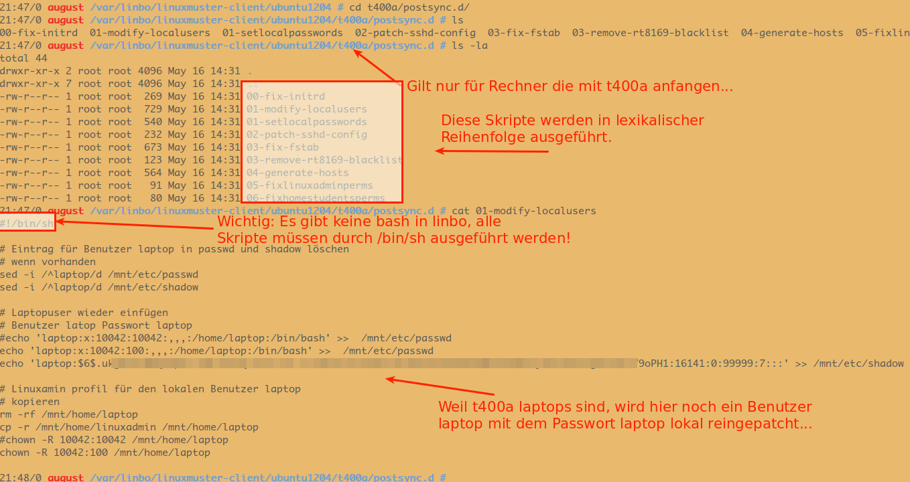

Patchklassen für Postsync-Scripte
=================================

**Wo müssen die Anpassungen (Patches) abgelegt werden ?**

Unter 

.. code:: bash

   /var/linbo/linuxmuster-client/

Dort finden sich weitere Unterverzeichnisse. Diese stellen die sog. Patchklasse dar. Wird also z.B. der Linuxmuster-Client 14.04 (trusty = Name der Patchklasse) verwendet, so sind alle weiteren Patches für 14.04er-Clients in diesem Verzeichnis abzulegen. 

Die Anpassungen finden sich also unter:

.. code:: bash

   /var/linbo/linuxmuster-client/trusty/

Bei Linuxmuster-Clients 16.04 (Xenial) wäre dies z.B. das Verzeichnis:

.. code:: bash

   /var/linbo/linuxmuster-client/xenial/

Diese Patches werden nach folgendem Schema angewendet:

.. code:: bash

   im Unterverzeichnis .../common liegende Patches erhalten alle Rechner
   im Unterverzeichnis  .../r100 liegende Patches erhalten nur die Rechner in Raum r100
   im Unterverzeichnis .../r100-pc01 liegende Patches erhält nur der PC01 in Raum r100 die Dateien.

Unterhalb dieser Verzeichnisse sind alle Anpassungen so abzulegen, wie diese dann auf den betreffenden Clients angewendet werden sollen - bsp.:

.. code:: bash

   .../common/etc/cups/cups.conf

Auf diese Weise würde die Datei cups.conf im Verzeichnis /etc/cups auf allen Clients der Patchklasse angepasst werden.

In der Patchklasse xenial würde eine Änderung der Datei rc.local auf allen Rechnern in folgendem Verzeichnis abgelegt:

.. code:: bash

   /var/linbo/linuxmuster-client/xenial/common/etc/rc.local

Um auf dem Server obige Verzeichnisstruktur zu erhalten, ist auf dem linuxmuster.net Server das Paket **linuxmuster-client-servertools** zu installieren. 

Hierzu ist folgender Befehel anzuwenden:

.. code:: bash

   sudo apt-get install linuxmuster-client-servertools

Dieses Paket liefert ein sog. universelles Postsync-Script mit, das weiter angepasst und auf die Cloops angewendet werden kann. 

Dieses Script ist zur Anwendung auf ein Cloop entsprechend zu kopieren nach:

.. code:: bash

   /var/linbo/<LinuxImagename>.cloop.postsync

Die Vorlage des universellen Postsync-Scriptes liegt in folgendem Verzeichnis: 

.. code:: bash

   /usr/lib/linuxmuster-client-servertools/generic.postsync

Dieses Script ist so aufgebaut, dass auch noch weitere Scripte ausgeführt werden (z.B. solche, die nur in Raum r100 ausgeführt werden sollen). Scripte, die abgearbeitet werden sollen, müssen in dem jeweiligen Unterverzeichnis postsync.d liegen.

Sollen Scripte für die Patchklasse xenial und dann nur auf PCs im Raum r100 angewendet werden, so müssen die Scripte in folgendem Verzeichnis liegen:

.. code:: bash

   /var/linbo/linuxmuster-client/xenial/r100/postsync.d/

Die Skripte müssen Sh-Scripte sein, da Linbo keine BASH als Shell kennt.

In diesen Scripten ist der Shebang

.. code:: bash

   #!/bin/sh

voranzustellen.

Beipiele für solche Scripte finden sich im Verzeichnis

.. code:: bash

   /usr/lib/linuxmuster-client-servertools/generic.postsync/generic.postsync.d/

Es finden sich folgende Skripte als Beispielvorlagen:

.. code:: bash

   -rw-r--r-- 1 root root 269 Nov 21  2016 00-lcst-fix-initrd
   -rw-r--r-- 1 root root 540 Nov 21  2016 01-lcst-setlocalpasswords
   -rw-r--r-- 1 root root 232 Nov 21  2016 02-lcst-patch-sshd-config
   -rw-r--r-- 1 root root 673 Nov 21  2016 03-lcst-fix-fstab
   -rw-r--r-- 1 root root 564 Nov 21  2016 04-lcst-generate-hosts

Diese können für die gewünschte Patchklasse in das jeweilige Verzeichnis kopiert und angepasst werden.
Diese Scripte werden entsprechend ihrer lexikalischen Reihenfolge ausgeführt, also hier beginnend mit der niedrigsten Ziffer.

Nachstehende Abbildungen verdeutlichen diesen Aufbau:

Das allgemeine Postsync-Script arbeitet nach folgendem Schema:

.. image:: media/scheme-for-general-postsync-usage.png

**Beispiel**

Nachstehender Verzeichnisbaum verdeutlicht, dass für Linuxmuster-Clients für alle PCs der Patchklasse xenial alles unterhalb von ./common angewendet wird. 
Zudem wird für den raum1 alles unterhalb von ./raum1 angewendet und schließlich wird für den Lehrer-PC in raum1 alles unterhalb von ./raum1-lehrer-pc angewendet.

.. code:: bash

   19:06/0 server /var/linbo/linuxmuster-client/xenial # ls -ld $(find .)
   drwxr-xr-x 7 root root 4096 Nov 20 10:25 .
   drwxr-xr-x 3 root root 4096 Apr 22  2016 ./common
   drwxr-xr-x 3 root root 4096 Mär 17 12:54 ./common/etc
   drwxrwxr-x 2 root root 4096 Mai  9  2016 ./common/etc/cups
   -rw-r--r-- 1 root root   21 Mai  9  2016 ./common/etc/cups/client.conf
   -rw-r--r-- 1 root root  797 Mär 31 09:16 ./common/etc/fstab
   -rw-r--r-- 1 root root  443 Mai  9  2016 ./common/etc/hosts
   drwxr-xr-x 4 root root 4096 Mär 26  2015 ./raum1
   drwxr-xr-x 7 root root 4096 Nov 20 10:10 ./raum1/etc
   drwxr-xr-x 2 root root 4096 Apr 14 10:38 ./raum1/etc/cups
   -rw------- 1 root root 3588 Apr 14 10:40 ./raum1/etc/cups/printers.conf
   drwxr-xr-x 2 root root 4096 Mär 26  2015 ./raum1/etc/default
   -rw-r--r-- 1 root root  369 Nov  5  2011 ./raum1/etc/default/epoptes
   -rw-r--r-- 1 root root  668 Nov 20 10:01 ./raum1/etc/default/epoptes-client
   drwxr-xr-x 2 root root 4096 Mär 26  2015 ./raum1/etc/epoptes
   -rw-r--r-- 1 root root  875 Mär 26  2015 ./raum1/etc/epoptes/server.crt
   -rw------- 1 root root  916 Mär 26  2015 ./raum1/etc/epoptes/server.key
   -rw-r--r-- 1 root root  984 Nov 20 10:18 ./raum1/etc/hosts
   drwxr-xr-x 2 root root 4096 Mär 26  2015 ./raum1/etc/init.d
   -rwxr-xr-x 1 root root 1645 Apr  8  2012 ./raum1/etc/init.d/epoptes
   -rwxr-xr-x 1 root root 1124 Apr  8  2012 ./raum1/etc/init.d/epoptes-client
   drwxr-xr-x 3 root root 4096 Mär 26  2015 ./raum1/etc/xdg
   drwxr-xr-x 2 root root 4096 Mär 26  2015 ./raum1/etc/xdg/autostart
   -rw-r--r-- 1 root root  428 Nov 20 10:45 ./raum1/etc/xdg/autostart/epoptes-client.desktop
   drwxr-xr-x 5 root root 4096 Jan 22 18:23 ./raum1-lehrer-pc
   drwxr-xr-x 7 root root 4096 Nov 20 10:10 ./raum1-lehrer-pc/etc
   drwxr-xr-x 2 root root 4096 Okt 23  2014 ./raum1-lehrer-pc/etc/cups
   -rw------- 1 root root 3588 Apr 14 10:40 ./raum1-lehrer-pc/etc/cups/printers.conf
   drwxr-xr-x 2 root root 4096 Mär 26  2015 ./raum1-lehrer-pc/etc/default
   -rw-r--r-- 1 root root  370 Nov 20 10:14 ./raum1-lehrer-pc/etc/default/epoptes
   -rw-r--r-- 1 root root    0 Nov 20 10:21 ./raum1-lehrer-pc/etc/default/epoptes-client
   drwxr-xr-x 2 root root 4096 Mär 26  2015 ./raum1-lehrer-pc/etc/epoptes
   -rw-r--r-- 1 root root  875 Mär 26  2015 ./raum1-lehrer-pc/etc/epoptes/server.crt
   -rw-r--r-- 1 root root  916 Mär 26  2015 ./raum1-lehrer-pc/etc/epoptes/server.key
   -rw-r--r-- 1 root root  983 Nov 20 10:17 ./raum1-lehrer-pc/etc/hosts
   drwxr-xr-x 2 root root 4096 Mär 26  2015 ./raum1-lehrer-pc/etc/init.d
   -rwxr-xr-x 1 root root 1645 Apr  8  2012 ./raum1-lehrer-pc/etc/init.d/epoptes
   -rwxr-xr-x 1 root root    0 Nov 20 10:22 ./raum1-lehrer-pc/etc/init.d/epoptes-client

**Universelles Postsync-Script**

Das universelle Postsync-Script weist derzeit folgenden Inhalt auf:

.. code:: bash

   echo "##### POSTSYNC BEGIN #####" 
   LOG=/mnt/var/log/postsync.log
   echo "##### POSTSYNC BEGIN #####" >  $LOG
   NOW=$(date +%Y%m%d-%H%M)
   echo $NOW | tee -a $LOG
   
   # IP-Adresse des Servers
   SERVERIP=$(nslookup dummy 2> /dev/null | head -n 1 | awk -F: '{print $2}' | sed "s/\s*//g")
   
   # Die Hostgruppe des aktuellen Rechners
   HOSTGROUP=$(hostgroup) 
   
   # Raum feststellen. Dieses Skript geht davon aus
   # dass die Rechner Namen der Form
   # raumname-hostname haben, also z.B. cr01-pc18
   RAUM=${HOSTNAME%%-*}
   # wenn der string leer ist, raum auf unknown setzen
   if [ "x${RAUM}" == "x" ]; then 
       RAUM="unknown"
   fi
   
   # UVZ für die Patches auf dem Server. Mit dieser Variablen 
   # kann man verschiedene Patches, z.B. für unterschiedliche
   # Linux-Versionen bereitstellen.
   # Wenn man hier $HOSTGROUP einträgt, erhält jede Rechnerklasse 
   # ein eigenes Patchklassenverzeichnis auf dem Server.
   # Damit kann man verschiedene Patchklassen mit derselben cloop-Datei
   # bedienen, wenn man das benötigt.
   PATCHCLASS="trusty"
   
   # Das Verzeichnis, in dem die Serverpatches
   # im lokalen Clientcache synchronisiert werden.
   PATCHCACHE=/linuxmuster-client/serverpatches
   
   echo "" | tee -a $LOG
   echo "Hostname:      ${HOSTNAME}" | tee -a $LOG
   echo "Raum:          ${RAUM}" | tee -a $LOG
   echo "Patchcache:    ${PATCHCACHE}" | tee -a $LOG
   echo "Hostgruppe:    ${HOSTGROUP}"   | tee -a $LOG
   echo "Patchclass:    ${PATCHCLASS}" | tee -a $LOG
   echo "" | tee -a $LOG
   
   # -----------------------------------------
   # Patchdateien auf das lokale Image rsyncen
   # ----------------------------------------- 
   echo " - getting patchfiles" | tee -a $LOG
   
   # RAUM     -> Raumname
   # HOSTNAME -> Rechnername
   # Verzeichnis anlegen, damit es sicher existiert
   mkdir -p /cache/${PATCHCACHE}
   rsync --delete --progress -r "${SERVERIP}::linbo/linuxmuster-client/${PATCHCLASS}" "/cache/${PATCHCACHE}" | tee -a $LOG
   
   echo " - patching local files"  | tee -a $LOG
   
   # common: Bekommen alle clients der Patchklasse
   # files
   if [ -d /cache/${PATCHCACHE}/${PATCHCLASS}/common ]; then 
       echo "   - patching common to /mnt" | tee -a $LOG
       cp -ar /cache/${PATCHCACHE}/${PATCHCLASS}/common/* /mnt/ | tee -a $LOG
   fi
   
   # tarpacks
   if [ -d /cache/${PATCHCACHE}/${PATCHCLASS}/common/tarpacks ]; then
     echo "   - unpacking tarpacks from common/tarpacks to /mnt" | tee -a $LOG
     for pack in /cache/${PATCHCACHE}/${PATCHCLASS}/common/tarpacks/*; do
        echo "     - unpacking: $pack" | tee -a $LOG
        tar xvzf $pack -C /mnt | tee -a $LOG
     done
   fi
   
   # Raum: Nur die Clients des Raums
   # files
   if [ -d /cache/${PATCHCACHE}/${PATCHCLASS}/${RAUM} ]; then 
       echo "   - patching ${RAUM} to /mnt" | tee -a $LOG
       cp -ar /cache/${PATCHCACHE}/${PATCHCLASS}/${RAUM}/* /mnt/ | tee -a $LOG
   fi
   
   # tarpacks
   if [ -d /cache/${PATCHCACHE}/${PATCHCLASS}/${RAUM}/tarpacks ]; then
     echo "   - unpacking tarpacks from ${RAUM}/tarpacks to /mnt" | tee -a $LOG
     for pack in /cache/${PATCHCACHE}/${PATCHCLASS}/${RAUM}/tarpacks/*; do
        echo "     - unpacking: $pack" | tee -a $LOG
        tar xvzf $pack -C /mnt | tee -a $LOG
     done
   fi
   
   # Host: Nur der Rechner
   # files
   if [ -d /cache/${PATCHCACHE}/${PATCHCLASS}/${HOSTNAME} ]; then 
       echo "   - patching ${HOSTNAME} to /mnt"  | tee -a $LOG
       cp -ar /cache/${PATCHCACHE}/${PATCHCLASS}/${HOSTNAME}/* /mnt/ | tee -a $LOG
   fi
    
   # tarpacks
   if [ -d /cache/${PATCHCACHE}/${PATCHCLASS}/${HOSTNAME}/tarpacks ]; then
     echo "   - unpacking tarpacks from ${HOSTNAME}/tarpacks to /mnt" | tee -a $LOG   
    for pack in /cache/${PATCHCACHE}/${PATCHCLASS}/${HOSTNAME}/tarpacks/*; do
        echo "     - unpacking: $pack" | tee -a $LOG
       tar xvzf $pack -C /mnt | tee -a $LOG
    done
   fi
   
   # Hook, um eigene Skripte auszuführen
   if [ -d /mnt/postsync.d ]; then
        for SCRIPT in /mnt/postsync.d/*
       do
           chmod 755 $SCRIPT
           echo "Executing: $SCRIPT" | tee -a $LOG
           #$SCRIPT > /dev/null 2>&1
           $SCRIPT | tee -a $LOG
           echo " ...done." | tee -a $LOG
       done
       rm -rf /mnt/postsync.d
    # wenn es /mnt/tarpacks gibt - löschen
    rm -rf /mnt/tarpacks
    
   # hostname in /etc/hosts patchen
       sed -i "s/HOSTNAME/$HOSTNAME/g" /mnt/etc/hosts
        sed -i "s/#SERVERIP/$SERVERIP/g" /mnt/etc/hosts
    
   # Zeitstempel letzter sync hinterlegen
   echo $NOW > /mnt/lastsync
   
   echo "##### POSTSYNC END #####" | tee -a $LOG

Aktualisierungen für dieses Script finden sich unter:

https://github.com/linuxmuster/linuxmuster-client-servertools/blob/master/usr/lib/linuxmuster-client-servertools/generic.postsync

