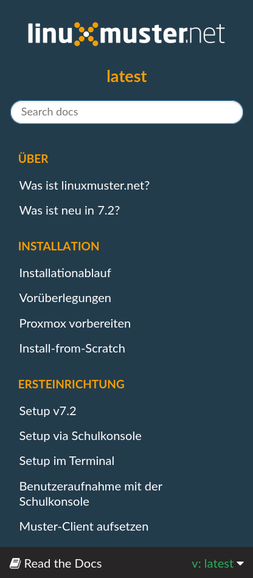
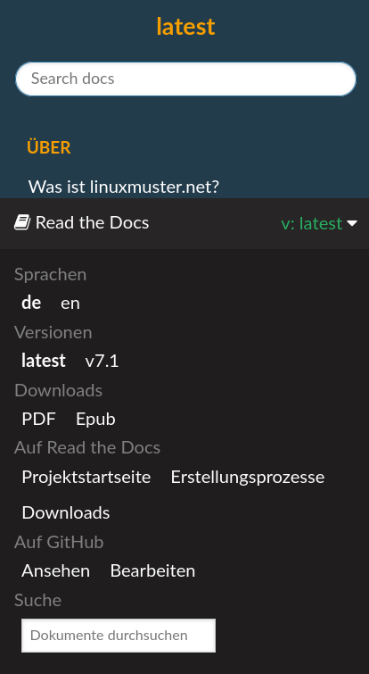

Einführung
==========

Herzlich Willkommen zur Dokumentation von linuxmuster.net v7.2!

Diese beschreibt alle wichtigen Schritte ...

  | ... von der Installation,
  | ... der Einrichtung von Windows- und Linux-Rechnern als Clients,
  | ... der Systemadministration,
  | ... der Verwaltung von Nutzern,
  | ... bis hin zu individuellen Anpassungen.

Wie es bei einem Projekt ist, dessen Entwicklungsgeschichte mittlerweile auf das Jahr 1999 zurückblickt, ist Dein Einstieg in die Beschreibung unseres Systems sicherlich unterschiedlich.

Kennst Du linuxmuster.net noch nicht,
-------------------------------------

dann empfehlen wir Dir das Kapitel

  :ref:`what-is-linuxmuster.net-label`

Hattest Du schon Kontakt mit einer Installation von
---------------------------------------------------

  | linuxmuster.net Version 7?

Dann ist das Kapitel :ref:`what-is-new-label` für Dich von Interesse.

Installation from Scratch
-------------------------

Diese Dokumentation führt Dich durch eine Installation von Grund auf. Dies bedeutet, dass zunächst 
die Vorbereitung der Virtualisierungslösungen - hier Proxmox - dokumentiert wird. Auf dem Virtualisierer sind sog. Virtuelle Maschinen (VM) anzulegen, um linuxmuster.net 7.2 installieren zu können. Hierzu gehört die spezifische Einrichtung des Netzwerks, des Speichers sowie die Vorbereitung der VM.

Weitere Hilfe
-------------

Neben dieser Dokumentation steht Dir unsere Community in unserem Hilfeforum und unser kostenfreier Telefon-Support helfend zur Seite.

Das Forum findest Du unter `<https://ask.linuxmuster.net>`_.

Informationen zum Telefon-Support gibt es auf unser Projektseite `<https://www.linuxmuster.net/de/support-de/>`_.

.. hint::

   Suchst Du die Dokumentation zur Version linuxmuster.net 7.1 oder die Möglichkeit unsere Dokumentation herunterzuladen?

Dann schaue in die unten recht angezeigte - zusätzliche - Menüleiste.

   Read the Docs Untermenü

Nach einem Klick auf die Leiste eröffnen sich Dir dort noch weitere Möglichkeiten:

   
   Read the Docs geöffnetes Untermenü

.. toctree::
  :maxdepth: 2
  :caption: Über
  :hidden:

  about/about
  about/what-is-new

.. toctree::
  :maxdepth: 2
  :caption: Installation
  :hidden:

  installation/overview
  installation/prerequisites
  installation/proxmox/index
  installation/install-from-scratch/index

.. toctree::
  :maxdepth: 4
  :caption: Ersteinrichtung
  :hidden:

  setup/setup
  setup/setup-gui
  setup/setup-console
  setup/add-user-accounts
  clients/client_templates/index

..  setup/add-devices

.. toctree::
  :maxdepth: 2
  :caption: Upgrade
  :hidden:

  migration/upgrade
  migration/linbo-migration-to-4

.. toctree::
  :maxdepth: 2
  :caption: Migration
  :hidden:

  migration/index
  migration/linbo-migration-to-4
  migration/linux-client-migration

.. toctree::
  :maxdepth: 4
  :caption: Clientverwaltung
  :hidden:

  clients/index
  clients/client_templates/index
  clients/use_linbo4/index
  clients/postsync/index
  clients/leoclient2/index

..  clients/linbo/index
..  clients/windows10clients/index
..  clients/linux-clients/index

.. toctree::
  :maxdepth: 2
  :caption: Benutzerverwaltung
  :hidden:

  user-management/change-own-password
  user-management/student-management
  user-management/manage-users/index
  user-management/change-teacher-passwords/index
  user-management/manage-quota/index
  user-management/preparation-newterm/index

.. toctree::
  :maxdepth: 2
  :caption: Pädagogische Funktionen
  :hidden:

  classroom/webui-basics/index
  classroom/exam-and-transfer
  classroom/access-control
  classroom/check-own-quota/index

.. toctree::
  :maxdepth: 2
  :caption: Systemadministration
  :hidden:

  systemadministration/maintenance/keep-lmn-uptodate
  systemadministration/network/default-access-rules
  systemadministration/harddisk/index
  systemadministration/network/radius/index
  systemadministration/network/networksegmentation/index
  systemadministration/printer/index
  systemadministration/schoolconsole/index
  systemadministration/gpo/gpo
  systemadministration/sw-remote-gpo/sw-remote-gpo
  systemadministration/openvpn/index

.. toctree::
  :maxdepth: 2
  :caption: Externe Dienste
  :hidden:

  external-services/dockerhost/index
  external-services/moodle/index
  external-services/nextcloud/index
  external-services/aleksis/index
  external-services/unifiwlan/index

.. toctree::
  :maxdepth: 1
  :caption: linuxmuster.net helfen
  :hidden:

  appendix/contribute/index

.. toctree::
  :maxdepth: 1
  :caption: Anhang
  :hidden:

  appendix/contribute/ad-dns-wiki
  appendix/lvm-server/index
