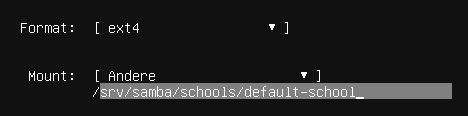
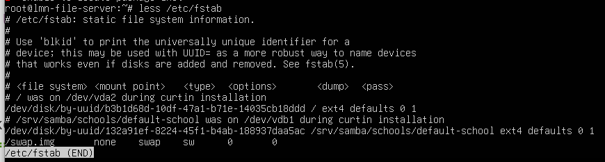

.. include:: /guided-inst.subst

.. _basis_file_server-label:

========================================
Anlegen und Installieren des Fileservers
========================================

.. sectionauthor:: `@cweikl <https://ask.linuxmuster.net/u/cweikl>`_

.. hint::

    Der Fileserver für inuxmuster.net 7.3 kann optional installiert werden (Drei-Server-Lösung. Es kann aber weiterhin wie bisher auch ein Weiterbetrieb als Zwei-Server-Lösung erfolgen. Wir empfehlen den Fileserver z.B. in einer eigenen VM zu installieren, da hierdurch deutliche Performancesteigerungen in Verbidnung mit Samba erreicht werden. Dies empfehlen wir insbesondere mittleren bis grösseren Schulen. Kleinere Schulen können problemlos linuxmuster.net 7.3 als Zwei-Server-Lösung weiterbetreiben.
    
    Grundsätzlich kann linuxmuster.net 7.3 weiterhin als Zwei-Server-Lösung betrieben werden und es kann jederzeit später eine Erweiterung / Umstellung auf den zusätzlichen File-Server erfolgen. Die Migration/ das Update auf v7.2 erfolgt zunächst immer als Zwei-Server-Lösung und es erfolgt danach eine Erweiterung um den Fileserver. 
    
In Samba-Umgebungen ist es inzwischen üblich, den Domänencontroller und den Fileserver getrennt voneinander zu betreiben, da das Performancevorteile hat: selbst wenn der Fileserver auf dem gleichen Host virtualisiert wird, wie der Server und auf dem gleichen Storage läuft. Das ist für große Schulen mit vielen Clients von Vorteil.
Es ist aber ohne Probleme möglich, den Fileserver später heraus zu trennen und auf eine eigene Maschine zu verlegen.
Man kann die Umgebung also erstmal ohne extra Fileserver aufsetzen, und wenn man später merkt, dass das von Vorteil wäre, ihn herausziehen.

Der File-Server von linuxmuster.net wird vollständig in das AD des linuxmuster.net Servers integriert. Die Netzwerkfreigaben werden auf dem linuxmuster.net Server definiert und mithilfe einer DFS-Konfiguration für die konfigurierte Schule bereitgestellt. Es werden so alle persönlichen Netzlaufwerke, die Projektfreigaben, sowie die Klassenfreigaben auf diesem File-Server bereitgestellt.

Vorteile:

- Trennung der Dienste (AD Service, File Service)
- verbesserte Backupstrategie (jeweils eigenständiges Backup für die Dateien als auch für das AD)
- verbesserte Sicherheit (bei einem Multi-School Setup kann jeweils ein eigenständier File-Server pro Schule eingesetzt werden.)
- einfache Wartung und vereinfachte Updates
- deutliche Leistungsverbesserung - gerade bei grossen Schulinstallationen

Installation Ubuntu-Server
==========================

Führe die Installation des für den File-Server benötigten Ubuntu 24.04 LTS Servers so aus, wie zuvor :ref:`basis_server-label` beschrieben. Es werden zwei Festplatten benötigt. Passe die Plattenkapazitäten an die Anforderungen Eurer Schule an.

Passe die Partitionierung und Formatierung der Festplatten entsprechend an. Zudem musst Du eine statische IP-Adresse aus dem LAN dem File-Server zuweisen.

Nutze die Daten gemäß Deines IP-Adresskonzeptes oder gib nachstehende Daten ein, die in der Dokumentation durchgängig für das LAN verwendet werden:

- Netzbereich: 10.0.0.0/16
- IP-Adresse:  10.0.0.2
- Netzmaske:   10.0.0.254
- Gateway:     10.0.0.254
- DNS:         10.0.0.254
- Domäne:      linuxmuster.lan

Die Domäne wird bei der Integration später noch automatisch angepasst.

Die Installation endet bei dem Punkt ``Automatische Updates abschalten``.

Führe danach die Vorbereitung des Ubuntu Servers weiter wie in :ref:`lmn_pre_install-label` beschrieben. Durchlaufe folgende Schritte:

1. Zeitservereinstellungen überprüfen
2. Cloud-init deinstallieren
3. Default-Locale setzen
4. siehe nachstehende Schritte

2. HDD einbinden
================

Bei der Einrichtung der VM für den File-Server hast Du eine zweite Festplatte vorgesehen. Bei der Installation von Ubuntu Server hast Du ggf. beim Setup für die zweite Platte bereits eine GPT-Partitionstabelle mit angelegt, wie in nachstehender Abb. zu sehen:

   Zweite HDD des File-Servers
   
Du musst jetzt noch den Eintrag in der Datei ``/etc/fstab`` anpassen, damit das zu verwendende Verzeichnis auf der zweiten HDD korrekt eingebunden wird und nach dem Setup des File-Servers dort Quotas aktiviert werden können.

Lass Dir dazu den Inhalt der Datei zuerst ausgeben:

.. code::

   sudo apt install less
   sudo less /etc/fstab
   
Du erkennst beide Festplatten mit ihren UUIDs:

   UUID der zweiten HDD des File-Servers
   
Du erkennst, dass die zweite Festplatte mit ihrer UUID bereits eingebunden ist und das Verzeichnis ``/srv/samba/schools/default-school`` zugeordnet ist.

Diesen Eintrag musst Du nun noch wie folgt ergänzen:

.. code::

   /dev/disk/by-uuid/<UUID> /srv/samba/schools/default-school ext4 user_xattr,acl,usrjquota=aquota.user,grpjquota=aquota.group,jqfmt=vfsv0,barrier=1 0 0
   
Damit die Quotas im Zuge des File-Server Setups noch eingebunden werden können, müssen wie o.g. Einträge ergänzt werden.

Starte danach den Server neu und prüfe die Zuordnung mit

.. code::

   sudo lsblk
   
Dort solltest Du nun erkennen, dass das Verzeichnis für default-school auf der zweiten Festplatte liegt.

Paketquellen eintragen
======================

Nachdem Du als Benutzer ``linuxadmin`` am file-server angemeldet bist, wechselst Du nun zum Benutzer root mit:

.. code::

   sudo -i

1. Importiere den Schlüssel für die Paketquellen

.. code::

   wget -qO- "https://deb.linuxmuster.net/pub.gpg" | gpg --dearmour -o /usr/share/keyrings/linuxmuster.net.gpg
   
2. Füge die Paketquellen hinzu

.. code::

   sudo sh -c 'echo "deb [arch=amd64 signed-by=/usr/share/keyrings/linuxmuster.net.gpg] https://deb.linuxmuster.net/ lmn73 main" > /etc/apt/sources.list.d/lmn73.list'
   
File-Server Installation
========================

Aktualisiere den Server und installiere die linuxmuster.net File-Server-Pakete:

.. code::

   sudo apt update && sudo apt install linuxmuster-fileserver

Bei der Paketinstallation wird für die Kerberos-Authentifizierung ein sog. Realm abgefragt. Dieser bleibt zu diesem Zeitpunkt frei. Bei der späteren Integration des File-Servers in den AD/DC wird dies dann automatisch angepasst.

.. hint::

   Für Anwender einer Virtualisierungslösung empfehlen wir an dieser Stelle einen Snapshot zu erstellen!

Weiteres Vorgehen
=================

1. Nun muss der linuxmuster.net Server (AD/DC) im nächsten Schritt vorbereitet werden.
2. Proxmox muss in das interne Netz gebracht werden.
3. Es muss das Setup für lmnv7.3 (AD/DC) durchgeführt werden.
4. Der File-Server ist in das AD einzubinden und es sind die Freigaben/Shares auf dem lmn-Server zu definieren.

