.. include:: ../../guided-inst.subst

.. _basis_opnsense:

=====================================
Anlegen und Installieren der Firewall
=====================================

.. sectionauthor:: `@cweikl <https://ask.linuxmuster.net/u/cweikl>`_
                   `@MachtDochNiX <https://ask.linuxmuster.net/u/MachtDochNiX>`_,
                   `@rettich <https://ask.linuxmuster.net/u/rettich>`_,

Installation der OPNsense |reg|
===============================

.. note:: 

   Bist Du zuvor der Anleitung :ref:`Proxmox vorbereiten <install-on-proxmox-label>` gefolgt, dann kannst Du fortfahren mit: `Erster Start der Firewall`_
   
   .. figure:: media/basis_opnsense_000.svg
      :align: center
      :alt: Stand nach Proxmox Installation
   
      Stand nach der vorhergehenden Beschreibung

Falls Du Dich für eine andere Installationsart entschieden hast, musst Du den dargestellten Aufbau herstellen.
      
Lade Dir die ISO-Datei der OPNsense |reg| von der Seite https://opnsense.org/download/ herunter.

.. hint::

   Die zuletzt freigegeben OPNsense Version für das Setup von linuxmuster.net v7.2 ist die Version 24.1 
   
   [Stand: Februar 24]. 
   
   wget https://mirror.informatik.hs-fulda.de/opnsense/releases/24.1/OPNsense-24.1-dvd-amd64.iso.bz2

Nutze als Architektur ``amd64`` und als ``image type dvd`` und einen Mirror, der in Deiner Nähe ist.
Du erhältst dann ein mit ``bz2`` komprimiertes ISO-Image. Entpacke die heruntergeladene Datei. Siehe hierzu auch :ref:`install-on-proxmox-label` - dort Kapitel `Vorbereiten des ISO-Speichers -> OPNsense |reg|`.

Unter Linux ist folgender Befehl anzugeben:

.. code::

   bunzip2 OPNsense-24.1-dvd-amd64.iso.bz2

In der Virtualisierungsumgebung lädst Du die ISO-Datei auf den ISO-Speicher.

.. hint:: 

   Willst Du in einer VM installieren, so musst Du für die neue VM folgende Mindesteinstellungen für die Hardware angeben:
   
   - template - other install media, installation from ISO library,
   - Boot-Mode - UEFI (Achtung: xcp-ng: Boot/MBR),
   - 1 vCPU
   - 2 GiB RAM
   - storage 10 GiB
   - 2 NIC mit Zuordnung zu vSwitch red, green.
  
Für den produktiven Betrieb müssen diese Hardware-Einstellungen **deutlich** angehoben werden (z.B.: 4 vCPU, 8 GiB RAM, 50 GiB SSD, 3 NIC).
  
.. _first_start_firewall:

Erster Start der Firewall
=========================

Starte dann OPNsense |reg| auf dem Rechner oder in der neu angelegten VM von Deinem Installationsmedium. Je nach Virtualisierungsumgebung hast Du ggf. die ISO-Datei bereits auf dem ISO-Datenspeicher des Hypervisors abgelegt. Boote dann die VM via ISO-Datei.

.. attention:: Solltest Du unserer Anleitung gefolgt sein und PROXMOX nutzen, dann muss Du für die Installation die Konsole ``noVNC`` nutzen.

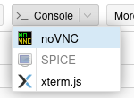
   
   Starte die OPNsense-VM

Am Ende des Boot-Vorgangs der OPNsense |reg| gelangst Du zu folgendem Bildschirm:

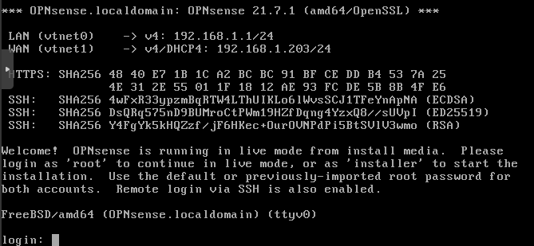
   
   Bildschirm nach dem ersten Boot-Vorgang

Melde Dich als Benutzer ``installer`` mit dem Passwort ``opnsense`` an.
Du gelangst direkt zum Installer und kannst das Layout der Tastatur festlegen.

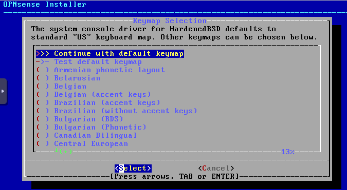

   Installer: Tastaturlayout festlegen

Standardmäßig ist ein amerikanisches Tastaturlayout voreingestellt. Gehe mit den Pfeiltasten auf den Eintrag ``( ) German (no accent keys)``. Wählen diesen mit ``<Select>`` aus.

Teste danach das Tastaturlayout:

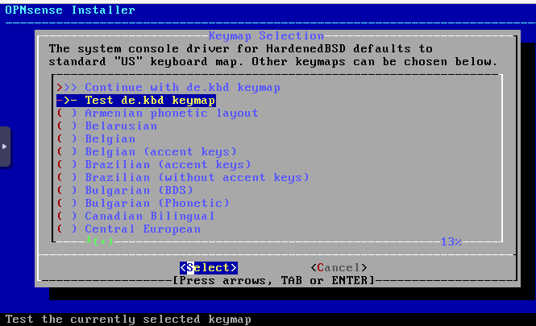
   
   Teste das Tastaturlayout

Bei der deutschen Tastatur werden ggf. die Umlaute im Test noch nicht korrekt wiedergegeben.

Wähle die eingestellte deutsche Tastatur aus:

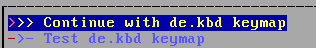

   Bestätige der Stataturlayout

Wähle ``<Select>``.

Installiere nun OPNsense |reg| via ``Install (UFS)``.

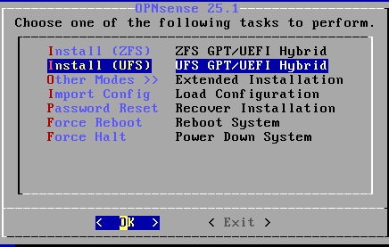
   
   Install (UFS)

Bestätige die Festplatte und wähle ``Install (UFS) UFS GPT/UEFI Hybrid``. 

Jetzt wird OPNsense |reg| auf der Festplatte installiert. Zuvor musst Du diese noch auswählen.

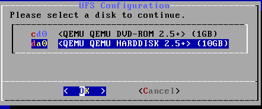
   
   da0 QEMU HARDDISK

Mit ``OK`` übernimmst Du Deine Auswahl.

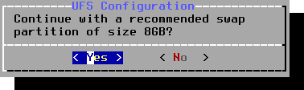
   
   SWAP Partition wählen

Sollte Dir dieses Fenster angezeigt werden, dann akzeptiere die Frage nach der empfohlenen Auslagerungsdatei.

Danach erfolgt die Rückfrage, ob die Festplatte wirklich überschrieben werden soll.

.. figure:: media/basis_opnsense_007.png
   :align: center
   :alt: OPNsense: Last change to abort vs. start installation
   
   Bestätige die Installation auf da0
   
Bestätige diesen Vorgang, um die Installation zu starten.

Warte jetzt, bis die Installation abgeschlossen ist.

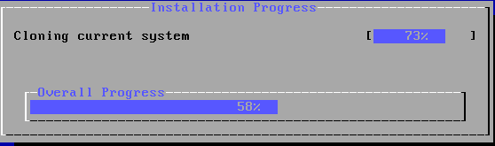
   
   Installationsfortschritt

Zum Abschluss der Konfiguration musst Du das Kennwort für den Benutzer ``root`` neu setzen.

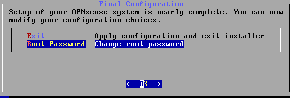
   
   Eingabe des Root Kennwortes

.. attention:: 
   
   An dieser Stelle muss als root-Passwort ``Muster!`` eingegeben werden, da später der lmn-Server beim Einrichten der Firewall davon ausgeht, dass das root-Passwort ``Muster!`` ist! Sollte dieses anders lauten, wird die komplette weitere Installation scheitern!

Gib das neue Passwort (``Muster!``) für root ein.

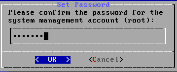
   
   Eingabe des neuen Root Kennwortes

Gib dieses Kennwort erneut ein.

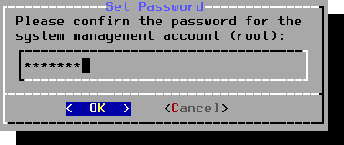
   
   Bestätigung des neuen Root Kennwortes

Setze es mit ``OK``

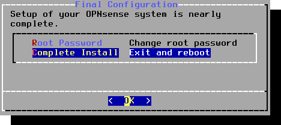
   
   Schließe die Installation ab

Wähle danach die Option ``Exit and reboot`` aus.

.. hint::

   Solltest Du nicht zum Entfernen des Installationsmedium aufgefordert werden, fahre Deine neue Firewall herunter (schalte sie aus). 
   
   Ändere die Boot-Reihenfolge zurück (Start via Festplatte).
   
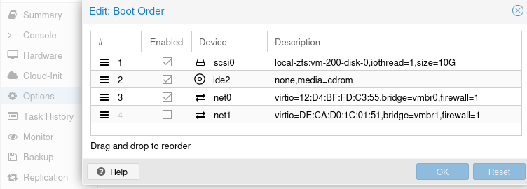
   
   Ändere die Boot-Reihenfolge
   
   Werfe die ISO-Datei aus dem CD-Laufwerk aus.
   
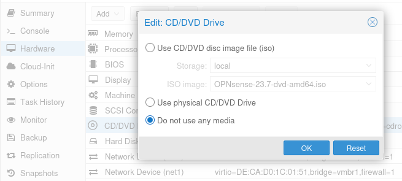
   
   Werfe die ISo-Datei aus dem Laufwerk aus.
   
   Starte die VM neu, nachdem Du das Installationsmedium ausgeworfen hast und fahre mit der Installation fort.

Der Boot-Vorgang kann dann eine Weile dauern. Vor allem, wenn der Router kein DHCP anbieten sollte.

Wenn alles geklappt hat, ist Folgendes zu sehen:

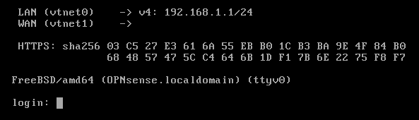

   Login nach erfolgter Installation und Reboot

.. hint::

   Die dargestellten IPs und Netze können bei Deiner OPNsense |reg| andere sein.

Basis-Konfiguration der OPNsense |reg|
======================================

Melde Dich als ``root`` mit dem Passwort ``Muster!`` an der OPNsense |reg| an.

Tastaturbelegung prüfen
-----------------------

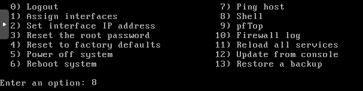
   
   Tastaturbelegung überprüfen

Zuerst überprüfe, ob die Tastaturbelegung richtig ist. Dazu wähle den Punkt ``8) Shell`` aus. Auf der Konsole kannst Du dann die Umlaute und Sonderzeichen der deutschen Tastaturbelegung testen. Sollte sie korrekt sein, verlässt Du mit ``exit`` die Konsole und bist wieder im Auswahl-Bildschirm. 

Fahre mit `Überprüfung der Zuordnung der Netzwerkkarten`_ fort, ansonsten |...|

.. hint::

   Solltest Du feststellen, dass nach dem Neustart in der Konsole der OPNsense |reg| die Tastaturbelegung immer noch falsch ist, stelle diese dauerhaft wie nachstehend beschrieben um:

   .. code::

     cd /usr/share/syscons/keymaps    # Für den Buchstaben "z" musst Du die Taste "y" drücken ;-)

     ls german.iso.kbd                # listet das deutsche Tastaturlayout auf, sofern vorhanden
    
     kbdcontrol -l german.iso.kbd     # (-l = Language; "-" zu finden unter "?" ;-) stelle temporär auf das neue Layout um
                                      # - teste, ob es dem gewünschten Layout entspricht
     
     echo "keymap='de'">>/etc/rc.conf # die Wahl des Tastaturlayouts dauerhaft hinzufügen  
     
     cat /etc/rc.conf                 # kontrolliere, ob der Eintrag vorhanden ist

     exit                             # Konsole verlassen

Überprüfung der Zuordnung der Netzwerkkarten
--------------------------------------------

   
   Zuordnung der NICs prüfen

Die erste Netzwerkkarte (LAN) ist derzeit als LAN mit dem pädagogischen Netz verbunden. Die Netzwerkkarte ``vtnet0`` ist nach der bisherigen Installation allerdings mit dem roten Netz verbunden. Zudem vergibt die Installationsroutine der OPNsense |reg| immer die IP 192.168.1.1/24 der LAN-Schnittstelle. Dies ist jetzt noch zu ändern.

Die zweite Netzwerkkarte (WAN) ist derzeit mit ``vtnet1`` verbunden. Dies müssen wir noch ändern.

Anpassung der Zuordnung der Netzwerkkarten
------------------------------------------

Rufe dazu den Menüeintrag ``1) Assign interfaces`` auf. Die Nachfragen bezüglich LAGGs und VLAN verneinst du.

.. figure:: media/basis_opnsense_015.png
   :align: center
   :alt: OPNsense: GUI - LAGGs an VLANs no 
   
   Keine LAGGs und VLANs

Dann sind die MAC-Adressen der virtuellen Maschine, hier vtnet0 und vtnet1

.. figure:: media/basis_opnsense_016.png
   :align: center
   :alt: OPNsense: GUI - Valid Interfaces
   
   Gültige NICs

und denen der Netzwerkbrücken vmbr0 und vmbr1 zu überprüfen (``Proxmox-Host`` --> ``VM`` --> ``Hardware`` --> ``Network Device (net.)``): 

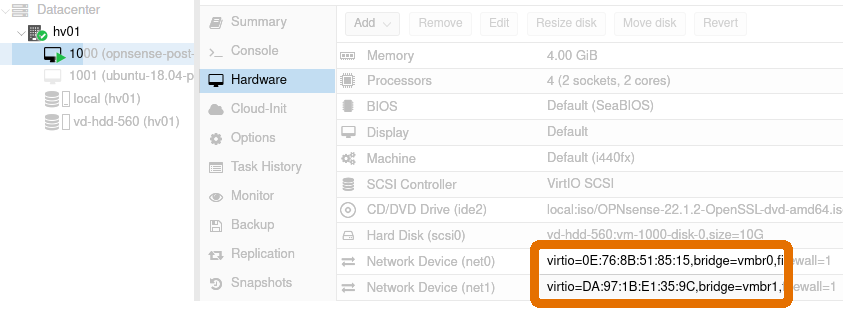
   
   Proxmox NICs der VM

Unter ``Proxxmox-Host`` --> ``Network`` kannst Du Dir jetzt mittels des Kommentarfeldes wieder die Zuordnung der Bridges ins Gedächtnis rufen.

=========  ======  =================  ===  ==================  ==========  ===
Bridge des Virtualisierers            <->  Virtuelle Maschine
------------------------------------  ---  -----------------------------------
Kommentar  Brücke  MAC                     MAC                 Interfaces  Typ
=========  ======  =================  ===  ==================  ==========  ===
red        vmbr0   0E:76:8B:51:85:15  <->  0e:76:8b:51:85:15   vtnet0      WAN
green      vmbr1   DA:97:1B:E1:35:9C  <->  da:97:1b:E1:35:9c   vtnet1      LAN
=========  ======  =================  ===  ==================  ==========  ===

Aus diesem Wissen und dem Vergleich erkennst Du |...|

   
   WAN-Verbindung an vtnet0

|...|, dass das WAN dem Interface vtnet0 zuzuordnen ist.

   
   LAN-Verbindung an vtnet1

|...|, dass das LAN zum Interface vtnet1 zuzuordnen ist.

Hast Du kein weiteres Interface, dann gebe ``Enter`` ein.

.. figure:: media/basis_opnsense_021.png
   :align: center
   :alt: OPNsense: Assign interfaces
   
   Netzwerkkarten zuordnen

Diese Zuordnung ist nun richtig, also weiter mit ``y`` |...|

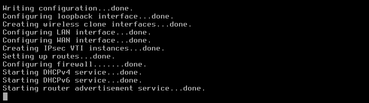

   Konfiguration gestartet

|...|, welches dann die Konfiguration startet. Nach Abschluss kommst Du wieder zum Konsolen-Menü. 

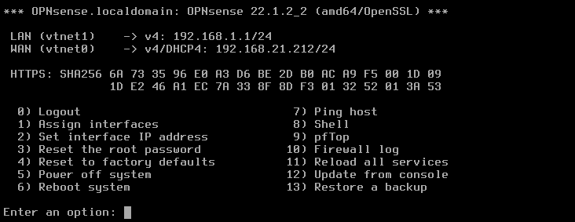

   Prüfe die Zuordnung der Netzwerkkarten

Die Zuordnung des WAN-Interfaces ist hier zu erkennen und nun so wie beabsichtigt. Das erkennst Du daran, das dessen IP-Adresse dem Adress-Pool des Routers entnommen ist (, sofern der DSL-Router via DHCP eine Adresse verteilt).

.. hint::

   Starte die OPNsense |reg| neu, nachdem Du die Netzwerkkarten neu zugeordnet hast.

WAN Zugang testen
^^^^^^^^^^^^^^^^^

Hast Du die OPNsense |reg| neu gestartet und auf der WAN-Schnittstelle eine IP-Adresse erhalten, führe zwei erste Tests durch. Wähle ``8) Shell`` auf der Kommandozeile und gib dort folgende Befehle ein:

.. hint:: 

   Sollte einer der Tests scheitern, dann verlasse die Konsole mittels ``exit`` und nutze den Auswahlpunkt ``11) reload all Services``.

.. code::

   ping -c 3 8.8.8.8

Die Ausgabe sollte wie folgt aussehen:

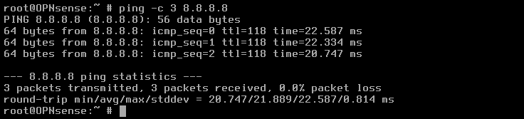
   
   Ping Test IP

.. code::

   ping -c 3 linuxmuster.net

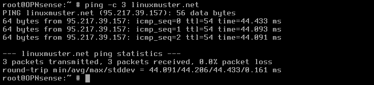

   Ping Test URL

Gib in der Konsole ``exit`` ein, um wieder zum Dashboard zurückzukommen.

   Konsolen Dashboard

.. hint:: 

   Sollte einer der Test auch nach ``11) Reload all services`` nicht erfolgreich verlaufen, dann stimmt etwas mit der Netzwerkkartenzuordnung nicht. Überprüfe Deine vorherige Netzwerk-Konfiguration auf Fehler.

IP-Adressen zuweisen
--------------------

Solltest Du in Deiner Netzwerkkonfiguration von unserem Muster abweichen, musst Du bei nachfolgenden Schritten anstelle der dargestellten IPs Deine hierfür festgelegten IPs eintragen.

   Setze die INterface IPs

Wähle in der Konsole der OPNsense |reg| den Eintrag ``2) Set interface IP address`` aus.

.. figure:: media/basis_opnsense_027.png
   :align: center
   :alt: OPNsense: LAN auswählen
   
   LAN auswählen

Wähle ``1 - LAN (`` |...| ``)`` für die nächsten Schritte.

.. figure:: media/basis_opnsense_028.png
   :align: center
   :alt: OPNsense: do not configure via DHCP
   
   IP nicht via DHCP zuweisen lassen

Bestätige die Nachfrage mit ``N`` und ``ENTER``. (Alternativ wäre auch nur ``ENTER`` möglich, da der großgeschriebene Buchstabe in der Auswahlmöglichkeit darauf hinweist, was die Standard-Einstellung ist.)

.. figure:: media/basis_opnsense_029.png
   :align: center
   :alt: OPNsense: insert IP

   IP eintragen

Gib die IPv4 Adresse ``10.0.0.254`` ein, unter der die OPNsense |reg| im lokalen Netz zu erreichen sein wird.

.. figure:: media/basis_opnsense_030.png
   :align: center
   :alt: OPNsense: netmask - CIDR notation

Gib die Netzmaske in CIDR-Notation an. Dies bedeutet, dass Du für unseren Fall die Zahl der Bits angibst, die in der Subnetzmaske gesetzt werden. Dies ist die Zahl ``16`` und führt zu der Subnetzmaske (255.255.0.0 - dezimal).

   Bestätige mit ENTER

Da keine Eingabe eines Upstream-Gateways nötig ist, einfach ``ENTER`` eingeben.

   Überspringe IPv6 via WAN tracking

.. attention:: Gib ein ``n`` ein.

   
   Kein IPv6 via DHCP

Gib ein ``N`` ein.

 
   Keine manuelle festgelegte IPv6-Adresse

Da keine IPv6-Adresse benötigt wird: ``ENTER``

   Kein DHCP-Server für das LAN aktivieren

Diese und die nächsten drei Fragen ebenfalls jeweils ``N`` und ``ENTER`` bzw. nur ``ENTER`` beantworten.

.. figure:: media/basis_opnsense_036.png
   :align: center
   :alt: OPNsense: change protokoll from https to http - no
   
   Keine Änderung des HTTPS-Protokolls

   
   Kein neues Zertifikat erstellen

.. figure:: media/basis_opnsense_038.png
   :align: center
   :alt: OPNsense: restore GUI defaults

   GUI-Einstellungen nicht zurücksetzen 

Nach der letzten Eingabe startet die Übernahme in das System.

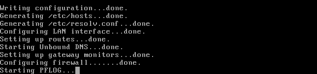

   Wende Konfigurationsschritte an

Nach erfolgreicher Übernahme erhältst Du den Hinweis, dass Du Dich mit der LAN IP auf die GUI der OPNsense |reg| aufschalten könntest.

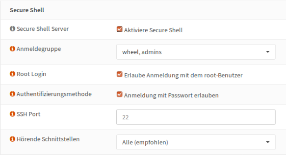
   
   GUI IP

Bevor Du das aber machst, erfolgt ein letzter Test, und zwar mit der Aktualisierung der OPNsense |reg|.

Aktualisierung der OPNsense |reg|
---------------------------------

Aktualisiere die OPNsense |reg| in der Konsole, indem Du den Punkt ``12) Update from console`` aufrufst und die Rückfrage mit ``y`` bestätigst.

.. hint:: 

   Sollte hierbei keine Verbindung zu den externen Update-Servern möglich sein, dann stimmt etwas mit der Netzwerkkartenzuordnung nicht.

   Als Erstes probiere es mit dem Neustart aller Netzwerk-Dienste. Dazu wählst Du den Punkt ``11) Reload all services``. Danach wiederholst Du das Upgrade nochmals mit dem Punkt ``12) Update from console``.

   Sollte die Aktualisierung immer noch nicht erfolgreich durchgeführt werden, dann überprüfe Deine vorherige Netzwerk-Konfiguration auf Fehler.
   
Sollte sich eine Eingabe-Aufforderung wie hier dargestellt vorher öffnen, muss du zum Fortführen des Updates ein ``q`` eingeben. Um dir alle Mitteilungen anzusehen, verwende die Auf- bzw. Ab-Tasten.

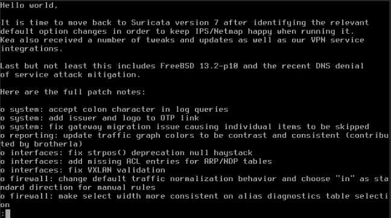
   
   OPNsense: Hello World - New Features

Das Update ist erfolgreich durchgeführt, wenn du wieder zu dieser Ansicht gelangst.

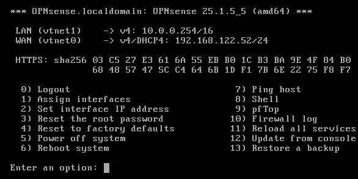
   
   NIC Zuordnung nach Neustart

.. hint::

   Stand Sept. 24 für die OPNsense |reg| ist die Version 24.1.10_8

Klappt das Update, starte die OPNsense |reg| neu.

Konfiguration der OPNsense |reg|
================================

Für die nachfolgende Konfiguration der OPNsense |reg| brauchst Du einen Rechner mit Webbrowser im LAN-Bereich der OPNsense |reg|. Das kann ein Laptop mit einem beliebigen Betriebssystem sein. Wichtig ist nur, dass er mit internen Switch im grünen Netzwerk verbunden ist, das mit dem LAN-Adapter der OPNsense |reg| verbunden ist und sich im gleichen Netzwerk wie die OPNsense |reg| befindet. In unserer Beschreibung gehen wir davon aus, dass der Laptop/PC manuell die IP-Adresse 10.0.0.10 mit der Subnetmask 255.255.0.0 (16 Bit) erhält.

Nachdem der Browser gestartet ist, gibst Du folgende URL für den Zugriff auf die GUI der OPNsense |reg| ein:

``https://10.0.0.254``

Du erhältst zunächst eine Zertifikatswarnung, da OPNsense |reg| ja ganz frisch installiert ist und ein selbst erstelltes Zertifikat nutzt. 

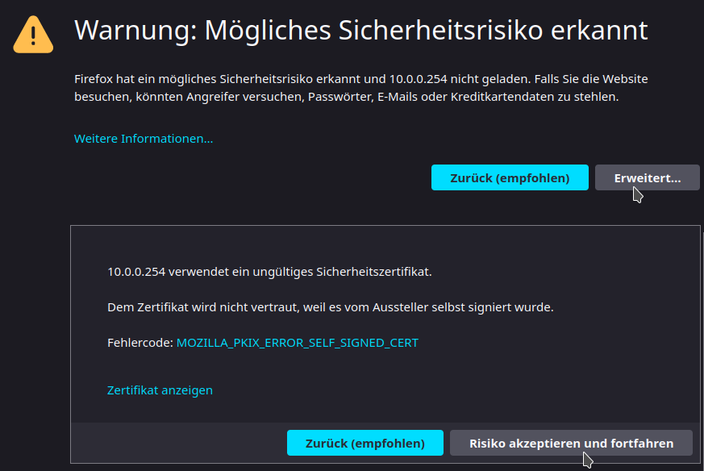
   
   Zertifikatswarnung

Klicke auf ``Erweitert`` und anschließend ``Risiko akzeptieren und fortfahren``. Dies bringt Dich auf die Login-Seite.

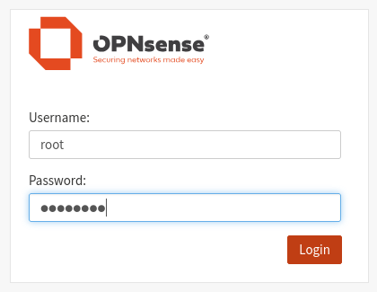
   
   GUI Login

Melde Dich mit ``root`` und dem Passwort ``Muster!`` an. Beim ersten Start erhältst folgende Information:

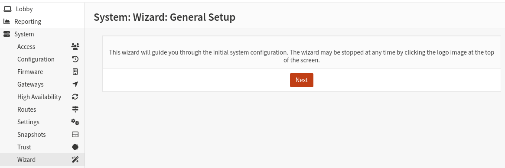
   
   GUI Erstkonfiguration nach erfolgter Anmeldung

Gefolgt von folgender Aufforderung:

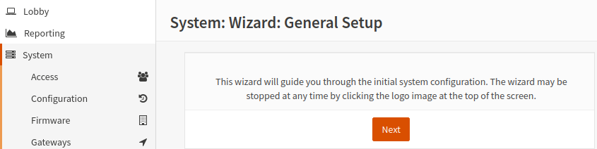
   
   Setup Wizard

Starte den ``General Setup Wizard`` mit dem ``Next``- Button. Dieser Wizard führt Dich durch die Konfiguration. Einige Dinge wurden zuvor bereits korrekt für die Basis-Konfiguration eingerichtet.  

System: Assistent: Allgemeine Information
-----------------------------------------

.. attention::

   Die Länge des ersten Teils der Domäne darf maximal 15 Zeichen betragen. Die Domain "muster-gymnasium.de" überschreitet diese Grenze um ein Zeichen, da "muster-gymnasium" 16 Zeichen lang ist.

   Eine gute Wahl ist beispielsweise ``linuxmuster.lan``. Beim späteren Setup von linuxmuster.net wird diese ggf. für alle Server-Dienste angepasst.

.. figure:: media/basis_opnsense_043.png
   :align: center
   :alt: OPNsense: GUI - setup genreral information
   
   Setup: Allgemeine Angaben

Gib als ``Primary DNS``, die neue IP des Upstream Gateway der externen WAN-Schnittstelle an und deaktiviere die Checkbox ``Override DNS``.

Weiter geht es mit ``Next``

System: Assistent: Zeitserverinformation
-----------------------------------------

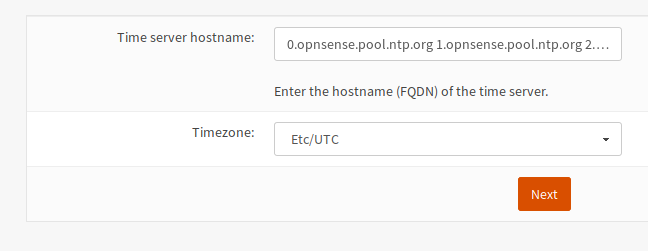
   
   Angabe des Zeitservers

Die Angaben zum Time Server belässt Du wie angegeben. Den Eintrag für die Zeitzone änderst Du auf ``Europ/Berlin`` wie in nachstehender Abbildung.

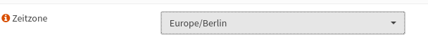
   
   Zeitzone einstellen

Die Angaben übernimmst Du mit ``Next``.

System: Assistent: Konfiguriere WAN-Schnittstelle
-------------------------------------------------

Danach kommst Du zu den Einstellungen für die WAN-Schnittstelle.
Nutzt Du hier DHCP z.B. eines vorgelagerten DSL-Routers, so gibst Du hier DHCP an, ansonsten ändere diese bitte auf ``Static``.

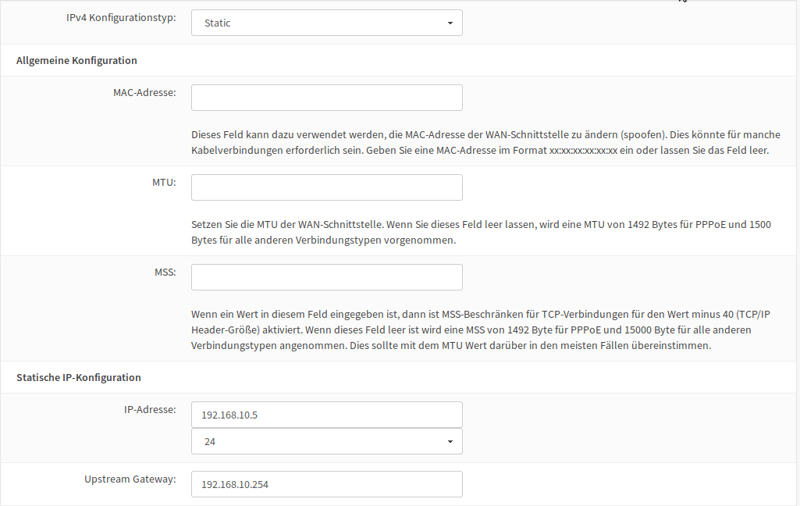
   
   WAN NIC

Falls Deine Firewall eine statische IP-Adresse hat, die nicht über DHCP erteilt wird, trägst Du sie hier ein.

.. figure:: media/basis_opnsense_046.png
   :align: center
   :alt: OPNsense: GUI - RFC1918 networks
   
   LAN private IP - Angabe RFC1918

Falls Dein Router eine private IP hat, musst Du den Haken bei ``Private RFC1918-Netzwerke blockieren`` entfernen. Diesen Eintrag findest Du ganz unten auf der Seite, nachdem Du mit der Laufleiste rechts nach ganz unten gegangen bist.

Mit ``Weiter`` übernimmst Du die von Dir vorgenommenen Einstellungen.

System: Assistent: Konfiguriere LAN-Schnittstelle
-------------------------------------------------

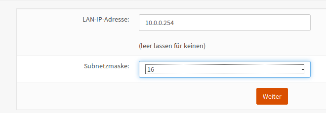
   
   LAN Schnittstelle

Die IP-Adresse und die Subnetzmaske des Schulnetzes sollten hier eingetragen sein. Sollte dies nicht der Fall sein, ändere dies nun.

System: Assistent: Setze Root-Passwort 
--------------------------------------

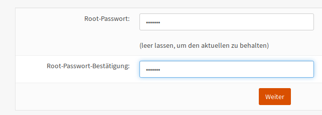
   
   Root Kennwort setzen

.. hint:: 

   An dieser Stelle muss als root-Passwort ``Muster!`` eingegeben werden, da später der lmn-Server beim Einrichten der Firewall davon ausgeht, dass das root-Passwort ``Muster!`` ist!

System: Assistent: Konfiguration neu laden
------------------------------------------

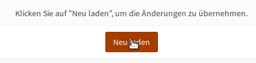
   
   System-Konfiguration neu laden

Nachdem Du die Einstellungen übernommen hast, können sich auch die Einstellungen des LAN-Netzwerks geändert haben. Dann wirst Du nicht - wie im nächsten Bild zu sehen - über die erfolgreiche Konfiguration informiert.

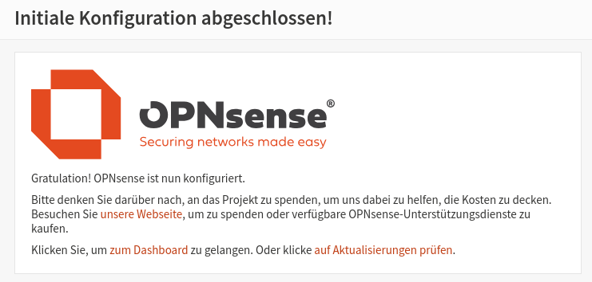
   
   Erstkonfiguration erfolgreich

Sollte dies bei Dir der Fall sein, musst Du Deinem Admin PC die passende IP-Adresse 10.0.0.10/16, DNS: 10.0.0.254 und das Gateway 10.0.0.254 manuell geben. (hier exemplarisch für unseren Standard-LAN-Bereich)

Gehe dann mit einem Webbrowser auf ``https://10.0.0.254``.

.. hint:: 

   Falls Du Dich für das Netz der linuxmuster.net v6.2 entschieden hast, solltest Du die IP-Adresse 10.16.0.10/12, DNS: 10.16.1.254 und das Gateway 10.16.1.254 verwenden.
  
   Du solltest dann auch mit einem Webbrowser auf https://10.16.1.254 gehen.

Du erhältst eventuell wieder eine Zertifikatswarnung. Akzeptiere diese und fahre fort.

Melde Dich wieder mit ``root`` und dem Passwort ``Muster!`` an.

DHCP abschalten
---------------
Jetzt musst Du den DHCP-Service der Firewall abschalten. Dieser wird vom Server übernommen. 

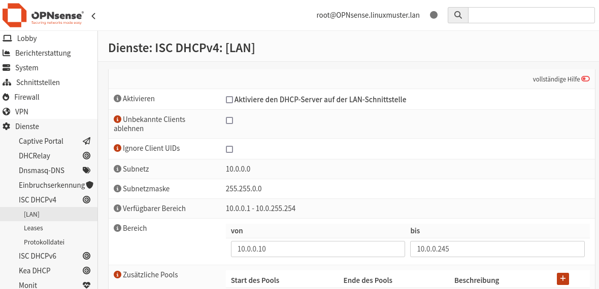
   
   ISC DHCP deaktivieren

Gehe auf ``Dienste -> ISC DHCPv4 -> [LAN]`` und lösche den Haken bei ``Aktivieren``, wenn gesetzt. ``Speichern`` lässt sich Deine Einstellungen unten auf der Seite.

Prüfe zudem, ob der neue Kea DHCP Server aktiviert ist. Falls ja, deaktiviere diesen. Hierzu gehst Du auf ``Dienste -> Kea DHCP [new] -> [Kea DHCP v4] -> Allgemeine Einstellungen``. Sollte der Halen bei ``Aktiviert`` gesetzt sein, musst Du diesen deaktivieren.

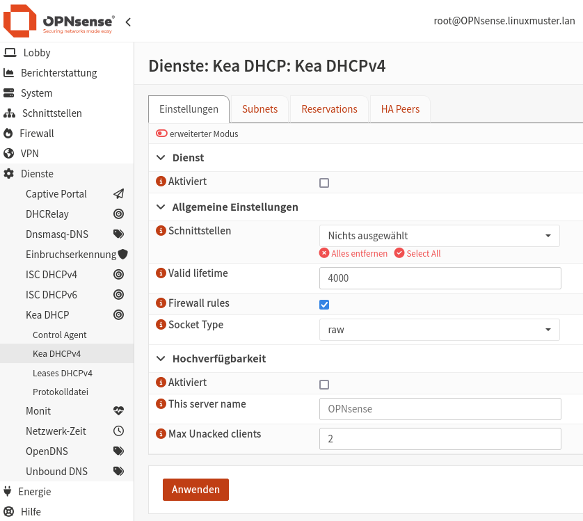
   
   Kea DHCP deaktivieren

Zusätzliche Netzwerkkarte hinzufügen (Optional)
-----------------------------------------------

Die linuxmuster.net v7 läuft bereits mit zwei Netzwerkkarten. Möchtest Du allerdings ein WLAN oder in einer DMZ einen Webserver betreiben, brauchst Du noch weitere Netzwerkkarten.

Wie das geht, siehst Du im Folgenden:

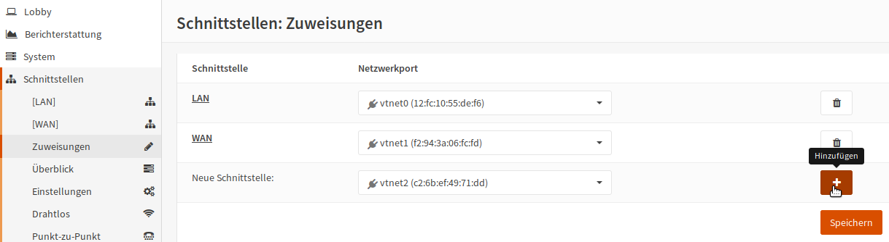
   
   Schnittstelle hinzufügen

Bei ``Schnittstellen -> Zuweisungen`` drückst Du ``+``, um die dritte Schnittstelle Deinem System hinzuzufügen. Diese dritte Schnittstelle ist dann als ``OPT1`` im System bekannt. OPT1 muss nur noch aktiviert und es muss ihr noch eine IP-Adresse zugewiesen werden. 

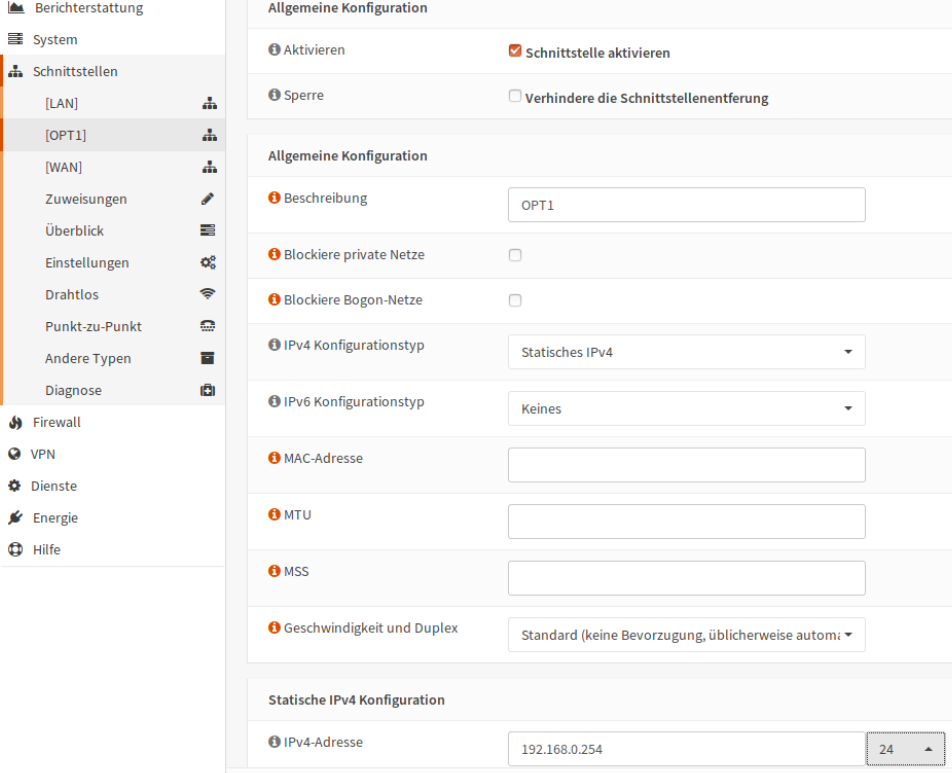
   
   Neue Schnittstelle konfigurieren

Unter ``Schnittstellen -> [OPT1]`` kannst Du diese Einstellungen vornehmen. Der Screenshot zeigt ein Beispiel. Für weitere Netzwerkkarten verfährst Du entsprechend. OPT1 wird dann hochgezählt zu OPT2 etc.

ssh erlauben
------------

.. attention:: Damit der Server für das weitere Setup Zugriff auf die OPNsense |reg| hat, musst Du den ssh-Zugriff erlauben. Gehe dafür auf ``System -> Einstellungen -> Verwaltung``.

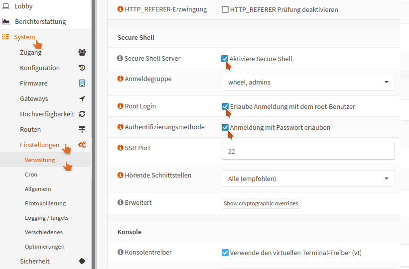
   
   SSH aktivieren

Setze jeweils den Haken bei ``Aktiviere Secure Shell``, ``Erlaube Anmeldung mit dem root-Benutzer`` und ``Anmeldung mit Passwort erlauben``.

Bei dem Punkt ``Sekundäre Konsole`` wähle die Serial-Konsole aus. Mit dieser Auswahl wird die `xterm.js-Konsole` nutzbar. (Zur Erinnerung: :ref:`xterm-label`)

Diese Einstellungen wieder ``Speichern``.

Update der OPNsense |reg|
-------------------------

Aktualisiere nun die OPNsense |reg|, indem Du unter 

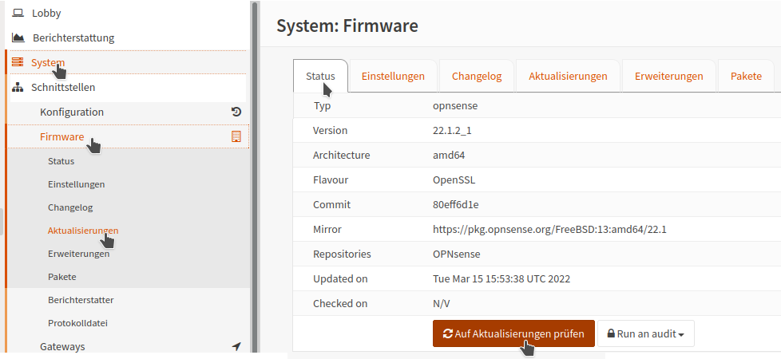
   
   Aktualisiere die Firmware

``System`` ``->`` ``Firmware`` ``-->`` ``Aktualisierungen`` ``--->`` ``Status`` ``---->`` ``Auf Aktualisierungen prüfen`` klickst.

Wenn keine Aktualisierungen verfügbar sind, erhältst Du folgende Meldung |...|

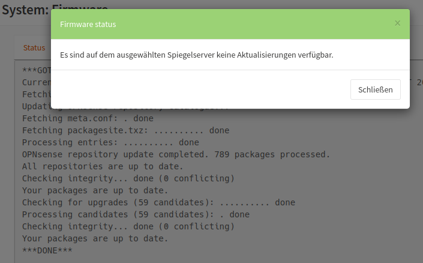
   
   Keine Aktualisierungen verfügbar

|...| und kannst zum abschließenden Schritt `Logout`_ gehen.

Sollten Dir - wie in nachstehender Abbildung - unter dem Reiter ``Aktualisierungen`` zu aktualisierende Pakete angezeigt werden |...|

.. figure:: media/basis_opnsense_057.png
   :align: center
   :alt: OPNsense: GUI - updates available
   
   Aktualisierungen verfügbar

|...| dann klicke in o.g. Fenster ``Jetzt aktualisieren``. 

|...| je nach Update/Upgrade erhälst Du Aktualisierungshinweise

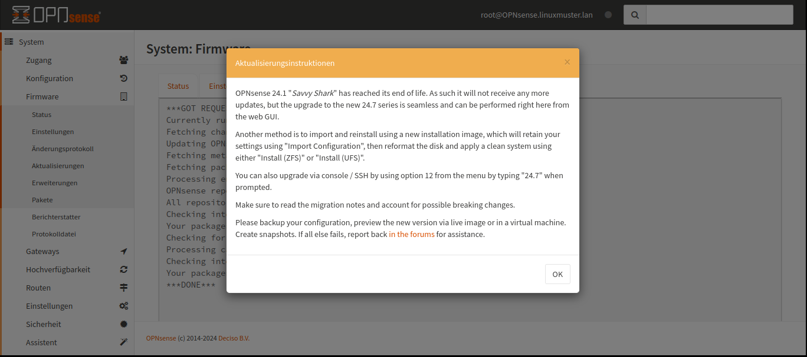
   
   Aktualisierungshinweise

|...| und Hinweise zur neuen Version
   
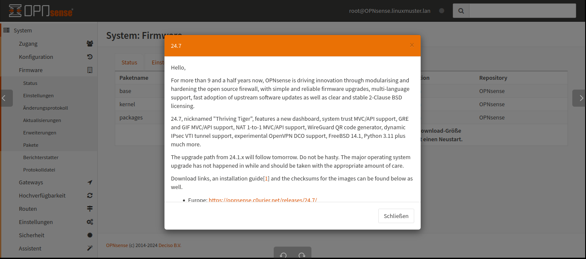
   
   Hinweise zur neuen Version
   
|...| aktualisiere nun 
   
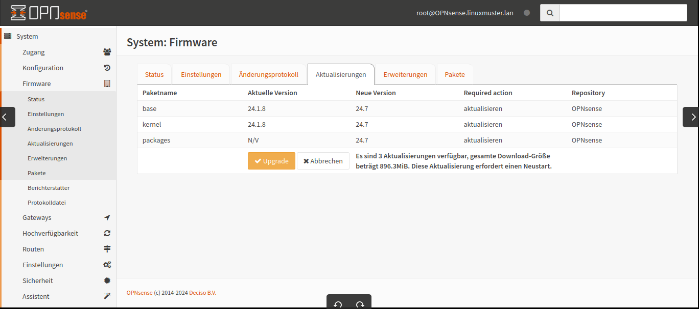
   
   Update/Upgrade ausführen
   
|...| je nach Updates/Upgrades kann ein Neustart der Firewall erforderlich sein
   
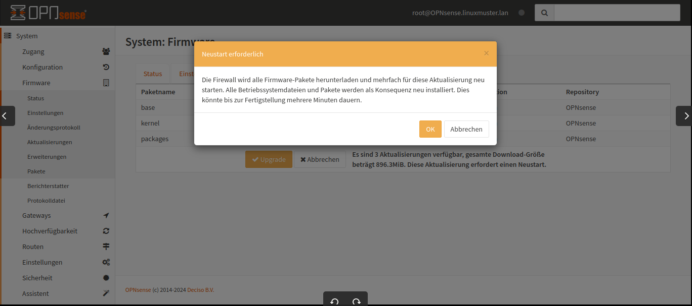
   
   Neustart erforderlich

|...| nach dem Neustart und der erneuten Anmeldung solltest Du das Dashboard der OPNsense |reg| sehen.

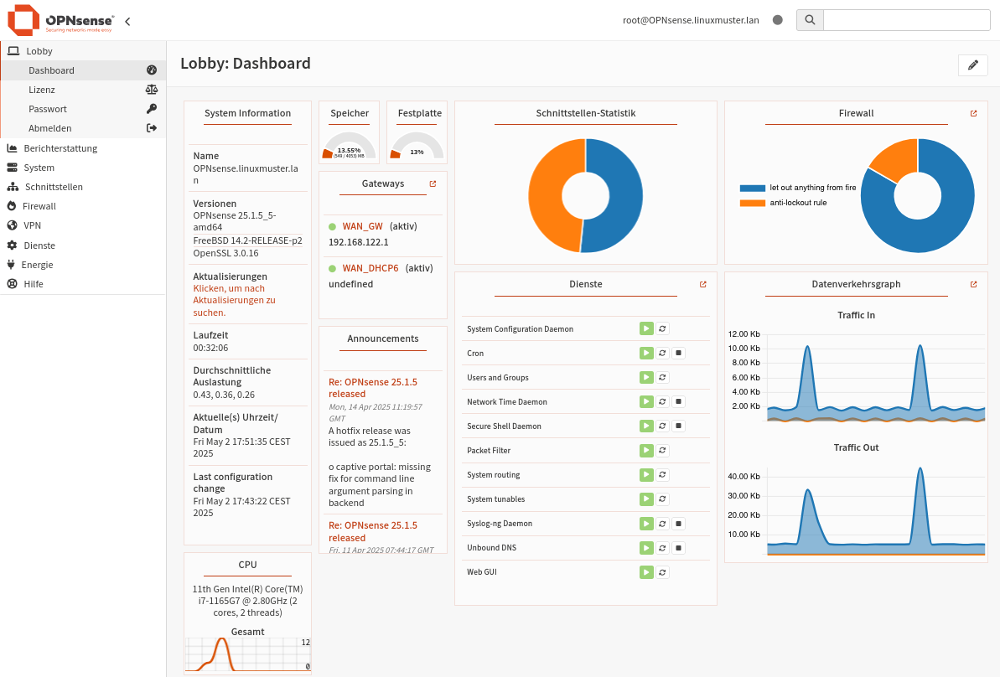
   
   Dashboard nach erneuter Anmeldung

|...| prüfe jetzt die Gateway-Einstellungen. Gehe auf ``System`` --> ``Gateways`` --> ``Konfiguration`` und editiere Dein Gateway (WAN_GW) mit dem Stiftsymbol.

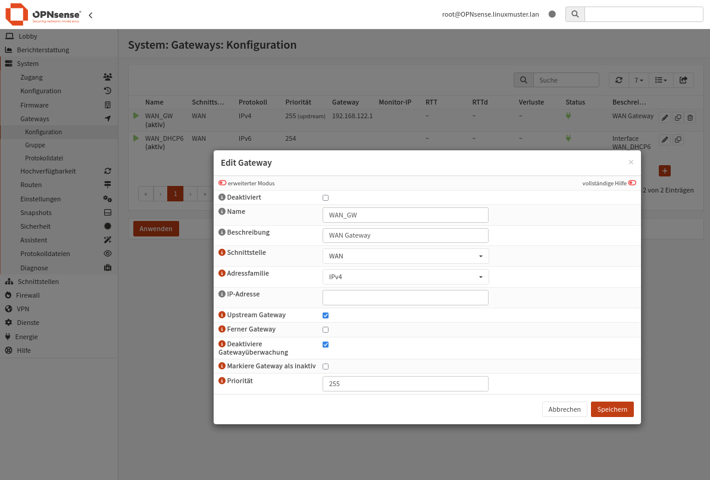
   
   Gateway - Konfiguration

Setze einen Haken bei ``Deaktiviere Gatewayüberwachung``, speichere die Einstellung und übernimm die Änderung. Jetzt ist Dein Gateway online. Du kannst später die Gatewayüberwachung wieder aktivieren, ohne dass das Gateway offline geht.

Nach dem erneuten Neustart ist die OPNsense |reg| soweit vorbereitet.

Logout
------

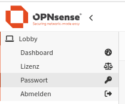
   
   Logout   
   
.. hint:: Für Anwender einer Virtualisierungslösung empfehlen wir an dieser Stelle einen ``Snapshot`` zu erstellen!

